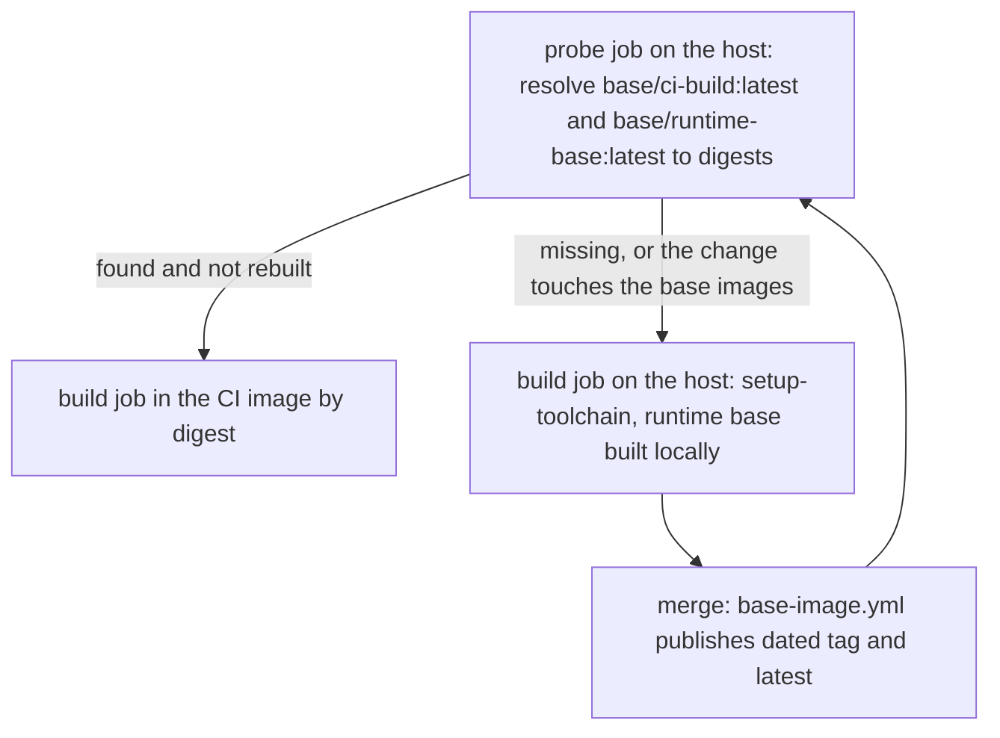

# Containerised CI execution

Read this when wiring a build job into the CI build image, when a container job fails, or when someone asks
whether the build should run in a container at all.

Contents: 1 Why a container · 2 What the runner does with `container:` · 3 The bootstrap sequence ·
4 User, HOME and file ownership · 5 The docker socket · 6 The default shell · 7 Docker outside of Docker ·
8 Test runners from the same image · 9 Laptop parity · 10 Podman · 11 Self-hosted runners ·
12 Checklist for a failing first container run

## 1. Why run the build in a container

| Option | Pros | Cons | When |
|---|---|---|---|
| `setup-java` / `setup-node` / ... on the runner host | simplest, fastest start | the toolchain drifts from the runtime image and from laptops; the CA, CLIs and linters are installed (or missing) per run | tiny repositories with nothing to pin |
| **The CI build image as the job's `container:`** (default) | one versioned environment for CI, laptops and test runners; CA and CLIs baked in; a toolchain bump is a reviewed image change | one more image to maintain; the docker socket enters the job container; actions run inside it | every build job of a repository with images, an enterprise CA, or tools to pin |
| The test process as a compose service from the same image | the test process sits on the stack network: no published ports, no host path translation | the build-tool cache is bind-mounted from the host | integration tests (skill gha-ephemeral-test-envs) |
| Everything inside one compose project (`compose run build ...`) | one file drives the whole build | cache plumbing, slow cold starts, nested access | only when `container:` is unavailable |

Three layers can be containerised: the dependencies under test (compose stacks, gha-ephemeral-test-envs), the
build and test process (this skill), and the runner itself (Actions Runner Controller pods; infrastructure,
out of scope here). The reference ran layers one and two on GitHub-hosted runners.

## 2. What the runner does with `container:`

The "Initialize containers" step of the job log shows it. Abridged, on a GitHub-hosted runner:

```text
docker pull <image>                                   # with container.credentials, before any step runs
docker create --workdir /__w/<repo>/<repo> --network github_network_<id> -e HOME=/github/home ...
  -v /var/run/docker.sock:/var/run/docker.sock        # the host daemon, always mounted
  -v /home/runner/work:/__w                           # the workspace (GITHUB_WORKSPACE=/__w/<repo>/<repo>)
  -v /home/runner/runners/<version>/externals:/__e:ro # the runner's Node.js, for JavaScript actions
  -v /opt/hostedtoolcache:/__t                        # the tool cache
  -v /home/runner/work/_temp/_github_home:/github/home
  --entrypoint tail <image> -f /dev/null              # kept alive; every step is a `docker exec`
```

Consequences:
- The image must be pullable when the job starts: a step cannot log in for it, and a job cannot build its own
  container. Hence `container.credentials` and the bootstrap (section 3).
- The image's `ENTRYPOINT`, `CMD` and `WORKDIR` are ignored; its `ENV` and `USER` apply.
- JavaScript actions (`actions/checkout`, `setup-gradle`, `docker/*`) run inside the container with the
  runner's Node.js from `/__e`: use a glibc image (Debian, Ubuntu).
- `actions/checkout` needs git 2.18 or later inside the container, or it downloads a tarball without `.git`.
- `container.image` is evaluated before the job: its expression may use `needs`, `inputs`, `matrix`, `vars`,
  `github`, but not `env`. An empty string means "no container": the job runs on the runner host.
- The job container and `services:` share the job network; containers started through the socket do not.

These are runner internals; read your own job's log when something does not match.

## 3. The bootstrap sequence



1. **Nothing published** (new repository, fork, deleted packages). The probe outputs empty references, the
   build job runs on the host: `setup-build-env` installs the toolchain and builds the runtime base from the
   repository's Dockerfile under a `bootstrap-<run_id>-<attempt>` tag, and the app images are built FROM it.
   `base-image.yml` on the pull request builds and verifies both base images without pushing.
2. **Publish.** The merge (a path trigger) or a manual dispatch runs `base-image.yml`, which pushes the dated
   tag and `latest`.
3. **Steady state.** The probe resolves both images to digests; the build job runs in the CI image and builds
   app images FROM the runtime base digest. Every job of the run uses these same digests.
4. **A change to the base images or the CA** (`rebuild-base`). The probe outputs empty references on purpose,
   so the PR's build runs on the host against locally built bases, and `base-image.yml` verifies both images
   on the PR. After the merge, the published images take over again.
5. **Registry outage.** The probe finds nothing and the run degrades to the host path instead of failing.

An alternative the reference documented but did not choose: a preliminary job that publishes the CI image when
it is missing and hands its reference to `container:`. It needs `packages: write` in pull requests and
publishes an image no reviewer has seen; the host path needs neither.

## 4. User, HOME and file ownership

- GitHub-hosted runners run as user `runner`, UID 1001. The workspace, `$RUNNER_TEMP` and the job's HOME
  (`/github/home`) belong to it.
- The CI image ends with `USER 1001:1001` (`RUNNER_UID` build arg), so everything the job writes stays owned by
  the runner user, and git sees its own checkout.
- A container running as root works on a GitHub-hosted runner but leaves root-owned files behind: on a
  persistent self-hosted runner the next job's checkout fails to clean them (`EACCES`).
- A container running as another non-root UID cannot write HOME, the workspace or `$RUNNER_TEMP`.
- Self-hosted fleets: build the CI image with `--build-arg RUNNER_UID=$(id -u runner) --build-arg
  RUNNER_GID=$(id -g runner)`, or set `options: --user <uid>:<gid>`.
- The runtime base uses UID 10001 instead: runtime images should not share a UID with any host account.

## 5. The docker socket

- The runner mounts `/var/run/docker.sock` into every job container. It belongs to the host's `docker` group,
  whose GID differs between runner images, so the probe job reads it (`stat -c %g /var/run/docker.sock`) and
  the build job adds it with `options: --group-add <gid>`. The probe and the build land on the same runner
  image version for a given label; during a runner image rollout they may not, and a re-run fixes it.
- `--user root` instead of the group also works, with root-owned files as the price (section 4).
- The socket is root-equivalent on the host: anyone who can run a step can start a privileged container. That
  is acceptable on ephemeral runners (GitHub-hosted, one-job VMs, ephemeral ARC pods) and never on a
  persistent self-hosted runner.
- A job that does not build images does not need the socket: leave out `--group-add`, or run it on the host.

## 6. The default shell

A job container ran `run:` steps with `sh`, although the CI image had bash; on the host the default is bash.
In the reference, every run had taken the host bootstrap path until `base-image.yml` published the CI image.
The first run inside it failed at once with `[[: not found` and `Syntax error: redirection unexpected`
(bash syntax: `[[`, `<<<`, `read -a`, `mapfile`). The fix is one block on the job:

```yaml
defaults:
  run:
    shell: bash
```

Composite actions must declare `shell:` on every `run` step anyway; the templates use `bash`.

## 7. Docker outside of Docker: what works from the job container

The docker CLI in the job container talks to the host's daemon, so everything the daemon resolves, it
resolves on the host.

| Operation from the job container | Result | Why, and what to do |
|---|---|---|
| `docker buildx build` (default `docker` driver), `docker push`, `imagetools` | works | the build context is streamed over the API |
| `docker run -v "$GITHUB_WORKSPACE:/src" ...` | an empty directory | bind sources are host paths; `/__w/...` does not exist on the host. Run such steps in a host job |
| `docker run -p 8080:8080`, then `curl localhost:8080` | connection refused | the port is published on the host; the job container's localhost is itself. Use `--network ${{ job.container.network }}` and the container name, or a host job |
| `docker compose up` with bind mounts or ports | same two problems | drive compose stacks from host jobs; run the tests in a container on the stack network |
| `kind create cluster` | works | the node container runs on the host daemon |
| `kubectl` against that cluster | refused | kind's API server listens on the host's 127.0.0.1. Run kind jobs on the host (`setup-kube-tools`), or `kind export kubeconfig --internal` plus `docker network connect kind <job container>` |
| A buildx `docker-container` builder building FROM a locally loaded image | `pull access denied` | that builder has its own image store; build with the default driver, or pass `--build-context` |

This is why the reference kept the build job (compile, tests, image build and push) in the container and ran
compose stacks and kind clusters in host jobs.

## 8. Test runners from the same image

Integration tests run their test process as a container from the CI image on the compose stack's network
(the reference's `it-runner` service; gha-ephemeral-test-envs calls it `test-runner`):
- the image reference is the probe's digest, passed down as a workflow output, so the build and the tests of
  one run share one environment;
- `user: "<runner uid>:<runner gid>"`, `HOME: /tmp`, the workspace and the host's build-tool cache
  bind-mounted (compose runs on the host, so host paths are right there);
- no published ports: the tests reach services by name;
- when the CI image is not published yet, `setup-build-env` with `ensure-base: ci-build` builds it locally for
  the test runner (a test runner is not a job container, so the bootstrap build works for it).

## 9. Laptop parity

```bash
# The CI build, as the laptop user (HOME=/tmp: an unknown UID has no home in the image)
docker run --rm -u "$(id -u):$(id -g)" -e HOME=/tmp -v "$PWD:/workspace" -w /workspace \
  -v "$HOME/.gradle:/tmp/.gradle" "$CI_BUILD_IMAGE" ./gradlew build
# Image builds from inside the container need the socket and its group (Linux)
docker run --rm -u "$(id -u):$(id -g)" --group-add "$(stat -c %g /var/run/docker.sock)" \
  -v /var/run/docker.sock:/var/run/docker.sock -e HOME=/tmp -v "$PWD:/workspace" -w /workspace \
  "$CI_BUILD_IMAGE" docker buildx build -f app/Dockerfile --build-arg BASE_IMAGE="$BASE_IMAGE" -t app:dev --load app
# Rootless Podman keeps the user's UID with keep-id; :Z relabels on SELinux hosts
podman run --rm --userns=keep-id -e HOME=/tmp -v "$PWD:/workspace:Z" -w /workspace "$CI_BUILD_IMAGE" ./gradlew build
```

Pin `CI_BUILD_IMAGE` in `ci/versions.env` as `<tag>@<digest>`. Docker Desktop (macOS, Windows) maps file
ownership itself; `-u` is harmless there.

## 10. Podman

- `container:` jobs on GitHub-hosted runners use Docker. Podman matters for laptops, self-hosted fleets and
  the images themselves.
- Build with `podman build --format docker`: the OCI format has no HEALTHCHECK (and no SHELL), and Podman
  drops them with a warning.
- Keep Dockerfiles plain: `ARG` before `FROM`, multi-stage `COPY --from`, `TARGETARCH` all work with buildah.
  Verify BuildKit-specific features (`RUN --mount`, heredocs, `COPY --link`, `# syntax=`) on buildah before
  relying on them.
- Fully qualified image names (`docker.io/library/...`): Podman's short-name resolution may prompt or choose
  another registry.
- Rootless: container UIDs map through the user namespace; use `--userns=keep-id` for bind-mounted
  workspaces, `:Z` on SELinux hosts, and ports of 1024 and above.
- The docker CLI in the CI image can talk to a Podman API socket for `run` and `compose`; buildx expects a
  Docker Engine, so build with `podman build` there.
- A parity check (build one app with both engines, compare `inspect` output for User, Healthcheck, Labels)
  was planned in the reference but not built; treat Podman support as verified only where you test it.

## 11. Self-hosted runners

- Ephemeral only for jobs with the socket: one-job VMs, runners registered with `--ephemeral`, ARC pods.
- Never run fork pull requests on self-hosted runners.
- Check the runner user's UID and build the CI image for it (section 4).
- Pull job containers by digest: a persistent runner's local image store can hold any tag a previous job
  created, but a digest reference cannot be spoofed by a local tag.
- Actions Runner Controller: `dind` mode keeps the socket model (and compose) unchanged; `kubernetes` mode has
  no Docker daemon, so container jobs go through container hooks and compose stacks do not work.
- Behind TLS interception the runner host itself needs the enterprise CA (checkout, JavaScript actions):
  references/enterprise-ca.md, section 7.

## 12. Checklist for a failing first container run

1. "Initialize containers": was the image pulled (credentials, `packages: read`, package access)? Read the
   `docker create` line: user, mounts, options.
2. Syntax errors in the first `run:` step: `defaults.run.shell: bash`.
3. `permission denied ... docker.sock`: `--group-add` with the probe's GID; print `id` in a step.
4. `EACCES` in the workspace, HOME or `$RUNNER_TEMP`: the image's USER is not the runner UID.
5. `dubious ownership`: git `safe.directory` (setup-build-env), then fix the UID.
6. A tool is missing: `scripts/ci/verify-image.sh --kind ci-build <image>` on the published image.
7. The app build cannot find the local base: a docker-container builder is the default; remove
   `setup-buildx-action` from the job or use `--build-context`.
