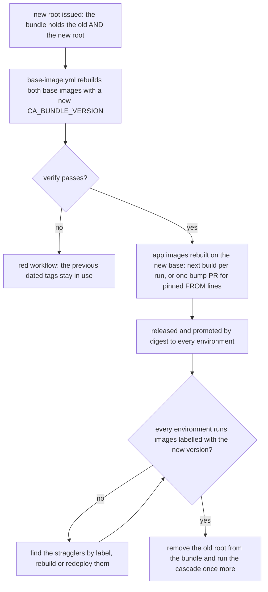

# The enterprise CA in images

Read this when a company CA (TLS interception, internal endpoints with a private CA) must be trusted by
builds and applications, when choosing where the bundle comes from, and before a CA rotation.

Contents: 1 Where to add the CA · 2 The bundle: public, integrity-sensitive · 3 The OS store ·
4 The JVM store and other runtimes · 5 Verification · 6 Rotation, a rebuild cascade · 7 The runners ·
8 A throwaway CA for tests

## 1. Where to add the CA, and why at build time

| Option | Pros | Cons | When |
|---|---|---|---|
| **In the company base images** (runtime base and CI build image), inherited by every app (default) | one place to rotate and verify; app Dockerfiles never repeat it; images are self-contained | rotation means rebuilding every image (a cascade, section 6) | several images sharing one CA (the common case) |
| Per app Dockerfile (`COPY` + `keytool` in each) | no shared image | N copies drift; rotation touches every Dockerfile | a single image, or a repository that cannot share a base |
| Mounted at runtime (volume, ConfigMap, a cluster CA injector) | rotation without rebuild | the image fails wherever the mount is missing (a laptop, CI); the JVM needs a truststore path; two mechanisms to keep aligned | as a stop-gap during an emergency rotation, never alone |

Both stores, because clients read different ones:

| Client | Reads | Covered by |
|---|---|---|
| curl, wget, git, apt, OpenSSL-based tools, Python `ssl`, Go, .NET on Linux | the OS store | `update-ca-certificates` |
| Java (every JDBC driver, HTTP and messaging client, Gradle, Maven) | the JVM's `cacerts` only | `keytool -importcert` per certificate |
| Node.js, npm | its built-in roots | `NODE_EXTRA_CA_CERTS` (adds a PEM file) |
| Python requests, pip | certifi's bundle | `REQUESTS_CA_BUNDLE` (and `PIP_CERT`) pointing at the OS bundle |
| AWS CLI and SDKs | their bundle | `AWS_CA_BUNDLE` |
| Rust with webpki roots | compiled-in roots, ignores the OS store | rebuild with native roots; check per tool |

The templates set `SSL_CERT_FILE` and `REQUESTS_CA_BUNDLE` to the full OS bundle (public roots plus the CA)
and `NODE_EXTRA_CA_CERTS` to the company bundle alone (Node adds it to its own roots). Never point a
replacing variable (`SSL_CERT_FILE`, `REQUESTS_CA_BUNDLE`) at the company bundle alone: every public
endpoint would then fail.

## 2. The bundle: public, but integrity-sensitive

- **What it is**: the CA certificates the company's TLS endpoints and proxies chain to (roots and, if
  needed, intermediates), PEM, one or more certificates in one file. Certificates are public: committing
  the bundle leaks nothing.
- **Why integrity matters anyway**: whoever changes the bundle decides whom every image trusts. A certificate
  slipped into it lets its owner intercept all TLS traffic of every app and build. Treat changes like code
  with the highest review bar:
  - CODEOWNERS on the bundle directory: platform team and security;
  - a README next to it: owner, each certificate's subject, validity and SHA-256 fingerprint, the bundle version;
  - when the bundle is downloaded instead of committed, verify the publisher's checksum
    (`--build-arg CA_BUNDLE_SHA256=<sum>`; the Dockerfiles check it);
  - the version travels into the `com.example.ca-bundle` label of every image built on it.
- **Never a private key**: the bundle holds certificates only. The base Dockerfiles refuse a bundle that
  contains `PRIVATE KEY`; secret scanning and review are the other two layers.
- **Build context**: the directory holding the bundle is the whole build context of both base images, so the
  context stays tiny and the same Dockerfile takes another bundle from another directory.
- **Committed or fetched**: commit it (simple, reviewed) unless the security team publishes versioned bundles
  in an artifact repository. Then fetch by version in `base-image.yml` before the build:

```yaml
      - name: Fetch the CA bundle (artifact repository)
        env:
          VERSION: ${{ inputs.ca-bundle-version || vars.CA_BUNDLE_VERSION }}
          BASE_URL: ${{ vars.CA_BUNDLE_BASE_URL }}   # e.g. https://artifacts.example.com/generic/ca-bundle
        run: |
          set -euo pipefail
          curl -fsSL --proto '=https' -o docker/ca/ca-bundle.pem "$BASE_URL/$VERSION/ca-bundle.pem"
          curl -fsSL --proto '=https' "$BASE_URL/$VERSION/ca-bundle.pem.sha256" | awk '{ print $1 "  docker/ca/ca-bundle.pem" }' | sha256sum -c -
```

- **Expiry**: an expired certificate fails `openssl verify` at build time, so the weekly rebuild turns red
  before clients do. Check ahead: `openssl x509 -checkend $((60*24*3600)) -noout -in <cert>` per certificate.

## 3. The OS store

| Distribution | Anchor directory (one certificate per `.crt` file) | Command | Resulting bundle |
|---|---|---|---|
| Debian, Ubuntu | `/usr/local/share/ca-certificates/` | `update-ca-certificates` | `/etc/ssl/certs/ca-certificates.crt` |
| Alpine | `/usr/local/share/ca-certificates/` (package `ca-certificates`) | `update-ca-certificates` | `/etc/ssl/certs/ca-certificates.crt` |
| RHEL, UBI, Fedora | `/etc/pki/ca-trust/source/anchors/` | `update-ca-trust extract` | `/etc/pki/tls/certs/ca-bundle.crt` |

- Split the bundle first: the tools take one certificate per file, so only the first certificate of a
  multi-certificate file would be trusted. The templates split with awk, which also drops text between
  certificates and tolerates CRLF line endings:

```sh
awk '/-----BEGIN CERTIFICATE-----/ { n++; out = sprintf("<dir>/ca-%02d.crt", n) } out { print > out } /-----END CERTIFICATE-----/ { close(out); out = "" }' bundle.pem
```

- Keep the bundle file as well (`/etc/ssl/certs/company-ca-bundle.pem`) for tools that take a file.
- On RHEL and UBI, `update-ca-trust extract` also regenerates the Java store that RHEL's OpenJDK packages
  link to; on Debian and Ubuntu, `ca-certificates-java` does the same for distribution JDKs. Vendor JDKs
  (Temurin and others) keep their own `cacerts`: import there (section 4). `verify-image.sh` checks the
  result either way (`--os-store /etc/pki/tls/certs/ca-bundle.crt` on RHEL-based images).

## 4. The JVM store and other runtimes

- Import every certificate into the JVM's default store, each under its own alias:

```sh
keytool -importcert -noprompt -trustcacerts -cacerts -storepass changeit -alias "<alias>-02" -file ca-02.crt
```

  `-cacerts` (Java 9+) targets the default store of the JDK running keytool; Java 8 takes
  `-keystore "$JAVA_HOME/jre/lib/security/cacerts"`. The templates name the first certificate `CA_ALIAS` and
  the others `CA_ALIAS-02`, `-03` and so on.
- Default `cacerts` rather than a separate truststore file with `-Djavax.net.ssl.trustStore`: with the
  default, every client, tool and sidecar JVM trusts the CA without a flag, and the public roots stay. A
  separate truststore must be passed to every JVM invocation (forgetting it falls back silently) and must
  also hold the public roots. Use it only when policy forbids changing `cacerts`.
- A JRE update ships a fresh `cacerts`; the weekly rebuild of the base re-imports, so nothing is lost.
- A runtime with `java` but without `keytool` (some trimmed images remove the tools): the templates fail the
  build rather than ship without the CA. Import in a builder stage with a full JDK of the same version and
  copy its `lib/security/cacerts` into the runtime.
- Distroless images (no shell, no package manager): do the OS and JVM imports in a Debian builder stage and
  copy `/etc/ssl/certs/ca-certificates.crt` and the `cacerts` file into the final image; verify with the
  application itself or a static probe, since `verify-image.sh` needs a shell.
- Upstream images you do not build (a vendor server with its own JVM): an overlay Dockerfile FROM the pinned
  upstream (`tag@sha256:...`), import into the OS store and into that image's own JVM (find it with
  `readlink -f "$(command -v java)"`), verify, and restore the upstream `USER`. The reference did this for a
  vendor server image, which is rebuilt in the same rotation cascade.

## 5. Verification

At build time (the templates):
- `openssl verify -CAfile /etc/ssl/certs/ca-certificates.crt ca-NN.crt` for every certificate, each followed by
  `|| exit 1` (bash ignores `-e` inside a loop that is part of an `&&` chain);
- `keytool -list -cacerts -storepass changeit -alias <CA_ALIAS>`.

From the outside, before pushing (`scripts/ci/verify-image.sh`):
- every certificate of `/etc/ssl/certs/company-ca-bundle.pem` verifies against the OS store, and its SHA-256
  fingerprint appears in `keytool -list -cacerts` output (alias-independent);
- `--tls-url https://<internal endpoint>` proves the CA works; a public URL proves the public roots survived.

Which bundle does an image carry?

```bash
docker image inspect --format '{{ index .Config.Labels "com.example.ca-bundle" }}' <image>
crane config <image> | jq -r '.config.Labels["com.example.ca-bundle"]'        # without pulling
kubectl get pods -A -o jsonpath='{range .items[*].spec.containers[*]}{.image}{"\n"}{end}' | sort -u   # what runs
```

## 6. Rotation, a rebuild cascade



1. Add the new root to the bundle **next to** the old one. Every certificate is imported, so both are trusted
   during the overlap and the order in which endpoints switch does not matter.
2. Run `base-image.yml` (the path trigger, or a dispatch with `ca-bundle-version`): new dated tags, labelled
   with the new version.
3. Rebuild the apps: with per-run digest resolution the next build of each app takes the new base; with
   pinned `FROM` lines one bump PR moves them all. Release and promote as usual (patch releases).
4. When every environment runs images with the new label, remove the old root and run the cascade once more.
   Removing the old root early is the only step that can break a laggard.

Emergency: a dispatch with the new bundle version, then rebuild and redeploy the critical apps first; a
runtime mount of the new bundle can bridge pods that cannot wait, as an exception with a removal date.

Rebuilt in the same cascade: the CI build image (builds reach internal repositories through the CA), overlay
images of upstream software (section 4), and anything else that imported the bundle.

## 7. The runners

- GitHub-hosted runners reach the public internet without interception: jobs need the enterprise CA only for
  internal endpoints (which hosted runners usually cannot reach anyway). Container jobs get it from the CI
  image.
- Self-hosted runners behind TLS interception need the CA on the runner host itself: the runner's own
  connections, `actions/checkout`, JavaScript actions (`NODE_EXTRA_CA_CERTS` in the runner's `.env`) and
  `docker pull` all happen outside any job container. That belongs in the runner's machine image.
- The host bootstrap path on such runners: `setup-java` installs a JDK without the CA. Import it right after:

```bash
for crt in /usr/local/share/ca-certificates/company/*.crt; do
  keytool -importcert -noprompt -trustcacerts -cacerts -storepass changeit -alias "company-$(basename "$crt" .crt)" -file "$crt"
done
```

  or publish the base images first (dispatch `base-image.yml`) so the build never takes the host path.

## 8. A throwaway CA for tests

To prove the import mechanism without the real bundle, generate a public root whose key never survives:

```bash
keydir=$(mktemp -d)
openssl req -x509 -newkey rsa:4096 -sha256 -days 3650 -nodes \
  -keyout "$keydir/test-root-ca.key" -out docker/ca/ca-bundle.pem -subj "/CN=Test Root CA" \
  -addext "basicConstraints=critical,CA:TRUE" -addext "keyUsage=critical,keyCertSign,cRLSign" \
  -addext "subjectKeyIdentifier=hash"
shred -u "$keydir/test-root-ca.key" && rmdir "$keydir"
openssl x509 -in docker/ca/ca-bundle.pem -noout -subject -dates -fingerprint -sha256
```

Nothing can ever be signed by it, so trusting it grants nothing. An end-to-end TLS test needs a leaf signed by
a root: create a fresh CA and leaf per test run instead of keeping a key anywhere.
