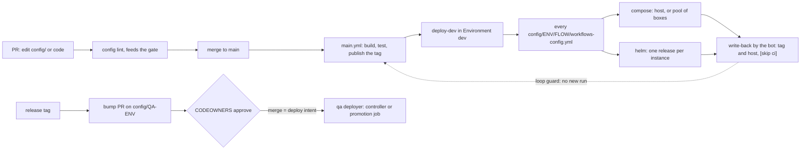

# gha-config-deploy

## What this skill gives you

A proven way to keep every environment's configuration and deployed version in git, lint it on every pull
request, deploy dev automatically after `main` passes and record what was deployed, and promote to qa and prod
only through reviewed pull requests. You get a reusable deploy workflow, a tested write-back script, an example
config tree, a CODEOWNERS file, and references for the tree, the lint checks, the deploy inventory and promotion.

## How the pieces fit



Dev is deployed first and recorded afterwards; qa and prod are recorded first (a reviewed PR) and deployed
afterwards. Either way the tree in git is what runs, and config lint has checked it before the merge.

## Principles

1. **The config tree is the deployment record.** One directory per running instance,
   `config/<env>/<flow>/<app>/<instance>/`, holds its configuration and its deployed tag. Why: "what runs where,
   since when, approved by whom" is `git log config/`, a rollback is a revert, and no deploy tool's database is
   needed for an audit.
2. **The path is the identity: restate it, lint it, derive every name from it.** `APP_ENV`, `APP_FLOW`,
   `APP_NAME`, `APP_INSTANCE` in `compose.env` and an `identity` map in `values.yaml` must equal the path;
   compose projects, Helm releases, labels and metric tags are derived from it. Why: a copied directory with a
   stale `APP_INSTANCE` reports its logs and metrics under another instance's name.
3. **Few ordered layers, one canonical place per key.** At most four file layers (platform, env, app-common,
   instance) loaded by one explicit import list; environment variables only for deploy-time knobs that compose
   or the platform also read. Why: a reviewer must be able to predict the effective value, and a key defined in
   two places is a silent override.
4. **Secrets never enter the tree.** Compose passes them through from the host's environment, Kubernetes mounts a
   `Secret` built from a secret store; lint scans values and forbids secret keys. Why: git history is forever and
   is copied to every clone, laptop and box.
5. **One set of files, two renderings.** Docker compose (laptops, CI stacks, dev hosts) and Helm (clusters) read
   the same files, and lint renders both. Why: parity from laptop to cluster, and a rendering nobody exercises rots.
6. **Config lint is a required check that also runs on a laptop.** Naming, required files, identity, allowed
   variables, rendering, tag policy, inventory, `helm template` per instance. Why: otherwise a config error
   surfaces at deploy time, in the target environment, after the merge.
7. **dev deploys itself after `main` passes, and only dev.** The GitHub Environment `dev` (branch `main` only)
   holds the deploy credentials; the workflow, the scripts and the Environment all refuse anything that is not a
   dev env. Why: every merge gets feedback on real targets, while qa and prod keep a reviewed deploy intent.
8. **Record what was deployed, only what was deployed, without looping.** The bot writes the tag (and the box)
   of every successful instance back with `[skip ci]`; jobs skip the bot's actor; bot runs get their own
   concurrency group. Why: git must match reality, a failed instance keeps its last good tag, and a write-back
   must not start the next deploy.
9. **qa and prod change only through reviewed bump PRs carrying the tested digest.** The release workflow opens
   them, CODEOWNERS of the env approve them, the merge is the deploy intent. Why: approvals and change records
   live on the PR, and nothing is rebuilt after `main` tested it.
10. **One deploy unit per instance.** One Helm release (`<app>-<instance>`, `replicas: 1`) or one compose project
    per instance, one namespace per flow. Why: an upgrade, a failed rollout or a rollback touches one instance,
    not every instance of an app.
11. **Every instance is in exactly one inventory entry and runs on exactly one box.** Placement is pinned, then
    discovered, then assigned; every box of a pool holds the whole flow; a guard refuses a second copy. Why: a
    forgotten instance never deploys, a deleted one never lingers, and no instance ever runs on two boxes at once.
12. **A failed deploy leaves the previous version running.** Pull before start; the new tag is only an override
    until the write-back records it, so a failed start restarts the old tag; Helm upgrades roll back on failure.
    Why: dev stays usable after a bad merge and the tree still tells the truth.

## Procedure

1. **Discover.** Deployable apps (Gradle `settings.gradle.kts` includes, Maven modules, npm/pnpm workspaces, Go
   `cmd/*`, Python packages with a Dockerfile) and their image names; how each runs today (a compose file, a Helm
   chart, both); the environments and regions; the business flows and their owning teams; existing config files
   and where secrets come from; the registry (default GHCR with `GITHUB_TOKEN`); the dev hosts or cluster and
   whether GitHub-hosted runners reach them; the rulesets on `main`; whether a GitHub App may be created.
2. **Decide**, starting from the defaults:

   | Decision | Default | Choose otherwise when |
   |---|---|---|
   | Location | `config/` in the code repository | access or cadence demands a separate repo (the layout moves unchanged) |
   | Env names | `dev`/`qa`/`prod` or `<region>-<stage>`; dev envs end in `dev` | other names: change the guard regex and `WRITE_BACK_ENV_PATTERN` |
   | Flows | business domains with an owning team | one flow is fine for a small estate |
   | Runtimes | Helm on clusters for every env; compose on hosts for `local` and dev only | no Kubernetes at all: compose everywhere, but qa and prod still deploy only merged bump PRs, through a promotion job (the dev scripts refuse them) |
   | Dev compose hosts | the flow's hosts declared as a `pool` | a single fixed host that already holds the config |
   | Host access | SSH from GitHub-hosted runners, key in Environment `dev`, forced command | host unreachable: a self-hosted runner on it |
   | Write-back identity | `GITHUB_TOKEN` while `main` accepts it | a ruleset blocks direct pushes: a GitHub App with a bypass |
   | qa / prod deployer | bump PR merged, then a GitOps controller or a promotion job applies it | never CI push with prod cluster credentials |

3. **Create the tree.** Copy `assets/config-example/` to `config/`, rename the placeholder directories and fill
   the tokens (below). Move existing settings to the lowest layer where they are true: every env to
   `_common/<app>/`, one env to `<env>/_common/`, one env and flow to `app-common/`, one instance to
   `<instance>/`. Keep YAML in mikefarah yq's layout (`yq -i . <file>` once) so write-backs are one-line diffs.
   Read `references/config-tree.md`.
4. **Load the layers.** Add the import list to the app's built-in config; make the compose template mount
   `/config/<layer>/` read-only and use `--env-file <instance>/compose.env`; make the chart render the
   `application.yml` layers into one ConfigMap (`--set-file appConfig.<layer>=...`) with a `checksum/config`
   annotation and mount an existing `Secret`. Give laptops, CI and hosts one wrapper,
   `run-compose.sh <env> <flow> <app> <instance> <command>`, that validates the tuple and refuses qa and prod
   (`references/config-tree.md` sections 2 and 7).
5. **Config lint.** Implement the catalogue of `references/config-lint-checks.md` in the repository's language,
   runnable locally, and call it from the PR and main pipelines as a job that feeds the single gate check (see
   gha-pipeline-design); never a path-filtered required check.
6. **Deployers.** Write the compose deployer (one target on its host) or a pool tool (one flow on its boxes), and
   the Helm deployer (one release), to the contracts in the header of `_deploy-dev.yml`; sketches and the forced
   SSH command are in `references/deploy-inventory.md`. Add `config/<env>/<flow>/workflows-config.yml` for every
   flow of every dev env and commit the reviewed `ssh-keyscan` lines as `config/<env>/known_hosts`.
7. **Workflow and write-back.** Copy `assets/workflows/_deploy-dev.yml` to `.github/workflows/`, fill its
   placeholders; copy `assets/scripts/write-back-tag.sh` and `write-back-tag-test.sh` to `scripts/ci/`. Call it
   from `main.yml` as job `deploy-dev` (gha-pipeline-design's `main.yml` template has it) with the loop guard and
   the bot concurrency group, `references/promotion.md` section 2.
8. **Repository settings.** Environment `dev` (branch `main`, secrets `DEV_DEPLOY_SSH_KEY`, `DEV_KUBECONFIG`);
   ruleset on `main` with "Require review from Code Owners" and, once it blocks direct pushes, a bypass for the
   write-back App (`WRITE_BACK_APP_ID` variable, `WRITE_BACK_APP_PRIVATE_KEY` secret); `.github/CODEOWNERS` from
   `assets/CODEOWNERS.example`; "Allow GitHub Actions to create and approve pull requests" for bump PRs.
9. **Promotion.** Create the qa and prod trees (same shape, no inventory, immutable tags pinned by digest), add
   the bump-PR job to the release workflow, and plan the GitOps controller that applies merged bumps:
   `references/promotion.md` sections 5 to 8.
10. **Validate and do a first run** (Validation below): merge a config-only change and watch one deploy, one
    write-back commit and no second run.

Filling the example tree (GNU sed; on macOS use `sed -i ''`):

```bash
cp -R <skill>/assets/config-example config
fill='s/__DEV_ENV__/us-dev/g; s/__FLOW__/payments/g; s/__APP__/sync-app/g; s/__INSTANCE_A__/ledger-db/g;
      s/__INSTANCE_B__/refunds-db/g; s#__IMAGE_REPO__#ghcr.io/<org>#g; s/__IMAGE_TAG__/0.1.0/g;
      s/__HOST_1__/box-1.<domain>/g; s/__HOST_2__/box-2.<domain>/g; s/__KUBE_CONTEXT__/<dev context>/g'
find config -depth -name '*__*' | while read -r p; do mv "$p" "$(dirname "$p")/$(basename "$p" | sed "$fill")"; done
grep -rl '__' config | xargs sed -i "$fill"
if grep -rnE '__[A-Z][A-Z0-9_]*__' config; then echo "placeholders left" >&2; fi
```

## Templates and scripts

| File | Purpose | What to adapt |
|---|---|---|
| `assets/workflows/_deploy-dev.yml` | Reusable deploy of one dev env: guard, resolve the inventory, deploy compose targets (per target, or per flow with a pool) and helm targets through pluggable commands, collect, write back, record a GitHub Deployment. Interface and contracts below | `__DEV_ENV__`, `__COMPOSE_DEPLOY_CMD__`, `__HELM_DEPLOY_SCRIPT__`; `POOL_DEPLOY_CMD` when a flow has a pool; the Guard regex if dev envs are named otherwise; a cloud OIDC login instead of `DEV_KUBECONFIG` if you use one (the caller then adds `id-token: write`) |
| `assets/scripts/write-back-tag.sh` | Sets `IMAGE_TAG` in `compose.env` and `image.tag` in `values.yaml` of each deployed instance, records pool placements as `host`, commits `chore(config): <env> deployed <tag> [skip ci]` as the bot on the fresh remote tip in a scratch worktree, pushes, re-applies on a new tip when the branch moved, stops at once on a real rejection; idempotent; refuses non-dev envs. Exit 0/1/2/3/4, `--help` | nothing to edit: `WRITE_BACK_*` variables (branch, config dir, inventory name, tag variable, env pattern, author, attempts, dry run). Needs git, awk, mikefarah yq v4 (for YAML) |
| `assets/scripts/write-back-tag-test.sh` | Plain-bash test of the script against a throwaway bare remote: edits, message, author, idempotency, race, rejected push, shallow clone, refusals | nothing; run in CI's lint job |
| `assets/config-example/` | Two layers of `_common`, one flow inventory with a pool, one app with `app-common` and two instances (one compose, one helm), in yq layout | tokens `__DEV_ENV__`, `__FLOW__`, `__APP__`, `__INSTANCE_A__`, `__INSTANCE_B__`, `__IMAGE_REPO__`, `__IMAGE_TAG__`, `__HOST_1__`, `__HOST_2__`, `__KUBE_CONTEXT__`; keys under `app:` are illustrative |
| `assets/CODEOWNERS.example` | Code, CI, config, per-flow and qa / prod ownership, last match wins | `__ORG__` and the team tokens; one line per flow |

### The `_deploy-dev.yml` contract

- **Inputs** (`workflow_call`): `env` (string, default `__DEV_ENV__`), `tag` (string, required: the version /
  image tag to deploy), `images` (string, default `'{}'`: JSON object project to image pinned by digest).
- **Outputs**: `deployed` (JSON list of `<flow>/<app>/<instance>`), `placements` (`<instance>=<host> ...`).
- **Caller**: `main.yml` job `deploy-dev`, only on `refs/heads/main` and not for the bot actor, with permissions
  `contents: write`, `deployments: write`, `packages: read`, and `secrets: inherit`. Keep the file name.
- **Deployers** run with stdin from `/dev/null` and `DEPLOY_ENV`, `DEPLOY_TAG`, `DEPLOY_IMAGES`, `DEPLOY_RUN_URL`,
  `DEPLOY_KNOWN_HOSTS` in their environment; exit 0 means deployed and healthy, anything else means not deployed
  with the previous version still running (no write-back):
  - compose: `$COMPOSE_DEPLOY_CMD <env> <flow> <app> <instance> --tag <tag> --host <host> --user <user>`;
  - pool: `$POOL_DEPLOY_CMD <env> <flow> deploy --tag <tag>`, printing `deployed <flow>/<app>/<instance>@<host>=<tag>`
    per deployed instance;
  - helm: `$HELM_DEPLOY_SCRIPT <env> <flow> <app> <instance> --tag <tag> --namespace <ns> --kube-context <cluster>`.
- **Secrets and variables**: Environment `dev` holds `DEV_DEPLOY_SSH_KEY` (loaded into an `ssh-agent` for the
  compose step only) and `DEV_KUBECONFIG`; `WRITE_BACK_APP_ID` (variable) and `WRITE_BACK_APP_PRIVATE_KEY`
  (secret) switch the write-back from `GITHUB_TOKEN` to a GitHub App.

References: `references/config-tree.md` (layout, layers, identity, naming, secrets, the two renderings, one release
per instance, namespaces) · `references/config-lint-checks.md` (checks 1 to 13 with failure examples, running and
testing the linter) · `references/deploy-inventory.md` (schema, placement, host bundles, transports, forced
command, Helm deploy steps) · `references/promotion.md` (dev deploy and write-back, loop guard, rulesets and
bypass, bump PRs, rollback, GitOps, settings checklist).

## Gotchas

| Symptom | Cause | Fix |
|---|---|---|
| The write-back starts another main run, which deploys and writes back again | the push was made with an App token or PAT (a `GITHUB_TOKEN` push starts no run) and nothing stops it | `[skip ci]` in the commit, jobs skip `github.actor == '<bot login>'`, bot runs in their own concurrency group; all three |
| The write-back fails with `GH013: Repository rule violations` (`GH006` with classic protection) | a ruleset or branch protection requires pull requests on `main` | add the pushing identity (a GitHub App) to the ruleset's bypass list; the script says so when the branch did not move |
| A human's queued deploy disappeared | concurrency keeps one pending run per group; a newer pending run (a bot run) cancelled it | give bot runs their own group; never `cancel-in-progress` on main |
| deploy-dev touched qa or prod files | one script path for every env | guard in the workflow, `WRITE_BACK_ENV_PATTERN` in the script, CODEOWNERS on `config/*-qa/`, `config/*-prod/`; qa and prod only by bump PRs |
| "Branch hotfix/1.2.x is not allowed to deploy to dev" | Environment `dev` is limited to `main` | run `deploy-dev` only when `github.ref == 'refs/heads/main'` |
| Two deployments per run in the Environment's history | the job's `environment:` creates one and the job records its own | `environment: {name: dev, deployment: false}` |
| Creating the Deployment fails with 409, or merges the default branch into the ref | the API checks all commit statuses (this run's are pending) and auto-merges by default | `required_contexts: []`, `auto_merge: false` |
| A password is in `config/` history | a value typed into a YAML layer or `compose.env` | rotate it; lint's secret scan and key rule; compose gets secrets from the host environment, Kubernetes from a `Secret` built from a secret store |
| The same instance runs on two boxes, or a box keeps a deleted instance | placement recomputed per deploy; sync without `--delete` | pinned, then discovered, then assigned, recorded as `host`; single-run guard before `start`; `rsync --delete` and a `--checksum` verification pass |
| A deploy loop handles the first target, then silently stops | `ssh` read the rest of the loop's input from stdin | give every deployer `</dev/null` (or `ssh -n`) |
| Fields shift when a target has no `host` | `IFS=$'\t' read` merges consecutive tabs | join with a non-blank separator such as `\|` |
| A broken jq filter deployed nothing and the step was green | `done < <(jq ...)`: a process substitution's failure escapes `set -e` | capture into a variable first (`rows=$(jq ...)`), then loop over `<<<"$rows"` (found while validating this template) |
| A chart receives `image.tag: 1.1` | `--set image.tag=1.10` and unquoted YAML make numbers | `--set-string image.tag=...`; quote tags in values files; lint rejects a non-string tag |
| Every write-back diff reformats the inventory | yq rewrote a file that was not in its layout | run `yq -i .` on every YAML file once; keep one space before trailing comments |
| The bump PR has no checks and cannot merge, or cannot be created | PRs created with `GITHUB_TOKEN` start no workflow; PR creation needs a repository setting | close and reopen the PR, or open it with an App token; enable "Allow GitHub Actions to create and approve pull requests" |
| Prod needs two teams but one approval merged it | CODEOWNERS needs one approval from any owner on the last matching line | Environment reviewers on the promotion job, or more required approvals; order rules general first, qa / prod last |
| A PR waits forever for "config-lint" | a path-filtered workflow is a required check and did not run | feed config lint into the single gate job instead |
| A failed first Helm install vanished with its pods | `--rollback-on-failure` (Helm 4; `--atomic` in Helm 3) uninstalls a failed first install | omit it when the release has no deployed revision; add it for upgrades |
| Config changed, pod did not restart | a ConfigMap update does not change the pod template | `checksum/config` annotation; Reloader for `Secret`s owned by a secret operator |
| Pool or lint tests went red after the first deploy | fixtures were copied from the live tree, which now records placements and tags | build fixtures in the test, or strip the recorded fields from the copy |
| git says an instance runs a tag it never ran | the write-back recorded a dry run or a validation-only transport | write back only real deploys; the reference wrote back its `local` transport only as a demo |

## Reviewing an existing setup

Ask these of a repository that already deploys from GitHub Actions; each "no" points at a principle or gotcha.

- From git alone, can you tell the tag and the box of every dev instance, and who approved what runs in prod? (1, 8, 9)
- Does every instance directory have exactly one inventory target, and every target a directory? (11, lint check 11)
- Do the identity copies equal the path, and does `image.tag` equal `IMAGE_TAG`? (2, lint check 4)
- Is any key set in two layers, or both as an environment variable and in YAML? (3)
- Does any file or commit in `config/` hold a credential? (4, lint check 9)
- Does config lint run on every PR through the gate, and on a laptop? (6)
- Could the deploy job, the write-back or a mis-typed input touch qa or prod? (7)
- Is a failed instance ever written back; does a write-back start a run; are all three loop guards there? (8)
- Can qa or prod change without a PR approved by that env's owners, or with a floating tag? (9, lint check 10)
- Does one upgrade touch more than one instance? (10)
- For pools: is the sync `--delete` and verified, is placement recorded, does `start` check the other boxes? (11)
- After a failed deploy, which version runs, and what does git say runs? (12)
- Do the deploy loops give `ssh` `</dev/null`, and capture `jq` output before looping over it? (gotchas)

## Validation

Run before handing the pipeline over (the workflow and scripts are in the target repository's paths):

```bash
python3 -c 'import sys,yaml; [yaml.safe_load(open(f)) for f in sys.argv[1:]]' \
  $(find config .github/workflows -name '*.yml' -o -name '*.yaml')        # YAML parses
! grep -rnE '__[A-Z][A-Z0-9_]*__' config .github scripts/ci                 # no placeholder left
actionlint                                  # workflows; runs shellcheck on run: blocks when it is installed
shellcheck --severity=style scripts/ci/*.sh
bash scripts/ci/write-back-tag-test.sh      # needs git and mikefarah yq v4; every case must pass
./gradlew configLint                        # or your linter: zero ERROR findings
WRITE_BACK_PUSH=false scripts/ci/write-back-tag.sh <dev env> 0.0.0-check   # what a write-back would commit
t=$(mktemp); for f in $(find config -name '*.yml' -o -name '*.yaml'); do   # every YAML file in yq's layout
  cp "$f" "$t"; yq -i . "$t"; cmp -s "$f" "$t" || echo "not in yq layout: $f"; done
```

Then on GitHub, once: merge a config-only change and check that `deploy-dev` deploys, one commit
`chore(config): <env> deployed <tag> [skip ci]` by the bot lands on `main`, no main run starts for it, and the
Environment `dev` shows one Deployment with state success; break one target and check the job goes red with no
write-back for it; push a release tag and check the bump PR opens and requests the qa CODEOWNERS.

## Related skills

- **gha-pipeline-design**: `main.yml` with the `deploy-dev` job, the loop guard and bot concurrency group, the
  single gate job config lint feeds, `GITHUB_TOKEN` limits, actionlint.
- **gha-versioning-release**: the tag `deploy-dev` receives, promotion of the tested digest, the release workflow
  that opens the bump PRs, registry retention that must keep every tag the tree references.
- **gha-affected-builds**: config-only changes run config lint without a build, yet still deploy on `main`.
- **gha-ephemeral-test-envs**: prove the chart and the tree in a throwaway kind cluster (one release per instance)
  before `deploy-dev`, and compose test stacks through the same wrapper.
- **gha-build-images**: pinned, checksum-verified helm, kubectl, kubeconform and yq in the CI image.

If one of these is not installed, the references of this skill contain what `deploy-dev` needs from them.

## Provenance

Distilled from the reference repository crazymatthsu/github-demo: its `config/` tree and `config/README.md`, docs
D5, D6, D9 and D11 with ADRs DL-06 to DL-39, `.github/workflows/_deploy-dev.yml`, `main.yml`, `config-lint.yml`
and `release.yml`, `scripts/ci/write-back-tag.sh`, `set-image-tag.sh` and `set-target-host.sh`,
`scripts/run-compose.sh`, `scripts/pool-deploy.sh`, `scripts/helm-deploy-instance.sh`, `build-logic`'s
`ConfigLint.kt`, `.github/CODEOWNERS` and `.github/README.md`. There, deploy-dev ran green on merges to `main`:
helm targets into a kind cluster created in the job, compose targets through the pool tool's `local` transport
(no real boxes existed), and the bot write-back of tag and placement with the loop guard. Not proven there: SSH
to real boxes, the GitHub App identity, a qa bump PR against an existing qa tree, lint checks 7 and 8, and a
GitOps controller. The templates are generalised rewrites and depend on nothing in that repository.
