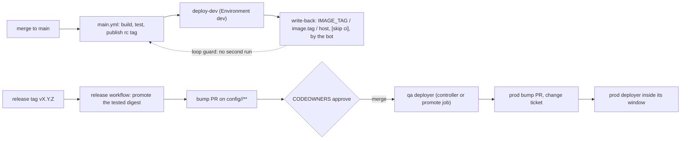

# Promotion: dev deploys then records, qa and prod record then deploy

Read this when you wire `deploy-dev` into the main pipeline, set up the write-back identity and the rulesets, or
build the bump pull requests that promote a release to qa and prod.

## Contents

1. The model
2. dev: deploy after main passes, then write back
3. The loop guard, and why it has three parts
4. Write-back identity, rulesets and bypass
5. qa and prod: bump pull requests approved by CODEOWNERS
6. Promoting a config change (not an image)
7. Rollback
8. Later: a GitOps controller
9. Repository settings checklist

## 1. The model



- dev is deployed first and recorded afterwards: every merge to `main` that passed CI deploys, and the bot
  writes the deployed tag back into the tree. Fast feedback, no human in the loop, git still says what runs.
- qa and prod are recorded first and deployed afterwards: a pull request changes the tag in
  `config/<env>/**`, CODEOWNERS approve it, and the merge is the deploy intent. Git is the deployment record
  in every env, and a rollback is always a revert.
- Nothing is rebuilt after `main`: the qa and prod bump PRs carry the tag of the digest that main tested (see
  gha-versioning-release for tags and promotion by digest).

## 2. dev: deploy after main passes, then write back

The last job of `main.yml` calls the reusable `_deploy-dev.yml` (the skill's template), only on `main` and never
for the bot:

```yaml
concurrency:
  # One queue per branch, never cancelled; runs started by the bot get a group of their own.
  group: ${{ github.actor == '__BOT_LOGIN__' && format('main-bot-{0}', github.run_id) || format('main-{0}', github.ref_name) }}
  cancel-in-progress: false

jobs:
  # build, tests, publish ... (gha-pipeline-design)
  deploy-dev:
    needs: [build, publish]
    if: github.ref == 'refs/heads/main' && github.actor != '__BOT_LOGIN__'
    uses: ./.github/workflows/_deploy-dev.yml
    permissions:
      contents: write     # the write-back commit
      deployments: write  # the GitHub Deployment record
      packages: read
    with:
      tag: ${{ needs.build.outputs.version }}
      images: ${{ needs.build.outputs.images }}
      # env: defaults to the dev env set in _deploy-dev.yml; pass it to deploy another dev env
    secrets: inherit
```

This is the `deploy-dev` job of gha-pipeline-design's `main.yml` template. `__BOT_LOGIN__` is the login of the
identity that pushes the write-back: `github-actions[bot]` with `GITHUB_TOKEN`, `<app-slug>[bot]` with a GitHub
App.

- Deploy only what passed: `deploy-dev` needs the job that published the tested digest. A config-only merge still
  runs the pipeline and deploys (the affected-builds map may skip the build and deploy the last published tag).
- Environment `dev`: deployment branches limited to `main`, no reviewers, the deploy secrets. A job on another
  branch that references it fails ("not allowed to deploy to dev due to environment protection rules"), which is
  why the job condition also checks the ref (a `hotfix/**` run of `main.yml` skips `deploy-dev`).
- `environment.deployment: false` in `_deploy-dev.yml` keeps the Environment's rules and secrets without the
  automatic deployment object, because the job creates its own Deployment with a payload (env, tag, images,
  targets) and statuses `in_progress`, then `success` / `failure` with the run URL.
- The write-back commits `IMAGE_TAG` in `compose.env`, `image.tag` in `values.yaml` of every instance that
  deployed (never a failed one) and the `host` of every pooled instance, as one commit per run:
  `chore(config): <env> deployed <tag> [skip ci]`, body listing the instances, boxes and run URL.
- Never tag or release the write-back commit: it has no main run of its own (it carries `[skip ci]`), and
  `[skip ci]` in a tagged commit also suppresses the tag's workflows. Release the merge commit main tested.

## 3. The loop guard, and why it has three parts

Config lives in the repository that deploys it, so the write-back is a push to `main`, and a push to `main`
starts `main.yml`. Three guards, each covering what the others miss:

| Guard | Covers | Misses on its own |
|---|---|---|
| `[skip ci]` in the write-back message | GitHub starts no `push` / `pull_request` run at all (no minutes, no lint of a bot edit) | a human replaying the commit without the marker; the marker copied into a human commit by accident (warn in PR lint) |
| `if: github.actor != '<bot>'` on the jobs | a bot push without the marker, a renamed commit | needs a stable bot identity (an App's `<slug>[bot]`) |
| a concurrency group of its own for bot runs | a bot run queued behind a human merge | nothing: GitHub keeps one pending run per group, and a newer pending run cancels the older pending one, so a bot run in the shared group could cancel a human's queued deploy |

Do not use `paths-ignore: config/**` on `main.yml` as a guard: a human config-only merge must still deploy. With
`GITHUB_TOKEN` the write-back push starts no workflow in the first place (events created by `GITHUB_TOKEN` never
do, except `workflow_dispatch` and `repository_dispatch`); the guards matter from the day an App token pushes.

## 4. Write-back identity, rulesets and bypass

- `GITHUB_TOKEN` (the default of the template) pushes as `github-actions[bot]`, starts no run, and needs
  `contents: write`. It is enough while `main` accepts direct pushes from workflows.
- A ruleset (or classic branch protection) that requires pull requests on `main` rejects the push
  (`GH013: Repository rule violations`). Grant a bypass to the pushing identity: a GitHub App installed on the
  repository with `contents: write`, added to the ruleset's bypass list. The template switches to it when the
  repository variable `WRITE_BACK_APP_ID` and the secret `WRITE_BACK_APP_PRIVATE_KEY` exist
  (`actions/create-github-app-token`), commits as `<slug>[bot]`, and `main.yml`'s guard must then name that login.
- The alternative, a write-back pull request with auto-merge, keeps the ruleset without a bypass but needs the
  App token too (a PR opened with `GITHUB_TOKEN` runs no checks, so it never becomes mergeable) and adds a merge
  delay per deploy.
- Never a personal access token: it ties deploys to a person, outlives them and is broader than one repository.
- The bot writes to dev paths and opens PRs; it can never approve (CODEOWNERS and required reviews still apply).
- `write-back-tag.sh` distinguishes a lost race (the branch moved: it re-applies the edits on the new tip and
  pushes again, no rebase) from a rejection (the branch did not move: it stops at once and prints the bypass hint).

The reference's write-back pushed with `GITHUB_TOKEN` to a `main` without a blocking ruleset and planned the App
for when one arrives; the App path of the template is therefore unproven there.

## 5. qa and prod: bump pull requests approved by CODEOWNERS

The release workflow (triggered by the release tag, see gha-versioning-release) promotes the tested digest in the
registry and then opens one bump PR per target env, changing only `config/<qa env>/**`:

```yaml
  bump-qa:
    needs: [resolve, github-release]   # the release's version and the list of released apps
    runs-on: ubuntu-latest
    timeout-minutes: 10
    permissions:
      contents: write
      pull-requests: write
    env:
      TARGET_ENV: __QA_ENV__                           # e.g. us-qa
      VERSION: ${{ needs.resolve.outputs.version }}    # e.g. 1.5.0
      APPS: ${{ needs.resolve.outputs.apps }}          # space-separated app names
      GH_TOKEN: ${{ github.token }}                    # an App token makes the PR's checks run
    steps:
      - uses: actions/checkout@v7
        with:
          ref: ${{ github.event.repository.default_branch }}
      - name: Open or update the bump PR
        env:
          BASE: ${{ github.event.repository.default_branch }}
        run: |
          set -euo pipefail
          changed=0
          for app in $APPS; do
            for f in config/"$TARGET_ENV"/*/"$app"/*/compose.env config/"$TARGET_ENV"/*/"$app"/*/values.yaml; do
              if [[ ! -f $f || $f == */app-common/* ]]; then continue; fi
              case $f in
                */compose.env) awk -v t="$VERSION" '/^IMAGE_TAG=/ {print "IMAGE_TAG=" t; next} {print}' "$f" > "$f.new"
                               mv "$f.new" "$f" ;;
                */values.yaml) TAG=$VERSION yq -i '.image.tag = strenv(TAG)' "$f" ;;
              esac
              changed=1
            done
          done
          if [[ $changed -eq 0 ]] || git diff --quiet; then
            echo "::notice::config/$TARGET_ENV has no instance to bump, or already runs $VERSION"
            exit 0
          fi
          branch="bump/$TARGET_ENV/$VERSION"
          git switch -c "$branch"
          git add -- "config/$TARGET_ENV"
          git -c user.name='github-actions[bot]' -c user.email='41898282+github-actions[bot]@users.noreply.github.com' \
            commit -q -m "chore(release): bump to $VERSION in $TARGET_ENV"
          git push -q --force origin "HEAD:refs/heads/$branch"
          body="Release $VERSION for config/$TARGET_ENV: approval by its CODEOWNERS is the deploy intent. Run: $GITHUB_SERVER_URL/$GITHUB_REPOSITORY/actions/runs/$GITHUB_RUN_ID"
          if [[ $(gh pr view "$branch" --json state --jq .state 2>/dev/null || true) == OPEN ]]; then
            gh pr edit "$branch" --body "$body"
          else
            gh pr create --base "$BASE" --head "$branch" --title "chore(release): bump to $VERSION in $TARGET_ENV" --body "$body"
          fi
```

- CODEOWNERS on `config/*-qa/**` and `config/*-prod/**` (and the ruleset's "Require review from Code Owners")
  make the approval of the owning team the deploy intent. One owner line needs one approval from any listed
  owner; for two distinct approvals on prod add required reviewers on the promotion job's Environment
  (`<region>-prod`) or raise the ruleset's required approvals.
- The PR body lists the images by digest, the release, and the main run that tested them; the prod PR also
  carries a `Change-Ticket:` trailer that a PR lint checks.
- qa and prod values should pin the digest next to the tag (`image.digest: sha256:...`, or
  `IMAGE_TAG=1.5.0@sha256:...`); config lint's tag policy (check 10) rejects floating tags there.
- `gh pr create` with `GITHUB_TOKEN` needs the repository setting "Allow GitHub Actions to create and approve pull
  requests"; without it the call fails with "GitHub Actions is not permitted to create or approve pull requests".
  The PR it creates starts no workflow, so its required checks never report: a human closes and reopens it (the
  reopen event is theirs), or the job uses an App token. The reference used `GITHUB_TOKEN` with the close/reopen
  note in the PR body, and its qa bump job only printed a notice because no qa tree existed.
- The prod PR copies the tag (and digest) proven in qa, opened by the promotion job or by ops, never computed
  again.

## 6. Promoting a config change (not an image)

One PR per env, changing only `config/<env>/**`, reviewed under that env's CODEOWNERS; the parity check (config
lint check 8) reports keys that exist in dev but not in the next env. Never copy directories between envs (`us-dev/`
over `us-qa/`): it drags dev-only values along and bypasses review. Promotion tooling may pre-fill the PR; a
human approves it.

## 7. Rollback

| Env | Mechanism |
|---|---|
| dev | revert the offending change on `main`: the pipeline builds, deploys and writes back again. A failed deploy already left the previous version running (compose restarts the previous tag, Helm rolls back) and wrote nothing back for it |
| qa, prod | revert the bump PR (same gates, expedited approvals); the deployer applies the previous tag, still in the registry (retention never deletes a tag the tree references) |
| emergency | `helm rollback` or the controller's rollback, with its auto-sync paused until the revert merges, otherwise self-heal re-applies the bad version |

## 8. Later: a GitOps controller

When clusters outgrow CI push, let a controller pull from the tree:

- Argo CD: an ApplicationSet per env with a git directory generator over `config/<env>/*/*/*` (excluding
  `app-common` and `_common`) in a matrix with a cluster generator; one Application `<app>-<instance>` per
  instance, `valueFiles` and `fileParameters` pointing at the layers, destination namespace the flow. Sync windows
  on an AppProject per env/flow enforce deployment windows in the cluster. Per-cluster installs for prod keep
  prod credentials out of GitHub entirely.
- Flux: a `HelmRelease` per instance (generated), real Helm history; windows only by suspending on a schedule.
- `deploy-dev` then shrinks to: wait for the Application's health, smoke test, write back. The inventory's helm
  part retires (config lint check 11 becomes the ApplicationSet dry run, check 13). Image-updater bots are fine
  for dev only; an automation that picks prod images contradicts the approval gate.

## 9. Repository settings checklist

- Ruleset on the default branch: pull request required, the single gate check required, "Require review from Code
  Owners", no force pushes; bypass for the write-back App when it pushes directly.
- `.github/CODEOWNERS` from `assets/CODEOWNERS.example`: flows own `config/*/<flow>/`, ops own qa and prod.
- Environment `dev`: deployment branches `main`; secrets `DEV_DEPLOY_SSH_KEY`, `DEV_KUBECONFIG`.
- Environments per qa / prod region for the promotion job: required reviewers, deployment tags `v*` only.
- Actions > General: "Allow GitHub Actions to create and approve pull requests" (bump PRs with `GITHUB_TOKEN`).
- Optional: variable `WRITE_BACK_APP_ID` and secret `WRITE_BACK_APP_PRIVATE_KEY` for the App write-back.
- Registry packages grant this repository Actions access (pushes and promotions otherwise fail with 403).
