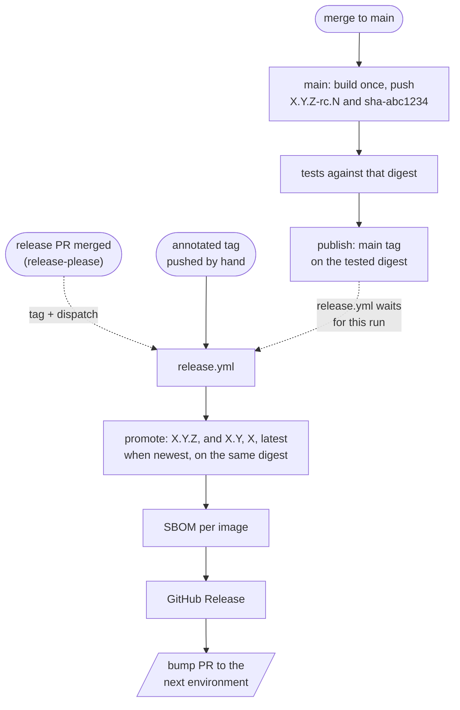

# Release flow end to end

Read this when you wire the release path into a repository, cut or re-run a release, handle a hotfix,
add or remove release-please, or promote to another registry path.

Contents: 1 The chain · 2 What main must publish · 3 release.yml job by job · 4 Cutting a release ·
5 Hotfix branches · 6 release-please (optional) · 7 Promotion targets · 8 The bump pull request ·
9 Repository settings · 10 What was proven where

## 1. The chain



One build per commit, on main. Everything after it moves the same digest: the tests pull it by digest,
`publish` tags it `main` once the tests pass, the release adds version tags to it, the bump pull request
points the next environment at it. A release never compiles anything.

## 2. What main must publish

A release is possible only for a commit whose main run passed and published, for **every image of the
line**, a digest tagged `sha-<sha7>`:

- main builds every image of a line (or, with affected builds, retags each unchanged image's previous
  digest with the new `sha-<sha7>` and rc tags; skill gha-affected-builds), pushes `<rc>` and `sha-<sha7>`,
  runs the tests against those digests, then `publish` (`_promote.yml`) re-asserts the tag set and moves
  `main` onto exactly the tested digests;
- the build computes the pre-release form even if the commit already carries its release tag
  (`--ignore-head-tags`), because release-please may tag the commit before main's build starts;
- `hotfix/**` branches run the same main workflow (without the dev deploy), so hotfix commits are tested
  and published the same way.

## 3. release.yml job by job

| Job | Does | Fails when | Permissions |
|---|---|---|---|
| `resolve` | parses the tag against `RELEASE_LINES`; runs the version command and compares; polls the main workflow's runs for the tag's sha (`gh api .../actions/workflows/<file>/runs?head_sha=`) up to `wait-minutes` (60); resolves `<image>:sha-<sha7>` per image to `repo:sha-…@sha256:…`; computes the release tag set, "newest" and the previous release of the line | not a release tag of a line; the build computes another version (wrong commit, wrong line, dirty tree); no run for the sha (5 minutes' grace for a run that is just starting); only failed runs; still running at the deadline; an image without `sha-<sha7>` | `contents: read`, `actions: read`, `packages: read` |
| `promote` | `_promote.yml`: `retag-image.sh` per image, verified writes | an immutable tag already points elsewhere (exit 3), a registry write fails | `packages: write` |
| `sbom` | `anchore/sbom-action` on `repo@digest`, CycloneDX JSON, one artifact per image | the scan fails | `packages: read` |
| `github-release` | `gh release view` → `create --verify-tag --generate-notes --notes-start-tag <previous of the line> --latest=<newest>` when missing; uploads the SBOMs with `--clobber` | the tag does not exist (`--verify-tag`) | `contents: write` |
| `bump` | runs the bump command in a checkout of the default branch; commits to `release-bump/<env>/<tag>`; opens or updates the pull request | a git or gh error | `contents: write`, `pull-requests: write` |

Every job is idempotent: a re-run finds tags `unchanged`, the release present, the bump branch
force-updated and its pull request edited. Re-run with `gh workflow run release.yml --ref <tag>` (the
`wait-minutes` input extends the wait). `concurrency: release-<ref>` serialises two runs of one tag.

Release tag set: `X.Y.Z` and `sha-<sha7>` always (the second is already there; keeping it in the set
re-verifies it), `X.Y` if the tag is the newest of `X.Y.*`, `X` if the newest of `X.*`, `latest` if the
newest of the line. Worked example with tags v1.4.2, v1.5.0, v2.0.0, then hotfixes v1.4.3 and v1.5.1:

| Tag released | Moving tags it gets |
|---|---|
| v2.0.0 | `2.0`, `2`, `latest` |
| v1.5.1 | `1.5`, `1` |
| v1.4.3 | `1.4` |
| v1.4.2 (re-run later) | none |

## 4. Cutting a release

**With release-please** (section 6): merge the release pull request. release-please tags the merge commit
and creates the GitHub Release; its workflow dispatches release.yml on each new tag.

**By hand** (always available, also the emergency route):

```bash
# 1. find the newest commit that main built and tested (NOT simply origin/main: a bot's [skip ci]
#    write-back commit on top has no run, and a tag on it starts no workflow)
gh run list --workflow main.yml --branch main --status success --limit 5 --json headSha,displayTitle,url
# 2. check what the build computes there, then tag and push
git fetch --tags origin && git switch --detach <sha>
scripts/ci/git-version.sh --ci --ref main --field version   # e.g. 1.5.0-rc.7: release it as v1.5.0
git tag -a v1.5.0 -m "v1.5.0" && git push origin v1.5.0
```

The pushed annotated tag triggers release.yml directly. If release-please is enabled, follow up with a
pull request that sets `.release-please-manifest.json` to the new version: release-please takes the last
release from that file and would otherwise propose the same number again.

## 5. Hotfix branches

Use a hotfix branch only when main already holds changes that must not ship yet; otherwise fix on main
and release normally.

1. `git switch -c hotfix/1.4.x v1.4.2 && git push -u origin hotfix/1.4.x`; protect `hotfix/**` like main.
2. Pull requests into `hotfix/1.4.x` get the full PR checks.
3. Each merge runs the main workflow on the branch: versions `1.4.3-rc.<n>` (patch only, whatever the
   commits say), tags `1.4.3-rc.<n>` and `sha-<sha7>`, no `main` tag and no dev deploy.
4. Tag the tested hotfix commit by hand: `git tag -a v1.4.3 <sha> -m v1.4.3 && git push origin v1.4.3`.
   release.yml promotes it; `1.4` moves, `1`/`latest` stay on newer releases; the GitHub Release is not
   marked Latest; the bump pull request goes to the next environment as usual.
5. Bring the fix to main: merge `hotfix/1.4.x` (git-version.sh keeps main's base at its highest tag) or
   cherry-pick the fix. If main would release the same number next (main has only fixes since the release
   the hotfix branched from), update the release-please manifest to the hotfix version first.
6. Delete the branch once a newer release has replaced it in production.

The release-please template runs on main only. To let it drive a hotfix branch, add the branch to its
trigger and pass `target-branch: ${{ github.ref_name }}`; its manifest and changelog then diverge per
branch and conflict when merged back, which is why the manual tag is the default for hotfixes.

## 6. release-please (optional front end)

What it gives: a release pull request per push to main with the next version and a changelog from
Conventional Commits; merging it creates the tag and the GitHub Release. It never feeds the build.

Configuration that keeps it consistent with git-version.sh (assets/release-please-config.example.json):

| Setting | Value | Why |
|---|---|---|
| `release-type` | `simple` | writes only `CHANGELOG.md` and the manifest; `version.txt` is updated only if it exists, so do not create one |
| `initial-version` | `0.1.0` | the default is 1.0.0; git-version.sh starts a line without tags at 0.1.0 |
| `bump-minor-pre-major`, `bump-patch-for-minor-pre-major` | `false` | the same bump rules as the script before 1.0 |
| `include-v-in-tag` | `true` | tags `v1.2.3` |
| packages | `"."` root line (`include-component-in-tag: false`); `"<dir>"` other lines (`include-component-in-tag: true`, `tag-separator: "/"`) | tags `v1.2.3` and `<dir>/v1.2.3` = the script's `--prefix` values |
| `exclude-paths` on `"."` | the other packages' directories | the root package otherwise sees every commit; give git-version.sh the same filter (`--path . --path ':(exclude)<dir>'`) or drop both |
| `separate-pull-requests` | unset (false) or `true` | with more than one package the default is ONE combined release pull request for all packages; `true` gives one per package |

`.release-please-manifest.json` starts as `{".": "0.0.0", "<dir>": "0.0.0"}` (0.0.0 = never released).
Placeholders of the example config: `__ROOT_COMPONENT__` (name of the root package, e.g. `api`),
`__SUB_PACKAGE_PATH__` (directory of the second line, e.g. `server`), `__SUB_COMPONENT__` (its name). With
one line, delete the second package and the `exclude-paths` entry.

Facts from running it (reference repository):
- It needs Settings → Actions → General → "Allow GitHub Actions to create and approve pull requests",
  or the run fails creating the pull request.
- Its pull request, tags and releases are created with `GITHUB_TOKEN`, so they start no workflow: the
  template dispatches release.yml per released path (`paths_released`; outputs `tag_name` for `.` and
  `<path>--tag_name` for the others), and the release pull request's own checks need a close/reopen.
- Its tags are lightweight (created through the Releases API); `git describe` without `--tags` ignores them.
- With a GitHub App token (`token:` input) the tag push starts release.yml by itself and the PR checks
  run; then delete the dispatch step, or every release runs twice (serialised and idempotent, but wasted).

To disable it: delete `release-please.yml`, `release-please-config.json` and the manifest (keep
`CHANGELOG.md` as history, or delete it too). Nothing else changes: releases go through the manual route.

## 7. Promotion targets

| Registry setup | How to promote | Notes |
|---|---|---|
| One repository per image (GHCR default) | retag inside the repository (`_promote.yml`) | GHCR has no promotion concept; the release tags are the promotion |
| A repository path per stage (`<ns>/dev/app` → `<ns>/qa/app`) | `retag-image.sh --to <ns>/qa/app <ns>/dev/app@sha256:… 1.5.0` | copies the manifest and blobs, keeps the digest (verified with a multi-platform index); consumers of a stage pull only what was promoted there |
| JFrog Artifactory | `jf rt docker-promote --copy <image> docker-dev-local docker-qa-local` (or the promotion REST API), with OIDC login | per-stage virtual repositories make it enforceable; keep the verify-after-write idea |
| Amazon ECR / other registries | `imagetools create` across repositories works with both logins; ECR supports immutable tags per repository | enable the registry's tag immutability where it exists |

Guard qa and prod promotions with a GitHub Environment (required reviewers, deployment branches limited to
tags `v*`) on the job that promotes, and pin tag and digest in their configuration.

## 8. The bump pull request

The release is not deployed by release.yml. Its last job edits the next environment's configuration
(image tag, ideally with the digest) and opens a pull request; approval by that environment's CODEOWNERS is
the deploy intent, and a revert of the merge is the rollback. The edit itself is the bump command
(`__BUMP_COMMAND__`), which belongs to the configuration layout (skill gha-config-deploy). Opened with
`GITHUB_TOKEN`, the pull request starts no checks until someone closes and reopens it; a GitHub App token
removes that step.

## 9. Repository settings

- Actions → General: allow GitHub Actions to create and approve pull requests (release-please, bump PR).
- Packages: each container package grants this repository Actions access (Package settings → Manage
  Actions access), write role for pushes and retags, admin role for deletions; otherwise 403.
- Rulesets: restrict who may create `v*` (and `*/v*`) tags; protect `main` and `hotfix/**`.
- Environments for qa/prod promotion jobs if promotion moves between registry paths or registries.

## 10. What was proven where

In the reference repository the main path ran green on GHCR: pre-release versions on main
(`0.1.0-rc.<n>`), images built once, tested, `publish` retagging by digest, the dev deploy with its
`[skip ci]` write-back; release-please opened its combined release pull request (manifest and changelog
only). The release workflow's logic was tested here with stubbed `gh`/`docker` and real temp repositories;
`retag-image.sh`/`resolve-image.sh` were run against a real registry (single-platform, multi-platform index,
cross-repository copy). A first end-to-end tag release (GitHub Release creation, SBOM upload, bump pull
request against GitHub) was not yet observed there: watch the first one.
