# Workflows: what runs when

One diagram per pipeline: the trigger, the workflow file that runs, its jobs, the reusable workflows
(`_*.yml`) those jobs call, and the composite actions (`.github/actions/<name>/action.yml`) each job
uses. [`../README.md`](../README.md) has the file table, the repository settings and the first-run
bootstrap. [`../affected-map.yml`](../affected-map.yml) decides which projects a change builds and tests.

1. [Which workflow runs on which event](#which-workflow-runs-on-which-event)
2. [Push to a branch](#push-to-a-branch)
3. [Pull request to main](#pull-request-to-main)
4. [Push to main](#push-to-main)
5. [Release](#release)
6. [Tag push](#tag-push)
7. [Nightly](#nightly)
8. [Base images](#base-images)
9. [Inside the reusable workflows](#inside-the-reusable-workflows)
10. [Composite actions by pipeline](#composite-actions-by-pipeline)

Legend, the same in every diagram:

| Shape | Meaning |
|---|---|
| blue pill | a trigger: the event that starts the run, or the caller of a reusable workflow |
| grey box | a whole workflow file |
| white box | a job, or a step that runs shell commands |
| violet box with side bars | a reusable workflow `_*.yml`, or a job that calls one |
| amber hexagon | a step that uses a composite action from `.github/actions/` |
| green parallelogram | what the run produces: images, a commit, a pull request, a release |
| dotted arrow | happens only under the condition on the arrow, or an indirect effect |

In the pipeline diagrams each job lists its composite actions on its last line (`actions: ...`).
`actions: none` means the job uses only shell steps and third-party actions.

## Which workflow runs on which event

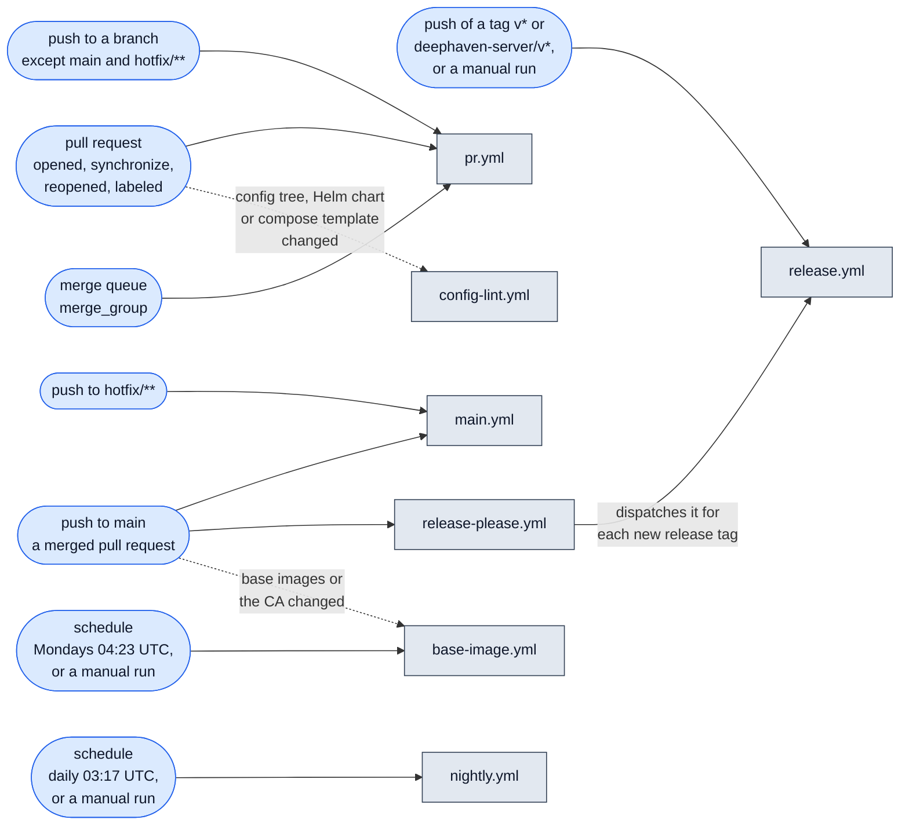

The reusable workflows (`_*.yml`, and `config-lint.yml` when called) run only as jobs of these callers:

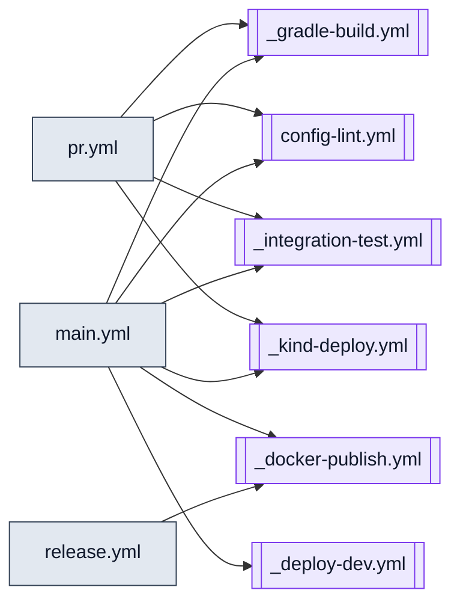

`nightly.yml`, `base-image.yml` and `release-please.yml` call no reusable workflow.

## Push to a branch

`pr.yml` on the `push` event: the fast tier, without images or containers. Its gate is reported as
`push-gate`.

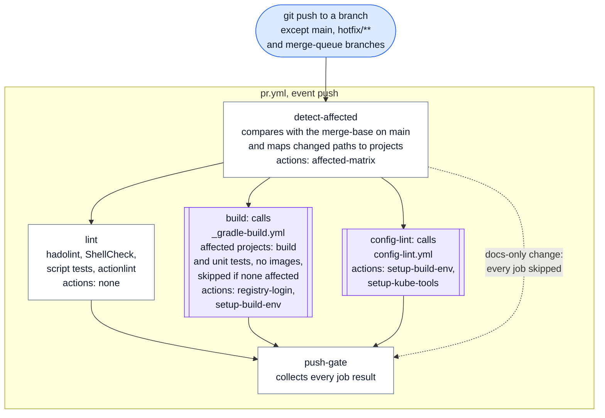

- `integration-test` and `kind-deploy` never run on a push event.
- A newer push to the same branch cancels the older run.
- Tag pushes do not start `pr.yml`.
- When the branch has an open pull request, the same push also starts the pull request pipeline below.
  Two `pr.yml` runs then appear, `push-gate` and `pr-gate`.

## Pull request to main

`pr.yml` on the `pull_request` and `merge_group` events, and `config-lint.yml` on its own when the
config tree, a Helm chart or a compose template changed.

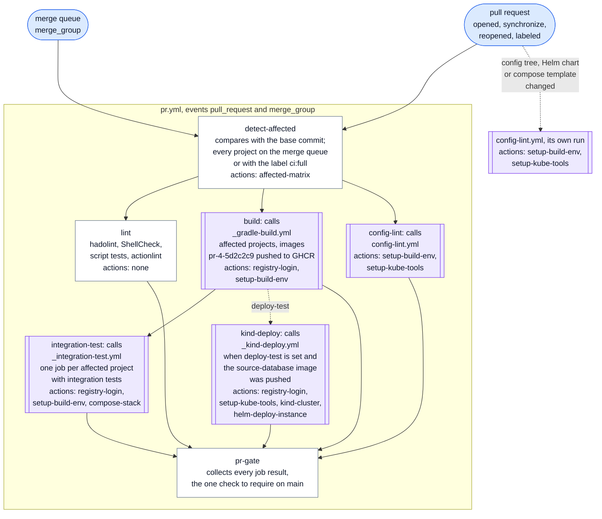

- The merge queue runs the same jobs on the merge result, with every project selected.
- Adding the `ci:full` label starts a new run with every project selected.
- A pull request from a fork builds its images but cannot push them, so `integration-test` and
  `kind-deploy` are skipped.
- A config-only change builds no image, so `kind-deploy` is skipped. `config-lint` still renders every
  Helm release, and `main` runs the kind deploy after the merge.

## Push to main

A merge to `main` starts `main.yml` and `release-please.yml`, and `base-image.yml` when the base images
or the CA changed. A push to `hotfix/**` runs `main.yml` without `deploy-dev`.

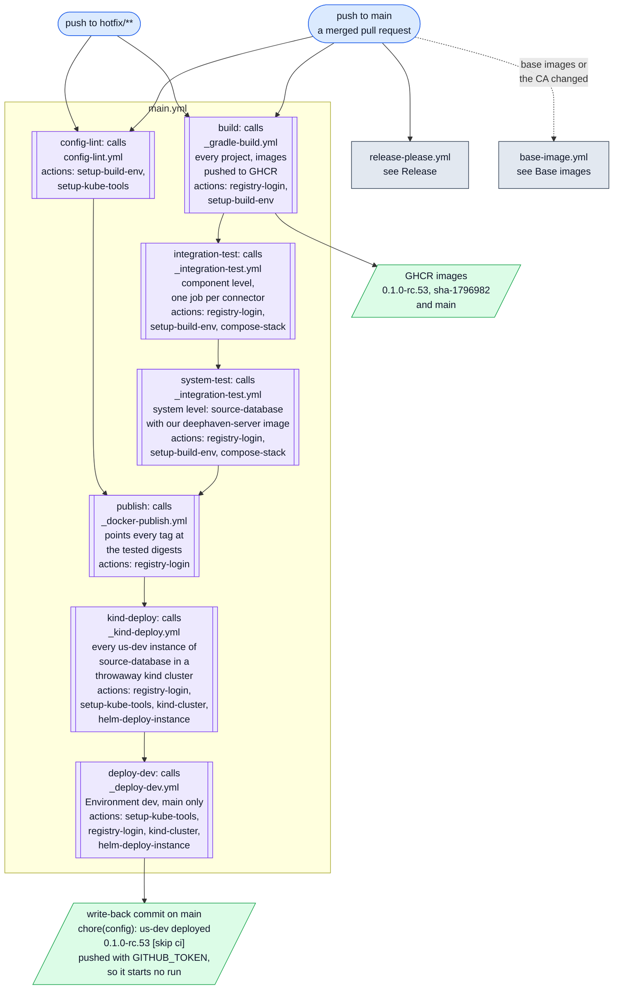

- Every job is skipped when the pusher is `github-actions[bot]`, the identity of the write-back. With
  `GITHUB_TOKEN` that push starts no run anyway (DL-36).
- `build` and `config-lint` start together. `publish` waits for the system test and config-lint, so
  nothing is deployed or released from an untested digest.
- `kind-deploy` proves the chart and the us-dev config with the published digests before `deploy-dev`.
- On `hotfix/**`, `deploy-dev` is skipped: a hotfix reaches qa and prod through a release tag on
  its branch and the us-qa bump pull request.

## Release

`release-please.yml` runs on every push to `main`. It keeps one release pull request open per version
line and creates the tag when that pull request is merged.

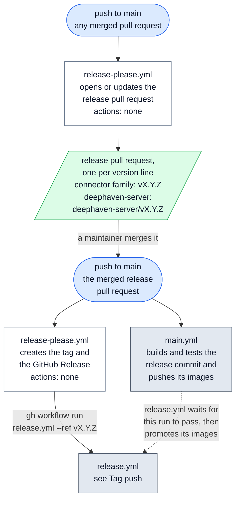

- Tags, releases and pull requests created with `GITHUB_TOKEN` start no workflow run. That is why
  `release-please.yml` dispatches `release.yml` itself. The release pull request and the us-qa bump
  pull request start no `pr.yml` run either: close and reopen them to run `pr-gate`, until a GitHub
  App token replaces `GITHUB_TOKEN` (DL-09).
- release-please needs the repository setting "Allow GitHub Actions to create and approve pull
  requests" (Settings, Actions, General).

## Tag push

`release.yml` runs on a release tag. release-please's tags reach it through `workflow_dispatch`, and a
tag pushed by hand, the emergency route, triggers it directly. It never rebuilds: it promotes the
images that `main.yml` built and tested for the tagged commit.

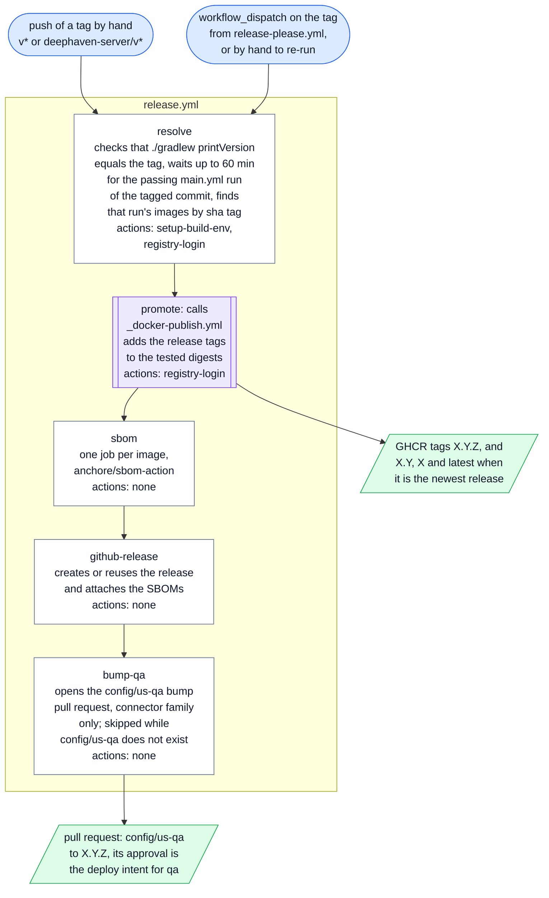

## Nightly

`nightly.yml` runs the GHCR retention sweep and proves the teardown guarantee on a failing and on a
cancelled run.

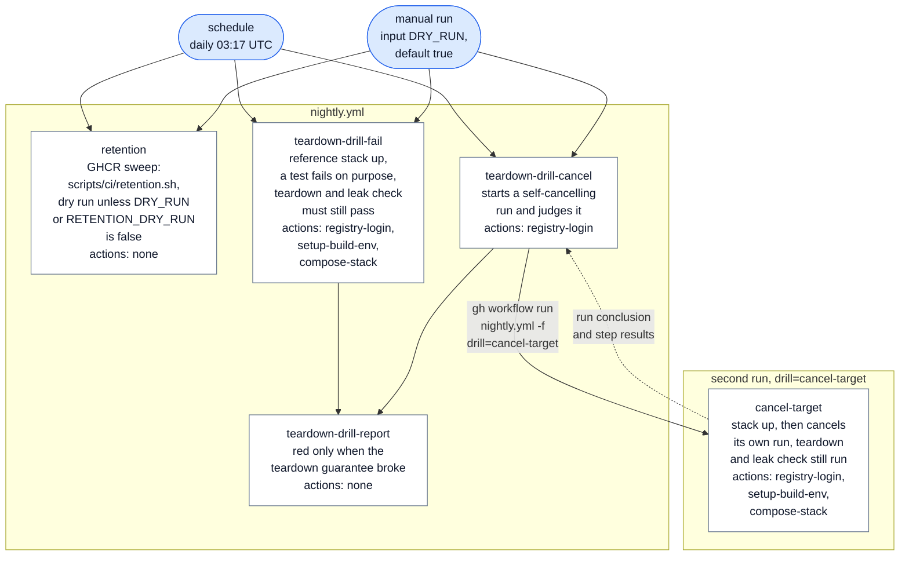

## Base images

`base-image.yml` builds, verifies and publishes the two company base images. One matrix job per image
runs the same steps.

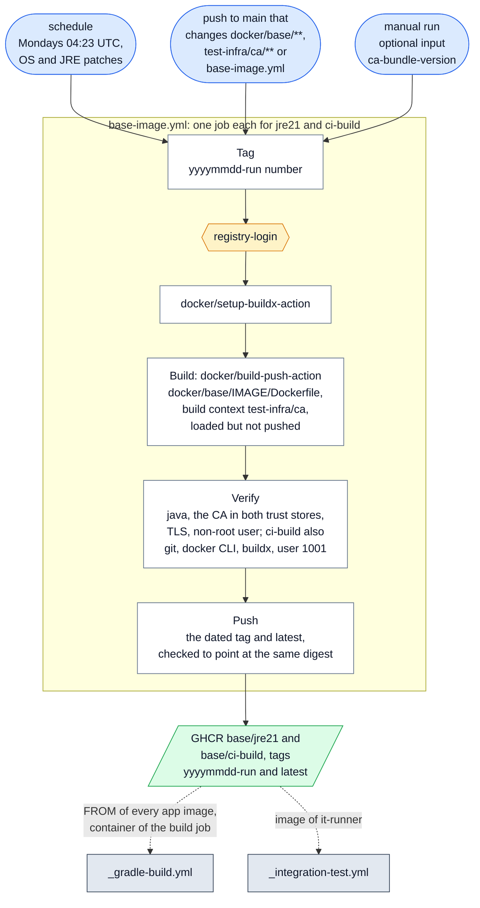

- The `setup-build-env` action builds these images locally from the same Dockerfiles in two cases.
  Either GHCR has none yet, or a pull request changes `docker/base/**`, so the change is tested before
  this workflow publishes it.

## Inside the reusable workflows

Where each composite action runs inside the reusable workflows. Amber hexagons are composite actions.

### `_gradle-build.yml`

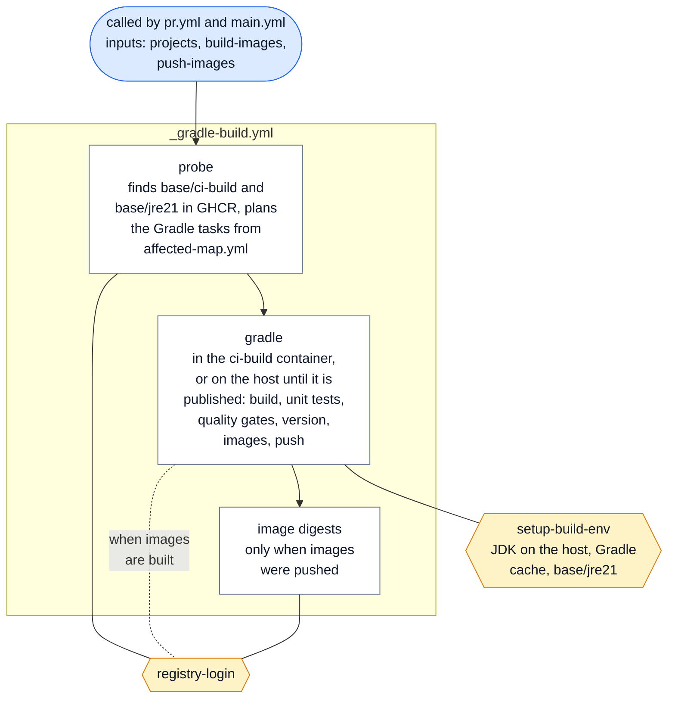

### `config-lint.yml`

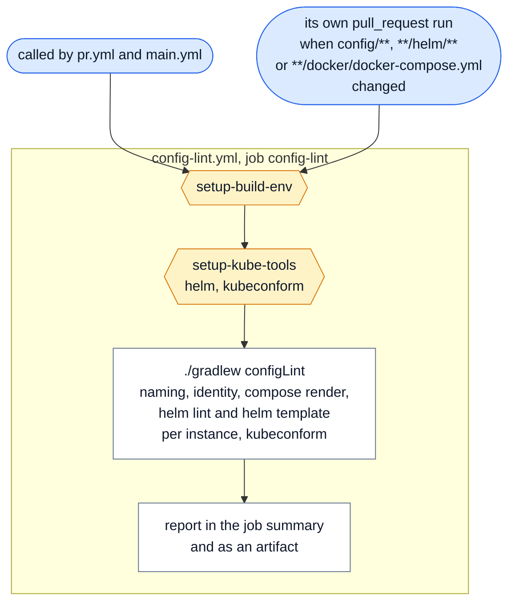

### `_integration-test.yml`

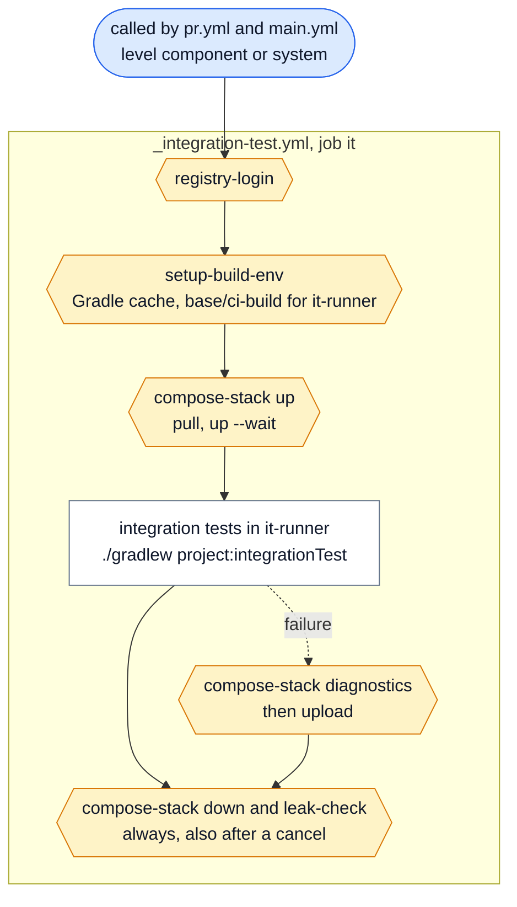

### `_docker-publish.yml`

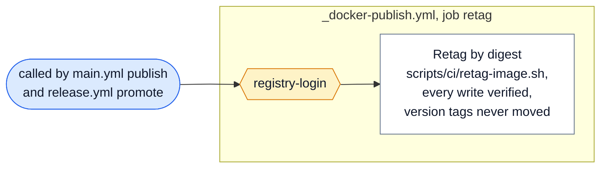

### `_kind-deploy.yml`

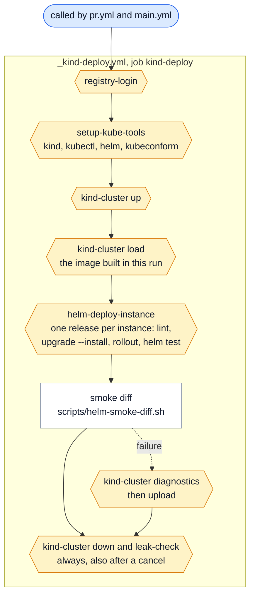

### `_deploy-dev.yml`

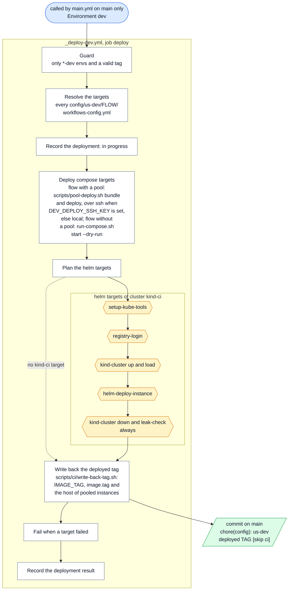

## Composite actions by pipeline

Which composite actions each pipeline uses, directly or through its reusable workflows:

| Composite action | Push to a branch | Pull request, merge queue | Push to main | Tag push, release | Nightly | Base images |
|---|:---:|:---:|:---:|:---:|:---:|:---:|
| `affected-matrix` | ✓ | ✓ | | | | |
| `registry-login` | ✓ | ✓ | ✓ | ✓ | ✓ | ✓ |
| `setup-build-env` | ✓ | ✓ | ✓ | ✓ | ✓ | |
| `setup-kube-tools` | ✓ | ✓ | ✓ | | | |
| `compose-stack` | | ✓ | ✓ | | ✓ | |
| `kind-cluster` | | ✓ | ✓ | | | |
| `helm-deploy-instance` | | ✓ | ✓ | | | |

What each one does and where it is used:

| Composite action | What it does | Used by |
|---|---|---|
| [`affected-matrix`](../actions/affected-matrix/action.yml) | Runs `scripts/ci/affected.py` over `affected-map.yml`: the projects to build, the integration-test matrix, the full, docs-only and deploy-test flags | `pr.yml` detect-affected |
| [`registry-login`](../actions/registry-login/action.yml) | Logs Docker in to GHCR with `GITHUB_TOKEN`; the JFrog OIDC mode is a stub | `_gradle-build.yml` probe, gradle and image digests; `_integration-test.yml`; `_docker-publish.yml`; `_kind-deploy.yml`; `_deploy-dev.yml` for kind; `release.yml` resolve; `base-image.yml`; `nightly.yml` drills |
| [`setup-build-env`](../actions/setup-build-env/action.yml) | JDK 21 when the job is not in ci-build, Gradle wrapper validation and cache, the base images from GHCR or built locally | `_gradle-build.yml` gradle; `config-lint.yml`; `_integration-test.yml`; `release.yml` resolve; `nightly.yml` drills |
| [`setup-kube-tools`](../actions/setup-kube-tools/action.yml) | Installs the pinned kind, kubectl, helm and kubeconform, each checked against its published checksum | `config-lint.yml`; `_kind-deploy.yml`; `_deploy-dev.yml` for kind |
| [`compose-stack`](../actions/compose-stack/action.yml) | Wraps `test-infra/compose/stack.sh`: up, diagnostics, down, leak-check | `_integration-test.yml`; `nightly.yml` drills |
| [`kind-cluster`](../actions/kind-cluster/action.yml) | Wraps `test-infra/kind/kind.sh`: up, load, diagnostics, down, leak-check | `_kind-deploy.yml`; `_deploy-dev.yml` for kind |
| [`helm-deploy-instance`](../actions/helm-deploy-instance/action.yml) | Wraps `scripts/helm-deploy-instance.sh`: one Helm release per instance, then `helm test` | `_kind-deploy.yml`; `_deploy-dev.yml` for kind |

Third-party actions: `actions/checkout` in most jobs, `actions/upload-artifact` for reports,
diagnostics and SBOMs, `actions/download-artifact` for the SBOMs in `release.yml`, `actions/setup-java`
and `gradle/actions/setup-gradle` inside `setup-build-env`, `docker/login-action` inside
`registry-login`, `docker/setup-buildx-action` and `docker/build-push-action` in `base-image.yml` and
`setup-build-env`, `googleapis/release-please-action` in `release-please.yml`, and `anchore/sbom-action`
in `release.yml`.
