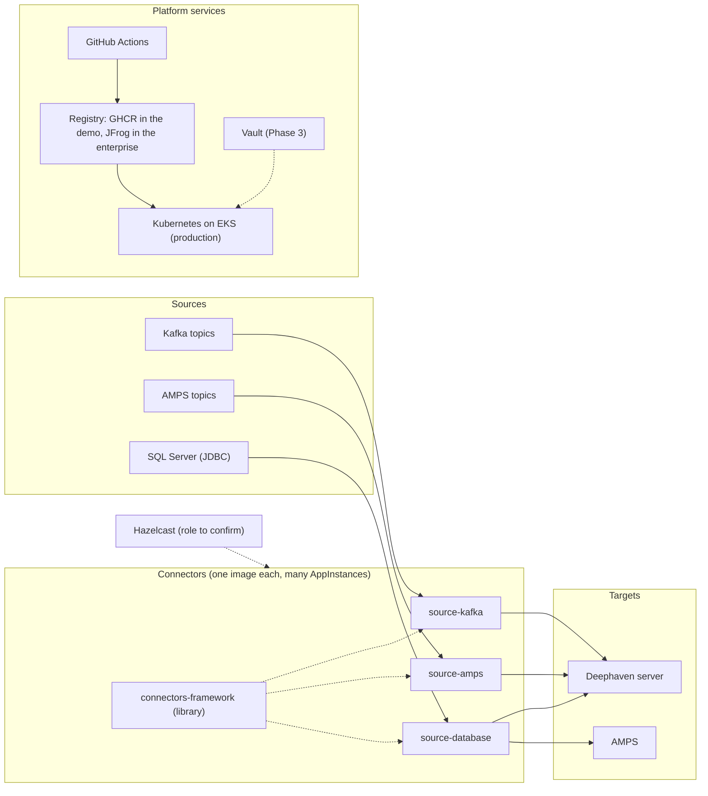
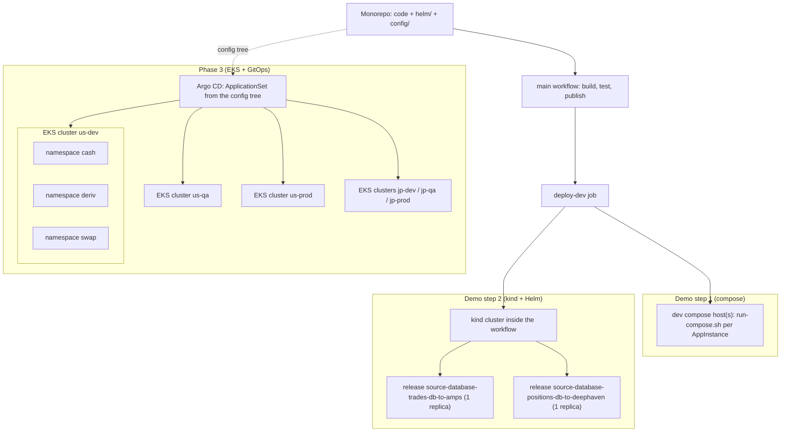

# D0 — Architecture overview and index

| | |
|---|---|
| Document | D0 |
| Status | Draft v1 (phase 1) |
| Date | 2026-09-26 |
| Source brief | `TODO.md` v1.1 (all sections) |
| Related | D1–D11 in this directory; decision records in `docs/adr/` |

## 1. The platform on one page

The platform ingests market and trade data into **Deephaven**, a real-time table engine, through a
family of **connectors**: `source-kafka`, `source-amps` and `source-database` (SQL Server over JDBC),
all built on the `connectors-framework` library. Connectors publish into Deephaven and, for some
pipelines, into **AMPS**. The same connector code base serves several **business flows** (`cash`,
`deriv`, `swap`) and many source or target endpoints, so one image runs as many **AppInstances**,
each named after the business pipeline it processes (for example `trades-db-to-amps`).

The code, the Helm charts and the configuration live in **one Gradle monorepo**. Builds run on
**Java 21 with Spring Boot 4.1**. Versions are derived from git, never from a file. Every app ships as a
Docker image whose enterprise CA certificate is trusted by both the OS and the JVM. **docker compose**
runs the local and CI test stacks and the dev compose hosts of the first demo step; it is never a
production artefact. **Production is Kubernetes on Amazon EKS**, packaged as **one Helm chart per app**
and deployed as **one Helm release per AppInstance** with one replica for now. Merging to `main`
auto-deploys to `dev`; `qa` and `prod` are promoted through reviewed pull requests, with the same image
digest promoted rather than rebuilt. Secrets come from HashiCorp Vault in production (Kubernetes auth);
the demo stubs them behind the same Spring property names.

Decided so far (details in the decision log, §8): DL-01 monorepo, DL-02 EKS, DL-06 config in the
monorepo, DL-15 / DL-24 compose as the demo test stack, DL-17 / DL-25 GitHub-hosted runners for the
demo, DL-23 Spring Boot 4.1, DL-29 Helm, DL-32 kind in demo step 2, DL-33 one release per AppInstance, DL-39 host pools per env/flow on the bare-metal boxes,
DL-37 naming model, DL-09 and DL-30 for the dev auto-deploy; and, decided on 2026-09-26 (v1.0): DL-03
hybrid versioning scope, DL-04 Conventional Commits with a release PR, DL-05 semver plus sha tags, DL-07
explicit import list, DL-09 bot PRs for qa and prod, DL-13 company base JRE image, DL-14 Dockerfile with
the Gradle-built jar, DL-27 layered teardown with a leak check, DL-28 pinned `ci-build` image, DL-35 SSH
from the runner, DL-36 bot-author check plus `[skip ci]`. Everything else is a recommendation.

## 2. System context

*Figure 1 — System context: sources, connectors, targets and the platform services around them.*
Each connector is one code base (an AppName) that runs as many AppInstances, one per business
pipeline. Hazelcast appears in the integration-test list of the brief; its role is still to be
confirmed (`TODO.md` §8).

## 3. Deployment topology

*Figure 2 — Deployment topology by phase.* The `deploy-dev` job targets compose hosts in demo step 1
and a kind cluster in step 2. In Phase 3 the same config tree is reconciled by Argo CD into one
cluster per `<region>-<stage>`, with one namespace per business flow and one Helm release per
AppInstance (namespace layout is DL-38, still open).

## 4. From pull request to production

```mermaid
flowchart LR
  FB["feature branch push: compile, unit tests, lint"] --> PR["pull request: affected component ITs (compose)"]
  PR --> MQ["merge to main: full system IT with built images + Deephaven"]
  MQ --> IMG["images tagged pre-release + sha"]
  IMG --> DEV["deploy-dev: compose hosts (step 1) / helm upgrade (step 2) / Argo CD (Phase 3)"]
  DEV --> WB["tag write-back to config, loop-guarded"]
  WB --> TAG["release tag v1.4.2"]
  TAG --> REL["release images 1.4.2, promoted by digest"]
  REL --> QA["qa bump PR + approval"]
  QA --> PROD["prod bump PR + approval + change ticket, inside a sync window"]
```

*Figure 3 — Request-to-production overview.* Fast checks run on every push, targeted integration
tests on pull requests, the full suite on the merge to `main`, and `dev` is deployed automatically.
Releases are cut by tag, promoted by digest, and reach `qa` and `prod` only through reviewed pull
requests. D7 owns the CI part of this picture, D4 the tags, D9 the deployments.

## 5. Phasing

| Phase | What exists at the end of it | Documents that define it |
|---|---|---|
| Demo step 1 (compose) | Monorepo builds with Java 21 and Spring Boot 4.1; images per app; git-derived versions and tags; `run-compose.sh`; the config tree with two `source-database` instances; PR / main / release workflows on GitHub-hosted runners; integration tests against a docker compose stack with Deephaven and SQL Server; `deploy-dev` running on merge to `main` (the compose-host SSH transport is a documented `TODO(DL-35)` placeholder in the demo) | D1, D3, D4, D5, D6, D7, D8, D9, D10 |
| Demo step 2 (kind + Helm) | A Helm chart per app; one release per AppInstance with one replica; `helm lint` and `helm template` in config-lint; a kind cluster inside the workflow proving the config-tree → values mapping; `deploy-dev` running `helm upgrade --install` into the target cluster | D11, D5, D6, D9, D10 |
| Phase 3 (EKS + GitOps) | EKS clusters per `<region>-<stage>`; Argo CD reconciling the config tree (ApplicationSets, sync windows); Vault via Kubernetes auth with External Secrets Operator; ephemeral-namespace tests; JFrog or an ECR mirror as the registry | D2, D3, D9, D11 |

## 6. Document index

| Doc | File | What it decides or specifies |
|---|---|---|
| D1 | [01-repository-and-build.md](01-repository-and-build.md) | Monorepo layout, Gradle multi-project and convention plugins, Java 21 toolchain, Spring Boot 4.1, per-subproject tree, monorepo-vs-submodules record |
| D2 | [02-secrets-and-vault.md](02-secrets-and-vault.md) | Vault path layout, Kubernetes auth, secrets delivery options, Spring Vault DB credentials, the demo's no-Vault stub and the switch |
| D3 | [03-docker-images.md](03-docker-images.md) | Dockerfile standard, enterprise CA in both trust stores, base image, image naming, registry for EKS, special images |
| D4 | [04-versioning-and-image-tagging.md](04-versioning-and-image-tagging.md) | Git-derived versions, tag naming, lockstep vs independent, promotion, retention, where tags live in values and compose |
| D5 | [05-configuration-management.md](05-configuration-management.md) | Config tree and layering, env vars vs YAML, naming model, config in the monorepo, `workflows-config.yml`, GitOps delivery, config-lint |
| D6 | [06-runtime-operations.md](06-runtime-operations.md) | `run-compose.sh` specification, Kubernetes runtime (probes, resources, logs, metrics, security), local developer experience |
| D7 | [07-ci-pipeline-github-actions.md](07-ci-pipeline-github-actions.md) | Workflow set and topology, test tiers by trigger, affected-subproject detection, caching, gates, publishing |
| D8 | [08-integration-testing.md](08-integration-testing.md) | Test levels, compose harness, dependency images, test data, expected-output comparison, budgets |
| D9 | [09-cd-and-release-management.md](09-cd-and-release-management.md) | Auto-deploy to dev on merge to `main`, dev → qa → prod promotion, rollback, hotfix, release cycle, deployment windows |
| D10 | [10-containerised-ci-execution.md](10-containerised-ci-execution.md) | Containerised build and test on GitHub runners, Deephaven lifecycle in CI, layered teardown and leak check, Kubernetes test tier |
| D11 | [11-kubernetes-packaging-and-gitops.md](11-kubernetes-packaging-and-gitops.md) | Helm chart per app, one release per AppInstance, config tree → values / ConfigMap mapping, `helm upgrade` from CI, Argo CD later |
| ADRs | [adr/README.md](adr/README.md) | One decision record per row of the decision log below |

Every document follows the same template: purpose, context, requirements table, options considered,
recommendation or decision, conventions with concrete examples, diagrams, how the demo skeleton
implements it, open items.

## 7. Reading order by role

| Role | Start with | Then |
|---|---|---|
| Application developer | D1, D5 | D6 (local runs), D8 (tests), D2 (property contract) |
| CI / CD engineer | D7, D10 | D4 (tags), D9 (deploy-dev, promotion), D3 (images) |
| Platform / Kubernetes engineer | D11, D3 | D2 (secrets delivery), D6 (runtime), D9 (GitOps, windows) |
| Reviewer or manager | D0 | D9 (release cycle), the decision log below, `TODO.md` §8 |

## 8. Decision log

Copied from `TODO.md` §6 at v1.1. Rows marked `decided` are fixed; every other row is a recommendation
the design documents validate. Each ID links to its ADR in `docs/adr/` (index: [adr/README.md](adr/README.md)).
No row blocks the demo skeleton: the eleven blocking rows were decided on 2026-09-26, and the Phase 3 rows
(Vault delivery, namespace layout, EKS GitOps controller, EKS registry) are deferred until after the demo.

| ID | Decision | Options | Leaning or decision | Blocking for skeleton | Status |
|---|---|---|---|---|---|
| [DL-01](adr/DL-01-repository-model.md) | Repository model | monorepo with Gradle subprojects / git submodules / polyrepo | **One Gradle monorepo; no git submodules anywhere in the project.** Rationale in §5.1; a future split, if ever, is into polyrepos consuming published artifacts | yes | decided (v0.5) |
| [DL-02](adr/DL-02-deployment-platform.md) | Deployment platform | compose on VMs / Kubernetes | **Kubernetes on Amazon EKS** for production; compose for local dev and CI test stacks only | yes | decided (v0.4) |
| [DL-03](adr/DL-03-versioning-scope.md) | Versioning scope | lockstep / independent / hybrid | **Decided (v1.0):** hybrid: connector family lockstep, `deephaven-server` independent | yes | decided (v1.0) |
| [DL-04](adr/DL-04-version-computation.md) | Version computation | git-describe plugin / Conventional Commits + release PR / manual tag | **Decided (v1.0):** Conventional Commits + release PR, tag-triggered release, pre-release on `main` | yes | decided (v1.0) |
| [DL-05](adr/DL-05-image-tag-scheme.md) | Image tag scheme | see §5.4 table | **Decided (v1.0):** semver + `sha-` tag; no floating tags beyond dev | yes | decided (v1.0) |
| [DL-06](adr/DL-06-config-location.md) | Config location | in monorepo / separate config repo | **In this monorepo under `config/` for now**, with CODEOWNERS and path filters; move later if access control or cadence demands | yes | decided (v0.7) |
| [DL-07](adr/DL-07-config-layering-mechanism.md) | Config layering mechanism | explicit `spring.config.import` list / profile chain | **Decided (v1.0):** explicit import list, ≤ 4 file layers | yes | decided (v1.0) |
| [DL-08](adr/DL-08-env-vars-vs-yaml.md) | Env vars vs YAML | rule of thumb | env vars only for compose-shared / infra knobs | no | open |
| [DL-09](adr/DL-09-image-and-config-bump-delivery.md) | Image and config bump delivery | GitOps bot PR / deploy-time parameter / deploy + write-back | **Decided (v1.0).** **dev: deploy on merge to `main`, then tag write-back with loop guard (v0.7)**; qa / prod: bot PR with approvals | yes | decided (qa / prod v1.0; dev path → DL-40 v1.5) |
| [DL-10](adr/DL-10-config-sync-to-target-vms.md) | Config sync to target VMs | pull agent / push via SSH-Ansible / artifact | superseded by DL-30 (GitOps to clusters) after the v0.4 platform change | no | closed |
| [DL-11](adr/DL-11-vault-authentication.md) | Vault authentication | AppRole / TLS cert / Vault Agent / **Kubernetes auth** | Kubernetes auth on EKS, delivery per DL-31; AppRole only for local stacks; **not in the demo** | no (demo skips Vault) | open — deferred to Phase 3 (v1.1), not needed for the demo skeleton |
| [DL-12](adr/DL-12-db-credentials.md) | DB credentials | static KV v2 / dynamic DB engine | static first, evaluate dynamic | no | open — deferred to Phase 3 (v1.1), not needed for the demo skeleton |
| [DL-13](adr/DL-13-enterprise-ca-injection.md) | Enterprise CA injection | company base image / per-Dockerfile ARG / runtime mount | **Decided (v1.0):** company base image | yes | decided (v1.0) |
| [DL-14](adr/DL-14-image-build-tool.md) | Image build tool | Dockerfile (buildx) / Jib | **Decided (v1.0):** Dockerfile; jar built by Gradle outside Docker | yes | decided (v1.0) |
| [DL-15](adr/DL-15-it-harness.md) | IT harness | Testcontainers / compose / both | **Demo: compose only (decided v0.6).** Later: Testcontainers for component ITs, compose stack for system ITs | no | decided for demo (v0.6) |
| [DL-16](adr/DL-16-test-data-distribution.md) | Test-data distribution | second-repo checkout in CI / JFrog artifact (submodule excluded by DL-01) | JFrog versioned artifact | no | open |
| [DL-17](adr/DL-17-ci-runners.md) | CI runners | GitHub-hosted / self-hosted (ARC on EKS) | **GitHub-hosted for the demo**; ARC on EKS when enterprise network reach is required | yes | decided for demo (v0.4) |
| [DL-18](adr/DL-18-registry-jfrog-auth-from-ci.md) | Registry / JFrog auth from CI | static token / OIDC | OIDC | no | open |
| [DL-19](adr/DL-19-docker-vs-podman-support.md) | Docker vs Podman support | Docker first-class / both | both, parity tested in CI | no | open |
| [DL-20](adr/DL-20-tag-vs-digest-pinning-in-compose.md) | Tag vs digest pinning in compose | tag / digest / both | tag in dev; digest + tag comment in qa / prod | no | open |
| [DL-21](adr/DL-21-config-promotion-between-envs.md) | Config promotion between envs | PR per env / directory copy | PR per env with CODEOWNERS | no | open |
| [DL-22](adr/DL-22-gradle-dsl.md) | Gradle DSL | Kotlin / Groovy | Kotlin | no | open |
| [DL-23](adr/DL-23-spring-boot-baseline.md) | Spring Boot baseline | 3.x / 4.x | **Spring Boot 4.1** on Spring Framework 7, Java 21; upgrade policy: track 4.x minors | no | decided (v0.8) |
| [DL-24](adr/DL-24-ci-test-execution-model.md) | CI test execution model (§5.11) | job `container:` + `services:` / host job + Testcontainers / ephemeral compose stack / fully containerised compose build | **Demo: ephemeral docker compose stack (model C) on GitHub-hosted runners (decided v0.6)**; `ci-build` container for the build job per DL-28 | yes | decided for demo (v0.6) |
| [DL-25](adr/DL-25-runner-lifecycle.md) | Runner lifecycle | persistent self-hosted / ephemeral self-hosted (ARC or `--ephemeral`) / GitHub-hosted | GitHub-hosted (ephemeral by nature) for the demo; ephemeral ARC runners later | no | decided for demo (v0.4) |
| [DL-26](adr/DL-26-deephaven-image-under-test-in-ci.md) | Deephaven image under test in CI | upstream `ghcr.io/deephaven/server` / our `deephaven-server` image / both by test level | upstream for component ITs, ours for system ITs | no | open |
| [DL-27](adr/DL-27-teardown-guarantee.md) | Teardown guarantee | `always()` compose down / run-id labels + prune / Ryuk / ephemeral runner | **Decided (v1.0):** all of them layered, plus a leak-check step | yes | decided (v1.0) |
| [DL-28](adr/DL-28-ci-build-environment.md) | CI build environment | `setup-java` on the runner host / pinned `ci-build` container image | **Decided (v1.0):** `ci-build` image maintained by `base-image.yml` | yes | decided (v1.0) |
| [DL-29](adr/DL-29-kubernetes-packaging.md) | Kubernetes packaging | Helm chart per app / Kustomize base + overlays / Helm + Kustomize | **Helm chart per app** under `helm/<AppName>/`; config-tree files passed as values (`-f`, `--set-file`) | yes (demo step 2) | decided (v0.7) |
| [DL-30](adr/DL-30-gitops-controller.md) | GitOps controller | Argo CD / Flux / CI push (`helm upgrade`) | **Demo: CI push — `helm upgrade --install` from `deploy-dev`**; EKS: Argo CD (ApplicationSets, sync windows) | no (Phase 3) | decided for demo (v0.7); EKS open — deferred to Phase 3 (v1.1), not needed for the demo skeleton |
| [DL-31](adr/DL-31-secrets-delivery-in-kubernetes.md) | Secrets delivery in Kubernetes | External Secrets Operator / Vault Agent Injector / Secrets Store CSI / Spring Cloud Vault in-process | ESO, app stays Vault-agnostic; demo uses plain `Secret` / env | no | open — deferred to Phase 3 (v1.1), not needed for the demo skeleton |
| [DL-32](adr/DL-32-kubernetes-test-tier.md) | Kubernetes test tier | none / kind in the job / ephemeral namespace on dev EKS / both | **Demo step 2: kind inside the workflow — Helm deploy test, and the `deploy-dev` target until a dev cluster exists (v0.7)**; Phase 3: dev EKS namespace | yes (demo step 2) | decided for demo (v0.7) |
| [DL-33](adr/DL-33-appinstance-modelling-on-kubernetes.md) | AppInstance modelling on Kubernetes | one release per instance / one release with N Deployments / StatefulSet | **One Application / Helm release per AppInstance generated from the config tree, one Deployment, `replicas: 1` for now** | yes (demo step 2) | decided (v0.7) |
| [DL-34](adr/DL-34-registry-for-eks.md) | Registry for EKS | JFrog direct (`imagePullSecrets`) / ECR mirror replicated from JFrog | ECR mirror if pulls must be in-region; JFrog direct otherwise | no | open — deferred to Phase 3 (v1.1), not needed for the demo skeleton |
| [DL-35](adr/DL-35-reaching-the-dev-compose-hosts-from-ci.md) | Reaching the dev compose hosts from CI (demo step 1) | SSH with a deploy key from the GitHub-hosted runner / self-hosted runner on the host / pull agent on the host | **Decided (v1.0):** SSH from the runner if the host is reachable; else a self-hosted runner on the host | yes (demo step 1) | decided (v1.0); demo: placeholder with a `TODO(DL-35)` comment (v1.1) |
| [DL-36](adr/DL-36-loop-guard-for-bot-write-backs.md) | Loop guard for bot write-backs in the same repo | skip bot author in workflow `if:` / `[skip ci]` / `paths-ignore` on `config/**` | **Decided (v1.0):** skip bot author + `[skip ci]`; config-only human merges still deploy | yes | superseded (v1.5, DL-40) |
| [DL-37](adr/DL-37-appinstance-naming.md) | AppInstance naming | numeric suffix / upstream name / business-logic name | **Business-logic name: the data source, optionally with target (`trades-db-to-amps`); kebab-case, unique per env + flow + AppName; AppName = code base; `<AppName>-<AppInstance>` ≤ 53 (Helm), AppInstance ≤ 32** | yes | decided (v0.8, budget corrected v0.9) |
| [DL-38](adr/DL-38-kubernetes-namespace-layout.md) | Kubernetes namespace layout | namespace per `<flow>` in each `<region>-<stage>` cluster / per `<flow>-<app>` / one per env | namespace per `<flow>`; release name `<app>-<instance>` | no (deferred; the demo uses namespace = `<flow>` as a working assumption) | open — deferred to Phase 3 (v1.1), not needed for the demo skeleton |
| [DL-39](adr/DL-39-host-pools-per-env-flow.md) | Host pools for the bare-metal compose targets | host per instance / pool per `<env>/<flow>` with recorded placement / deploy-time scheduler | **One inventory per flow, `config/<env>/<flow>/workflows-config.yml`, with the flow's `pool`; every box gets the flow's whole configuration (host bundle synced on deploy); placement pinned → discovered → assigned, recorded as `host` by the write-back; single-run rule on the boxes** | no | decided (v1.3; v2 DL-41 v1.5) |
| [DL-40](adr/DL-40-deployment-record-without-writing-to-main.md) | Deployment record without writing to `main` | record PR after the deploy / record off `main` with the tree declaring intent / bump PR before the deploy | **No workflow writes to `main`: `config/*-dev/**` declares `main`, the deploy pins the digest and records a GitHub Deployment; flows opt in to deploy on merge, nightly or by hand; qa / prod unchanged** | yes | decided (v1.5) |
| [DL-41](adr/DL-41-versioned-bundles-on-dedicated-boxes.md) | Versioned per-project bundles on dedicated boxes (host pools v2) | in-place sync / versioned directories with `current` per project / per flow | **One `<env>/<flow>` per box; `~/versions/<project>/<version>/` + `current` flipped after health; declared placement; deploy-all; rollback = previous directory** | no | decided (v1.5) |

## 9. Traceability from the brief

| Brief section | Topic | Document(s) |
|---|---|---|
| §2.3, §2.4 | Repository layout, per-subproject convention, config tree | D1, D5 |
| §4 | Demo skeleton scope, two demo steps, later phases | D0 §5, D7, D9, D10, D11 |
| §5.1 | Repository and build | D1 |
| §5.2 | Secrets — Vault and Spring Vault | D2 |
| §5.3 | Docker images and the enterprise CA | D3 |
| §5.4 | Versioning, image tagging and retention | D4 |
| §5.5 | Image tags in deployment manifests and in compose | D4 (scheme, placement), D11 (Helm mechanics) |
| §5.6 | Configuration model, naming model | D5 |
| §5.7 | Configuration repository and GitOps delivery | D5 (repository, `workflows-config.yml`), D11 (controller mechanics) |
| §5.8 | `run-compose.sh` specification | D6 |
| §5.9 | CI pipeline — GitHub Actions to the registry | D7 |
| §5.10 | Integration testing | D8 |
| §5.11 | Containerised CI execution with an ephemeral Deephaven server | D10 |
| §5.12 | CD pipeline and release cycle | D9 |
| §5.13 | Cross-cutting runtime topics | D6 |
| §6 | Decision log | D0 §8, `docs/adr/` |
| §8 | Open questions | D0 §10 |
| §9 | Glossary | D0 §11 |
| Appendix A | The original v0.1 questions | mapped in the brief itself |

Every document's §3 "Requirements" table maps each "Must answer" bullet of its brief section to the
heading that answers it, so the chain brief → document → section is complete without a separate
matrix.

## 10. Open questions that still gate the design

Unanswered items from `TODO.md` §8 at v1.1. Items tagged *(Phase 3)* are not needed for the demo skeleton.

- *(Phase 3 — not needed for the demo skeleton)* EKS topology: one cluster per `<region>-<stage>`, or shared clusters with a namespace per stage? Are dev and qa on EKS too? Which AWS regions serve `us` and `jp`?
- *(Phase 3 — not needed for the demo skeleton)* Is a GitOps controller (Argo CD / Flux) already provided on the EKS platform, and who runs it?
- *(Phase 3 — not needed for the demo skeleton)* Network path from EKS to on-prem AMPS, Kafka and SQL Server (Direct Connect / VPN, latency budget, security groups / NetworkPolicies)? Are any sources also moving to AWS?
- *(Phase 3 — not needed for the demo skeleton)* Image pulls on EKS: JFrog reachable from the nodes, or an ECR mirror required? Node architecture (amd64 only, or Graviton arm64)?
- *(Phase 3 — not needed for the demo skeleton)* Pod security standards, IRSA, service mesh or ingress requirements imposed by the platform team?
- *(Phase 3 — not needed for the demo skeleton)* Can CI create ephemeral namespaces on a dev EKS cluster (GitHub OIDC → IAM role → EKS RBAC)?
- *(Phase 3 — not needed for the demo skeleton)* Is a persistent dev Kubernetes cluster available before EKS, or does kind inside the workflow stand in until then?
- GitHub Enterprise Cloud or Server? Self-hosted runners available? Egress policy (Docker Hub blocked → JFrog remotes)?
- JFrog: Artifactory edition, Xray, OIDC support, existing repository naming conventions, promotion API allowed?
- *(Phase 3 — not needed for the demo skeleton)* Vault: edition, namespaces, enabled auth methods, Database secrets engine allowed for SQL Server?
- Is there an existing company base image and a CA bundle distribution / rotation process?
- *(Phase 3 — not needed for the demo skeleton)* Regional isolation: separate JFrog / Vault / runners per region (us, jp)? Data residency rules?
- CI runners: the demo uses GitHub-hosted runners (decided). For the enterprise pipeline: is ARC on EKS the self-hosted option, and can those runners reach JFrog, `ghcr.io` (or its JFrog remote) and the dev cluster?
- Which container layers are mandatory in CI: dependencies only, or the build / test process too? (The runner-in-a-container layer is out of the demo.)
- Is mounting the container socket into a job container acceptable to security (root-equivalent on the runner), or must nested access go through a rootless Podman socket?
- AMPS licence terms for CI / test images; Deephaven Community vs Enterprise; Hazelcast role.
- Which components publish to AMPS / Deephaven — part of `source-database`, or shared sinks in `connectors-framework`?
- Do other repositories consume `connectors-framework` (needs Maven publishing to JFrog)?
- Number of instances and hosts per env; are instances pinned to hosts? (sizes the sync / CD design)
- Deephaven version and auth mode for CI tests (anonymous handler vs pre-shared key)? Must our `deephaven-server` image be under test on every PR, or only on `main` / nightly?
- Change-management constraints for prod (CAB, evidence required, deployment windows per region / flow).
- Ownership: config repo, base images, Vault policies, runners, test-data repo.
- Timezone policy (`TZ` per region for the app; UTC in logs?).
- Compliance: audit retention, image signing, SBOM required?
- Stand-ins for the demo: GHCR instead of JFrog (confirm); Vault skipped (decided); docker compose as the only integration-test stack mechanism (decided v0.6); kind in demo step 2 for the Helm deployment demo only (v0.7).

## 11. Glossary

| Term | Meaning in these documents |
|---|---|
| env | `<region>-<stage>` deployment environment, e.g. `us-dev`, `jp-prod` |
| business flow | product line the instance serves: `cash`, `deriv`, `swap` |
| AppName | the code base: a Gradle subproject and its image, e.g. `source-kafka`; one AppName serves many flows and endpoints |
| AppInstance | one concrete pipeline run by an AppName, named after its business logic — usually the data source, optionally with its target, e.g. `trades-db-to-amps` |
| app-common | config shared by all instances of one AppName in one env + flow |
| lockstep versioning | every subproject carries the same version and is released together |
| promotion | moving the same immutable image (digest) between registry repos / environments without rebuilding |
| GitOps bump | a bot PR that changes `IMAGE_TAG` in the config repo; merge = deploy intent |
| secret zero | the first credential that lets a workload authenticate to Vault |
| AppRole | Vault auth method using `role_id` + `secret_id` |
| digest | content hash of an image (`sha256:...`); immutable, unlike a tag |
| layered jar | Spring Boot jar split into layers (deps, snapshots, app) for cache-friendly images |
| ADR | Architecture Decision Record, one per decision in §6 |
| IT | integration test (needs containers) |
| Xray | JFrog vulnerability scanner |
| job container | the container a GitHub Actions job runs in (`container:` key) |
| service container | a dependency container GitHub starts next to a job and removes afterwards (`services:` key) |
| ci-build image | pinned image with JDK 21, the enterprise CA and the CLIs, used to run builds and tests in CI and locally |
| Ryuk | Testcontainers' reaper sidecar that removes containers when the test JVM exits |
| ephemeral runner | a self-hosted runner that serves exactly one job and is then destroyed |
| ARC | Actions Runner Controller, the Kubernetes operator for self-hosted runners |
| DinD | Docker-in-Docker: a container engine running inside a container |
| leak check | a post-teardown step that fails if resources labelled with the run id still exist |
| EKS | Amazon Elastic Kubernetes Service, the production platform |
| Helm chart | Kubernetes packaging as templated manifests driven by layered values; one chart per app (decided v0.7). Kustomize was the alternative, not used |
| values layer | one `values.yaml` in the chain chart defaults → `app-common` → `<AppInstance>`, mirroring the config tree |
| GitOps controller | Argo CD or Flux: reconciles the config repo into the cluster and reports drift |
| ApplicationSet | Argo CD object that generates one Application per directory, cluster or list entry |
| sync window | Argo CD schedule that allows or denies syncs, used for deployment windows |
| ESO | External Secrets Operator: copies secrets from Vault into Kubernetes `Secret`s |
| IRSA | IAM Roles for Service Accounts: AWS identity for a pod without static keys |
| kind | Kubernetes in Docker: a throw-away cluster inside a CI job or on a laptop |
| Helm release | one installed instance of a chart; here one per AppInstance |
| workflows-config.yml | per-env file mapping each instance to its deploy target: compose host, or cluster + namespace |
| write-back | the CD job committing the deployed image tag into the config tree |
| loop guard | the rule that a bot write-back commit does not trigger the deploy workflow again |

## 12. Keeping this document current

- When `TODO.md` §6 changes, regenerate §8 of this document from it and update or add the ADR.
- When a document's status moves past "Draft v1", update the index row here.
- New decisions are recorded as ADRs first, then reflected in the owning design document, then here.
