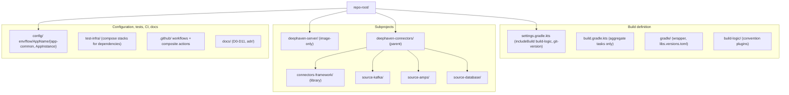
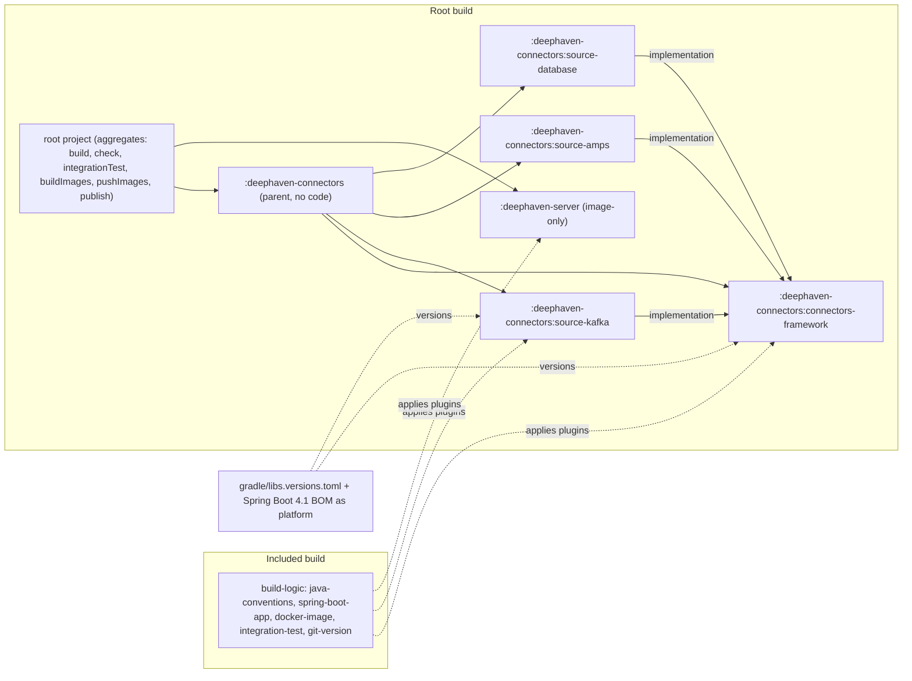
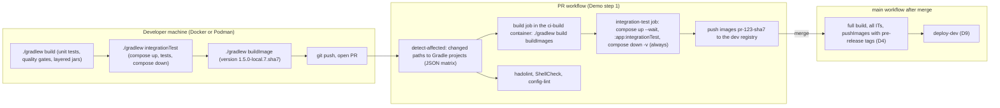

# D1 — Repository and build (Gradle monorepo, Java 21)

| | |
|---|---|
| Document | D1 |
| Status | Draft v1 (phase 1) |
| Date | 2026-09-26 |
| Source brief | TODO.md v0.8, §2.2, §2.3, §2.4, §5.1, §6 (DL-01, DL-06, DL-14, DL-22, DL-23, DL-29) |
| Related | D3 (`docs/03-docker-images.md`), D4 (`docs/04-versioning-and-image-tagging.md`), D5 (`docs/05-configuration-management.md`), D7 (`docs/07-ci-pipeline-github-actions.md`), D8 (`docs/08-integration-testing.md`), D10 (`docs/10-containerised-ci-execution.md`), D11 (`docs/11-kubernetes-packaging-and-gitops.md`) |

## 1. Purpose and scope

This document fixes how the code is organised and built: the repository layout (§2.3 of the
brief), the per-subproject directory convention (§2.4), the Gradle multi-project structure with its
nested `deephaven-connectors` parent, the convention plugins in `build-logic/`, centralised
dependency management, toolchain provisioning, reproducibility, build performance,
affected-subproject detection for CI, and how `project.version` is obtained from git.

It also records the decision on the image build tool at the Gradle level (DL-14): which task
produces the jar and which task produces the image. The content of the Dockerfile is D3
(`docs/03-docker-images.md`); the version and tag scheme is D4
(`docs/04-versioning-and-image-tagging.md`); workflow YAML is D7
(`docs/07-ci-pipeline-github-actions.md`); test content is D8 (`docs/08-integration-testing.md`);
the containers a CI job runs in are D10 (`docs/10-containerised-ci-execution.md`); the Helm chart
under `helm/<AppName>/` is D11 (`docs/11-kubernetes-packaging-and-gitops.md`).

## 2. Context and constraints

Decided facts this document builds on (indicative, not up for discussion here):

| Constraint | Source |
|---|---|
| One Gradle monorepo; git submodules are not used anywhere (code, config, test data) | DL-01 (decided v0.5), §2.2 |
| Java 21 (LTS); Spring Boot 4.1 on Spring Framework 7; upgrade policy: track 4.x minors | DL-23 (decided v0.8), §2.2 |
| Gradle multi-project, wrapper pinned, every dependency and plugin resolved through JFrog (no direct internet in the enterprise) | §2.2 |
| Versions derived from git; never a checked-in `version.txt` | §2.2, §5.4 |
| Helm chart per app under `<subproject>/helm/<AppName>/` | DL-29 (decided v0.7) |
| Configuration lives in this monorepo under `config/`, layout repo-agnostic so it can move later | DL-06 (decided v0.7) |
| Docker **and** Podman must build and run the local and CI test stacks; compose is never a production artefact | §2.2, DL-02 |
| Directory name = Gradle project name = Docker image name = `AppName`, one lower-case kebab-case token (`source-kafka`, never `source-Kafka`) | §2.3 |
| Production is Kubernetes on Amazon EKS | DL-02 (decided v0.4) |

Phasing. Everything in this document belongs to **Demo step 1 (compose)** except the `helm/<AppName>/`
directory and its `helm lint` / `helm template` checks, which arrive with **Demo step 2 (kind + Helm)**.
**Phase 3 (EKS + GitOps)** changes nothing in the build: the same images and charts are consumed by
the GitOps controller instead of by `helm upgrade` from CI.

Consequences of Spring Boot 4.1 (DL-23) for the build: the Gradle wrapper must be at a version the
Boot 4.1 Gradle plugin supports (verify against the plugin's documentation when pinning); the Spring
Cloud release train that matches Boot 4.1 is pinned in the version catalog only when Spring Cloud
Vault arrives (D2); the third-party clients (Deephaven Java client, AMPS, Kafka, SQL Server JDBC
driver) are verified against Boot 4's modularised starters and the Jakarta EE baseline in the
skeleton's first build.

Demo simplification (§2.2, §4): on GitHub-hosted runners there is no JFrog, so the build resolves
from the public repositories when `ARTIFACTORY_URL` is unset and from the JFrog virtual repositories
when it is set. Nothing else differs between the demo and the enterprise build.

## 3. Requirements

| "Must answer" bullet (§5.1) | Answered in |
|---|---|
| Gradle multi-project structure with a nested parent (`:deephaven-connectors:source-kafka`), root aggregation tasks (`build`, `check`, `integrationTest`, `buildImages`, `publish`) | §6.1, §6.2 |
| Centralised dependency management: version catalog + Spring Boot BOM via `platform(...)`; upgrade policy (Renovate / Dependabot through JFrog remotes) | §4.5, §6.3 |
| Convention plugins in `build-logic/` (composite build): toolchain, tests, formatting / static analysis, coverage, Spring Boot app, Docker image tasks, `integrationTest` source set not run by `check` | §4.4, §4.6, §6.4, §6.5 |
| Toolchain provisioning in the enterprise: JDK distribution matching the runtime base image; Foojay probably blocked | §4.9, §6.6 |
| Reproducibility: pinned wrapper, JFrog virtual repos for plugins and dependencies, credentials from env, optional dependency verification | §6.7 |
| Build performance: build cache, configuration cache, parallel, CI cache strategy | §6.8 |
| Affected-subproject detection (path filters → Gradle projects; everything on `main`) | §4.7, §6.9 |
| `project.version` derived from git at build time, never from a checked-in file | §4.8, §6.10 |
| What `deephaven-server` is as a Gradle subproject | §4.10, §5 |
| Repository layout (§2.3) and per-subproject convention (§2.4), naming rule | §6.1 |
| Options: Kotlin vs Groovy DSL (DL-22); Dockerfile vs Jib (DL-14); jar by Gradle vs Gradle inside Docker; layered jar | §4.2, §4.3 |
| Tasks: quality gates, `deephaven-server` scope, root aggregate and image task names | §6.2, §6.5, §4.10 |

## 4. Options considered

### 4.1 Repository model (DL-01 — decided; rationale kept as the decision record)

| | Gradle monorepo (one repo, multi-project build) — **decided** | Git submodules (one repo per subproject, pinned SHAs) — rejected |
|---|---|---|
| Change touching framework + a connector | one atomic commit, one PR, one CI run | several PRs plus a pin-bump PR; easy to leave inconsistent |
| Dependency versions | one version catalog, one BOM | drift between repos unless policed |
| CI | one pipeline with affected-project detection | recursive clone with credentials per repo; pins bumped by CI |
| Refactoring / IDE | whole codebase in one workspace | detached HEADs, `--recurse-submodules`, forgotten pin updates |
| Release | tags per repo or per subproject (D4) | natural per-repo releases |
| Access control | per path (CODEOWNERS) | per repo |
| Fits when | one team owns the family and the framework API is still moving | a hard boundary is imposed: different owners, compliance, a vendor component |

If a boundary is ever needed, the split is into separate repositories that consume
`connectors-framework` as a published, versioned artefact from JFrog — never submodules.
`deephaven-server` is the only later candidate (different cadence, mostly upstream packaging); it
starts in the monorepo.

### 4.2 Gradle DSL (DL-22 — open, leaning Kotlin)

| Option | Pros | Cons | When to prefer |
|---|---|---|---|
| Kotlin DSL (`*.gradle.kts`) | type-safe accessors for the version catalog and convention plugins, IDE completion, compile-time errors, one language for `build-logic/` plugins and build scripts | slower first configuration (compiled scripts), stricter syntax for newcomers | new builds, teams writing convention plugins (this project) |
| Groovy DSL (`*.gradle`) | more examples on the web, forgiving syntax, fast script compilation | dynamic typing hides errors until runtime, weak IDE support for catalog accessors, precompiled Groovy plugins less common | legacy builds already in Groovy |

### 4.3 Image build tool and jar production (DL-14 — open, leaning Dockerfile with the jar built by Gradle)

| Option | Pros | Cons | When to prefer |
|---|---|---|---|
| Dockerfile built with `docker buildx` / `podman build`, jar copied in from `build/libs` | full control of OS layer, enterprise CA and non-root user (§5.3); one Dockerfile serves Docker and Podman; hadolint-lintable; what was requested | needs a container engine at build time; layer cache must be managed in CI | when the OS layer matters (CA, tz, tools) — this project |
| Jib (Gradle plugin, no daemon) | reproducible layers, no engine needed, fast pushes | opaque OS layer; CA injection needs a custom base image anyway; Podman irrelevant but Dockerfile requirement unmet | pure JVM images built on runners without a container engine |
| Multi-stage Gradle build **inside** Docker | hermetic build environment | duplicates the Gradle cache and JFrog credentials inside the build; slow cold starts; ITs still need the engine | when no CI build image (`ci-build`, DL-28) exists |
| Spring Boot layered jar (`layertools`) — orthogonal | dependencies in a separate, rarely changing layer; smaller pushes | slightly more Dockerfile lines | always, together with the Dockerfile option |

### 4.4 Where convention logic lives

| Option | Pros | Cons | When to prefer |
|---|---|---|---|
| `build-logic/` included build (`includeBuild("build-logic")`) with precompiled script plugins | cached and configuration-cache friendly, testable, publishable later, no full re-configuration on every change like `buildSrc` | one more directory, plugin ids to name | multi-project builds with several conventions (this project) |
| `buildSrc/` | zero wiring | any change invalidates the whole build's classpath, cannot be published | tiny builds |
| Script plugins (`apply(from = "…gradle.kts")`) | trivial | no type-safe accessors, poor caching, deprecated pattern | never for new builds |
| Published plugin in JFrog | reusable across repositories | release cycle for the build logic itself | when a second repository appears (future split) |

### 4.5 Dependency version management

| Option | Pros | Cons | When to prefer |
|---|---|---|---|
| Version catalog `gradle/libs.versions.toml` + `platform(libs.spring.boot.dependencies)` | one file for every version, type-safe accessors, Renovate / Dependabot understand it, BOM alignment for Spring | catalog cannot express rich version rules | default (this project) |
| Spring dependency-management plugin | Maven-like BOM import | second mechanism next to Gradle platforms, slower configuration | builds migrated from Maven |
| Versions in `ext` / per-project | none | drift, duplicated numbers | never |

### 4.6 Integration tests in the build

| Option | Pros | Cons | When to prefer |
|---|---|---|---|
| Separate `integrationTest` source set (JVM Test Suite plugin), not wired into `check` | unit tests stay fast and container-free; IDE sees a real source set; explicit task for CI and local parity | two test directories per subproject | when ITs need containers (this project) |
| JUnit tags inside `src/test` | one directory | `test` must exclude tags everywhere; accidental container use in unit tests | very small projects |
| Dedicated `*-it` subproject | clean classpath | doubles the project count, awkward access to the app's test fixtures | when ITs are shared across apps |

### 4.7 Affected-subproject detection for CI

| Option | Pros | Cons | When to prefer |
|---|---|---|---|
| Path filters → Gradle project mapping in a `detect-affected` job (a JSON matrix), everything on `main` | simple, transparent, mapping is a checked-in table; matrix of ITs only for changed apps | mapping must be maintained when the tree changes; cross-project effects (framework → all apps) coded by hand | PR workflows (this project) |
| Always build everything, rely on the Gradle build cache | no mapping | ITs cannot be cached; container start-up dominates PR time | small builds |
| Gradle-native dependency analysis (task graph of changed inputs) | exact | needs custom plugin or third-party tooling (verify); harder to reason about in workflow YAML | later optimisation |

### 4.8 Where `project.version` is computed

| Option | Pros | Cons | When to prefer |
|---|---|---|---|
| Settings plugin in `build-logic/` derives the version from git on every invocation (exact tag → release; otherwise `<next>-rc.<n>` / `-pr.` / `-local.` forms, scheme in D4) | one implementation for CI and laptops; nothing to pass around; no file to forget | the "next" version for pre-releases is a prediction from commit messages | default (this project) |
| CI computes once and passes `-Pversion=` | single computation per run | local builds diverge unless the fallback is identical; `-P` easy to omit | when a release tool owns the version and Gradle must follow it |
| Checked-in `version.txt` / `gradle.properties` version | trivial | forbidden by §2.2; merge conflicts, forgotten bumps | never |

### 4.9 JDK toolchain provisioning

| Option | Pros | Cons | When to prefer |
|---|---|---|---|
| JDK preinstalled in the `ci-build` image (DL-28) and on developer machines; Gradle toolchain declares `21` and the vendor; auto-download disabled | matches the runtime base image by construction; no egress at build time | image maintained by `base-image.yml`; developers install the same distribution | enterprise (this project) |
| Foojay toolchain resolver (auto-download) | zero set-up | downloads from the internet — blocked in the enterprise; distribution may differ from the runtime | demo on GitHub-hosted runners only if the runner lacks the JDK |
| Custom toolchain resolver against a JFrog generic repo | egress-free auto-provisioning | more plugin code to own (verify support in the pinned Gradle) | when many machines need unattended JDK provisioning |

### 4.10 `deephaven-server` as a Gradle subproject

| Option | Pros | Cons | When to prefer |
|---|---|---|---|
| Image-only subproject: applies `buildlogic.docker-image`, no `java` plugin; `docker/` holds Dockerfile, start-up scripts, placeholder plugin files | cheap; participates in `buildImages`, versioning (independent line, D4) and scanning; no Java toolchain cost | no compiled plugin yet | now (demo) |
| Java + image subproject (Deephaven server plugins compiled here) | plugins versioned with the image | needs Deephaven plugin API dependencies through JFrog, IT against the image | as soon as a real plugin exists |
| Separate repository consuming published artefacts | independent cadence | loses atomic changes with the connectors; premature | only if ownership or cadence forces it (§4.1) |

## 5. Recommendation and rationale

1. **Repository model — decided (DL-01).** One Gradle monorepo with the tree in §6.1. The decision
   record is the table in §4.1. Nothing in this repository is a git submodule.
2. **Kotlin DSL (DL-22, recommended).** The convention plugins in `build-logic/` are precompiled
   Kotlin script plugins; type-safe accessors for the version catalog remove a whole class of typos.
   Groovy stays possible for one-off scripts but no build file uses it.
3. **Dockerfile with the jar built by Gradle (DL-14, recommended).** `bootJar` produces a layered
   jar; a `buildImage` task runs `docker buildx build` (or `podman build`, detected) on
   `docker/Dockerfile` with the jar's directory as build context input. Jib is rejected because the
   enterprise CA, the non-root user and the OS trust store require control of the OS layer (D3).
   Building Gradle inside Docker is rejected because the `ci-build` image (DL-28) already gives a
   hermetic build environment without duplicating caches and credentials.
4. **Convention plugins in `build-logic/`** (included build), four plugin ids (§6.4). `check` runs
   unit tests, formatting, static analysis and coverage; `integrationTest` is a separate source set
   and task that `check` never depends on.
5. **Version catalog + Spring Boot BOM platform** (§6.3). Upgrades arrive as Renovate (or Dependabot)
   PRs resolved through the JFrog remotes; Boot 4.x minors are tracked as they appear (DL-23).
6. **Toolchain pinned to Java 21 with the vendor of the runtime base image** (D3 decides the vendor);
   auto-download disabled; the JDK comes from the `ci-build` image in CI and from the same
   distribution on developer machines.
7. **Reproducibility** (§6.7): pinned wrapper with checksum, `pluginManagement` and
   `dependencyResolutionManagement` pointing at JFrog virtual repositories with
   `FAIL_ON_PROJECT_REPOS`, credentials only from environment variables, dependency verification
   metadata introduced after the demo.
8. **Affected-subproject detection by a checked-in path → project mapping** (§6.9); `main` and the
   nightly build always build everything.
9. **`project.version` from git** through a `buildlogic.git-version` settings plugin (§6.10); the
   string formats and the release process are D4's.
10. **`deephaven-server` is image-only for now** (§4.10); it gains a Java source set the day a real
    server plugin is written, and it is versioned independently from the connector family (D4, DL-03).

## 6. Conventions

### 6.1 Repository layout and naming

| Token (`AppName`) | Directory | Gradle project path | Image name (JFrog; GHCR stand-in analogous) | Kind |
|---|---|---|---|---|
| `connectors-framework` | `deephaven-connectors/connectors-framework/` | `:deephaven-connectors:connectors-framework` | — (library, published to the Maven repo only if another repository consumes it) | library |
| `source-kafka` | `deephaven-connectors/source-kafka/` | `:deephaven-connectors:source-kafka` | `artifactory.<company>.com/docker-dev-local/deephaven-connectors/source-kafka` | app |
| `source-amps` | `deephaven-connectors/source-amps/` | `:deephaven-connectors:source-amps` | `.../deephaven-connectors/source-amps` | app |
| `source-database` | `deephaven-connectors/source-database/` | `:deephaven-connectors:source-database` | `.../deephaven-connectors/source-database` | app |
| `deephaven-server` | `deephaven-server/` | `:deephaven-server` | `.../deephaven-server` | image-only |

Rules: one lower-case kebab-case token (`[a-z0-9-]`, ≤ 20 characters so that
`<AppName>-<AppInstance>` fits Helm's 53-character release-name limit with AppInstance ≤ 32, DL-37 /
D5 §6.2) names the directory, the
Gradle project, the image and the Helm chart. `deephaven-connectors` is a parent project with no
code of its own: it aggregates its children and declares nothing but the shared platform.

Per-subproject directory convention (§2.4) for every deployable app:

| Path | Purpose | Phase |
|---|---|---|
| `build.gradle.kts` | applies `buildlogic.spring-boot-app` (+ `docker-image`, `integration-test`), declares dependencies from the catalog | Demo step 1 (compose) |
| `README.md` | what it does, how to run locally, config keys it understands | Demo step 1 (compose) |
| `src/main/java/…`, `src/main/resources/application.yml` | code; environment-agnostic safe defaults only (baked into the jar) | Demo step 1 (compose) |
| `src/test/java/…` | unit tests — no containers | Demo step 1 (compose) |
| `src/integrationTest/java/…` | separate source set — needs Docker or Podman (D8) | Demo step 1 (compose) |
| `docker/Dockerfile`, `docker/docker-compose.yml` | image (D3); ONE compose template for local dev and CI test stacks only (D6) | Demo step 1 (compose) |
| `scripts/run-compose.sh` | `<env> <flow> <AppName> <AppInstance> <cmd>` (D6) | Demo step 1 (compose) |
| `helm/<AppName>/` | Chart.yaml, values.yaml, templates (D11) | Demo step 2 (kind + Helm) |
| `config/<env>/<flow>/<AppName>/{app-common,<AppInstance>}/` | in the repository root `config/` tree (D5); the app directory itself holds no config | Demo step 1 (compose) |

The brief's §2.4 tree draws `config/` under the subproject; §2.3 places it at the repository root.
The root location is used (one tree, one CODEOWNERS rule, one `config-lint` job), see D5.

### 6.2 Root aggregate tasks

| Command | Effect | Runs ITs? | Who runs it |
|---|---|---|---|
| `./gradlew build` | compile, unit tests, quality gates, `bootJar` for every app | no | developers, PR `build` job |
| `./gradlew check` | everything `build` verifies, without assembling | no | PR `build` job |
| `./gradlew integrationTest` | starts the compose stack of each app, runs `src/integrationTest`, stops it (Gradle compose lifecycle, D8) | yes | developers, `integration-test` job |
| `./gradlew :deephaven-connectors:source-database:integrationTest` | one app's ITs | yes | affected-only matrix on PRs |
| `./gradlew buildImages` | `buildImage` of every app + `deephaven-server` | no | `build` job, local |
| `./gradlew pushImages` | `pushImage` of the same, tags from D4 | no | `main.yml`, `release.yml` |
| `./gradlew publish` | `connectors-framework` to the JFrog Maven repo (only when other repositories consume it, §8) | no | `main.yml`, `release.yml` |
| `./gradlew printVersion` | prints `project.version` derived from git (§6.10) | no | workflows (job output), developers |
| `./gradlew devUp` / `devDown` | start / stop the `test-infra` dependency stack for local work (D8) | — | developers |

Per-app image tasks (from `buildlogic.docker-image`): `buildImage`, `pushImage`, `printImageRef`
(prints `<repo>/<group>/<AppName>:<tag>` for the compose template and workflows). Task names are
the same for every app, so the root aggregates are one `dependsOn` over `subprojects`.

### 6.3 Version catalog and platform

| Element | Convention | Example |
|---|---|---|
| File | `gradle/libs.versions.toml`; the only place a dependency version appears | `[versions] spring-boot = "4.1.<patch>"` (patch tracked by Renovate) |
| Spring BOM | applied as `implementation(platform(libs.spring.boot.dependencies))` by the `spring-boot-app` and `java-conventions` plugins | `spring-boot-dependencies = { module = "org.springframework.boot:spring-boot-dependencies", version.ref = "spring-boot" }` |
| Third-party clients | aliased, versions pinned; verified against Boot 4.1 in the skeleton's first build | `deephaven-java-client`, `amps-client`, `kafka-clients`, `mssql-jdbc` (versions to fill in, none invented here) |
| Bundles | one per concern | `bundles.observability = ["micrometer-core", "micrometer-registry-prometheus"]` |
| Plugins | `[plugins]` with `version.ref`, consumed by `build-logic/build.gradle.kts` | `spring-boot = { id = "org.springframework.boot", version.ref = "spring-boot" }` |
| Upgrade policy | Renovate (or Dependabot) opens grouped PRs; JFrog remotes are the only source; Boot minors tracked, majors by decision | `renovate.json` with `gradle` manager enabled |

### 6.4 Convention plugins (`build-logic/`)

| Plugin id | Applies | Used by |
|---|---|---|
| `buildlogic.java-conventions` | `java`, toolchain 21, `-parameters`, JUnit 5 with `useJUnitPlatform()`, Spotless formatting, Checkstyle (or Error Prone — one to pick), JaCoCo with a ratcheted threshold, reproducible archives | every JVM subproject |
| `buildlogic.spring-boot-app` | `java-conventions` + Spring Boot plugin, layered `bootJar`, `bootBuildInfo` (git sha, version into `/actuator/info`), no plain `jar` | `source-kafka`, `source-amps`, `source-database` |
| `buildlogic.docker-image` | `buildImage`, `pushImage`, `printImageRef`; Docker / Podman detection; OCI labels from `project.version` and git (D3 §6) | the three apps and `deephaven-server` |
| `buildlogic.integration-test` | `integrationTest` source set and task (JVM Test Suite), compose lifecycle (`composeUp` → `integrationTest` → `composeDown`, `finalizedBy`), never wired into `check` | the three apps |
| `buildlogic.git-version` (settings plugin) | computes `project.version` (§6.10) for every project of the build | `settings.gradle.kts` |

`connectors-framework` applies `java-conventions` plus Gradle's `java-library`, and `maven-publish`
only when publishing is confirmed.

### 6.5 Quality gates

| Gate | Tool (one choice each; versions in the catalog) | Runs in `check`? | Also in |
|---|---|---|---|
| Formatting | Spotless with a Java formatter | yes (`spotlessCheck`) | PR job |
| Static analysis | Checkstyle or Error Prone (pick one in the first build) | yes | PR job |
| Unit tests | JUnit 5 | yes | PR job |
| Coverage | JaCoCo report + verification rule, threshold starts low and only ratchets up | yes | PR job |
| Dependency vulnerabilities | JFrog Xray via `jf` CLI (or an OSS scanner in the demo) | no | nightly (D7) |
| Dockerfile lint | hadolint (D3) | no (not a Gradle task) | PR job |
| Shell lint | ShellCheck on `scripts/*.sh` (D6) | no | PR job |

### 6.6 Toolchain

| Item | Convention |
|---|---|
| Declaration | `java { toolchain { languageVersion = JavaLanguageVersion.of(21); vendor = <vendor of the runtime base image, D3> } }` |
| Auto-download | disabled: `org.gradle.java.installations.auto-download=false` in `gradle.properties` |
| Where the JDK comes from | CI: the `ci-build` image (DL-28) maintained by `base-image.yml`; developers: the same distribution; enterprise fallback: JFrog generic repo |
| Demo exception | GitHub-hosted runners: the `ci-build` image still provides the JDK; if a job runs on the host, `actions/setup-java` with the same distribution |

### 6.7 Reproducibility

| Item | Convention | Example |
|---|---|---|
| Wrapper | pinned version and distribution checksum committed under `gradle/wrapper/`; `gradle-wrapper-validation` in the PR workflow | `distributionSha256Sum=…` |
| Plugin repositories | `pluginManagement { repositories { maven(url = "$ARTIFACTORY_URL/<plugins-virtual-repo>") } }` when `ARTIFACTORY_URL` is set, otherwise Gradle Plugin Portal (demo) | repo names follow the enterprise JFrog convention (§8) |
| Dependency repositories | `dependencyResolutionManagement { repositoriesMode = FAIL_ON_PROJECT_REPOS; repositories { maven(…) } }` — no repository in any subproject | `<libs-virtual-repo>` |
| Credentials | never in files: `ARTIFACTORY_USER` / `ARTIFACTORY_TOKEN` from the environment; in CI an OIDC-issued token (DL-18) | `credentials(PasswordCredentials::class)` reading env |
| Dependency verification | `gradle/verification-metadata.xml` (checksums, optionally signatures) — introduced after the demo, when the dependency set is stable | `./gradlew --write-verification-metadata sha256` |
| CA | Gradle in CI trusts the enterprise CA through the `ci-build` image's JVM truststore (D3); nothing is set in build files | — |

### 6.8 Build performance

| Setting | Where | Value |
|---|---|---|
| Build cache | `gradle.properties` | `org.gradle.caching=true`; remote cache node if the platform provides one, read-only for PRs, push from `main` |
| Configuration cache | `gradle.properties` | `org.gradle.configuration-cache=true` (every convention plugin must stay compatible) |
| Parallel | `gradle.properties` | `org.gradle.parallel=true` |
| Daemon memory | `gradle.properties` | `org.gradle.jvmargs=-Xmx…` sized to the runner class (D10 measures it) |
| CI cache | workflow | `gradle/actions/setup-gradle` for `~/.gradle` and the build cache; Docker layer cache per D3 / D7 |

### 6.9 Affected-subproject detection

| Changed path (glob) | Affected Gradle projects | Workflow effect |
|---|---|---|
| `deephaven-connectors/connectors-framework/**` | all three apps + framework | build all, ITs for all apps |
| `deephaven-connectors/source-kafka/**` | `:deephaven-connectors:source-kafka` | build + IT + image for that app only |
| `deephaven-server/**` | `:deephaven-server` | image build, server smoke IT |
| `build-logic/**`, `gradle/**`, `settings.gradle.kts`, `build.gradle.kts`, `gradle.properties` | everything | full build |
| `test-infra/**` | every app with ITs | ITs for all apps, no image rebuild |
| `config/**` | none | `config-lint` only (D5); no image rebuild |
| `docs/**`, `*.md` | none | docs checks only |
| `.github/**` | everything | full build (safety) |
| push to `main`, nightly, tag | everything | full build regardless of paths |

The `detect-affected` job (D7) turns the mapping into a JSON list for the `matrix:` of the build and
IT jobs; the mapping lives in `.github/affected-map.yml` next to the workflows.

### 6.10 `project.version` from git

| Situation | Inputs read from git / CI | Resulting `project.version` (formats owned by D4) |
|---|---|---|
| Commit carries a release tag `v1.4.2` | exact tag match | `1.4.2` |
| `main` (CI), 7 commits after `v1.4.1`, commits since the tag contain a `feat:` | last tag, distance, commit messages | `1.5.0-rc.7` |
| PR #123 (CI), same base | last tag, `PR_NUMBER`, `sha7` | `1.5.0-pr.123.1a2b3c4` |
| Developer machine, untagged | last tag, distance, `sha7`, dirty flag | `1.5.0-local.7.1a2b3c4` (`.dirty` appended when the tree has changes) |
| `deephaven-server` (independent line, DL-03) | tags matching `deephaven-server/v*` | `0.3.0`, `0.3.1-rc.2`, … |

Wiring: `settings.gradle.kts` applies `buildlogic.git-version`, which sets `gradle.rootProject.version`
and propagates it to every subproject; `-Pversion=` overrides it (used only for experiments, never in
workflows). No file in the repository contains a version number to bump; `./gradlew printVersion` is
the single query used by workflows and by `run-compose.sh version`.

## 7. Diagrams

### 7.1 Structural — repository tree

*Figure 1 — Repository tree: one git repository, one Gradle build, no submodules.*

The build definition, the code, and the operational trees (`config/`, `test-infra/`, `.github/`,
`docs/`) sit side by side at the root. `deephaven-connectors/` is a parent directory whose Gradle
project only aggregates; each child owns its `docker/`, `scripts/`, `helm/` and source sets (§6.1).

### 7.2 Structural — Gradle project graph

*Figure 2 — Gradle project graph: nested parent, one library consumed by three apps, one image-only project, one included build.*

Solid arrows are project containment and `implementation` dependencies; dotted arrows show that
every subproject gets its behaviour from the convention plugins and its versions from the catalog.
No subproject declares a repository or a version of its own.

### 7.3 Flow — local build to CI build

*Figure 3 — The same Gradle tasks run on a laptop and in CI; CI adds affected-project selection, the pinned `ci-build` container and image publishing.*

A developer runs exactly the tasks the PR workflow runs, against the same compose stacks, so a red
PR is reproducible locally with one command. Only the version string and the image tag differ
(`-local.` versus `-pr.`, D4). Workflow structure and gates are D7's; the containers are D10's.

## 8. How the demo skeleton implements it

| File / directory | What it proves | Phase |
|---|---|---|
| `settings.gradle.kts` | `includeBuild("build-logic")`, `pluginManagement` / `dependencyResolutionManagement` with the `ARTIFACTORY_URL` switch, `include(":deephaven-server", ":deephaven-connectors:…")`, `buildlogic.git-version` | Demo step 1 (compose) |
| `build.gradle.kts` | root aggregates only: `buildImages`, `pushImages`, `integrationTest`, `printVersion` | Demo step 1 (compose) |
| `gradle/libs.versions.toml`, `gradle/wrapper/` | catalog with Spring Boot 4.1 BOM and client aliases; pinned wrapper with checksum | Demo step 1 (compose) |
| `build-logic/build.gradle.kts`, `build-logic/src/main/kotlin/buildlogic.*.gradle.kts` | the five convention plugins of §6.4 | Demo step 1 (compose) |
| `deephaven-connectors/build.gradle.kts` | parent with no code; `subprojects {}` kept empty — conventions come from plugins, not from the parent | Demo step 1 (compose) |
| `deephaven-connectors/connectors-framework/build.gradle.kts` | `java-library` + `java-conventions`; consumed by the three apps | Demo step 1 (compose) |
| `deephaven-connectors/source-database/build.gradle.kts` (and `source-kafka`, `source-amps`) | `spring-boot-app` + `docker-image` + `integration-test`; hello-world app logging `env / flow / AppName / AppInstance` | Demo step 1 (compose) |
| `deephaven-connectors/source-database/src/integrationTest/java/…` | the end-to-end IT (SQL Server → app image → target) started by the compose lifecycle | Demo step 1 (compose) |
| `deephaven-server/build.gradle.kts`, `deephaven-server/docker/` | image-only subproject, independent version line | Demo step 1 (compose) |
| `.github/affected-map.yml`, `.github/workflows/pr.yml` (`detect-affected` job) | the §6.9 mapping feeding the matrix (D7) | Demo step 1 (compose) |
| `deephaven-connectors/source-database/helm/source-database/` | chart linted and templated from the config tree (D11) | Demo step 2 (kind + Helm) |
| No `version.txt`, no version in `gradle.properties` | `./gradlew printVersion` on a `v0.1.0` checkout prints `0.1.0` (acceptance criterion §7) | Demo step 1 (compose) |

## 9. Open items

Decision-log rows this document depends on that are still open:

| DL | Topic | This document's recommendation |
|---|---|---|
| DL-22 | Gradle DSL | Kotlin DSL (§4.2) |
| DL-14 | Image build tool | Dockerfile via buildx / Podman, jar built by Gradle, layered jar (§4.3) |
| DL-03 / DL-04 / DL-05 | Versioning scope, computation, tag scheme | wiring in §6.10; scheme and process in D4 |
| DL-18 | JFrog authentication from CI | OIDC-issued token exported as `ARTIFACTORY_TOKEN` (§6.7) |
| DL-19 | Podman support level | `buildImage` and the compose lifecycle detect the engine; parity tested in CI |
| DL-26 | Deephaven image under test | affects only the IT stack composition (D8, D10) |
| DL-28 | CI build environment | `ci-build` image provides the JDK and CA; toolchain auto-download disabled (§6.6) |
| DL-16 | Test-data distribution | JFrog versioned artefact fetched by a Gradle task; no submodule (D8) |

§8 questions to confirm: JFrog edition and repository naming (virtual repo names for libraries,
plugins and Docker), OIDC support and whether the promotion API is allowed; whether other
repositories consume `connectors-framework` (decides `maven-publish`); egress policy (Docker Hub and
Gradle Plugin Portal blocked → JFrog remotes); GitHub Enterprise Cloud or Server; whether a company
base image and JDK distribution already exist (fixes the toolchain vendor, D3); Deephaven version and
edition for the `deephaven-server` subproject.

Follow-ups: pick Checkstyle or Error Prone and the initial coverage threshold in the first build;
verify the Gradle wrapper version supported by the Spring Boot 4.1 plugin; introduce dependency
verification metadata once the dependency set is stable; measure configuration-cache compatibility of
every convention plugin.
