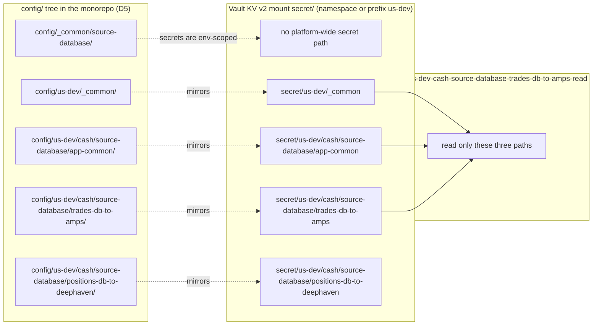
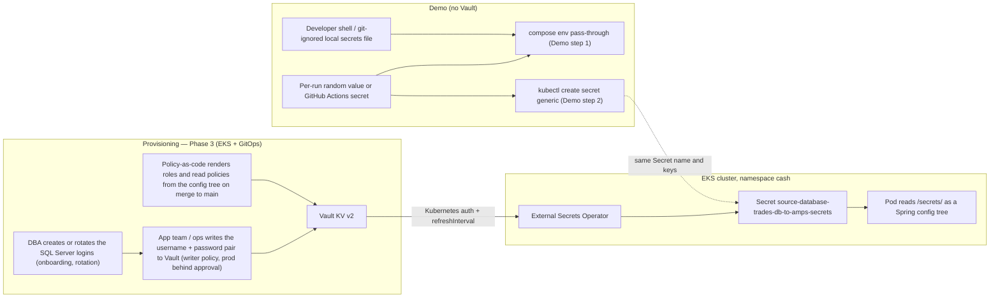
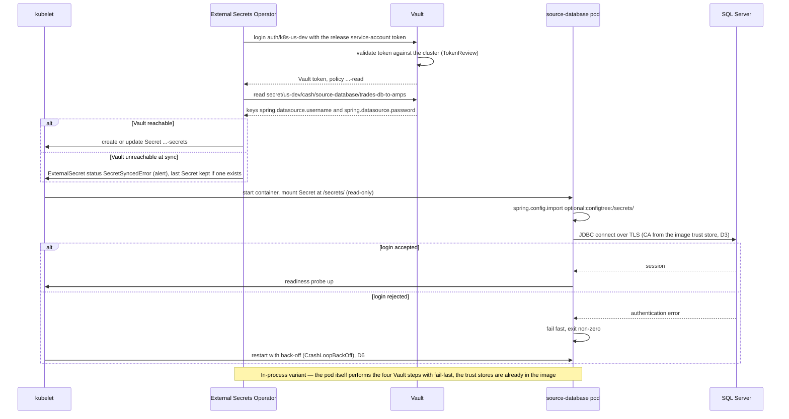
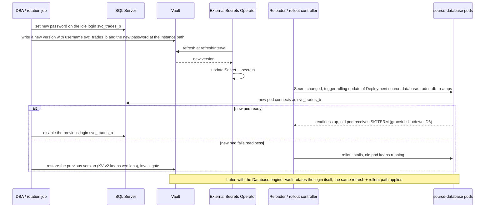

# D2 — Secrets and Vault

| | |
|---|---|
| Document | D2 |
| Status | Draft v1 (phase 1) |
| Date | 2026-09-26 |
| Source brief | TODO.md v0.8, §2.2, §4, §5.2, §5.13, DL-11, DL-12, DL-31 |
| Related | D3 (`docs/03-docker-images.md`), D5 (`docs/05-configuration-management.md`), D6 (`docs/06-runtime-operations.md`), D8 (`docs/08-integration-testing.md`), D9 (`docs/09-cd-and-release-management.md`), D11 (`docs/11-kubernetes-packaging-and-gitops.md`) |

## 1. Purpose and scope

This document designs how secrets reach the connector services: the Vault path and policy layout,
the authentication method per runtime, the delivery path into Kubernetes, the Spring Boot
integration, database credential handling, rotation, audit and break-glass. It also fixes the demo
stub — secrets supplied without Vault, behind the final Spring property names — and the exact switch
to Vault afterwards.

In scope: every secret consumed by `source-kafka`, `source-amps`, `source-database`,
`connectors-framework` and `deephaven-server`. Out of scope: provisioning the Vault service itself
(platform / security team), the trust stores inside the images (D3), non-secret configuration (D5),
chart mechanics (D11), runtime probes and restart behaviour (D6).

Phasing:

- **Demo step 1 (compose)** — no Vault. Secrets arrive as environment variables passed through by the
  compose template from the invoking shell (developer machine or CI job).
- **Demo step 2 (kind + Helm)** — no Vault. Secrets arrive as a Kubernetes `Secret` created by the
  workflow and mounted as a Spring config tree.
- **Phase 3 (EKS + GitOps)** — Vault with Kubernetes auth (no secret zero); delivery per DL-31,
  recommended: External Secrets Operator. AppRole only for local and test stacks that run a Vault.

## 2. Context and constraints

- HashiCorp Vault holds **all** secrets in production; Spring Vault / Spring Cloud Vault is the
  intended mechanism for database credential retrieval (§2.2).
- Production is Kubernetes on Amazon EKS (DL-02). The pod's service-account token is the workload
  identity, so Vault Kubernetes auth needs no first credential delivered by hand (§5.2).
- The enterprise CA must be trusted before any TLS client — including the Vault client — opens a
  connection (§5.3, D3). The Vault client therefore never starts before the trust stores are in place.
- The config tree lives in this monorepo (DL-06). Hostnames may live there; secrets never (§5.6),
  enforced by a pre-commit hook and secret scanning (D5, D7).
- Spring Boot 4.1 (DL-23): when Spring Cloud Vault is introduced, pin the Spring Cloud release train
  that matches Boot 4.1 (verify). No Vault code is written in the demo (§4).
- Demo simplifications (§2.2, §4): no Vault; GHCR as registry stand-in; secrets stubbed behind the
  final property names so the later switch needs no code change (§7 acceptance criteria).
- Open with the platform teams (§8): Vault edition (namespaces are Enterprise-only), enabled auth
  methods, availability of the Database secrets engine for SQL Server, regional isolation of Vault
  (`us`, `jp`), and the network path from EKS to Vault.

## 3. Requirements

| "Must answer" bullet of §5.2 | Answered in |
|---|---|
| Vault topology: one cluster or per region; namespaces; who owns policies | §4.1, §5 (R1), §6.3 |
| Path convention mirroring the config hierarchy; least-privilege policy per app / instance | §6.2, §6.3, Figure 1 |
| Authentication and the secret-zero problem on Kubernetes and for local / test stacks | §4.2, §5 (R2, R6), §6.3 |
| What counts as a secret vs configuration | §6.1 |
| Database credentials: static KV v2 vs dynamic; lease renewal, HikariCP refresh; SQL Server support | §4.4, §5 (R4), §6.7, Figure 4 |
| Spring integration: config-data import, profile → path mapping, fail-fast, token renewal, retries, truststore ordering | §6.4, §6.5, Figure 3 |
| Local dev and CI: Vault dev server in compose, Testcontainers Vault module | §4.5, §5 (R6), §8.2 |
| Audit, rotation policy, break-glass | §6.7, Figure 4 |
| Delivery options in Kubernetes (DL-31) | §4.3, §5 (R3), Figure 2 |
| Demo: stub secrets behind the final property names and document the switch (§4, §5.2 tasks) | §8.1 |

## 4. Options considered

### 4.1 Vault topology

| Option | Pros | Cons | When to prefer |
|---|---|---|---|
| One Vault cluster for the company, path prefix per `<env>` | one audit trail, one policy set, simplest client config | single blast radius across regions and stages; cross-region latency; data-residency questions for `jp` | small estate, no residency rules |
| One Vault cluster, Enterprise **namespace per `<env>`** (`us-dev`, …, `jp-prod`) | hard tenancy boundary per env, delegated policy admin per stage, identical paths inside each namespace | Enterprise licence; the client must send the namespace header | Enterprise edition available (§8) |
| **One Vault cluster per region** (`us`, `jp`) with a namespace or path prefix per stage | regional isolation and residency by construction; an incident in one region leaves the other untouched | two clusters to operate; policy-as-code must apply to both | regional isolation or residency is required (§2.1, §8) |

The path convention in §6.2 is written so that the region either appears in the namespace or in the
`<env>` path segment: the client configuration changes, the layout does not.

### 4.2 Authentication and secret zero (DL-11)

| Option | Pros | Cons | When to prefer |
|---|---|---|---|
| **Kubernetes auth** (pod service-account token, Vault validates it against the cluster) | no secret zero; identity = `namespace/serviceaccount`; short-lived projected tokens; policies bound per role | one auth mount per cluster to register; Vault must reach the cluster API (or use JWT auth with the cluster's OIDC issuer) | production and every Kubernetes runtime (EKS, Phase 3) |
| AppRole (`role_id` + `secret_id`) | works anywhere, including compose hosts and CI; `secret_id` can be single-use and response-wrapped | the `secret_id` is a secret zero that someone must deliver at start; rotation of `secret_id` is our job | local and test stacks that run a Vault; the dev compose hosts of Demo step 1 if Vault is ever attached there |
| TLS client certificate | strong identity, no token distribution | certificate issuance and renewal per instance; another PKI to run | VM hosts with an existing PKI — not our case |
| Dev-mode root token | zero set-up | never leaves a laptop or an ephemeral CI stack | Vault dev server in `test-infra/` only |

### 4.3 Delivery in Kubernetes (DL-31)

| Option | Pros | Cons | When to prefer |
|---|---|---|---|
| **External Secrets Operator (ESO)**: `ExternalSecret` → Kubernetes `Secret` → volume or env | app is Vault-agnostic (same binary in compose, kind and EKS); the `Secret` persists if Vault is down, so pods can still restart; one Vault identity per instance via the store's service account; rotation = refresh interval plus a rollout | secret material exists as a Kubernetes `Secret` (etcd encryption and RBAC must be in place); an extra operator to run; rollout on change needs a reloader | default for all connectors (leaning DL-31) |
| Vault Agent Injector (sidecar or init container renders files) | no Kubernetes `Secret`; agent renews leases and rewrites files; templates for arbitrary formats | a sidecar per pod (CPU / memory, start-up ordering); app must re-read files or be restarted; mutating webhook in the path of every pod start | dynamic credentials with in-place file refresh, keystores that must never touch etcd |
| Secrets Store CSI driver with the Vault provider | files mounted directly from Vault; optional sync to a `Secret` | node-level driver plus provider; rotation support depends on driver configuration; pod start fails if Vault is unreachable | platform already standardises on the CSI driver |
| Spring Cloud Vault in-process (Kubernetes auth from the JVM) | no operator; native lease renewal for the Database engine; fine-grained property sources | every app carries the Vault client and CA plumbing; a Vault outage blocks pod restarts (fail-fast); compose stacks need a Vault too | dynamic database credentials with lease renewal inside HikariCP |

### 4.4 Database credentials (DL-12)

| Option | Pros | Cons | When to prefer |
|---|---|---|---|
| **Static KV v2** — password of an existing SQL Server login stored under the instance path | no engine to enable; works with ESO unchanged; DBA keeps ownership of logins | rotation is a procedure (two logins alternating, §6.7); a leaked password is valid until rotated | first iteration (leaning DL-12) |
| Database engine, **static role** — Vault rotates the password of an existing login on a schedule | automatic rotation without changing the login; still one long-lived login; compatible with ESO (`Secret` refreshed) | Vault needs a privileged SQL Server account and network reach to every SQL Server; a rotation while pods are up requires a rollout or pool refresh | once the engine is allowed for SQL Server (§8) |
| Database engine, **dynamic role** — a new login per lease, revoked at expiry | least exposure; per-instance, per-lease audit in SQL Server | leases must be renewed by the process (in-process client or agent); HikariCP must re-authenticate on rotation; DBAs must accept generated logins; heavier on SQL Server | long-running connectors once the operational model is proven |

### 4.5 Local and test stacks

| Option | Pros | Cons | When to prefer |
|---|---|---|---|
| **No Vault — environment pass-through** (the demo): the compose template declares the secret variables without values and inherits them from the shell | nothing to run; identical property names; CI supplies values from GitHub Actions secrets | no rotation semantics tested; developers manage a local, git-ignored secrets file | Demo step 1 (compose) and Demo step 2 (kind + Helm) |
| Vault dev server in compose, seeded by a script, AppRole for the app | exercises the real client path and policies; catches path typos before EKS | one more container per stack; seed script to maintain | the iteration after the demo (§5.2 task) |
| Testcontainers Vault module in component ITs | per-test isolation, programmatic seeding | Testcontainers is not in the demo (DL-15) | component ITs of the Vault integration itself, later |

## 5. Recommendation and rationale

Decided facts (indicative): production runs on EKS; Vault holds every secret; Vault Kubernetes auth
is the production authentication method; the demo skips Vault and binds stubbed secrets to the final
Spring property names. Everything else below is a recommendation to validate.

| # | Recommendation | Rationale | Alternative kept |
|---|---|---|---|
| R1 | Topology: follow the platform team's edition. With Enterprise, one namespace per `<env>`; without, a path prefix per `<env>`. One Vault per region if residency or regional isolation is required (§8). Policies are **policy-as-code** generated from the config tree and owned by the platform / security team; secret **values** are written by the owning app team (or DBA) through a writer role, never by developers into git | the env is the tenancy boundary that matters for approvals and audit; generating policies from `config/<env>/<flow>/<app>/<instance>` keeps them in lockstep with the inventory | §4.1 |
| R2 | Authentication: Kubernetes auth on every cluster (one auth mount per cluster, `auth/k8s-<env>`), one role per AppInstance bound to its service account and namespace. AppRole only for stacks that run a Vault outside Kubernetes | no secret zero; identity is the same tuple the rest of the platform uses | §4.2 |
| R3 | Delivery: **External Secrets Operator** with one `ClusterSecretStore` per cluster authenticating by Kubernetes auth, and one `ExternalSecret` per release rendered by the chart (D11). The app reads the resulting `Secret` as a Spring config tree mounted at `/secrets/` | the app stays Vault-agnostic, so the very same image runs in compose, kind and EKS; a Vault outage does not stop pods from restarting; the property-name contract (§6.4) is honoured unchanged | Vault Agent Injector or in-process Spring Cloud Vault when dynamic credentials arrive (R4) |
| R4 | Database credentials: **static KV v2 first**, with the two-login rotation procedure (§6.7); evaluate the Database engine static role next, dynamic roles last | the engine's availability for SQL Server is unconfirmed (§8); static KV needs nothing beyond ESO; rotation becomes automatic with the static role without changing the delivery path | §4.4 |
| R5 | Spring integration: `optional:configtree:/secrets/` in the import list now; `vault://` imports only if in-process access is chosen later; fail-fast, bounded retries, token and lease renewal per §6.5 | property-source changes only; no Java code refers to Vault | §6.5 |
| R6 | Local and test stacks: pass-through of environment variables in the demo; after the demo, a Vault dev server in `test-infra/compose/vault/` seeded by a script with AppRole, the `secret_id` generated per stack start | proves the real path and policies without ever storing a credential in git or an image | §4.5 |
| R7 | Secret boundary: §6.1 is the rule; config-lint (D5) fails on any key matching the secret patterns inside `config/**` | the config tree is world-readable within the company; a secret in git is a rotation incident | — |
| R8 | Rotation, audit and break-glass per §6.7; Reloader-style rollout on `Secret` change (D5 §4, D11) | a rotated password must reach running pods without manual restarts | — |

## 6. Conventions

### 6.1 What is a secret

| Item | Secret? | Where it lives |
|---|---|---|
| SQL Server login user and password | yes (the pair travels together, §6.4) | Vault KV v2 under the instance path |
| Kafka SASL credentials, AMPS user / password | yes | Vault, instance path (or `app-common` path if shared by all instances of an app in that env + flow) |
| Deephaven pre-shared key / auth token | yes | Vault, `app-common` path |
| Keystores, private keys, their passwords | yes (binary as base64 in KV, or PKI engine later) | Vault |
| API tokens, licence files (AMPS licence) | yes | Vault; licence rendered to a file by the chart from the `Secret` |
| Vault address, namespace, auth mount, role name | no — identity configuration | `config/<env>/_common/` and instance values (D5) |
| Hostnames, ports, topics, table names, subscriptions | no | `config/` YAML layers (D5) |
| Enterprise CA bundle | no (public material) | baked into the image (D3) |
| Image tag, JVM options, log level | no | `compose.env` / instance `values.yaml` (D5) |

### 6.2 Vault path layout

KV v2 mount `secret/` (Enterprise: inside namespace `<env>`, then the `<env>` segment is dropped —
choose one form per §4.1 and keep it everywhere).

| Config layer (D5) | Vault path (KV v2, logical) | Example | Contents |
|---|---|---|---|
| Env-wide (`config/<env>/_common/`) | `secret/<env>/_common` | `secret/us-dev/_common` | log-shipping token, shared Deephaven key for the env |
| App common (`config/<env>/<flow>/<app>/app-common/`) | `secret/<env>/<flow>/<app>/app-common` | `secret/us-dev/cash/source-database/app-common` | AMPS publisher credentials shared by all instances of the app in `cash` |
| Instance (`config/<env>/<flow>/<app>/<instance>/`) | `secret/<env>/<flow>/<app>/<instance>` | `secret/us-dev/cash/source-database/trades-db-to-amps` | `spring.datasource.username`, `spring.datasource.password` |
| Platform-wide (`config/_common/<app>/`) | **none** | — | secrets are always env-scoped; nothing is shared between `dev` and `prod` |
| Dynamic DB credentials (later) | `database/creds/<env>-<flow>-<app>-<instance>` or `database/static-creds/...` | `database/static-creds/us-dev-cash-source-database-trades-db-to-amps` | generated or Vault-rotated login |

Rules: one KV secret per path holding a **flat map whose keys are Spring property names** (§6.4);
lower-case kebab-case segments identical to the directory names; no secret path exists without a
matching config directory (config-lint cross-checks the ESO manifests against the tree, D5).

### 6.3 Policies, roles and identities

| Object | Name | Example | Grants / binding |
|---|---|---|---|
| Kubernetes auth mount | `auth/k8s-<env>` | `auth/k8s-us-dev` | one per cluster; the cluster's token reviewer or JWT issuer |
| Vault role (Kubernetes auth) | `<env>-<flow>-<app>-<instance>` | `us-dev-cash-source-database-trades-db-to-amps` | bound to service account `<app>-<instance>` in namespace `<flow>` (DL-38); TTL short (minutes), renewable |
| Read policy | `<env>-<flow>-<app>-<instance>-read` | `us-dev-cash-source-database-trades-db-to-amps-read` | `read` on the instance path, the `app-common` path and `<env>/_common`; nothing else |
| Writer policy (humans / DBA automation) | `<env>-<flow>-<app>-write` | `us-prod-cash-source-database-write` | `create`, `update` on `secret/data/<env>/<flow>/<app>/*` and `secret/metadata/...`; prod behind approval |
| ESO identity | the release's service account (R3) | `source-database-trades-db-to-amps` | the `ClusterSecretStore` authenticates **as the target pod's service account** so ESO holds no broader identity than the app itself (verify) |
| Break-glass policy | `break-glass-<env>` | `break-glass-us-prod` | time-boxed read on `secret/<env>/*`; MFA-backed human auth; §6.7 |

Illustrative read policy (HCL), generated from the config tree by policy-as-code:

```hcl
# illustrative — us-dev-cash-source-database-trades-db-to-amps-read
path "secret/data/us-dev/cash/source-database/trades-db-to-amps/*" { capabilities = ["read"] }
path "secret/data/us-dev/cash/source-database/app-common/*"        { capabilities = ["read"] }
path "secret/data/us-dev/_common/*"                                 { capabilities = ["read"] }
```

Vault policy templating (`{{identity.entity.aliases...}}`) can collapse the per-instance policies
into one templated policy per env once the alias metadata carries `flow`, `app` and `instance` (verify).

### 6.4 The property-name contract

The Spring property name is the single identifier. Every delivery path maps to it mechanically:

| Delivery path | Phase | Key form | Binding mechanism |
|---|---|---|---|
| Environment variable | Demo step 1 (compose) | `SPRING_DATASOURCE_PASSWORD` (upper-case, dots → `_`) | Spring relaxed binding of the system environment |
| Kubernetes `Secret` mounted at `/secrets/` | Demo step 2 (kind + Helm), Phase 3 with ESO | file `/secrets/spring.datasource.password` (file name = property name) | `spring.config.import=optional:configtree:/secrets/` |
| Vault KV v2 secret | Phase 3 | key `spring.datasource.password` in the flat map | ESO `dataFrom.extract` copies the map 1:1 into the `Secret`; or `vault://` property source if in-process |

Secret property names used by the connectors:

| Secret | Property | Env-var form |
|---|---|---|
| SQL Server login | `spring.datasource.username`, `spring.datasource.password` | `SPRING_DATASOURCE_USERNAME`, `SPRING_DATASOURCE_PASSWORD` |
| AMPS | `connector.amps.username`, `connector.amps.password` | `CONNECTOR_AMPS_USERNAME`, `CONNECTOR_AMPS_PASSWORD` |
| Kafka SASL | `connector.kafka.sasl.username`, `connector.kafka.sasl.password` | `CONNECTOR_KAFKA_SASL_USERNAME`, `CONNECTOR_KAFKA_SASL_PASSWORD` |
| Deephaven | `connector.deephaven.token` | `CONNECTOR_DEEPHAVEN_TOKEN` |
| TLS material | `connector.tls.keystore.password` | `CONNECTOR_TLS_KEYSTORE_PASSWORD` |

Rules: secret property names contain **no dashes** (so the env-var form is a pure upper-case
transform); the username travels with the password so the pair rotates atomically and a later switch
to the Database engine changes nothing for the app; the effective-configuration summary printed at
start-up masks every key under these prefixes (D6).

### 6.5 Spring integration settings (Phase 3, in-process variant only)

| Concern | Setting (verify names against the Spring Cloud train matched to Boot 4.1) | Value |
|---|---|---|
| Import | `spring.config.import` | `vault://secret/<env>/<flow>/<app>/app-common`, then `vault://secret/<env>/<flow>/<app>/<instance>` (later import wins, D5) |
| Auth | `spring.cloud.vault.authentication` | `KUBERNETES`; `spring.cloud.vault.kubernetes.role=<env>-<flow>-<app>-<instance>`; auth path `k8s-<env>` |
| Namespace (Enterprise) | `spring.cloud.vault.namespace` | `<env>` |
| Fail-fast | `spring.cloud.vault.fail-fast` | `true` — a pod that cannot read its secrets must not start half-configured; Kubernetes restarts it with back-off (D6) |
| Retries | Spring Retry on the Vault client | bounded (for example 5 attempts, exponential back-off) so a Vault blip does not fail the pod, but an outage does |
| Token renewal | `spring.cloud.vault.session.lifecycle.*` | enabled; refresh before expiry |
| Lease renewal (dynamic DB) | `spring.cloud.vault.config.lifecycle.*` | enabled; on lease rotation, update the HikariCP credentials and soft-evict connections (§6.7) |
| Profile → path | not used | paths are built from the identity tuple `APP_ENV`, `APP_FLOW`, `APP_NAME`, `APP_INSTANCE` (D5), not from Spring profiles (DL-07) |
| Truststore ordering | image trust stores (D3) | the enterprise CA is in the OS store and the JVM `cacerts` of the base image, so it is present before the JVM starts; no runtime import step precedes the Vault client |

With ESO (R3) none of these settings exist in the app; ESO owns authentication, retries and refresh.

### 6.6 Kubernetes objects per release (D11 renders them)

| Object | Name | Notes |
|---|---|---|
| ServiceAccount | `<app>-<instance>` | identity for Vault Kubernetes auth (and IRSA if AWS-native secrets appear, DL-11) |
| `Secret` (opaque) | `<app>-<instance>-secrets` | keys = property names; demo: created by the workflow; Phase 3: owned by ESO |
| `ExternalSecret` | `<app>-<instance>` | `refreshInterval` short (for example 1m); `dataFrom.extract` from the `_common` path, the `app-common` path, then the instance path (later entries win) |
| Volume mount | `/secrets/` read-only | one file per key; `spring.config.import=optional:configtree:/secrets/` |
| Restart on change | Reloader-style annotation on the Deployment (D5 §4, D11) | the `Secret` is not Helm-owned, so a checksum annotation cannot see rotations |

### 6.7 Rotation, audit and break-glass

| Topic | Convention |
|---|---|
| Static KV rotation (R4) | two SQL Server logins per instance (`svc_trades_a`, `svc_trades_b`): set a new password on the idle login, write the pair to Vault, ESO refreshes the `Secret`, Reloader rolls the pod, then the DBA disables the previous login. No moment where the running pod holds a password that SQL Server rejects |
| Rotation cadence | passwords: policy-defined (for example 90 days) and immediately after any exposure; Kubernetes auth tokens: minutes (automatic); dynamic leases: TTL with renewal |
| Dynamic credentials (later) | Spring Cloud Vault lease renewal; on `SecretLeaseCreatedEvent` / rotation, set the new user and password on the `HikariDataSource` and soft-evict idle connections so new connections use the new login (verify API names) |
| Audit | Vault audit device to the enterprise log platform; ESO sync events; Kubernetes audit on `Secret` reads; the app never logs values (masked summary, D6) |
| Break-glass | a human authenticates with MFA-backed OIDC, receives the time-boxed `break-glass-<env>` policy through an approval step (Enterprise control groups where available, verify); every use opens an incident and the touched secrets are rotated afterwards |
| Vault unavailable | ESO keeps the last `Secret`, so running pods and restarts continue; syncs resume when Vault returns. In-process variant: fail-fast blocks restarts — another reason for R3 |

## 7. Diagrams

### 7.1 Structural — Vault path layout mirroring the config hierarchy



*Figure 1 — Vault paths mirror the config directories one to one; the platform-wide layer has no secret counterpart.*

Each config directory that can hold non-secret files has exactly one KV v2 path with the same
segments, so a reader who knows the instance directory knows the secret path. The instance policy
reads its own path, the `app-common` path and the env-wide path — never a sibling instance
(`positions-db-to-deephaven` is invisible to `trades-db-to-amps`).

### 7.2 Flow — secret provisioning (who writes secrets, when)



*Figure 2 — Who writes a secret and when, in production and in the demo.*

In Phase 3 (EKS + GitOps) humans and policy-as-code write to Vault only; nothing writes to the
cluster by hand, ESO materialises the `Secret`. In the demo the same `Secret` name and keys are
produced by the workflow, so the chart and the app are identical in both worlds.

### 7.3 Sequence — app start → Vault auth → fetch DB credentials → JDBC connect



*Figure 3 — Start-up path with ESO: Vault authentication happens once per instance identity, the pod only reads files.*

The pod's identity (service account in namespace `cash`) is what Vault authorises; no credential is
delivered by hand. A Vault outage degrades to "the last synced `Secret`", so pod restarts keep working;
a wrong password fails fast and shows up as a crash-looping pod rather than a half-configured one.

### 7.4 Sequence — credential rotation (static KV, two-login procedure)



*Figure 4 — Rotation never leaves a running pod with a password SQL Server rejects.*

The idle login is rotated first, Vault is written second, the pods roll third and the old login is
disabled last. KV v2 versioning gives the rollback; the rolling update with `replicas: 1` means the
instance is briefly unavailable, which is acceptable for single-consumer connectors (D6) and can be
scheduled inside the deployment windows (D9).

## 8. How the demo skeleton implements it

### 8.1 Demo stub and the switch to Vault

The demo ships **no Vault**. The contract that makes the later switch a property-source change is:

1. The app binds secrets only through the property names in §6.4; no code reads an environment
   variable or a file directly.
2. The jar's `application.yml` (D5 owns the full import list) ends with
   `optional:configtree:/secrets/`, so a mounted `Secret` is picked up whenever it exists.
3. Compose passes the secret variables through from the invoking shell; `compose.env` never contains
   them, and `run-compose.sh validate` fails when a required one is unset (D6).
4. The chart mounts an **existing** `Secret` named `<app>-<instance>-secrets`; it never templates
   secret values (D11).

Illustrative — jar `src/main/resources/application.yml` (secret-related lines only; D5 has the rest):

```yaml
spring:
  config:
    import:
      # ... the four optional file layers from D5 come first ...
      - optional:configtree:/secrets/      # Demo step 2 (kind + Helm) and Phase 3 (EKS + GitOps) with ESO: one file per property name
  datasource:
    url: jdbc:sqlserver://${connector.source.host}:${connector.source.port};databaseName=${connector.source.database};encrypt=true
    # username and password are never set here: they arrive from the environment, /secrets/ or Vault
```

Illustrative — `docker/docker-compose.yml` fragment (Demo step 1):

```yaml
services:
  source-database:                                   # the service is named after the AppName (D6)
    image: ${APP_IMAGE:-${IMAGE_REPO}/source-database:${IMAGE_TAG}}
    env_file: [ "${CONFIG_DIR}/compose.env" ]     # non-secret knobs only
    environment:
      SPRING_DATASOURCE_USERNAME: ${SPRING_DATASOURCE_USERNAME:?set in the shell, never in git}
      SPRING_DATASOURCE_PASSWORD: ${SPRING_DATASOURCE_PASSWORD:?set in the shell, never in git}
```

Where the value comes from in the demo:

| Stack | Source of the value | Phase |
|---|---|---|
| Integration-test stack in CI and locally | generated per run (`openssl rand`), given to SQL Server as `MSSQL_SA_PASSWORD` and to the app as `SPRING_DATASOURCE_PASSWORD`; nothing stored | Demo step 1 (compose) |
| Dev compose hosts (`deploy-dev`) | GitHub Environment `dev` secret, exported into the remote shell before `run-compose.sh start` (transport per DL-35) | Demo step 1 (compose) |
| kind cluster in the workflow | `kubectl create secret generic source-database-trades-db-to-amps-secrets --from-literal=spring.datasource.username=... --from-literal=spring.datasource.password=...` from the same generated value, before `helm upgrade --install` | Demo step 2 (kind + Helm) |

The switch to Vault (Phase 3), two variants, neither touching Java code:

- **ESO (recommended, R3)** — set `secrets.externalSecret.enabled=true` in the instance
  `values.yaml`; the chart renders an `ExternalSecret` that produces the very same `Secret`; the
  workflow's `kubectl create secret` step disappears. Illustrative:

```yaml
apiVersion: external-secrets.io/v1
kind: ExternalSecret
metadata: { name: source-database-trades-db-to-amps, namespace: cash }
spec:
  refreshInterval: 1m
  secretStoreRef: { kind: ClusterSecretStore, name: vault-us-dev }
  target: { name: source-database-trades-db-to-amps-secrets }
  dataFrom:                                                             # later entries win: env-wide, app-common,
    - extract: { key: us-dev/_common }                                  # then the instance path (keys = property names,
    - extract: { key: us-dev/cash/source-database/app-common }          # verify path form) — the order the chart's
    - extract: { key: us-dev/cash/source-database/trades-db-to-amps }   # externalsecret.yaml renders
```

- **In-process (alternative)** — add the Spring Cloud Vault starter to the app's dependencies and
  replace the config-tree import with `vault://` imports plus the §6.5 settings, all in the env-wide
  layer `config/<env>/_common/application.yml`:

```yaml
spring:
  config:
    import:
      - vault://secret/${APP_ENV}/${APP_FLOW}/${APP_NAME}/app-common
      - vault://secret/${APP_ENV}/${APP_FLOW}/${APP_NAME}/${APP_INSTANCE}
  cloud:
    vault:
      uri: https://vault.<company>.com:8200
      authentication: KUBERNETES
      kubernetes: { role: "${APP_ENV}-${APP_FLOW}-${APP_NAME}-${APP_INSTANCE}", kubernetes-path: "k8s-${APP_ENV}" }
      fail-fast: true
```

The acceptance criterion in §7 of the brief ("D2 documents the switch and it needs no code change")
is met by rule 1 above: the skeleton's `source-database` hello-world query reads
`spring.datasource.password` and nothing else.

### 8.2 File pointers by phase

| File (planned tree, §2.3 / §2.4) | Role | Phase |
|---|---|---|
| `deephaven-connectors/source-database/src/main/resources/application.yml` | import list ending in `optional:configtree:/secrets/` | Demo step 1 (compose) |
| `deephaven-connectors/source-database/docker/docker-compose.yml` | secret env pass-through with `:?` guards | Demo step 1 (compose) |
| `deephaven-connectors/source-database/scripts/run-compose.sh` (`validate`, `printenv` masked) | refuses to start without the secret variables; masks them (D6) | Demo step 1 (compose) |
| `test-infra/compose/sqlserver/` | SQL Server test service taking `MSSQL_SA_PASSWORD` from the same generated value | Demo step 1 (compose) |
| `.github/workflows/main.yml` (`integration-test`, `deploy-dev`) | generates or injects the values; never echoes them | Demo step 1 (compose), Demo step 2 (kind + Helm) |
| `deephaven-connectors/source-database/helm/source-database/templates/deployment.yaml` | mounts `Secret <app>-<instance>-secrets` at `/secrets/` | Demo step 2 (kind + Helm) |
| `deephaven-connectors/source-database/helm/source-database/templates/externalsecret.yaml` | rendered only when `secrets.externalSecret.enabled` | Phase 3 (EKS + GitOps) |
| `config/<env>/_common/application.yml` | Vault address, namespace, auth mount (in-process variant only) | Phase 3 (EKS + GitOps) |
| `test-infra/compose/vault/` + `seed-vault.sh` | dev Vault seeded from a local file, AppRole `secret_id` generated per start | iteration after the demo |
| `docs/adr/` | ADRs for DL-11, DL-12, DL-31 once confirmed | phase 1 review |

## 9. Open items

> **Update 2026-09-26 (brief v1.0):** DL-35 referenced below were decided as recommended in this
> document; their ADRs in `docs/adr/` are now Accepted. The remaining rows are unchanged.

| Item | Status | Needed for |
|---|---|---|
| DL-11 Vault authentication (Kubernetes auth leaning; AppRole for local stacks) | open | Phase 3 (EKS + GitOps) |
| DL-12 static KV v2 vs Database engine (static first) | open | Phase 3; rotation procedure §6.7 |
| DL-31 delivery in Kubernetes (ESO leaning) | open | chart templates (D11), Reloader choice (D5) |
| DL-38 namespace layout — the Vault role binds to `namespace/serviceaccount` | open | role naming §6.3 |
| DL-35 how the dev compose hosts receive the secret variables | open | Demo step 1 (compose) `deploy-dev` |
| DL-30 GitOps controller — ESO objects must sync before the Deployment (sync waves, D11) | open for EKS | Phase 3 |

§8 questions this document depends on: Vault edition, namespaces, enabled auth methods and Database
engine availability for SQL Server; regional isolation of Vault (`us`, `jp`) and data residency;
network path from EKS to Vault and to on-prem SQL Server; pod security standards and IRSA imposed by
the platform team; ownership of Vault policies; compliance requirements for audit retention.

Follow-ups: confirm ESO (or the platform's standard) is installed on the EKS clusters; build the
policy-as-code generator from the config tree; run a spike on HikariCP credential refresh before
choosing dynamic credentials; define the local-dev Vault bootstrap (§5.2 task) for the iteration
after the demo; write the ADRs for DL-11, DL-12 and DL-31.
