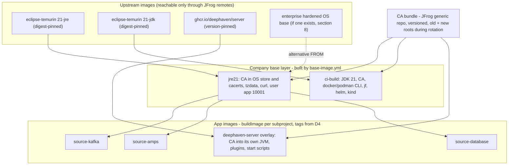
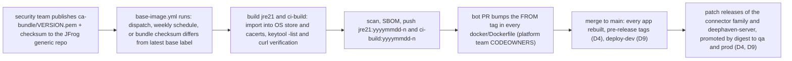
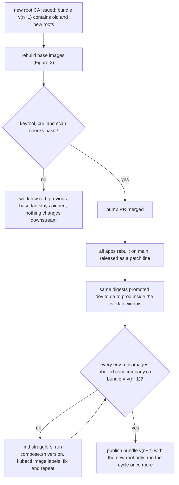

# D3 — Docker images and the enterprise CA

| | |
|---|---|
| Document | D3 |
| Status | Draft v1 (phase 1) |
| Date | 2026-09-26 |
| Source brief | TODO.md v0.8, §2.2, §2.4, §5.3, §6 (DL-02, DL-13, DL-14, DL-19, DL-26, DL-28, DL-34) |
| Related | D1 (`docs/01-repository-and-build.md`), D4 (`docs/04-versioning-and-image-tagging.md`), D6 (`docs/06-runtime-operations.md`), D7 (`docs/07-ci-pipeline-github-actions.md`), D8 (`docs/08-integration-testing.md`), D10 (`docs/10-containerised-ci-execution.md`), D11 (`docs/11-kubernetes-packaging-and-gitops.md`) |

## 1. Purpose and scope

This document defines what a container image of this platform looks like: the base image, how the
enterprise CA certificate reaches both trust stores (OS and JVM) and how it is rotated, the
Dockerfile standard every app follows, the OCI labels, image naming, Podman build compatibility,
scanning / SBOM / signing, the registry the EKS nodes pull from, and the special images
(`deephaven-server`, the test-infra dependency images, the `ci-build` image).

Not here: the version and tag strings and retention (D4, `docs/04-versioning-and-image-tagging.md`);
the Gradle `buildImage` / `pushImage` tasks (D1); workflow YAML (D7); how a container is started for
local and test stacks (`run-compose.sh`, D6) or on Kubernetes (probes, resources, D6 and D11); how
the `ci-build` image is used by jobs (D10).

## 2. Context and constraints

| Constraint | Source |
|---|---|
| Production runs on Kubernetes (Amazon EKS); docker compose is only for local development and CI test stacks — an image is the one artefact both consume | DL-02 (decided v0.4) |
| The enterprise CA must be trusted inside every image, in the OS trust store **and** the JVM truststore | §2.2 |
| JFrog Artifactory is the Docker registry and the only route to upstream images (Docker Hub direct unavailable / rate-limited); Xray if available | §2.2, §5.3 |
| Docker **and** Podman must build the images and run the test stacks | §2.2, DL-19 |
| CI stays amd64: the SQL Server test image is amd64-only | §5.3 |
| Demo simplifications: GHCR stands in for JFrog; GitHub-hosted runners; no Vault | §2.2, §4 |
| Image build tool: D1 recommends a Dockerfile with the jar built by Gradle (DL-14, open) | D1 §4.3 |
| Every image carries the OCI labels `run-compose.sh version` and the retention job read | §5.3, §5.4, §5.8 |

Phasing. The image is identical in every phase. **Demo step 1 (compose)** builds it, pushes it to
GHCR and runs it under compose; **Demo step 2 (kind + Helm)** loads the same image into the kind
cluster; **Phase 3 (EKS + GitOps)** pulls it from JFrog (or an ECR mirror, DL-34) with the same
digest. The `base-image` workflow exists from Demo step 1 because the `ci-build` image (DL-28) needs
the same CA layer.

## 3. Requirements

| "Must answer" bullet (§5.3) | Answered in |
|---|---|
| Where the CA bundle comes from and how it is rotated; renewing the CA must rebuild every image | §5 (1), §6.3, §7.2, §7.3 |
| Two trust stores (OS and JVM); also needed by Gradle in CI, `curl` health checks, the Vault client, AMPS / Kafka TLS | §4.8, §6.2 |
| Dockerfile standard: multi-stage, non-root, `WORKDIR`, `HEALTHCHECK`, `JAVA_OPTS` entrypoint, container-aware JVM flags, `TZ`, read-only root filesystem, `.dockerignore`, hadolint | §6.4, §6.11 |
| OCI labels + custom `com.<company>.*` labels | §6.5 |
| Base image from a JFrog remote only | §4.2, §6.1, §6.6 |
| Podman build compatibility | §4.7, §6.7 |
| Scanning gate, SBOM, signing — required or optional | §4.5, §6.8 |
| Image naming `<registry>/<docker-repo>/<group>/<subproject>` | §6.6 |
| EKS image pull: JFrog direct vs ECR mirror (DL-34); node architecture | §4.4, §4.6, §6.9 |
| Special images: `deephaven-server`, test-infra images (AMPS licence), `ci-build` | §6.10 |
| Options: CA injection (DL-13); base image (Temurin / UBI / distroless-style) | §4.1, §4.2 |
| Tasks: existing company base image (§8); Dockerfile template and lint rules; CA rotation procedure | §9, §6.4, §6.3 |

## 4. Options considered

### 4.1 Enterprise CA injection (DL-13 — open, leaning company base image)

| Option | Pros | Cons | When to prefer |
|---|---|---|---|
| Company base JRE image built once by `base-image.yml` (CA in both stores, tzdata, non-root user); every app `FROM`s it | one place to rotate; app Dockerfiles stay trivial; the `ci-build` image shares the layer; scan once | one more image to version and bump into the apps (Renovate does it); rotation = rebuild of every app | several images sharing one CA and OS policy (this project) |
| Per-Dockerfile `ARG CA_BUNDLE_URL` + `COPY`/`RUN keytool …` in every app | no shared image | N copies of the same 10 lines drift; each app fetches from JFrog at build time; rotation touches N Dockerfiles | a single image, or a repository that cannot share a base |
| Runtime mount (compose volume / Kubernetes ConfigMap of the bundle, or a cluster CA injector) into `/etc/ssl/certs` and a truststore path | rotation without rebuild | image is not self-contained: fails on a laptop or in CI without the mount; the JVM needs `-Djavax.net.ssl.trustStore` pointing at the mount; two mechanisms to keep aligned | as a *supplement* for very frequent rotation, never as the only path |

### 4.2 Base image (open — recommendation §5)

| Option | Pros | Cons | When to prefer |
|---|---|---|---|
| Eclipse Temurin JRE 21 (Ubuntu / Debian-based) through the JFrog remote | widely used, `update-ca-certificates`, shell and `curl` available for `HEALTHCHECK`, JDK from the same vendor for the toolchain (D1 §6.6) | larger than distroless; OS CVE noise from apt packages | default when no company standard exists |
| Red Hat UBI 9 OpenJDK 21 runtime | enterprise support line, `update-ca-trust`, FIPS-friendly, often the mandated base in regulated shops | image names and JVM paths differ from Temurin; toolchain vendor must follow (Red Hat build of OpenJDK) | when the enterprise standardises on UBI / RHEL |
| Distroless-style (no shell, no package manager) | minimal attack surface, small | no `curl` for `HEALTHCHECK` (needs a Java or static probe), CA import must happen in a builder stage, debugging harder, Podman `HEALTHCHECK` semantics moot | hardened production once the operational tooling (probes, exec-free debugging) is in place |
| `jlink`-trimmed runtime on a minimal base | smallest JVM footprint | module list must be maintained per app; Spring Boot's reflective use makes trimming fragile | later optimisation, per app |

### 4.3 Image build tool (DL-14 — open; D1 §4.3 holds the build-level table)

| Option | Image-level pros | Image-level cons |
|---|---|---|
| Dockerfile via `docker buildx build` / `podman build`, jar built by Gradle | OS layer under our control (CA, tz, user, `HEALTHCHECK`); hadolint; identical for Docker and Podman; layered jar gives cache-friendly layers | needs an engine at build time; `HEALTHCHECK` requires Docker manifest format under Podman (§6.7) |
| Jib | no engine; reproducible timestamps | CA and OS choices pushed into a custom base anyway; no `HEALTHCHECK`, no shell; requested Dockerfile absent |
| Gradle build inside a Docker stage | hermetic | duplicates Gradle cache and JFrog credentials inside the build; the `ci-build` image already gives hermeticity (D10) |

### 4.4 Registry the EKS nodes pull from (DL-34 — open, leaning "ECR mirror only if pulls must be in-region")

| Option | Pros | Cons | When to prefer |
|---|---|---|---|
| JFrog direct: nodes pull `artifactory.<company>.com/docker-prod/…` with an `imagePullSecret` (delivered by ESO, D2 / D11) | one registry, one promotion model, Xray results next to the image | egress from EKS to the enterprise network on every pull; pull latency; registry outage blocks pod restarts unless images are cached on nodes | when nodes reach JFrog with acceptable latency (leaning default) |
| ECR mirror in-region, replicated from the JFrog prod repo by digest | IAM / node-role auth (no pull secret), fast in-region pulls, AWS-native availability | a second registry to keep in sync (replication job, digest verification); `image.repository` differs per env; ECR scanning duplicates Xray | when pull time or egress policy forces in-region pulls |
| JFrog edge / replica node in AWS | same JFrog model, in-region | licence and platform-team effort | when the enterprise already operates JFrog edges |

### 4.5 Scanning, SBOM and signing

| Concern | Option A | Option B | Recommendation |
|---|---|---|---|
| Vulnerability scan | JFrog Xray on push (policy blocks download of failing images) | Trivy (or Grype) step in the workflow, fails the job | Xray in the enterprise, Trivy in the demo; gate on `main` and release, warn on PRs |
| SBOM | Xray-generated from build-info | CycloneDX generated in the workflow (Syft or buildx `--sbom`, verify) and attached as an OCI attestation | generate in the workflow so the demo has it; publish build-info to Xray in the enterprise |
| Signing | cosign keyless with the workflow's OIDC identity | cosign with a KMS-held key | keyless from `release.yml`; enforcement in the cluster (admission policy) is Phase 3 (EKS + GitOps); whether it is *required* is a §8 compliance question |

### 4.6 Node architecture

| Option | Pros | Cons | When to prefer |
|---|---|---|---|
| amd64 only | matches CI (SQL Server test image is amd64-only); one manifest | no Graviton savings | now |
| Multi-arch manifest list (amd64 + arm64) via buildx / `podman manifest` | Graviton node groups; laptops on arm | ITs cannot run the arm64 image against SQL Server; double build time; QEMU emulation for the non-native arch | when EKS node groups move to Graviton (§8) |

### 4.7 Podman compatibility approach

| Option | Pros | Cons | When to prefer |
|---|---|---|---|
| One Dockerfile, plain instruction set (no BuildKit-only frontend features), built by both engines; `podman build --format docker` to keep `HEALTHCHECK` (verify) | one artefact, one lint | forgo `RUN --mount=type=cache` unless verified on buildah; `HEALTHCHECK` is a Docker-format extension | this project (DL-19 leaning: both engines, parity tested) |
| Separate Containerfile for Podman | freedom to use engine-specific features | two files drift | never |

### 4.8 JVM trust store placement

| Option | Pros | Cons | When to prefer |
|---|---|---|---|
| Import the CA into the JRE's default `cacerts` in the base image | every client (JDBC, Kafka, AMPS, Vault, HTTP) trusts it with no system property; the JVM's public roots stay | `cacerts` is rewritten on every JRE update — handled because the base image imports on each rebuild | default (this project) |
| Separate truststore file + `-Djavax.net.ssl.trustStore=…` | explicit, auditable file | every JVM invocation (including `keytool` checks and sidecars) must carry the property; forgetting it means silent fallback to public roots only | when policy forbids modifying `cacerts` |

## 5. Recommendation and rationale

1. **Company base JRE image (DL-13, recommended).** `base-image.yml` builds
   `<registry>/docker-base-local/<company>/jre21:<tag>` from the upstream JRE pulled through the
   JFrog remote, adds the CA bundle to both trust stores, `tzdata`, `curl`, a non-root user
   `app` (UID/GID 10001) and `/app` + `/config` + `/tmp` layout. Every app image and the
   `deephaven-server` overlay start `FROM` a pinned tag of it; the `ci-build` image (DL-28) is a
   sibling built by the same workflow from the JDK variant. Rationale: one place to rotate, one
   image to scan, app Dockerfiles that stay under 40 lines.
2. **Base image: Eclipse Temurin JRE 21 unless the enterprise mandates UBI (§8).** Temurin gives
   `update-ca-certificates`, a shell and `curl` for the `HEALTHCHECK`, and a JDK of the same vendor
   for the Gradle toolchain (D1 §6.6). If a company base image already exists, it replaces the
   upstream layer and this document's base becomes a thin overlay on it.
3. **Dockerfile via buildx / Podman with the jar built by Gradle (DL-14, recommended, with D1).**
   Multi-stage: stage 1 explodes the layered jar (`layertools`), stage 2 copies the layers onto the
   base image (§6.11).
4. **Both trust stores are populated in the base image; the JVM store is the default `cacerts`**
   (§4.8). The bundle also stays at `/etc/ssl/certs/<company>-ca-bundle.pem` for `curl`, the
   Vault CLI and any non-Java tool.
5. **CA rotation is a rebuild cascade, not a runtime mount** (§6.3, §7.3): a new bundle version in
   the JFrog generic repo triggers `base-image.yml`; the new base tag is bumped into every
   `Dockerfile` by a bot PR; the apps rebuild and are released as a patch line (D4). The bundle
   ships old **and** new root during the overlap window, so the order of rollout does not matter.
6. **Registry for EKS (DL-34): JFrog direct first**, with the pull secret delivered by ESO; move to
   an ECR mirror replicated by digest only if pull latency or egress policy demands it. Either way
   the digest, not the tag, is what promotion carries (D4).
7. **amd64 only for now** (§4.6); the Dockerfile has no architecture-specific instruction so a
   manifest list can be added later.
8. **Scanning gates on `main` and release, SBOM generated in the workflow, cosign keyless signing
   from `release.yml`** (§6.8); admission enforcement and whether signing is *required* wait for
   Phase 3 (EKS + GitOps) and the §8 compliance answer.
9. **Podman parity** (§6.7): a plain Dockerfile that both engines build; the `buildImage` task
   picks the engine and passes `--format docker` to Podman so the `HEALTHCHECK` survives (verify).
10. **Special images** (§6.10): `deephaven-server` is an overlay on the pinned upstream image with
    the CA imported into *its* JVM's `cacerts` too; test-infra images are upstream images mirrored
    through JFrog remotes and pinned by digest, except AMPS which is an internal image whose licence
    is mounted at runtime and never baked in.

## 6. Conventions

### 6.1 Image layering

| Layer | Image (JFrog) | Built by | Rebuilt when |
|---|---|---|---|
| Upstream JRE / JDK | `artifactory.<company>.com/docker-remote/eclipse-temurin:21-jre` (remote of the public image; exact tag pinned by digest) | vendor | — |
| Company base JRE | `artifactory.<company>.com/docker-base-local/<company>/jre21:<yyyymmdd>-<n>` | `base-image.yml` | weekly (OS patches), on CA bundle change, on JRE patch |
| Company build image | `…/docker-base-local/<company>/ci-build:<yyyymmdd>-<n>` (JDK 21, CA, container CLI, `jf`, `helm`, `kind`) | `base-image.yml` | same triggers + tool bumps |
| App image | `…/docker-dev-local/deephaven-connectors/source-database:<tag from D4>` | `main.yml`, `release.yml`, `pr.yml` (`buildImage` task) | every code change; every base bump |
| Deephaven server overlay | `…/docker-dev-local/deephaven-server:<tag>` `FROM ghcr.io/deephaven/server:<pinned>` (through the remote) | `main.yml`, `release.yml` | upstream pin bump, CA change, plugin change |

The base image tag is a date plus a sequence number so that Renovate can bump it; the digest is
recorded in each app's `FROM` line comment by the bump PR (`# sha256:…`) for traceability.

### 6.2 Trust stores

| Store | Path (Temurin base; UBI in brackets) | Populated by (in the base image) | Consumers |
|---|---|---|---|
| OS | `/usr/local/share/ca-certificates/<company>-root.crt` → `/etc/ssl/certs/ca-certificates.crt` (`/etc/pki/ca-trust/source/anchors/` → `update-ca-trust`) | `COPY` bundle, `update-ca-certificates` | `curl` in `HEALTHCHECK`, Vault CLI, `jf`, `git`, package managers |
| JVM | `$JAVA_HOME/lib/security/cacerts` | `keytool -importcert -noprompt -trustcacerts -cacerts -alias <company>-root-<n>` per certificate in the bundle | Spring (JDBC to SQL Server, Kafka TLS, AMPS TLS, Vault client, actuator HTTP clients), Gradle in `ci-build` |
| Bundle copy | `/etc/ssl/certs/<company>-ca-bundle.pem` (`ENV SSL_CERT_FILE`, `REQUESTS_CA_BUNDLE` for scripts) | `COPY` | tools that read a file instead of the store |
| Deephaven server JVM | the upstream image's own `cacerts` (path verify per pinned version) | same `keytool` step in the overlay Dockerfile | Deephaven's outbound TLS (plugins, auth back-ends) |

Verification step in `base-image.yml`: `keytool -list -cacerts -alias <company>-root-<n>` and
`curl https://artifactory.<company>.com/api/system/ping` must succeed inside the built image.

### 6.3 CA bundle source and rotation

| Step | Who / what | Detail |
|---|---|---|
| Source | security team publishes `ca-bundle/<version>/<company>-ca-bundle.pem` to a JFrog generic repo (URL and checksum) | the bundle contains every active root and intermediate; during rotation it contains **old and new** |
| Trigger | `base-image.yml` on `workflow_dispatch`, weekly schedule, and `repository_dispatch` from the publisher; a scheduled run compares the bundle checksum with the label `com.<company>.ca-bundle` of the latest base | no manual rebuild in the happy path |
| Build | fetch bundle by version (`ARG CA_BUNDLE_VERSION`), import into both stores, verify (§6.2), scan, push `jre21:<yyyymmdd>-<n>` and `ci-build:<yyyymmdd>-<n>` | the bundle version becomes an OCI label |
| Propagate | Renovate (or the workflow itself) opens one PR bumping the `FROM` tag in every `docker/Dockerfile`; CODEOWNERS = platform team; auto-merge allowed for dev | one PR, all apps |
| Rebuild apps | merge to `main` rebuilds every app (affected detection treats a Dockerfile change as "that app", the base bump touches all) → pre-release tags → `deploy-dev` | D4, D9 |
| Release | a patch release of the connector family (`v1.4.3`) and of `deephaven-server` carries the new roots to qa and prod through promotion | D4 §6, D9 |
| Overlap end | after every env runs images with the new bundle, the old root is removed from the bundle → repeat once | two cycles per rotation |
| Emergency | `workflow_dispatch` with `CA_BUNDLE_VERSION` pinned; runtime ConfigMap mount as a stop-gap for pods that cannot wait for a rebuild (Phase 3, exception only) | §4.1 third option |

### 6.4 Dockerfile standard

| Rule | How | Checked by |
|---|---|---|
| Multi-stage | stage `layers` explodes the layered jar; stage `runtime` copies `dependencies/`, `spring-boot-loader/`, `snapshot-dependencies/`, `application/` in that order | review, hadolint |
| Base | `FROM ${BASE_IMAGE}` with `ARG BASE_IMAGE=artifactory.<company>.com/docker-base-local/<company>/jre21:<pinned>`; the demo passes the GHCR base | Renovate bumps the default |
| Non-root | `USER app` (UID 10001) set in the base; app files owned by root, read-only; `/tmp` and `/app/logs` are the only writable paths | hadolint (`USER` present), Kubernetes `runAsNonRoot` (D11) |
| Filesystem | runtime is compatible with `readOnlyRootFilesystem: true`: `-Djava.io.tmpdir=/tmp` with an `emptyDir` / tmpfs; compose uses `read_only: true` + `tmpfs: /tmp` | compose template (D6), chart (D11) |
| `WORKDIR` | `/app` | hadolint |
| Config mount | `/config` (read-only) — layers per D5; `/config` is empty in the image | D5, D6 |
| Entrypoint | `scripts/entrypoint.sh` → `exec java $JAVA_TOOL_OPTIONS_DEFAULTS $JAVA_OPTS org.springframework.boot.loader.launch.JarLauncher` (launcher class for Boot 4.1: verify); `exec` keeps Java as PID 1 for `SIGTERM` | review |
| JVM defaults | `-XX:MaxRAMPercentage=75.0 -XX:+ExitOnOutOfMemoryError -XX:+UseG1GC -Djava.security.egd=file:/dev/./urandom` (G1 default; ZGC per app via `JAVA_OPTS`); heap **never** hard-coded with `-Xmx` in the image | review |
| `TZ` | `ENV TZ=UTC` default, overridden per env / instance (§8 timezone policy); `tzdata` present in the base | — |
| `HEALTHCHECK` | `HEALTHCHECK --interval=30s --timeout=3s --start-period=60s --retries=3 CMD curl -fsS http://localhost:8080/actuator/health/liveness \|\| exit 1` (compose test stacks use it; Kubernetes probes replace it, D11) | Podman needs `--format docker` (§6.7) |
| Ports | `EXPOSE 8080` (HTTP / actuator); app ports as documented in the README; no privileged ports | — |
| Labels | §6.5, all from `--label` build args supplied by `buildImage` | `run-compose.sh version` |
| `.dockerignore` | at the subproject root: everything except `build/libs/*.jar`, `docker/`, `scripts/entrypoint.sh`; `buildImage` stages a minimal context under `build/docker/` anyway (D1 §6.4) | review |
| Lint | `hadolint docker/Dockerfile` in the PR workflow with `.hadolint.yaml` at the repo root (pin-version rules relaxed for `apt` in the base only) | PR job |
| No secrets | no `ARG`/`ENV` carrying credentials; JFrog credentials for base pulls come from the engine's login, never the Dockerfile | secret scanning |

### 6.5 OCI and custom labels

| Label | Value | Example |
|---|---|---|
| `org.opencontainers.image.version` | `project.version` (D1 §6.10) | `1.4.2` |
| `org.opencontainers.image.revision` | full git sha | `1a2b3c4d…` |
| `org.opencontainers.image.source` | repository URL | `https://github.com/<org>/github-demo` |
| `org.opencontainers.image.created` | build timestamp (UTC, RFC 3339) | `2026-09-26T10:15:00Z` |
| `org.opencontainers.image.title` / `.description` | AppName / README first line | `source-database` |
| `org.opencontainers.image.base.name` | base image reference | `…/jre21:20260926-1` |
| `com.<company>.app` | AppName | `source-database` |
| `com.<company>.git-sha` | short sha | `1a2b3c4` |
| `com.<company>.build-url` | workflow run URL | `https://github.com/<org>/github-demo/actions/runs/…` |
| `com.<company>.ca-bundle` | bundle version baked in (from the base) | `2026-03` |

### 6.6 Image naming

| Image | JFrog (enterprise) | GHCR (demo stand-in) |
|---|---|---|
| App | `artifactory.<company>.com/docker-dev-local/deephaven-connectors/source-kafka:<tag>` (promoted to `docker-qa-local`, `docker-prod-local`; pulled through the virtual repos `docker-dev`, `docker-qa`, `docker-prod`) | `ghcr.io/<org>/deephaven-connectors/source-kafka:<tag>` |
| Deephaven server | `…/docker-dev-local/deephaven-server:<tag>` | `ghcr.io/<org>/deephaven-server:<tag>` |
| Base JRE | `…/docker-base-local/<company>/jre21:<yyyymmdd>-<n>` | `ghcr.io/<org>/base/jre21:<yyyymmdd>-<n>` |
| Build image | `…/docker-base-local/<company>/ci-build:<yyyymmdd>-<n>` | `ghcr.io/<org>/base/ci-build:<yyyymmdd>-<n>` |
| Test-infra (mirrored upstream) | `…/docker-remote/<upstream path>@sha256:…` (Kafka, Hazelcast, SQL Server, Deephaven, Vault) | upstream reference pinned by digest |
| Test-infra (internal) | `…/docker-internal-local/test-infra/amps:<vendor-version>` | not available in the demo (§6.10) |

Repository names (`docker-dev-local`, `docker-remote`, …) follow the enterprise JFrog convention
and are confirmed in §8; the `<group>/<AppName>` part is fixed by D1 §6.1.

### 6.7 Podman compatibility

| Concern | Convention |
|---|---|
| Build | `podman build --format docker -f docker/Dockerfile -t <ref> build/docker` — Docker manifest format keeps `HEALTHCHECK` (verify); `buildImage` detects the engine (`docker` → `docker buildx build`, else `podman`) |
| Dockerfile features | only instructions both engines accept: no `# syntax=` directive dependence, no `--mount=type=cache` unless verified on buildah, no `--platform` in `FROM` |
| Rootless | UID 10001 in the image maps through the user namespace; volumes labelled `:Z` on SELinux hosts (D6); no ports below 1024 |
| Parity test | the PR workflow builds one app with both engines on the runner (Podman installed by a step) and compares `inspect` output for `User`, `Healthcheck`, labels (D7) |

### 6.8 Scanning, SBOM, signing by phase

| Control | Demo step 1 (compose) | Enterprise / Phase 3 (EKS + GitOps) |
|---|---|---|
| Scan | Trivy step, fails `main` on critical CVEs with an allowlist file | Xray policy on `docker-dev-local` push; promotion blocked on failing scan |
| SBOM | CycloneDX generated and uploaded as workflow artefact and OCI attestation | same, plus `jf rt build-publish` build-info |
| Sign | cosign keyless from `release.yml` (GitHub OIDC identity) | same; admission policy verifies signature and issuer in qa / prod clusters |
| Base image drift | Renovate PR on new base tag | same; nightly re-scan of promoted images |

### 6.9 EKS image pull (DL-34)

| Item | JFrog direct (default) | ECR mirror (if required) |
|---|---|---|
| `image.repository` (env-level values, D5 / D11) | `artifactory.<company>.com/docker-prod/deephaven-connectors` | `<account>.dkr.ecr.<region>.amazonaws.com/deephaven-connectors` |
| Auth | `imagePullSecret` created by ESO from a Vault-held JFrog token | node IAM role; no secret |
| Promotion | Artifactory promotion by digest (D4) | promotion + replication job copying by digest; digest equality verified before the bump PR merges |
| Availability | node image cache; `imagePullPolicy: IfNotPresent` with immutable tags | in-region |

### 6.10 Special images

| Image | Convention |
|---|---|
| `deephaven-server` | `FROM` pinned upstream `ghcr.io/deephaven/server:<version>` through the JFrog remote; adds the CA to the OS store and the image's own JVM `cacerts`, a `/plugins` directory, start-up scripts under `/opt/deephaven/bin/`; own version line (D4, DL-03); readiness on port 10000 (D8 / D10); used for system ITs, upstream for component ITs (DL-26 leaning) |
| SQL Server | `mcr.microsoft.com/mssql/server` via JFrog remote, digest-pinned, amd64 only, `ACCEPT_EULA=Y` in the test compose file only, health check on `sqlcmd`, slow start → `--wait` timeout in D8 |
| Kafka, Hazelcast, Vault dev, Deephaven upstream | upstream images via JFrog remotes, digest-pinned in `test-infra/compose/*.yml` |
| AMPS | licensed; no public image; `docker-internal-local/test-infra/amps` built from the vendor tarball by `base-image.yml`; licence file mounted at runtime from a secret, never in a layer; CI licensing to confirm (§8); fallback: contract tests against a shared dev AMPS |
| `ci-build` | JDK 21 (same vendor as the base), CA, `docker`/`podman` CLI, `docker compose`, `jf`, `helm`, `kind`, `kubectl`, `hadolint`, `shellcheck`; usage in D10 |

### 6.11 Illustrative Dockerfile skeleton

```dockerfile
# illustrative — deephaven-connectors/source-database/docker/Dockerfile
ARG BASE_IMAGE=artifactory.<company>.com/docker-base-local/<company>/jre21:20260926-1
FROM ${BASE_IMAGE} AS layers
WORKDIR /build
COPY build/libs/source-database-*.jar app.jar
RUN java -Djarmode=tools -jar app.jar extract --layers --destination extracted   # Boot 4.1 syntax: verify

FROM ${BASE_IMAGE} AS runtime
ARG APP_VERSION GIT_SHA BUILD_URL CREATED
LABEL org.opencontainers.image.title="source-database" \
      org.opencontainers.image.version="${APP_VERSION}" \
      org.opencontainers.image.revision="${GIT_SHA}" \
      org.opencontainers.image.created="${CREATED}" \
      org.opencontainers.image.source="https://github.com/<org>/github-demo" \
      com.<company>.app="source-database" com.<company>.git-sha="${GIT_SHA}" \
      com.<company>.build-url="${BUILD_URL}"
ENV TZ=UTC JAVA_OPTS="" \
    JAVA_TOOL_OPTIONS_DEFAULTS="-XX:MaxRAMPercentage=75.0 -XX:+ExitOnOutOfMemoryError -Djava.io.tmpdir=/tmp"
WORKDIR /app
COPY --from=layers /build/extracted/dependencies/ ./
COPY --from=layers /build/extracted/spring-boot-loader/ ./
COPY --from=layers /build/extracted/snapshot-dependencies/ ./
COPY --from=layers /build/extracted/application/ ./
COPY --chmod=0755 scripts/entrypoint.sh /app/entrypoint.sh
VOLUME ["/tmp", "/config"]
EXPOSE 8080
USER app
HEALTHCHECK --interval=30s --timeout=3s --start-period=60s --retries=3 \
  CMD curl -fsS http://localhost:8080/actuator/health/liveness || exit 1
ENTRYPOINT ["/app/entrypoint.sh"]
```

The base image (built by `base-image.yml`) is where `COPY <company>-ca-bundle.pem`,
`update-ca-certificates`, the `keytool -importcert` loop, `tzdata`, `curl` and `useradd -u 10001 app`
live; app Dockerfiles never repeat them. `entrypoint.sh` is three lines:
`exec java $JAVA_TOOL_OPTIONS_DEFAULTS $JAVA_OPTS org.springframework.boot.loader.launch.JarLauncher "$@"`.

## 7. Diagrams

### 7.1 Structural — image layering



*Figure 1 — Three layers: upstream (or enterprise) base, company JRE base with the CA, app images.*

The CA enters exactly two build definitions — the company base images and the `deephaven-server`
overlay, because the upstream Deephaven image brings its own JVM. App Dockerfiles inherit the trust
stores, the non-root user and the timezone data from `jre21` and only add the layered jar.

### 7.2 Flow — CA bundle to base image to app images



*Figure 2 — A bundle change becomes new base images, then one bump PR, then rebuilt and promoted app images.*

No app is rebuilt against a bundle that was not first imported, verified and scanned in the base.
The bump PR is the audit point: its merge commit is the moment every app starts carrying the new
roots, and D4's tags make the resulting images traceable to it.

### 7.3 Flow — CA rotation rebuild cascade



*Figure 3 — Rotation is two cycles of the same rebuild cascade: add the new root, then remove the old one.*

Because the bundle carries both roots during the overlap, the order in which environments and
external endpoints switch does not matter. The `com.<company>.ca-bundle` label is what proves an
environment is done; only then is the old root dropped, which is the change that would break a
laggard.

## 8. How the demo skeleton implements it

| File / directory | What it proves | Phase |
|---|---|---|
| `.github/workflows/base-image.yml` | builds `ghcr.io/<org>/base/jre21` and `ghcr.io/<org>/base/ci-build` from upstream Temurin (no JFrog on GitHub-hosted runners), injects the demo CA bundle, runs the `keytool` / `curl` verification, pushes with `<yyyymmdd>-<n>` tags | Demo step 1 (compose) |
| `docker/base/jre21/Dockerfile`, `docker/base/ci-build/Dockerfile` | the two company base images of §6.1; `base-image.yml` triggers on changes under `docker/base/**` (D7 §6.1); D10 runs the `build` job in `ci-build` | Demo step 1 (compose) |
| `test-infra/ca/demo-root-ca.pem` | a self-signed **public** root certificate standing in for the enterprise bundle; its private key is destroyed after generation, so no leaf can ever be signed by it. The trust path is verified by `keytool -list -cacerts` and `update-ca-certificates` in the base-image build; an end-to-end TLS test would need a throwaway CA generated per run (follow-up, not in the demo) | Demo step 1 (compose) |
| `deephaven-connectors/<AppName>/docker/Dockerfile`, `scripts/entrypoint.sh`, `.dockerignore` (subproject root) | the §6.11 skeleton per app; `JAVA_OPTS`, non-root, `HEALTHCHECK`, labels | Demo step 1 (compose) |
| `build-logic/src/main/kotlin/buildlogic.docker-image.gradle.kts` | engine detection (Docker → `buildx`, Podman → `--format docker`), staged context `build/docker/`, `--label` and `--build-arg` values from `project.version` and git (D1) | Demo step 1 (compose) |
| `deephaven-server/docker/Dockerfile` | overlay on the pinned upstream server image with the CA imported into its JVM, `/plugins`, start script | Demo step 1 (compose) |
| `test-infra/compose/*.yml` | dependency images pinned by digest (Deephaven, SQL Server with `ACCEPT_EULA`, Kafka, Hazelcast); AMPS absent — documented stub | Demo step 1 (compose) |
| `.hadolint.yaml`, `pr.yml` steps `hadolint`, `trivy`, `podman-parity` | lint, scan and Docker / Podman parity of one app image | Demo step 1 (compose) |
| `.github/workflows/release.yml` steps `sbom`, `cosign sign` | SBOM attestation and keyless signature on release images | Demo step 1 (compose) |
| `kind load docker-image …` in the kind job; chart `values.yaml` keys `image.repository`, `image.tag`, `image.pullPolicy` | the same image runs under Kubernetes; `readOnlyRootFilesystem`, `runAsNonRoot` in the chart (D11) | Demo step 2 (kind + Helm) |
| `imagePullSecrets` via ESO, ECR replication job | documented in §6.9, not provisioned | Phase 3 (EKS + GitOps) |

## 9. Open items

> **Update 2026-09-26 (brief v1.0):** DL-13, DL-14, DL-28 referenced below were decided as recommended in this
> document; their ADRs in `docs/adr/` are now Accepted. The remaining rows are unchanged.

| DL | Topic | This document's recommendation |
|---|---|---|
| DL-13 | Enterprise CA injection | company base JRE image built by `base-image.yml` (§5 (1)) |
| DL-14 | Image build tool | Dockerfile via buildx / Podman, jar built by Gradle (§5 (3), with D1) |
| DL-19 | Docker vs Podman support | both; plain Dockerfile, `--format docker`, parity job (§6.7) |
| DL-26 | Deephaven image under test | upstream for component ITs, our overlay for system ITs (§6.10) |
| DL-28 | CI build environment | `ci-build` sibling of the base image (§6.1); usage in D10 |
| DL-34 | Registry for EKS | JFrog direct first, ECR mirror by digest replication if required (§6.9) |
| DL-18 | Registry auth from CI | OIDC to JFrog for pushes; engine login from the issued token (D7) |

§8 questions to confirm: does a company base image already exist and how is the CA bundle
distributed and rotated today; JFrog repository naming and Xray availability, promotion API; egress
policy (`ghcr.io`, `mcr.microsoft.com` blocked → remotes); node architecture (amd64 only or
Graviton); AMPS licence terms for CI images; Deephaven edition and version pin; timezone policy
(`TZ` per region, UTC in logs); compliance: are image signing and SBOM required, and which pod
security standard applies (drives `readOnlyRootFilesystem` and the writable `/tmp`).

Follow-ups: verify the Spring Boot 4.1 layered-jar extraction command and launcher class used in
§6.11; verify `podman build --format docker` keeps `HEALTHCHECK`; measure image size and CVE
baseline for Temurin versus UBI before fixing the base; choose the GC default per app after the
first load tests; write the `base-image.yml` checksum-detection step against the real bundle URL.
