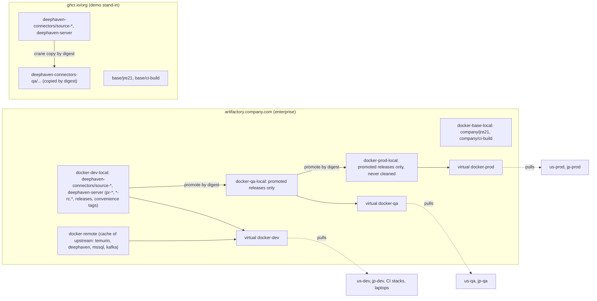
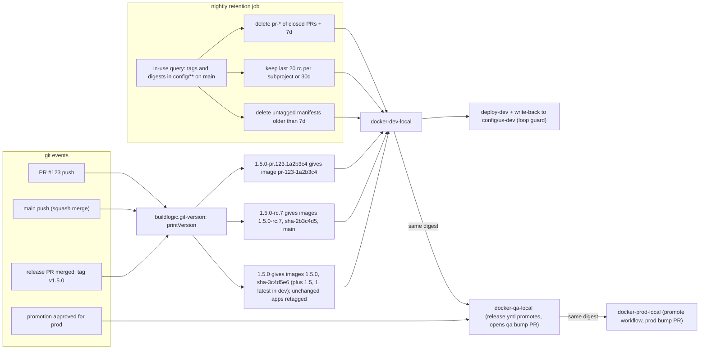
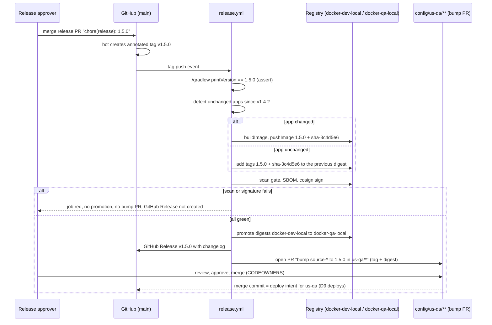

# D4 — Versioning, image tagging and retention

| | |
|---|---|
| Document | D4 |
| Status | Draft v1 (phase 1) |
| Date | 2026-09-26 |
| Source brief | TODO.md v0.8, §2.2, §2.4, §4, §5.4, §5.5, §6 (DL-03, DL-04, DL-05, DL-09, DL-20, DL-36) |
| Related | D1 (`docs/01-repository-and-build.md`), D3 (`docs/03-docker-images.md`), D5 (`docs/05-configuration-management.md`), D7 (`docs/07-ci-pipeline-github-actions.md`), D9 (`docs/09-cd-and-release-management.md`), D11 (`docs/11-kubernetes-packaging-and-gitops.md`) |

## 1. Purpose and scope

This document defines how a version is computed from git on every build, how a git tag becomes a
release, whether the subprojects share one version (lockstep, independent or hybrid), the image tag
naming convention, promotion of the same digest across registry repositories, retention and cleanup
of non-production images, and where the image tag lives for each consumer: `image.tag` in the
instance's Helm values for Kubernetes, `IMAGE_TAG` in `compose.env` for local and test stacks. It
also covers tag-versus-digest pinning per environment, how the tag is changed (dev write-back, bump
PRs) and the hotfix version path.

Not here: the Gradle wiring that computes `project.version` (D1 §6.10); OCI labels and image
naming (D3 §6.5, §6.6); workflow YAML (D7); approvals, deployment windows, rollback drills and the
`deploy-dev` job mechanics (D9); the values layering and `--set-file` mapping (D5, D11).

## 2. Context and constraints

| Constraint | Source |
|---|---|
| Versions are derived from git (tags, commits); a `version.txt` or any checked-in version number never exists | §2.2, §5.4 |
| Production: the tag is `image.tag` in `config/<env>/<flow>/<AppName>/<AppInstance>/values.yaml`; the deployer (`helm upgrade` from `deploy-dev` in the demo, the GitOps controller on EKS) rolls the Deployment when it changes | §5.5, DL-29 (decided v0.7) |
| Local and test stacks: `image: ${IMAGE_REPO}/source-kafka:${IMAGE_TAG}` in the compose template, `IMAGE_TAG` in the instance `compose.env`; CI sets it to the image built in the same run | §5.5, §2.4 |
| Merge to `main` auto-deploys to dev and **writes the deployed tag back** into the instance config with a loop guard; qa and prod are never touched by that job | DL-09 (decided for dev, v0.7), §5.12; DL-36 open |
| Git is the deployment record; rollback = revert the bump commit | §5.5 |
| Same digest promoted across environments, never rebuilt | §5.4, §5.5, §5.12 |
| Convenience tags (`1.4`, `1`, `main`, `latest`) are dev / local only and are never referenced by qa or prod configuration | §5.4 |
| JFrog Artifactory with `docker-dev-local` → `docker-qa-local` → `docker-prod-local`; GHCR stands in for the demo | §2.2, §5.4, §4 |
| Demo acceptance: a `main` push produces a pre-release tag; pushing `v0.1.0` produces `0.1.0` image tags and a config-bump PR | §4, §7 |

Phasing. **Demo step 1 (compose)**: pre-release tags on `main`, release on tag, GHCR, write-back into
`compose.env` of the dev instances, retention job against GHCR. **Demo step 2 (kind + Helm)**: the
write-back targets `values.yaml` (`image.tag`) as well; `helm upgrade --set image.tag`. **Phase 3
(EKS + GitOps)**: Artifactory promotion between repos, the controller reconciles the bump commit,
optional Argo CD Image Updater for dev (§4.8), digests pinned in qa / prod.

## 3. Requirements

| "Must answer" bullet (§5.4, §5.5) | Answered in |
|---|---|
| Version source of truth is git; how the version is computed on every build and how a tag becomes a release | §4.2, §5 (2), §6.1, §7.2, §7.3 |
| Lockstep vs independent versioning with explicit criteria | §4.1, §5 (1) |
| Hybrid flow: pre-release versions on `main`, release on tag (by hand or by a release PR), hotfix versioning from a release tag | §4.2, §4.11, §6.1, §6.6 |
| Tag naming convention (table to ratify, with examples for PR, main, release, hotfix) | §4.4, §6.2, §6.6 |
| One image tag ↔ one git commit; OCI labels carry sha, version, build URL | §6.2 (labels in D3 §6.5) |
| Promote, never rebuild: repo promotion vs properties — decide | §4.5, §5 (4), §6.3 |
| Skip rebuilding unchanged subprojects under lockstep (retag the existing digest) | §4.6, §6.3 |
| Retention / cleanup: `pr-*`, last N pre-releases, untagged manifests, never prod or tag-referenced, protect tags referenced by any env's config (in-use query); Gradle snapshots; Actions caches | §4.10, §6.5, §7.2 |
| Production tag in `image.tag` of the instance values; deployer rolls the Deployment; same digest promoted | §6.4 |
| Compose template with `${IMAGE_REPO}` / `${IMAGE_TAG}` from `compose.env`; CI sets it to the run's image | §6.4 |
| Who changes `IMAGE_TAG` and where the record lives (git) | §4.8, §5 (6), §6.4 |
| Tag vs digest pinning (DL-20) | §4.7, §5 (5), §6.4 |
| Drift detection (controller desired vs live; `run-compose.sh status`) | §6.4 (mechanics in D6, D11) |
| Rollback = revert the bump commit | §6.4, §6.6 |
| Options: GitOps bump PR, deploy-time parameter, manual edit, dev auto-bump by image updater, bot identity (DL-09) | §4.8, §4.9 |

## 4. Options considered

### 4.1 Versioning scope (DL-03 — open, leaning hybrid)

| Option | Pros | Cons | When to prefer |
|---|---|---|---|
| Lockstep: every subproject carries the same version, one tag `v1.4.2` releases the set | one "platform version" in change tickets; framework and apps provably built together; one changelog | apps that did not change get a new version (mitigated by retagging the unchanged digest, §4.6) | one team, shared framework whose API still moves, ops want one number |
| Independent: tag per subproject (`source-kafka/v1.4.2`) | only what changed is released; per-app cadence | N tags per release day; framework / app compatibility matrix to document; change tickets list several versions | mature, decoupled components with different owners |
| **Hybrid**: connector family (`connectors-framework`, `source-*`) lockstep under `v*`; `deephaven-server` independent under `deephaven-server/v*` | family stays one unit while the API moves; the server follows the upstream Deephaven cadence, which is unrelated | two tag patterns to teach; `release.yml` branches on the tag prefix | this project now; revisit when the framework API is stable (criteria below) |

Criteria to move a connector out of lockstep later: its own release cadence differs for two
consecutive quarters; the framework API it uses has been unchanged for a major line; a different
owning team; ops accept a compatibility matrix instead of one version.

### 4.2 Version computation (DL-04 — open, leaning Conventional Commits + release PR)

| Option | Pros | Cons | When to prefer |
|---|---|---|---|
| git-describe style Gradle plugin only (axion-release, palantir git-version, nebula, reckon — verify current state) | zero process: version = last tag + distance; releases by pushing a tag | someone chooses the next number by hand; no changelog; bump size not derived from content | small teams, few releases |
| **Conventional Commits + release PR** (release-please / semantic-release style tooling — verify): commits `feat:` / `fix:` / `feat!:` drive the next version; a bot keeps a release PR with the changelog; merging it creates the annotated tag, which triggers `release.yml`; Gradle derives `project.version` from the tag (D1 §6.10) | the version is a function of the history; changelog and GitHub Release for free; humans review the release as a PR | commit-message discipline (enforced by a PR title / commit lint); the tool's bookkeeping file must not become the version source (§9 inconsistency) | this project |
| Manual tag only | simplest | number chosen by hand, easy to skip; no automation of pre-releases | never as the only path; kept as the emergency route (`git tag -a v1.4.3`) |

### 4.3 Pre-release format on `main`

| Option | Pros | Cons |
|---|---|---|
| **`1.5.0-rc.<n>`**, `<n>` = commit distance from the last release tag on the family's tag line | short, sorts within a version line, unique per `main` commit (linear history by squash merges), semver-valid | `1.5.0` is a prediction from commit messages: a later `feat!:` turns the line into `2.0.0-rc.<m>` (harmless — pre-releases are dev-only) |
| `1.5.0-SNAPSHOT.<yyyymmdd>.<sha7>` | date visible; Maven-friendly for the framework jar | longer; two builds on one day sort by sha, not by order; `SNAPSHOT` implies mutability to Maven tooling |

Both are paired with `sha-<sha7>` on the same digest, so the exact commit is always addressable.

### 4.4 Tag scheme (DL-05 — open; §5.4 table as the proposal)

| Option | Pros | Cons | When to prefer |
|---|---|---|---|
| **Semver + `sha-<sha7>`; `pr-<n>-<sha7>` for PRs; floating convenience tags only in the dev repo** (the §5.4 table, ratified in §6.2) | readable versions for humans, exact sha for machines, no floating tag can reach qa / prod | two tags per digest to push | this project |
| Git sha only | trivially unique | unreadable in change tickets and values files | machine-only pipelines |
| Date-based (`2026.09.26-1`) | monotonic | no semantic meaning; hotfix ordering unclear | products released strictly by calendar |
| Floating tags everywhere (`latest`, `stable`) | easy pulls | non-reproducible deployments, no rollback target | never beyond local development |

### 4.5 Promotion mechanism

| Option | Pros | Cons | When to prefer |
|---|---|---|---|
| **Artifactory repository promotion** (copy of the manifest by digest `docker-dev-local` → `docker-qa-local` → `docker-prod-local`; pull through per-stage virtual repos) | a prod cluster can only see promoted images; Xray policies per repo; audit in Artifactory | promotion API must be allowed (§8); `image.repository` differs per stage (env-level values layer, D5) | this project (enterprise) |
| Properties on one repo (`env=prod` on the manifest) | one repository, one reference everywhere | any consumer can pull unpromoted images; property changes are weakly audited | when promotion API is unavailable |
| Rebuild per environment | none | different digests per env; breaks "build once" and every audit claim | never |
| Demo stand-in | `crane copy` / `skopeo copy` by digest between GHCR paths (`…/deephaven-connectors/<AppName>` → `…/deephaven-connectors-qa/<AppName>`), verify tooling | GHCR has no promotion concept | Demo step 1 (compose) only |

### 4.6 Unchanged subprojects under lockstep

| Option | Pros | Cons |
|---|---|---|
| **Retag the existing digest**: if the subproject's inputs (its directory, the framework, `build-logic`, base image) are unchanged since the previous release, `release.yml` adds the new version tag to the existing digest instead of building | true "build once"; faster releases | needs the affected-detection mapping (D1 §6.9) and the previous digest lookup; SBOM / scan results are reused |
| Always rebuild everything | simple | new digests for identical code; wasted scanning and promotion |

### 4.7 Tag vs digest pinning per environment (DL-20 — open, leaning tag in dev, digest + tag in qa / prod)

| Option | Pros | Cons | When to prefer |
|---|---|---|---|
| Tag only (`image.tag: 1.4.2`) | readable diffs; simple write-back | a tag could in theory be re-pushed (prevented by immutable-tag policy on the repos) | dev, local |
| Digest only (`image@sha256:…`) | immutable, verifiable | unreadable reviews; humans cannot see what version it is | machine-only |
| **Both**: `image.tag: 1.4.2` and `image.digest: sha256:…`; the chart renders `repository@digest` when the digest is set and `repository:tag` otherwise; compose gets `IMAGE_TAG` and `IMAGE_DIGEST` the same way | readable **and** immutable; digest checked against the tag at bump time | two fields to write | qa / prod (and dev once the write-back fills both) |

### 4.8 Who changes the tag (DL-09 — decided for dev; qa / prod open)

| Option | Pros | Cons | When to prefer |
|---|---|---|---|
| **dev: deploy on merge to `main`, then bot write-back of the deployed tag with a loop guard** (decided) | zero-latency dev; git still records what runs | bot commits on `main`; loop guard (DL-36) must be right | dev — decided |
| dev alternative (Phase 3): Argo CD Image Updater / Flux image automation writes the newest `rc` tag back to git | no CI credentials to the cluster; controller-native | another component to run; tag-filter regex must exclude PR and convenience tags; write-back races with the CI write-back if both exist | when the controller is in place and CI push is retired |
| **qa / prod: bot PR** ("bump source-kafka to 1.4.2 in us-qa/*") opened by `release.yml` / a `promote` workflow, CODEOWNERS review, approval = deploy intent | audit, four-eyes, change-ticket reference in the PR | latency of a review | qa / prod (leaning) |
| Deploy-time parameter (`helm upgrade --set image.tag=` with no commit) | fast | state outside git; drift between what runs and what git says | never for qa / prod; the demo's `deploy-dev` uses it **only** together with the write-back |
| Manual edit by an operator via PR | always available | error-prone | fallback |

### 4.9 Bot identity for write-backs and bump PRs (DL-09)

| Option | Pros | Cons |
|---|---|---|
| **GitHub App installation token** (short-lived, per-repo permissions, distinct author `platform-bot[bot]`) | least privilege; the loop guard can key on the app's login; no personal account | app registration by an org admin |
| Personal access token | quick | tied to a person; broad scopes; expires silently |
| `GITHUB_TOKEN` of the workflow | nothing to manage | commits by it do not trigger workflows at all (which also blocks the *wanted* `config-lint`), and it cannot open PRs across protected branches in every configuration (verify) |

### 4.10 Retention implementation

| Option | Pros | Cons | When to prefer |
|---|---|---|---|
| Artifactory cleanup policies (retention by age / count per repo) | native, no code | cannot know which tags are referenced by the config tree | baseline rules (`pr-*` age, untagged manifests) |
| **Scheduled `nightly.yml` job with the JFrog CLI (`jf rt search` / `jf rt delete` by AQL) plus an in-use query against `config/**`** | encodes every rule of §6.5 including the in-use protection | code to maintain; must be dry-run tested | this project |
| GHCR API deletion (demo) | available on GitHub-hosted runners | GHCR has no AQL; the job lists package versions and filters by tag pattern | Demo step 1 (compose) |

### 4.11 Hotfix versioning

| Option | Pros | Cons | When to prefer |
|---|---|---|---|
| **Branch `hotfix/1.4.x` from tag `v1.4.2`, fix commit(s), release PR on that branch → tag `v1.4.3`; fix merged forward to `main`** | prod gets exactly the released code plus the fix; `main` may contain unreleased features | a second release line to maintain until the next minor is in prod | whenever `main` has moved past the released commit |
| Fix on `main`, release `1.5.0` early | one line | ships unreleased changes to prod under time pressure | when `main` == last release + the fix |
| Long-lived release branches per minor | classic | contradicts trunk-based leaning (D9); branch drift | regulated products with parallel supported lines |

## 5. Recommendation and rationale

1. **Hybrid scope (DL-03, recommended).** The connector family (`connectors-framework`,
   `source-kafka`, `source-amps`, `source-database`) is released in lockstep under tags `v<semver>`;
   `deephaven-server` has its own line under `deephaven-server/v<semver>`. Ops get one platform
   version per change ticket while the framework API moves; the server tracks upstream Deephaven.
2. **Conventional Commits + release PR (DL-04, recommended).** Every PR title follows Conventional
   Commits (enforced by a PR-title check, squash merge). A release bot keeps one release PR per line
   open on `main` with the computed next version and the changelog; merging it creates the annotated
   tag; the tag triggers `release.yml`. The build never reads the tool's bookkeeping file: Gradle
   derives `project.version` from the tag and the distance (D1 §6.10), so "no `version.txt`" holds.
   The manual `git tag -a` route remains the emergency path and produces the same release.
3. **Tag scheme (DL-05)**: the §5.4 table ratified in §6.2 with `1.5.0-rc.<n>` as the `main`
   pre-release form (§4.3) and `sha-<sha7>` on every published digest. Floating tags exist only in
   the dev repo; config-lint rejects them in any `values.yaml` or `compose.env` outside `*-dev` and
   `local`.
4. **Promote by Artifactory repository promotion of the digest (§4.5); retag unchanged digests
   under lockstep (§4.6).** Per-stage virtual repositories mean a prod cluster can only pull what
   was promoted. The demo copies by digest between GHCR paths to keep the same shape.
5. **Pinning (DL-20)**: `image.tag` alone in `*-dev` and `local`; `image.tag` **and**
   `image.digest` in `*-qa` and `*-prod`, digest verified against the tag by the bump PR's check.
   The dev write-back records both anyway, so promotion PRs copy verified pairs.
6. **Changing the tag (DL-09)**: dev is decided — deploy then write-back by a GitHub App bot with
   the loop guard "skip commits authored by the bot in the workflow `if:` **and** `[skip ci]`" (DL-36
   leaning; config-only human merges still deploy). qa gets a bot PR from `release.yml`; prod gets
   a bot PR from a `promote` workflow started by an approver; both reviewed under CODEOWNERS. Image
   updaters are not introduced before Phase 3 (EKS + GitOps) and only if the CI write-back is retired.
7. **Retention (§6.5)** by a nightly JFrog-CLI job (GHCR API in the demo) with an in-use query over
   `config/**`, never touching the prod repo or any tag-referenced version.
8. **Hotfix (§6.6)**: branch from the release tag, patch bump by the same release-PR mechanism on
   the hotfix branch, promote through qa fast-track, merge forward to `main`.

## 6. Conventions

### 6.1 Version computation

| Input | Rule | Example |
|---|---|---|
| Release tag (family) | `v<major>.<minor>.<patch>` annotated, on `main` or a `hotfix/*` branch | `v1.4.2` |
| Release tag (server) | `deephaven-server/v<major>.<minor>.<patch>` | `deephaven-server/v0.3.0` |
| Bump size | commits since the last tag of that line: `feat!:` or `BREAKING CHANGE:` → major; `feat:` → minor; `fix:`, `perf:`, `deps:` → patch; `chore:`, `docs:`, `ci:` → no release | `feat(source-kafka): …` after `v1.4.2` → next `1.5.0` |
| Pre-release on `main` | `<next>-rc.<n>`, `<n>` = commits since the last tag of the line | `1.5.0-rc.7` |
| PR build | `<next>-pr.<number>.<sha7>` — never published to Maven, image tag is `pr-<number>-<sha7>` | `1.5.0-pr.123.1a2b3c4` |
| Local build | `<next>-local.<n>.<sha7>[.dirty]` | `1.5.0-local.7.1a2b3c4.dirty` |
| Hotfix branch build | `<next-patch>-rc.<n>` on `hotfix/1.4.x` | `1.4.3-rc.2` |
| Who computes | `buildlogic.git-version` in every Gradle invocation (D1 §6.10); the release bot computes the same `<next>` for the release PR title; `release.yml` asserts `./gradlew printVersion` equals the tag | `printVersion` → `1.4.2` on the tag |
| Scope of "changed" | one tag releases the whole family; unchanged apps are retagged, not rebuilt (§6.3) | — |

### 6.2 Image tag convention (ratified §5.4 table) with worked examples

| Event | Image tag(s) on the digest | Mutable? | Lifetime | Example (`source-database`, family line) |
|---|---|---|---|---|
| PR build (#123 at `1a2b3c4`) | `pr-123-1a2b3c4` | no | until PR closed + 7 days | `…/deephaven-connectors/source-database:pr-123-1a2b3c4` |
| `main` push (7 commits after `v1.4.2`, next `1.5.0`, sha `2b3c4d5`) | `1.5.0-rc.7`, `sha-2b3c4d5`; convenience `main` | first two no; `main` yes | last N = 20 pre-releases per subproject, or 30 days | `…/source-database:1.5.0-rc.7`, `…/source-database:sha-2b3c4d5` |
| Release tag `v1.5.0` at `3c4d5e6` | `1.5.0`, `sha-3c4d5e6`; convenience `1.5`, `1`, `latest` (dev repo only) | first two no; convenience yes | forever (promoted to qa / prod repos) | `…/source-database:1.5.0` (promoted, same digest in `docker-prod-local`) |
| Hotfix tag `v1.5.1` from `hotfix/1.5.x` at `4d5e6f7` | `1.5.1`, `sha-4d5e6f7`; convenience `1.5`, `1` move | as above | forever | `…/source-database:1.5.1` |
| Server release `deephaven-server/v0.3.0` at `5e6f7a8` | `0.3.0`, `sha-5e6f7a8` | no | forever | `…/deephaven-server:0.3.0` |
| Local build | `1.5.0-local.7.1a2b3c4`, convenience `local` | `local` yes | until pruned locally | `source-database:local` (never pushed) |
| Base images | `<yyyymmdd>-<n>` (D3 §6.1) | no | last 10 | `…/<company>/jre21:20260926-1` |

Rules: one immutable tag pair per git commit; the repos `docker-*-local` have the immutable-tag
setting enabled so a version tag can never be re-pushed (verify the Artifactory option); `sha-<sha7>`
is the join key between an image, its git commit and the OCI labels (D3 §6.5); `+` build metadata
is never used because it is not a legal tag character.

### 6.3 Registry layout and promotion

| Item | JFrog (enterprise) | GHCR (demo stand-in) |
|---|---|---|
| Push target | `docker-dev-local/deephaven-connectors/<AppName>` and `docker-dev-local/deephaven-server` | `ghcr.io/<org>/deephaven-connectors/<AppName>`, `ghcr.io/<org>/deephaven-server` |
| Promotion | `docker-dev-local` → `docker-qa-local` → `docker-prod-local` by digest (`jf rt docker-promote --copy` or the promotion REST API, verify); the same manifest, all its tags | `crane copy` (or `skopeo copy`) by digest to `ghcr.io/<org>/deephaven-connectors-qa/<AppName>`, then `…-prod/…` (verify tooling) |
| Pull path per stage | virtual repos `docker-dev` (dev-local + remotes), `docker-qa` (qa-local), `docker-prod` (prod-local); `image.repository` set in the env-level values layer (D5) | package path per stage as above |
| Retag unchanged digest at release | `release.yml`: for each app whose inputs are unchanged since the previous release tag, `jf rt docker-promote` / `crane tag` adds `1.5.0` and `sha-…` to the existing digest | `crane tag` |
| Maven artefacts (`connectors-framework`, only if consumed elsewhere) | `libs-snapshot-local` for `-rc.` versions (30-day retention), `libs-release-local` for releases | GitHub Packages Maven (optional) |
| Test-infra images | `docker-remote` cache, digest-pinned | upstream, digest-pinned |

### 6.4 Where the tag lives and who changes it

| Consumer | File and key | Set by | Example |
|---|---|---|---|
| Kubernetes (production, qa, dev cluster) | `config/us-prod/cash/source-database/trades-db-to-amps/values.yaml` → `image.tag`, `image.digest`; `image.repository` in the env layer | prod: `promote` bot PR + approval; qa: `release.yml` bot PR + review; dev: `deploy-dev` write-back | `image: { tag: "1.5.0", digest: "sha256:9f…" }` |
| Compose (local, CI, dev compose hosts of Demo step 1) | `config/us-dev/cash/source-database/trades-db-to-amps/compose.env` → `IMAGE_REPO`, `IMAGE_TAG`, optional `IMAGE_DIGEST`; template `image: ${IMAGE_REPO}/source-database${IMAGE_DIGEST:+@$IMAGE_DIGEST}${IMAGE_DIGEST:-:$IMAGE_TAG}` (shell-style defaults, verify compose support; fallback: two variables rendered by `run-compose.sh`) | dev: write-back; CI: `IMAGE_TAG=pr-123-1a2b3c4` exported by the workflow for the run's stack | `IMAGE_TAG=1.5.0-rc.7` |
| CI test stack | the run's own image | `build` job output `image_tag` consumed by `integration-test` | `IMAGE_TAG=pr-123-1a2b3c4` |
| `local` env | `config/local/…/compose.env` | developer; default `IMAGE_TAG=local` | `IMAGE_TAG=local` |

Illustrative instance values (qa / prod shape; dev omits `digest` until the write-back fills it):

```yaml
# illustrative — config/us-qa/cash/source-database/trades-db-to-amps/values.yaml
image:
  tag: "1.5.0"
  digest: "sha256:9f8e7d6c…"   # verified against tag 1.5.0 by the bump PR check
replicas: 1
```

Illustrative `compose.env` line set for a dev instance after a write-back:

```dotenv
# illustrative — config/us-dev/cash/source-database/trades-db-to-amps/compose.env
IMAGE_REPO=ghcr.io/<org>/deephaven-connectors
IMAGE_TAG=1.5.0-rc.7
IMAGE_DIGEST=sha256:9f8e7d6c…
```

Bump conventions:

| Item | Convention | Example |
|---|---|---|
| Write-back commit (dev) | author = GitHub App bot; message `chore(deploy): us-dev source-database → 1.5.0-rc.7 [skip ci]`; touches only `config/us-dev/**` | loop guard: `if: github.actor != 'platform-bot[bot]'` on the `main` workflow + `[skip ci]` (DL-36) |
| qa bump PR | branch `bump/us-qa/source-database/1.5.0`; title `chore(release): bump source-database to 1.5.0 in us-qa/*`; body lists digest, changelog link, scan result, source run URL | opened by `release.yml`; reviewed by flow owners (CODEOWNERS `config/us-qa/**`) |
| prod bump PR | branch `bump/us-prod/…`; body adds the change-ticket reference; label `deploy:prod` | opened by the `promote` workflow on approver request; approvals per D9 |
| Config-lint on bump PRs | digest resolves to the tag in the stage's repo; tag not floating; every instance of the app in the env bumped together unless the PR says otherwise | D5 |
| Drift | Argo CD `OutOfSync` / Flux status (Phase 3); `run-compose.sh status` compares `IMAGE_TAG` with the running digest (D6) | — |
| Rollback | revert the bump commit or PR; same deployer path; `helm rollback` only as the emergency short-cut (D9) | `git revert <bump-sha>` |

### 6.5 Retention and cleanup rules

| Rule | Scope | Mechanism | Protection |
|---|---|---|---|
| `pr-*` tags deleted when the PR is closed + 7 days | dev repo | `pr.yml` on `closed` schedules deletion; nightly sweep catches leftovers | none needed |
| Keep the last 20 `*-rc.*` per subproject, and everything younger than 30 days | dev repo | nightly `jf rt search` (AQL by name pattern and `created`) → delete | **in-use protection**: any tag or digest present in `config/**/compose.env` or `values.yaml` on `main` is never deleted (job greps the config tree) |
| Untagged manifests older than 7 days | dev repo | Artifactory policy or nightly AQL | referenced digests from in-use list kept |
| Convenience tags (`main`, `1.5`, `1`, `latest`) | dev repo only | moved, never deleted; absent in qa / prod repos | config-lint forbids them outside `*-dev` / `local` |
| Release versions | all repos | never deleted while a git tag references them; prod repo never touched by any job | job hard-codes `docker-prod-local` as excluded |
| Base images | base repo | keep last 10 per name | any base referenced by a `FROM` on `main` kept |
| Gradle snapshots (`-rc.` jars) | `libs-snapshot-local` | 30-day policy | releases in `libs-release-local` untouched |
| GitHub Actions caches | repository | `actions/cache` eviction + a weekly job deleting caches of closed PR branches | — |
| Dry run | every job | `--dry-run` output posted to the job summary; deletion only on the scheduled run with `DRY_RUN=false` | — |

### 6.6 Hotfix path (`1.5.0` in prod, bug found)

| Step | Action | Result |
|---|---|---|
| 1 | `git checkout -b hotfix/1.5.x v1.5.0`; push | branch protected like `main` (PR required) |
| 2 | PR with `fix(source-database): …` into `hotfix/1.5.x`; the PR workflow builds `pr-456-<sha7>` | ITs green |
| 3 | merge → `main`-style workflow on the hotfix branch: images `1.5.1-rc.1`, no `deploy-dev` (dev tracks `main`), optional deploy to a `us-dev` instance listed for hotfix soak | pre-release available |
| 4 | release bot opens the release PR `chore(release): 1.5.1` on `hotfix/1.5.x`; merge → tag `v1.5.1` | `release.yml`: `1.5.1`, `sha-…`, changed apps rebuilt, unchanged retagged; qa bump PR opened |
| 5 | qa fast-track approval → promote → prod bump PR with change ticket → approval → GitOps sync (D9) | prod on `1.5.1` |
| 6 | `git merge hotfix/1.5.x` (or cherry-pick) into `main` via PR | `main`'s next version stays `1.6.0-rc.<n>` (> 1.5.1) |
| 7 | branch deleted after `1.6.0` reaches prod | — |

## 7. Diagrams

### 7.1 Structural — registry and repository layout



*Figure 1 — Push once into the dev repository; qa and prod see an image only after promotion of its digest.*

The per-stage virtual repositories are the enforcement point: a prod cluster's `image.repository`
resolves against `docker-prod`, which contains nothing that was not promoted. GHCR reproduces the
shape with separate package paths and a copy by digest, without any registry-side policy.

### 7.2 Flow — git event to version, tags, registry, promotion; retention job



*Figure 2 — One version function feeds every event; only the dev repository ever receives a build, and only the dev repository is cleaned.*

The three tag families (`pr-`, `-rc.`, release) come from the same computation and the same
digests move rightwards without a rebuild. The retention job starts from the in-use query so that a
tag written into any `compose.env` or `values.yaml` on `main` survives every rule.

### 7.3 Sequence — tag push to workflow to registry to config bump



*Figure 3 — The tag is the release trigger; the qa bump PR is the hand-over from build to deployment.*

The workflow asserts that Gradle's git-derived version equals the tag before anything is pushed, so
a mis-tagged commit fails early. The `alt` branch on the scan gate shows that a failing image never
reaches qa and never produces a bump PR; the previous release keeps running because nothing in
`config/` changed.

## 8. How the demo skeleton implements it

| File / directory | What it proves | Phase |
|---|---|---|
| `build-logic/src/main/kotlin/buildlogic.git-version.settings.gradle.kts` | `./gradlew printVersion` → `0.1.0` on the `v0.1.0` tag, `0.1.1-rc.<n>` / `0.2.0-rc.<n>` on `main`, `-pr.` and `-local.` forms; no version file anywhere | Demo step 1 (compose) |
| `.github/workflows/pr.yml` | pushes `pr-<n>-<sha7>` to `ghcr.io/<org>/deephaven-connectors/<AppName>`; exports `image_tag` to the IT job; on `closed` schedules the `pr-*` deletion | Demo step 1 (compose) |
| `.github/workflows/main.yml` | pushes `<next>-rc.<n>`, `sha-<sha7>`, `main`; `deploy-dev` then writes `IMAGE_TAG` / `IMAGE_DIGEST` back into `config/us-dev/**/compose.env` as the GitHub App bot with `[skip ci]`; the loop guard `if:` is visible in the workflow | Demo step 1 (compose) |
| `.github/workflows/release.yml` | on `v*` and `deephaven-server/v*`: assert version, rebuild or retag, SBOM, cosign, GitHub Release, copy by digest to the `-qa` GHCR path, open the `us-qa` bump PR | Demo step 1 (compose) |
| `.github/workflows/release-please.yml` (or equivalent, verify tool) | keeps the release PR per line; merge creates the tag | Demo step 1 (compose) |
| `.github/workflows/nightly.yml` job `retention` | GHCR API sweep with the in-use grep over `config/**`, dry-run summary | Demo step 1 (compose) |
| `config/us-dev/cash/source-database/{trades-db-to-amps,positions-db-to-deephaven}/compose.env` | `IMAGE_REPO`, `IMAGE_TAG`, `IMAGE_DIGEST` written back; `config/local/…` uses `IMAGE_TAG=local` | Demo step 1 (compose) |
| `config/us-dev/…/<AppInstance>/values.yaml` (`image.tag`, `image.digest`), chart template rendering `repository@digest` when set | write-back targets both files; `helm upgrade --set image.tag=` in `deploy-dev` | Demo step 2 (kind + Helm) |
| `config-lint` checks: floating tag outside `*-dev` / `local`, digest ↔ tag agreement, PR-title Conventional Commits check | the guard rails of §6.4 | Demo step 1 (compose) |
| Artifactory promotion, per-stage virtual repos, prod `promote` workflow, Argo CD Image Updater evaluation | documented in §6.3 / §4.8, not built | Phase 3 (EKS + GitOps) |

## 9. Open items

> **Update 2026-09-26 (brief v1.0):** DL-03, DL-04, DL-05, DL-09, DL-36 referenced below were decided as recommended in this
> document; their ADRs in `docs/adr/` are now Accepted. The remaining rows are unchanged.

| DL | Topic | This document's recommendation |
|---|---|---|
| DL-03 | Versioning scope | hybrid: family lockstep, `deephaven-server` independent (§5 (1)) |
| DL-04 | Version computation | Conventional Commits + release PR; Gradle derives from tags (§5 (2)) |
| DL-05 | Image tag scheme | §6.2 table with `-rc.<n>` pre-releases and `sha-` tags |
| DL-20 | Tag vs digest pinning | tag in dev / local; tag + digest in qa / prod (§5 (5)) |
| DL-09 (qa / prod part) | Bump delivery | bot PRs from `release.yml` (qa) and `promote` (prod); GitHub App identity (§4.8, §4.9) |
| DL-36 | Loop guard | skip bot author in `if:` + `[skip ci]`; human config-only merges still deploy |
| DL-21 | Config promotion between envs | same PR-per-env flow as image bumps (D5, D9) |
| DL-18 | Registry auth from CI | OIDC; needed for promotion API calls (D7) |
| DL-30 | GitOps controller | decides whether Image Updater is ever relevant for dev (Phase 3) |

§8 questions to confirm: JFrog edition, repository naming, whether the promotion API is allowed and
whether immutable tags can be enforced per repository; whether other repositories consume
`connectors-framework` (Maven retention rules); change-management evidence required in the prod
bump PR (change-ticket field); compliance retention of images and SBOMs; GitHub Enterprise Cloud or
Server (GitHub App availability for the bot identity).

Inconsistency to resolve in the brief: §2.2 forbids any checked-in version file while the DL-04
leaning (release-PR tooling) normally keeps a manifest of released versions. This document keeps the
rule by making the tag the only input of the build (D1 §6.10); the tool's manifest, if the chosen
tool needs one, is bot-owned bookkeeping that nothing else reads — or a tag-only tool is chosen.

Follow-ups: prove the pre-release and release paths in the demo (`main` push → `0.1.1-rc.<n>`,
`v0.1.0` → `0.1.0` + bump PR, acceptance §7); verify the compose variable-substitution syntax used
in §6.4 or move the digest rendering into `run-compose.sh`; decide N and the day counts of §6.5 with
ops after measuring image volume; write the in-use query as a reusable script shared by the retention
job and `run-compose.sh status`.
