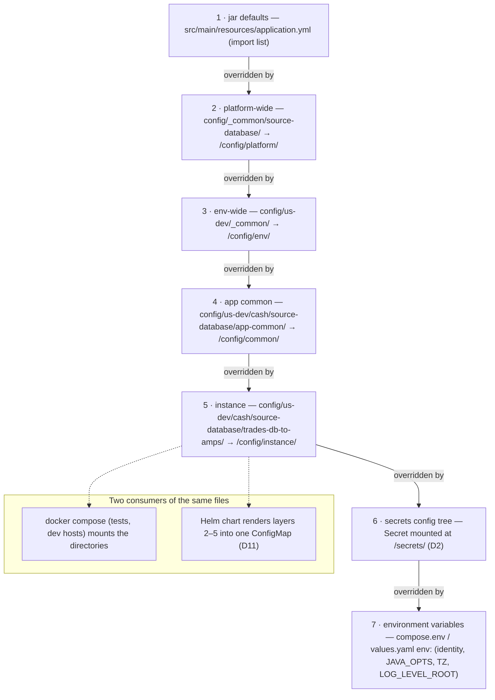
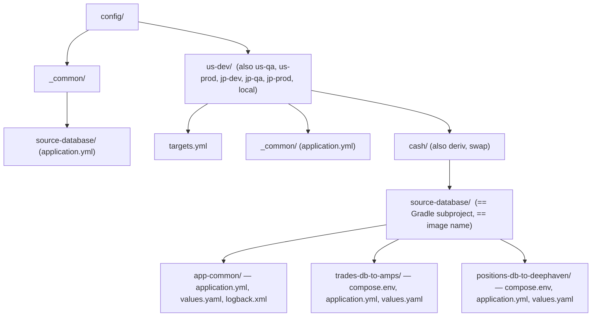
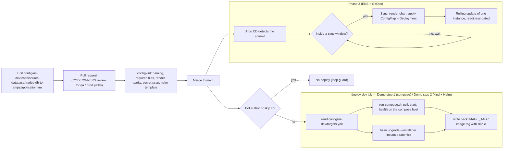
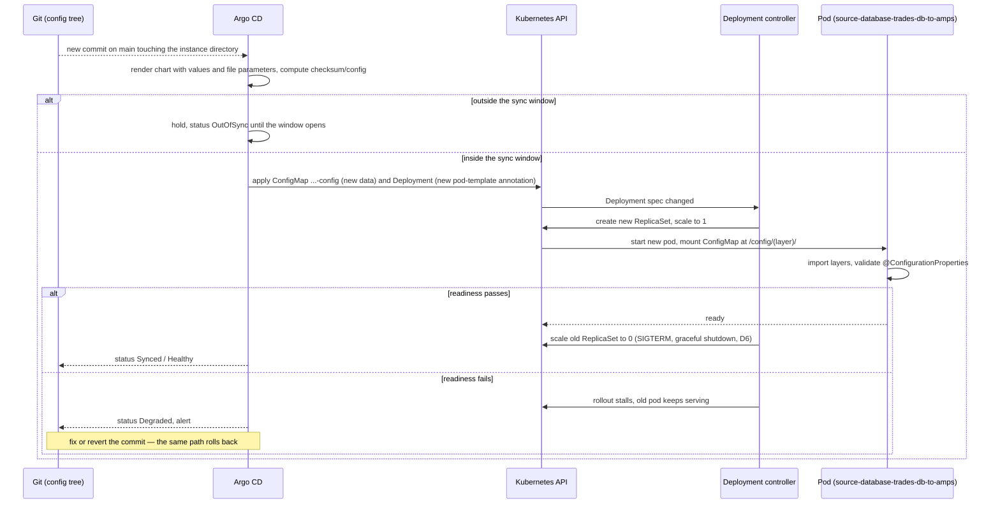

# D5 — Configuration Management

| | |
|---|---|
| Document | D5 |
| Status | Draft v1 (phase 1) |
| Date | 2026-09-26 |
| Source brief | TODO.md v0.8, §2.3, §2.4, §5.5, §5.6, §5.7, §5.12 (write-back), DL-06, DL-07, DL-08, DL-09, DL-21, DL-30, DL-33, DL-36, DL-37 |
| Related | D2 (`docs/02-secrets-and-vault.md`), D4 (`docs/04-versioning-and-image-tagging.md`), D6 (`docs/06-runtime-operations.md`), D7 (`docs/07-ci-pipeline-github-actions.md`), D9 (`docs/09-cd-and-release-management.md`), D11 (`docs/11-kubernetes-packaging-and-gitops.md`) |

## 1. Purpose and scope

This document defines the configuration model of the Spring Boot connector services — the file
layers, their precedence, the mechanism that merges them, the rule for environment variables versus
YAML, the AppName / AppInstance naming model and its validation — and the configuration repository:
where it lives, how it is guarded, how an instance is inventoried, how a change reaches the dev
compose hosts and the clusters, and how a configuration change becomes a rolling update.

In scope: everything under `config/`, the jar defaults it overrides, `targets.yml`, the config-lint
job, the delivery path and the write-back. Out of scope: secret values and Vault (D2), chart
templates (D11), the `run-compose.sh` command table (D6), approval gates and promotion policy (D9),
the workflow files themselves (D7), image tag computation (D4).

Phasing:

- **Demo step 1 (compose)** — config tree in this repo, consumed directly by `run-compose.sh` on
  laptops, in CI and on the dev compose hosts; `deploy-dev` reads `config/us-dev/targets.yml`.
- **Demo step 2 (kind + Helm)** — the same files become Helm values and a ConfigMap per release;
  config-lint adds `helm lint` / `helm template`; `deploy-dev` runs `helm upgrade --install`.
- **Phase 3 (EKS + GitOps)** — a controller reconciles the config tree into the clusters;
  `targets.yml` retires in favour of an ApplicationSet; qa and prod promote by PR.

## 2. Context and constraints

- Decided: config lives **in this monorepo under `config/`** for now, layout repo-agnostic (DL-06);
  one Helm release per AppInstance with `replicas: 1` (DL-33); Helm chart per app (DL-29); AppName =
  code base, AppInstance = business-logic name (DL-37); merge to `main` auto-deploys to dev with tag
  write-back and a loop guard (DL-09 for dev, §5.12).
- The config tree has two consumers reading the **same files**: docker compose for local and CI test
  stacks and the dev compose hosts (never production), and Kubernetes (kind in the demo, EKS in
  production) through the chart (§5.6).
- Spring Boot 4.1 (DL-23) keeps the config-data API (`spring.config.import`, `configtree:`), which
  this design relies on.
- Hostnames, ports, topics and table names belong in the config tree; **secrets never do** (§5.6);
  D2 fixes the property-name contract for secrets.
- Gaps named in §2.4 and resolved here: `qa` (env token `<region>-<stage>`), the missing common
  layers, and the precedence order.
- Tree location: §2.3 places `config/` at the repository root while the §2.4 per-subproject tree
  draws it inside `<subproject>/`. This document uses the **root** location — the tree carries a
  `<AppName>` level and a per-env `targets.yml`, both of which only make sense across apps — and
  reports the discrepancy.

## 3. Requirements

| "Must answer" bullet (§5.6 / §5.7) | Answered in |
|---|---|
| §5.6 Layering and precedence, lowest → highest | §4.2, §5 (R2), §6.1 |
| §5.6 Mechanism: explicit import vs profiles (DL-07); config tree for file-based secrets | §4.1, §5 (R1), §6.1, §8 |
| §5.6 Kubernetes delivery: ConfigMap per release from the layers, `--set-file`, `/config/<layer>/`, `compose.env` → env, config-lint renders both | §6.1, §6.6, Figure 4 (mechanics in D11) |
| §5.6 Env vars vs YAML rule, one canonical place, `${VAR}` placeholders, no duplicate keys | §4.3, §5 (R3), §6.3 |
| §5.6 Naming model (decided): rules, length budget, identity propagation | §6.2 |
| §5.6 Validation: `@ConfigurationProperties` + `@Validated`; config-lint job; parity diff | §6.5 |
| §5.6 Non-Spring files follow the hierarchy; how `application.yml` references them | §6.4 |
| §5.6 Hostnames in the repo, secrets never | §6.5 (checks 8–9), D2 |
| §5.7 Separate repo trade-offs; decision and guard-rails | §4.4, §5 (R4), §6.7 |
| §5.7 Inventory `targets.yml`; ApplicationSet replaces it on EKS | §6.6, Figure 2 |
| §5.7 Delivery mechanism: Argo CD / Flux / CI push; compose reads the tree directly | §4.5, §5 (R5), Figure 3 |
| §5.7 Criteria: controller provided? ConfigMap change → restart; drift and self-heal; RBAC; audit; rollback; secrets | §4.6, §5 (R6), Figure 4, §9 |
| §5.7 Promotion of a config change dev → qa → prod | §4.7, §5 (R7), §6.7 |
| §5.12 Write-back with loop guard (DL-36) | §4.8, §5 (R8), §6.8 |

## 4. Options considered

### 4.1 Layering mechanism (DL-07)

| Option | Pros | Cons | When to prefer |
|---|---|---|---|
| **Explicit `spring.config.import` list** of optional files under `/config/<layer>/`, declared once in the jar defaults | deterministic and visible (`/actuator/env` shows each file as its own property source); no profile arithmetic; the same list works in compose and Kubernetes; a missing optional layer is simply skipped | the layer set is fixed in the jar (adding a fifth layer is a code change — intended) | our case: few, well-known layers, two consumers |
| Profile chain: `spring.profiles.active=us-dev,cash,trades-db-to-amps` with `application-<profile>.yml` | idiomatic Spring; profile-specific beans possible | profile names collide across dimensions (`cash` is a flow, not a profile of code); precedence follows list order in a way reviewers misread; every file must sit in one directory or be enumerated anyway | single-dimension environments (`dev`, `prod`) |
| Hybrid: explicit imports for files, one profile for the stage (`dev` / `qa` / `prod`) | lets code switch beans on stage | two mechanisms to explain | only if a bean really differs by stage — none identified yet |

### 4.2 Extra common layers (§2.4 gap)

| Option | Pros | Cons | When to prefer |
|---|---|---|---|
| Keep only `app-common` (one common level) | smallest tree | env-wide values (Vault address, log endpoint, region TZ) duplicated in every `app-common`; platform-wide app defaults duplicated per env | tiny estates |
| Add `config/_common/<AppName>/` (platform-wide app defaults) | one place for "same in every env" app settings | a wrong edit hits prod and dev alike — must be CODEOWNERS-guarded | settings that are truly environment-agnostic yet not safe as jar defaults |
| Add `config/<env>/_common/` (env-wide) | natural home for Vault / log shipping / TZ per region | one more layer to reason about | always useful |
| Add `config/<env>/<flow>/_common/` (flow-wide, all apps) | shared flow endpoints (one AMPS per flow) | pushes the count past four layers; the same value can live in each app's `app-common` | not recommended now |
| **Four file layers**: `_common/<app>` → `<env>/_common` → `app-common` → `<instance>` | covers every identified need within the ≤ 4 budget | none beyond the discipline of choosing the right layer (config-lint parity report helps) | recommended (DL-07 leaning) |

### 4.3 Environment variables vs YAML (DL-08)

| Option | Pros | Cons | When to prefer |
|---|---|---|---|
| Everything through env vars (`SPRING_*`) | one mechanism for compose and Kubernetes | lists and maps are unreadable as env vars; no structure, no comments; a long `env:` block per instance | tiny apps with flat config |
| Everything in YAML, env vars forbidden | fully structured, reviewable, diffable | compose still needs `IMAGE_TAG`, ports and memory as variables — so a second mechanism exists anyway | never fully achievable here |
| **Rule**: env vars only for deploy-time knobs shared with compose or the platform; YAML for application configuration; one canonical place per key | reviewable structure where it matters, variables where the runtime needs them; a mechanical check exists (§6.5) | requires the rule to be written down and linted | recommended |

### 4.4 Config location (DL-06 — decided: this monorepo; kept for the record)

| Option | Pros | Cons | When to prefer |
|---|---|---|---|
| **In this monorepo under `config/`** | one PR for code + config; one CI run; config-lint sees the app's configuration metadata; no cross-repo checkout | code and config history interleaved; prod paths need CODEOWNERS; bot write-backs land in the code repo (loop guard) | now (decided v0.7) |
| Separate config repo | independent cadence; stricter access; clean deployment audit | version skew between keys and code; two PRs per feature; discoverability | when access control or change cadence demands it — the layout below moves unchanged |
| One repo per env | hard env isolation | three copies of every convention; parity drift | regulated prod with separate operators |
| Code repo holds `app-common` + schema, env repo holds env / instance values | schema stays next to code | two places to look for one instance | a later variant of "separate repo" |

### 4.5 GitOps delivery to clusters (DL-30)

| Option | Pros | Cons | When to prefer |
|---|---|---|---|
| **Argo CD** | ApplicationSets map the tree to releases; sync windows implement trading-hours deployment windows in the cluster; UI and RBAC per project; drift detection and self-heal; Image Updater for dev | another platform component (or provided by the platform team); Helm rendered by the controller, not by `helm install` (hooks differ slightly) | EKS (Phase 3) when a controller is available (§8) |
| Flux | lightweight, CRD-native (`HelmRelease`), image automation; no UI to run | deployment windows only via suspend / resume automation; less discoverable for operators | platform already standardises on Flux |
| CI push — `helm upgrade --install` from `deploy-dev` | simplest; nothing in the cluster; the demo's mechanism | state and audit live in the pipeline; cluster credentials in CI; no drift detection | Demo step 2 (kind + Helm); dev until a controller exists |
| Compose hosts read the checked-out tree | nothing to sync | test stacks and dev hosts only — never production | Demo step 1 (compose) |

### 4.6 ConfigMap change → rolling update

| Option | Pros | Cons | When to prefer |
|---|---|---|---|
| **Checksum annotation** on the pod template (`checksum/config` = hash of the rendered ConfigMap) | no extra component; the Deployment changes exactly when the config does; Helm and Argo CD both see it as a normal rollout | invisible to changes made outside the release (rotated `Secret`s owned by ESO, D2) | Helm-owned ConfigMaps — always |
| Reloader-style controller watching ConfigMaps / `Secret`s | catches out-of-band changes (secret rotation) | another controller; restarts can surprise during a deployment window unless paused | ESO-owned `Secret`s (D2 §6.6) |
| Manual `kubectl rollout restart` | full control | not GitOps; forgotten restarts leave drift between file and process | break-glass only |

### 4.7 Promotion of a config change dev → qa → prod (DL-21)

| Option | Pros | Cons | When to prefer |
|---|---|---|---|
| **PR per env** — the bot (or a human) opens a PR that edits `config/us-qa/...`, reviewed under CODEOWNERS | explicit review per stage; git is the deployment record; same flow as image bumps (D4, D9) | three edits for one logical change; parity drift unless linted | recommended; parity check in config-lint |
| Directory copy `us-dev` → `us-qa` | trivial | copies dev-only values into qa; no review of the diff | never |
| Templated single source rendered per env | no duplication | a template language on top of YAML; the rendered result is what runs, but not what is reviewed | if the estate grows to dozens of envs |

### 4.8 Loop guard for bot write-backs in the same repo (DL-36)

| Option | Pros | Cons | When to prefer |
|---|---|---|---|
| Skip bot author in the workflow `if:` (`github.actor != '<bot>'`) | precise: only the bot's pushes are ignored | a human editing config still deploys (wanted); depends on the bot identity being stable (DL-09) | always |
| `[skip ci]` in the write-back commit message | GitHub skips every workflow for that push; belt and braces | also skips lint of the write-back (acceptable: it only changes `image.tag` / `IMAGE_TAG`) | always, together with the first |
| `paths-ignore: config/**` on the `main` workflow | simplest | wrong: a config-only human merge must still deploy (§5.12) | never |

## 5. Recommendation and rationale

Decided (indicative): config lives under `config/` in this monorepo; one release per AppInstance;
the naming model of §6.2; dev auto-deploy with write-back. The rest is recommended for validation.

| # | Recommendation | Rationale | Alternative kept |
|---|---|---|---|
| R1 | **Explicit `spring.config.import` list** (DL-07) of four optional file layers mounted under `/config/<layer>/`, plus the secrets config tree; no Spring profiles for env / flow / instance | deterministic, visible in `/actuator/env`, identical in compose and Kubernetes; a fifth layer is deliberately a code change | §4.1 |
| R2 | Precedence as in §6.1: jar defaults < platform < env < app-common < instance < `/secrets/` < environment variables. Spring ranks OS environment variables above all config-data imports (verify in the rendered-config test); the brief adopted this order in v0.9 — harmless because env vars never carry secrets or YAML keys (R3) | the order must be the one the runtime actually applies; config-lint's rendered-config test pins it | — |
| R3 | **Env vars only** for deploy-time knobs that compose or the platform also consume (§6.3 list); **YAML** for application configuration including source / target host and port; one canonical place per key; `compose.env` variable names never spell a Spring property | reviewable structure where it matters; duplicates impossible by construction | §4.3 |
| R4 | Monorepo guard-rails: CODEOWNERS on `config/**` with `config/*-prod/**` and `config/*-qa/**` owned by ops; path-filtered `config-lint`; no image rebuild on config-only changes; write-backs with the loop guard (R8) | the decided location needs the access control a separate repo would have given | §4.4 |
| R5 | Delivery: CI push (`run-compose.sh`, then `helm upgrade --install`) in the demo — decided; **Argo CD** on EKS (DL-30 leaning) with an ApplicationSet generated from the tree, retiring `targets.yml`; Flux if the platform provides it | sync windows map to trading-hours deployment windows; the ApplicationSet makes the tree itself the inventory | §4.5 |
| R6 | Rollout on change: **checksum annotation** for the Helm-owned ConfigMap; a **Reloader-style controller** only for ESO-owned `Secret`s (D2); blast radius one instance at a time because each instance is its own release | no controller needed for the common case; rotations still reach pods | §4.6 |
| R7 | Promotion dev → qa → prod by **PR per env** (DL-21) with the parity report attached by config-lint | git stays the deployment record; the diff is what is reviewed | §4.7 |
| R8 | Loop guard: skip the bot author in the workflow `if:` **and** `[skip ci]` in the write-back commit (DL-36) | either alone has a failure mode; together they cover a renamed bot and a manual replay | §4.8 |

## 6. Conventions

### 6.1 Layers, mount paths and precedence (lowest → highest)

| # | Layer | Location in git | Mounted at (Kubernetes) / read from (compose) | Contents | Required |
|---|---|---|---|---|---|
| 1 | Jar defaults | `<subproject>/src/main/resources/application.yml` | inside the jar | safe, environment-agnostic defaults; the import list itself | yes |
| 2 | Platform-wide app defaults | `config/_common/<AppName>/application.yml` | `/config/platform/` | same in every env: poll intervals, metric names | optional |
| 3 | Env-wide | `config/<env>/_common/application.yml` | `/config/env/` | log-shipping endpoint, region TZ, Vault address (D2) | optional |
| 4 | App common in env + flow | `config/<env>/<flow>/<AppName>/app-common/application.yml` | `/config/common/` | shared endpoints (AMPS, Deephaven) for this app in this env + flow | yes |
| 5 | Instance overrides | `config/<env>/<flow>/<AppName>/<AppInstance>/application.yml` | `/config/instance/` | source host, database, query, topic, table names | yes |
| 6 | Secrets config tree | never in git (D2) | `/secrets/` (Kubernetes `Secret`); env vars in compose | secret properties only | runtime |
| 7 | Environment variables | `compose.env` → container env; instance `values.yaml` `env:` | process environment | deploy-time knobs (§6.3) | yes |

Illustrative — the import list in the jar defaults (layer 1), identical for every app:

```yaml
spring:
  config:
    import:
      - optional:file:/config/platform/application.yml
      - optional:file:/config/env/application.yml
      - optional:file:/config/common/application.yml
      - optional:file:/config/instance/application.yml
      - optional:configtree:/secrets/
```

Later imports override earlier ones (verify in the skeleton's rendered-config test); compose mounts
the same directories: `<instance>/` → `/config/instance/`, `app-common/` → `/config/common/`, and so on.

### 6.2 Naming model (decided, DL-37) and identity propagation

| Token | Rule | Examples | Where it is validated |
|---|---|---|---|
| `<env>` | `<region>-<stage>`, region ∈ {`us`, `jp`}, stage ∈ {`dev`, `qa`, `prod`}; plus `local` | `us-dev`, `jp-prod`, `local` | config-lint check 1 |
| `<flow>` | enumerated: `cash`, `deriv`, `swap` | `cash` | check 1 |
| `<AppName>` | `^[a-z0-9]([a-z0-9-]*[a-z0-9])?$`, ≤ 20 chars, equals a deployable Gradle subproject and its image name | `source-database` | check 2 |
| `<AppInstance>` | same regex, business-logic name (source, optionally with target), never a bare number; unique within `<env>/<flow>/<AppName>` | `trades-db-to-amps`, `bbg-equity-ticks` | check 1 |
| Length budget | `<AppName>-<AppInstance>` ≤ 53 (Helm release-name limit): AppName ≤ 20, **AppInstance ≤ 32** (20 + 1 + 32 = 53); adopted by the brief in v0.9 | `source-database-trades-db-to-amps` = 33 | check 1 |
| Compose project | `<env>-<flow>-<app>-<instance>` | `us-dev-cash-source-database-trades-db-to-amps` | D6 |
| Helm release / Deployment | `<app>-<instance>` in namespace `<flow>` (DL-38 leaning) | `source-database-trades-db-to-amps` in `cash` | D11 |
| Labels, log fields, metric tags | `env`, `flow`, `app`, `instance` | `env=us-dev flow=cash app=source-database instance=trades-db-to-amps` | D6 |
| Deephaven table prefix | `<flow>_<instance>_` with `-` → `_` | `cash_trades_db_to_amps_` | framework |
| Identity in the process | env vars `APP_ENV`, `APP_FLOW`, `APP_NAME`, `APP_INSTANCE` set by the deployer (compose.env / instance values); must equal the directory path | — | check 4 |

### 6.3 Environment variables vs YAML — the rule and the worked example

Allowed variables in `compose.env` (and, for the app-facing subset, in the instance `values.yaml`
`env:` block). Anything not in this list is YAML.

| Variable | Consumer | App-facing? | Note |
|---|---|---|---|
| `IMAGE_REPO`, `IMAGE_TAG` | compose template | no | Helm carries the tag as `image.tag` (D4, D11) |
| `APP_ENV`, `APP_FLOW`, `APP_NAME`, `APP_INSTANCE` | compose project name, app identity | yes | must equal the path |
| `JAVA_OPTS` | entrypoint (D3) | yes | heap percentage, GC |
| `TZ` | container | yes | region time zone (§8 timezone policy) |
| `LOG_LEVEL_ROOT` | app via `${LOG_LEVEL_ROOT:INFO}` placeholder | yes | the only placeholder-backed knob besides identity |
| `*_HOST_PORT` (e.g. `ACTUATOR_HOST_PORT`) | compose published ports | no | container ports are fixed in YAML |
| `LOGS_DIR`, `DATA_DIR` | compose volume paths | no | Kubernetes uses volumes in values |
| `CONFIG_DIR`, `COMMON_DIR` | set by `run-compose.sh`, never in the file | no | D6 |
| `SPRING_*`, `LOGGING_*`, `MANAGEMENT_*`, `CONNECTOR_*` | **forbidden** in `compose.env` | — | the secret variables of D2 are passed through by the shell, never written to the file |

Worked example — two `source-database` instances in `us-dev/cash` differing in SQL Server host and
target. Illustrative files:

```yaml
# config/us-dev/cash/source-database/app-common/application.yml   (layer 4)
connector:
  source: { port: 1433, poll-interval: 5s }
  sink:
    amps:      { host: amps-cash.us-dev.<company>.com, port: 9007 }
    deephaven: { host: deephaven-cash.us-dev.<company>.com, port: 10000 }
logging: { level: { root: "${LOG_LEVEL_ROOT:INFO}" } }
```

```yaml
# config/us-dev/cash/source-database/trades-db-to-amps/application.yml   (layer 5)
connector:
  source: { host: sql-trades.us-dev.<company>.com, database: trades, table: dbo.trades }
  sink:   { type: amps, amps: { topic: cash.trades } }
```

```yaml
# config/us-dev/cash/source-database/positions-db-to-deephaven/application.yml   (layer 5)
connector:
  source: { host: sql-positions.us-dev.<company>.com, database: positions, table: dbo.positions }
  sink:   { type: deephaven, deephaven: { table: cash_positions } }
```

```dotenv
# config/us-dev/cash/source-database/trades-db-to-amps/compose.env   (layer 7, non-secret)
IMAGE_REPO=ghcr.io/<org>/deephaven-connectors
IMAGE_TAG=0.1.0-rc.12
APP_ENV=us-dev
APP_FLOW=cash
APP_NAME=source-database
APP_INSTANCE=trades-db-to-amps
JAVA_OPTS=-XX:MaxRAMPercentage=75
TZ=America/New_York
LOG_LEVEL_ROOT=INFO
ACTUATOR_HOST_PORT=18081
```

The two instances share layer 4 (AMPS and Deephaven endpoints, port) and differ only in layer 5
(host, database, sink type, topic / table) — no env var carries an endpoint, so the diff between the
instances is exactly the two YAML files. The skeleton's smoke test proves the difference by comparing
the start-up configuration summaries (§7 of the brief).

### 6.4 Non-Spring files

| File | Layers where allowed | Referenced from `application.yml` as |
|---|---|---|
| `logback.xml` | `app-common` (default), `<instance>` (override) | `logging.config: file:/config/instance/logback.xml` if present, else `/config/common/logback.xml` |
| `kafka-client.properties`, `amps-client.properties` | `app-common`, `<instance>` | `connector.kafka.client-properties: file:/config/common/kafka-client.properties` |
| Deephaven scripts (`*.py`, `*.groovy`) | `app-common`, `<instance>` | `connector.deephaven.script: file:/config/instance/init.groovy` |
| `values.yaml` | `app-common`, `<instance>` | not read by the app; Helm values (D11) |
| `compose.env` | `<instance>` only | not read by the app; compose variables |

Every file in a layer directory is shipped to the same mount path, so a reference is always
`/config/<layer>/<file>`; config-lint fails on a reference to a file that does not exist.

### 6.5 Required-file checklist and config-lint checks

Required files per instance (`config/<env>/<flow>/<AppName>/<AppInstance>/`): `compose.env`,
`application.yml`, `values.yaml` (from Demo step 2). Required per `app-common/`: `application.yml`,
`values.yaml`. Required per env: `targets.yml` (until ApplicationSets). Optional: `_common` layers,
`logback.xml`, client properties. Forbidden: anything matching a secret pattern; `.env` files other
than `compose.env`.

| # | config-lint check | Fails when | Phase |
|---|---|---|---|
| 1 | Naming: regex, enumerated `<env>` / `<flow>`, length budget, uniqueness of `<AppInstance>` within `<env>/<flow>/<AppName>`, no bare numbers | any token violates §6.2 | Demo step 1 (compose) |
| 2 | Every `<AppName>` directory matches a deployable Gradle subproject and vice versa for envs that must be complete | orphan or missing app directory | Demo step 1 (compose) |
| 3 | Required files present (list above) | a file is missing | Demo step 1 (compose) |
| 4 | Identity restated in `compose.env` and in `values.yaml` `env:` equals the directory path | mismatch | Demo step 1 (compose) |
| 5 | `compose.env` contains only the allowed variables of §6.3; no forbidden prefixes | unknown or forbidden key | Demo step 1 (compose) |
| 6 | Render: `docker compose config` per instance with a placeholder for each secret variable | compose template or env file invalid | Demo step 1 (compose) |
| 7 | Merged configuration: layers 2–5 merged offline (YAML deep-merge in import order) and validated against the app's `spring-configuration-metadata.json`; unknown keys warn (version-skew guard, verify) | invalid type or missing required key | Demo step 1 (compose) |
| 8 | Parity: key sets of the merged configuration diffed across `us-dev` / `us-qa` / `us-prod` (and `jp-*`) for the same `<flow>/<AppName>/<AppInstance>`; report attached to the PR | missing key in a higher env (fail for prod, warn for qa) | Demo step 1 (compose) |
| 9 | Secret scan on `config/**` (generic secret scanner) plus a key-name rule: keys under the D2 secret prefixes may not appear in any YAML layer | a value or key looks like a secret | Demo step 1 (compose) |
| 10 | Tag policy: `IMAGE_TAG` / `image.tag` in `*-qa` and `*-prod` must be an immutable release tag (digest + tag comment per DL-20 leaning); floating tags only in `*-dev` and `local` | `latest`, `main`, `1.4` outside dev | Demo step 1 (compose) |
| 11 | `targets.yml`: schema valid; every instance directory has one target and every target has a directory | inventory drift | Demo step 1 (compose) |
| 12 | `helm lint` and `helm template` per instance with the layered values and `--set-file` layers (D11) | chart or values invalid | Demo step 2 (kind + Helm) |
| 13 | ApplicationSet dry-run: generated Application names equal `<app>-<instance>` and are ≤ 53 chars | generator mismatch | Phase 3 (EKS + GitOps) |

### 6.6 Inventory — `targets.yml` (Demo step 1 and 2) and what replaces it

Illustrative `config/us-dev/targets.yml`:

```yaml
env: us-dev
defaults:
  kind: helm                    # compose | helm
  cluster: kind-ci              # Demo step 2: kind inside the workflow; later the dev EKS cluster
  namespace: "{flow}"           # DL-38 leaning: namespace per flow
targets:
  - instance: cash/source-database/trades-db-to-amps
    kind: compose               # Demo step 1
    host: dev-compose-01.<company>.com
  - instance: cash/source-database/positions-db-to-deephaven   # inherits the helm defaults
```

Only `*-dev` envs carry a `targets.yml` consumed by `deploy-dev`; qa and prod are never touched by
that job (§5.12). In Phase 3 (EKS + GitOps) the ApplicationSet's git directory generator enumerates
`config/<env>/<flow>/<AppName>/<AppInstance>/` and a cluster generator maps `<env>` to a cluster, so
the file retires (D11).

### 6.7 Guard-rails in the monorepo and promotion

| Concern | Convention |
|---|---|
| CODEOWNERS | `config/** @<company>/connectors-team`; `config/*-qa/** @<company>/connectors-ops`; `config/*-prod/** @<company>/connectors-ops @<company>/change-approvers` |
| Path filters | `config-lint` runs when `config/**`, `**/helm/**` or `**/docker/docker-compose.yml` change; image builds run only when code paths change (D7); a config-only merge still runs `deploy-dev` |
| Promotion | one PR per env (`us-dev` → `us-qa` → `us-prod`, then `jp-*` in the agreed region order, D9); the PR body carries the parity report; approvals per GitHub Environment (D9) |
| Rollback | revert the config commit; the deployer (or controller) applies the previous state; for the demo `helm rollback` is the emergency path (D11) |
| Audit | git history + GitHub Deployments; on EKS the controller's sync history (D9) |

### 6.8 Write-back conventions (dev only)

| Item | Convention |
|---|---|
| Author | the deploy bot identity (GitHub App token, DL-09), never a personal token |
| Files touched | only `IMAGE_TAG` in `<instance>/compose.env` (Demo step 1) and `image.tag` in `<instance>/values.yaml` (Demo step 2); one commit per `main` run covering every deployed instance |
| Message | `chore(config): us-dev deployed <tag> to <n> instance(s) [skip ci]` |
| Loop guard | `if: github.actor != '<bot>'` on the `main` workflow plus `[skip ci]` (R8); a human config-only merge still deploys |
| Branch protection | the bot needs a bypass for direct pushes to `main`, or the write-back opens an auto-merged PR — decide with DL-09 |

## 7. Diagrams

### 7.1 Structural — config layering and precedence



*Figure 1 — Seven layers, four of them files in git; a later layer overrides an earlier one.*

The four file layers are the maximum; the instance layer should be the only place where two
instances of one app differ. Environment variables sit on top but, by the §6.3 rule, never define a
key that a YAML layer defines, so precedence between them is never exercised in practice.

### 7.2 Structural — the config repository tree



*Figure 2 — The tree for one env and one flow; every other env repeats the same shape.*

Directory names are the identity tuple, which is why config-lint validates them as names and not
just as paths. The layout carries nothing repository-specific, so moving `config/` to its own
repository later changes the deployer's checkout, not the tree.

### 7.3 Flow — config change → PR → lint → merge → sync → rolling update



*Figure 3 — One change, two delivery paths: the demo pushes from CI, Phase 3 lets the controller pull.*

The lint and review steps are identical in both worlds; only the last hop differs. The loop guard
sits between the merge and `deploy-dev`, so a bot write-back ends the cycle while a human
config-only merge still deploys.

### 7.4 Sequence — controller reconciling a ConfigMap change into a pod restart



*Figure 4 — A ConfigMap change is a normal rollout because the pod template carries the ConfigMap checksum.*

The controller never restarts pods directly; it changes the desired state and the Deployment
controller does the rest, gated by readiness. With `replicas: 1` the instance is briefly
unavailable, which the sync window confines to the deployment window.

## 8. How the demo skeleton implements it

| File (planned tree, §2.3 / §2.4) | Role | Phase |
|---|---|---|
| `config/us-dev/cash/source-database/app-common/application.yml`, `values.yaml`, `logback.xml` | layer 4 for the demo app; shared AMPS / Deephaven endpoints | Demo step 1 (compose); `values.yaml` from Demo step 2 (kind + Helm) |
| `config/us-dev/cash/source-database/trades-db-to-amps/{compose.env,application.yml,values.yaml}` and `.../positions-db-to-deephaven/{...}` | the two instances whose effective configuration provably differs (§6.3) | Demo step 1 (compose); `values.yaml` from Demo step 2 (kind + Helm) |
| `config/us-dev/_common/application.yml`, `config/_common/source-database/application.yml` | optional layers 3 and 2 with one key each, to prove the precedence order | Demo step 1 (compose) |
| `config/local/cash/source-database/...` | developer stack: the same shape with `localhost` endpoints (§5.13) | Demo step 1 (compose) |
| `config/us-dev/targets.yml` | inventory read by `deploy-dev` | Demo step 1 (compose), Demo step 2 (kind + Helm) |
| `deephaven-connectors/source-database/src/main/resources/application.yml` | layer 1 with the import list of §6.1 | Demo step 1 (compose) |
| `deephaven-connectors/connectors-framework/` (`ConnectorIdentity`, `@ConfigurationProperties` + `@Validated` bindings, masked start-up summary) | validation and the identity tuple in logs and metrics | Demo step 1 (compose) |
| `build-logic/` (root task `configLint`) | checks 1–11 runnable locally and in CI; `run-compose.sh validate` calls it for one instance (D6) | Demo step 1 (compose) |
| `.github/workflows/pr.yml` (`config-lint` job, path-filtered), `.github/CODEOWNERS` | guard-rails of §6.7 | Demo step 1 (compose) |
| `.github/workflows/main.yml` (`deploy-dev` job: read `targets.yml`, deploy, write back, loop guard) | R8 and §6.8 | Demo step 1 (compose), Demo step 2 (kind + Helm) |
| `deephaven-connectors/source-database/helm/source-database/templates/configmap.yaml`, `deployment.yaml` (checksum annotation) | layers 2–5 as a ConfigMap, mounted per layer (D11) | Demo step 2 (kind + Helm) |
| ApplicationSet per env (location proposed in D11) | replaces `targets.yml` | Phase 3 (EKS + GitOps) |
| Rendered-config test (`integrationTest` of `source-database`) | asserts the precedence order of §6.1 (R2) | Demo step 1 (compose) |

## 9. Open items

| Item | Status | Needed for |
|---|---|---|
| DL-07 layering mechanism (explicit import leaning) | open | Demo step 1 (compose) — blocking |
| DL-08 env vars vs YAML rule (§6.3 proposed) | open | Demo step 1 (compose) |
| DL-09 bump delivery for qa / prod (bot PR with approvals) | open for qa / prod | Phase 3 (EKS + GitOps), D9 |
| DL-20 tag vs digest pinning per env (check 10) | open | config-lint |
| DL-21 promotion by PR per env | open | D9 |
| DL-30 GitOps controller on EKS (Argo CD leaning) | open for EKS | Phase 3 (EKS + GitOps) |
| DL-36 loop guard (skip bot author + `[skip ci]`) | open | Demo step 1 (compose) — blocking |
| DL-38 namespace layout (namespace per flow leaning) | open | `targets.yml` defaults, D11 |
| DL-35 reaching the dev compose hosts | open | Demo step 1 (compose) — blocking |

§8 questions this document depends on: EKS topology (cluster per `<region>-<stage>` or shared
clusters — decides what a cluster generator maps `<env>` to); whether a GitOps controller is
provided on the platform and who runs it; number of instances and hosts per env; timezone policy
(`TZ` per region, UTC in logs); ownership of the config tree, base images and Vault policies;
change-management constraints for prod (approvals per env in D9).

Follow-ups: pin the precedence order with the rendered-config test in the first skeleton build;
spike the configuration-metadata validation (check 7) before promising it; decide the bot's branch
protection path (§6.8); decide where ApplicationSet manifests live (D11); write ADRs for DL-07,
DL-08, DL-36.
