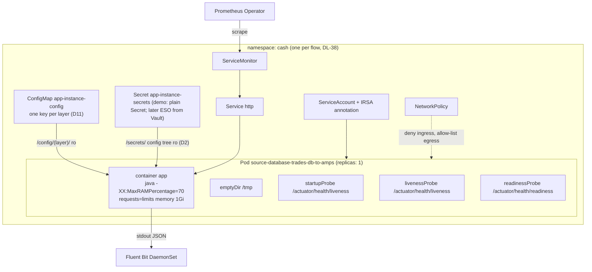
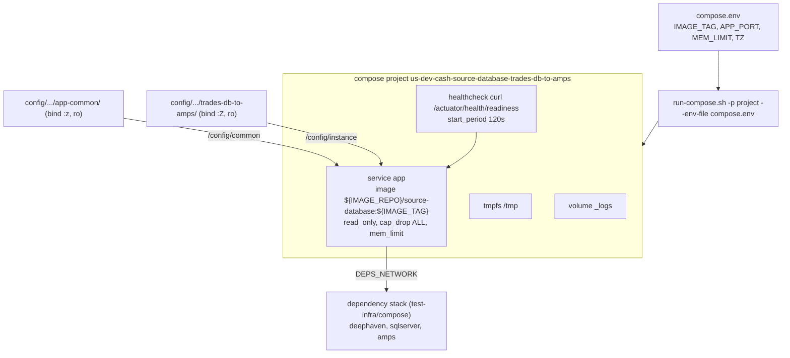
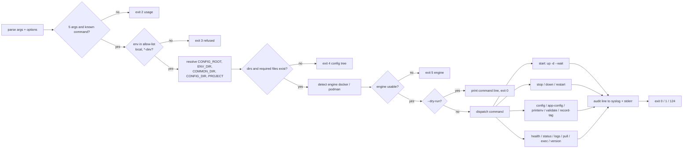
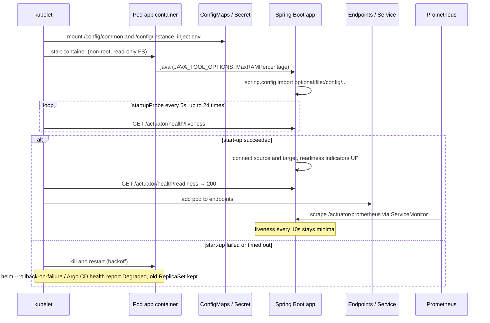
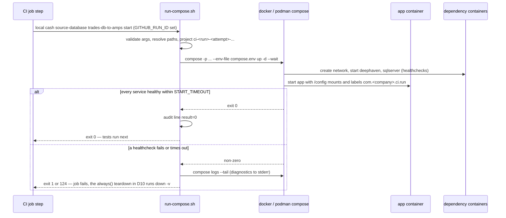

# D6 — Runtime operations: `run-compose.sh` and the Kubernetes runtime

| | |
|---|---|
| Document | D6 |
| Status | Draft v1 (phase 1) |
| Date | 2026-09-26 |
| Source brief | TODO.md v0.8, §5.8, §5.13 (with §2.4, §4, §5.6 identity model, §5.11 labels) |
| Related | D3 (`docs/03-docker-images.md`), D5 (`docs/05-configuration-management.md`), D8 (`docs/08-integration-testing.md`), D9 (`docs/09-cd-and-release-management.md`), D10 (`docs/10-containerised-ci-execution.md`), D11 (`docs/11-kubernetes-packaging-and-gitops.md`) |

## 1. Purpose and scope

This document specifies two things that every deployable app (`source-kafka`, `source-amps`,
`source-database`) shares at runtime:

- the `run-compose.sh` command-line tool (§5.8 of the brief): the one entry point for starting,
  inspecting and stopping a compose stack for **local development, CI test stacks and the dev
  compose hosts of demo step 1**;
- the cross-cutting runtime rules (§5.13): observability, resilience, security and compliance,
  local developer experience, and the decision-record convention.

Production runs on Kubernetes on Amazon EKS (DL-02). Production operations go through the GitOps
controller, `kubectl` and the controller UI — D9 (`docs/09-cd-and-release-management.md`) and D11
(`docs/11-kubernetes-packaging-and-gitops.md`). `run-compose.sh` is never run in production and
refuses every env other than `local` (which the CI test stacks also use) and `*-dev`.

Out of scope here: the Helm chart structure and the config-tree → values mapping (D11), the
configuration layering itself (D5), the Dockerfile (D3), the CI job lifecycle and teardown (D10),
promotion and rollback across environments (D9).

## 2. Context and constraints

| Constraint | Source | Effect on this document |
|---|---|---|
| Production on EKS; compose only for local dev and CI test stacks | §2.1, DL-02 (decided) | Two runtime shapes: a Pod per AppInstance (production) and a compose project per AppInstance (tests, dev hosts). Both consume the same config files (§5.6) |
| Identity tuple `<env>/<flow>/<AppName>/<AppInstance>` propagated everywhere | §5.6, DL-37 (decided) | Compose project `<env>-<flow>-<app>-<instance>`, Helm release `<app>-<instance>`, labels and log fields `env, flow, app, instance`, metrics tags, Deephaven table-name prefix |
| One Helm release, one Deployment, `replicas: 1` per AppInstance | DL-33 (decided) | Probes, `strategy`, PDB and spread rules are written for a single-consumer connector first |
| Docker **and** Podman must work for local dev and CI test stacks | §2.2; DL-19 (open) | Engine detection, rootless and SELinux handling in `run-compose.sh` |
| Config in this monorepo under `config/`, layout repo-agnostic | DL-06 (decided) | `run-compose.sh` resolves everything from a `CONFIG_ROOT` that defaults to `<repo>/config` |
| Demo simplifications | §2.2, §4 | GitHub-hosted runners, no Vault (secrets as env / `Secret` behind the final property names), GHCR as registry stand-in, kind inside the workflow for demo step 2 |
| `deploy-dev` runs `run-compose.sh pull`, `start`, `health` on the dev compose hosts on merge to `main` | §4, §5.12 | The tool must be non-interactive, return meaningful exit codes and write an audit line |
| Enterprise CA in OS and JVM trust stores | §2.2, §5.3 | Truststore is baked into the image (D3); this document only defines the optional runtime override mount |

Phasing used below: **Demo step 1 (compose)**, **Demo step 2 (kind + Helm)**, **Phase 3 (EKS +
GitOps)**.

## 3. Requirements

| Brief bullet ("must answer") | Answered in |
|---|---|
| §5.8 Argument validation against the config tree; `CONFIG_DIR` and `COMMON_DIR` resolution; project name `<env>-<flow>-<app>-<instance>` | §6.1, §6.2 |
| §5.8 Invocation `docker compose -p <project> --env-file <instance>/compose.env -f docker/docker-compose.yml <cmd>` | §6.3 |
| §5.8 Command table with exit codes and prod safety | §6.4, §6.5 |
| §5.8 `start` pull policy and wait-for-healthy; `restart` semantics; `config` vs `app-config` | §4.1–§4.3, §6.4 |
| §5.8 Docker vs Podman detection, rootless Podman, SELinux labels | §4.4, §6.6 |
| §5.8 Mounts: config → `/config` read-only, logs, truststore, `TZ` | §6.7 |
| §5.8 Safety and audit: `--dry-run`, consistent exit codes, audit line to syslog | §6.5 |
| §5.8 Quality: ShellCheck, optional bats | §6.8 |
| §5.13 Observability: JSON logs via Fluent Bit, Micrometer + `ServiceMonitor`, probes and compose `HEALTHCHECK`, identity labels on every log line and metric | §6.9 |
| §5.13 Resilience: restart policy, graceful shutdown, requests / limits with JVM percentage, PDB, topology spread, replicas per instance, behaviour on config change | §4.5, §6.10 |
| §5.13 Security and compliance: non-root, read-only FS, pod security standards, NetworkPolicies, IRSA, trusted registries, scanning, SBOM, audit, least privilege | §6.11 |
| §5.13 Local developer experience: one app + dependencies with the same template and a `local` env; kind for chart work; README | §6.12 |
| §5.13 Decision records: one ADR per §6 row under `docs/adr/` | §6.13 |
| §3 diagrams: pod internals and compose equivalent; command dispatch; pod start and `run-compose.sh start` sequences | §7 |

## 4. Options considered

### 4.1 `start`: pull policy and readiness wait

| Option | Pros | Cons | When to prefer |
|---|---|---|---|
| `up -d` (compose default: pull only if the image is missing) | fast; CI images built in the same run are used as-is | a stale local tag is silently reused | CI test stacks (images just built, never pulled) |
| `up -d --pull always` | always the registry's current digest | slow; fails offline; hides the explicit `pull` step wanted for deploy windows | never as the default |
| `up -d --wait` (+ `--wait-timeout`, verify) | the command returns 0 only when every service is healthy — usable as a gate by CI and `deploy-dev` | needs a `healthcheck` on every service; long start-up needs a generous timeout | default for `start` |

**Recommendation:** `start` = `up -d --wait` with the default pull policy; `--no-wait` opts out
(local iteration). Pulling is the separate `pull` command, run by `deploy-dev` before `start` so a
registry failure changes nothing on the host.

### 4.2 `restart` semantics

| Option | Pros | Cons | When to prefer |
|---|---|---|---|
| `compose restart` | fastest; keeps container | does **not** pick up `compose.env`, image tag or mount changes | never as the default (surprising in dev) |
| `stop` + `up -d --wait` | picks up config, env and image changes; compose recreates only what changed; volumes and network kept | slightly slower | default |
| `down` + `up` | cleanest slate | removes the network; a mistaken `-v` loses data | only via explicit `down` then `start` |

**Recommendation:** `restart` = `stop` followed by `start`. Never removes volumes.

### 4.3 `config` vs `app-config`

| Command | Renders | Mechanism | Masking |
|---|---|---|---|
| `config` | the merged **compose** configuration (`docker compose config`) after `--env-file` substitution | compose itself | values whose variable name matches `*PASSWORD*`, `*SECRET*`, `*TOKEN*`, `*KEY*` are replaced by `***` before printing |
| `app-config` | the **effective Spring configuration** of the app | default: `GET /actuator/connectorconfig` on the running container (the framework's masked summary endpoint, the same content as the start-up log; `/actuator/env` and `configprops` stay unexposed); `--offline`: `compose run --rm --no-deps app --print-config` (the framework prints the effective configuration, secrets masked, and exits — the same summary every app logs at start-up, §4) | Spring Boot's sanitisation plus the same name-pattern filter |

`--offline` is deliberately not called `--dry-run`: the global `--dry-run` (§6.5) means "show the
command, do nothing".

### 4.4 Podman support level (DL-19, open)

| Option | Pros | Cons | When to prefer |
|---|---|---|---|
| Docker first-class, Podman unsupported | one engine to test | developers on Podman-only desktops cannot run the stack | never — §2.2 requires both |
| Both, Podman best-effort | low CI cost; detection in the script is cheap | parity breaks unnoticed (rootless ports, SELinux, `--wait` behaviour) | until a Podman job exists in CI |
| Both first-class, parity tested in CI | one end-to-end IT proven on Docker and Podman (§4 acceptance) | a Podman install step on the GitHub-hosted runner (verify) and a slower nightly job | the target state |

**Recommendation (leaning of DL-19):** both, parity tested — the script detects the engine, the
compose template avoids Docker-only features, and a nightly job re-runs the compose IT on Podman.

### 4.5 Replicas per AppInstance (DL-33, decided)

| Option | Pros | Cons |
|---|---|---|
| `replicas: 1`, fast restart | exactly one consumer: no duplicate publishes, ordering kept, no coordination | seconds of gap on restart or node loss |
| N replicas with leader election (Kubernetes `Lease`) | hot standby, sub-second failover | leader logic in `connectors-framework`; still one active consumer |
| N replicas with partitioned consumption (Kafka consumer groups) | horizontal scale | only for partitioned sources; AMPS and JDBC pollers are not |

**Decision (DL-33):** one replica per instance for now; leader election and partitioning are
later options per source type. Rationale in §6.10.

### 4.6 Log shipping

| Option | Pros | Cons | When to prefer |
|---|---|---|---|
| stdout JSON + Fluent Bit DaemonSet (platform-provided) | no per-pod sidecar; Kubernetes metadata added by the collector; same JSON in compose (`docker compose logs`) | depends on the platform's Fluent Bit configuration | default (§5.13) |
| Fluent Bit sidecar per pod | per-app routing | one more container per instance; resources | only if the platform has no DaemonSet |
| App ships logs directly (Logback appender to the log backend) | no collector | credentials and network in every app; lost logs on crash | never |

## 5. Decision and rationale

Decided by the brief and taken as fixed here: compose is a test and development mechanism only
(DL-02); the identity tuple is propagated to project names, release names, labels, log fields and
metric tags (DL-37); one release with one replica per AppInstance (DL-33); config lives under
`config/` in this repository (DL-06).

Recommendations made in this document:

1. `run-compose.sh` is a thin, deterministic wrapper: it resolves paths from the config tree,
   builds one compose command line, and adds safety (env allow-list, no `-v` by default), audit and
   drift checks. Every command prints exactly what it will run under `--dry-run` (§6.5).
2. `start` waits for health (`--wait`); `restart` is `stop` + `start`; `pull` is explicit (§4.1, §4.2).
3. Both engines are supported and parity is tested in CI (DL-19 leaning, §4.4).
4. Kubernetes and compose use the **same health endpoints, the same JSON log shape and the same
   identity labels**, so what a developer sees locally is what the platform sees in production (§6.9).
5. Single-consumer connectors run with `strategy: Recreate` by default; a PDB is rendered only when
   `replicas > 1` (§6.10).
6. The namespace runs under the `restricted` Pod Security Standard; NetworkPolicies default-deny
   ingress and allow-list egress to the on-prem sources (§6.11).

## 6. Conventions

### 6.1 Arguments and validation

`run-compose.sh <env> <business-flow> <AppName> <AppInstance> <command> [options]`

| Argument | Rule | Check performed | Example |
|---|---|---|---|
| `<env>` | `local` or `<region>-<stage>` matching `^[a-z]{2}-(dev\|qa\|prod)$` | directory `config/<env>/` exists; env is in the **allow-list** `local`, `*-dev` (§6.5); CI test stacks run under `local` with run-scoped project names (D5, D8) | `us-dev` |
| `<business-flow>` | `cash`, `deriv`, `swap` | directory `config/<env>/<flow>/` exists | `cash` |
| `<AppName>` | lower-case kebab-case, ≤ 20 chars; must equal the subproject that owns the script | `config/<env>/<flow>/<AppName>/app-common/` exists; `<AppName>` == basename of the script's subproject directory | `source-database` |
| `<AppInstance>` | `^[a-z0-9]([a-z0-9-]*[a-z0-9])?$`, ≤ 32 chars; `<AppName>-<AppInstance>` ≤ 53 (DL-37, D5 §6.2) | directory exists; required files present (`compose.env`, `application.yml`) | `trades-db-to-amps` |
| `<command>` | one of the commands in §6.4 | unknown → usage error | `start` |

Validation failures print the offending path and exit with code 2 (usage) or 4 (config tree),
never a compose error. `validate` runs every check without touching the engine and is what the
config-lint job calls (D5).

### 6.2 Path resolution

| Variable | Resolved as | Example (`us-dev cash source-database trades-db-to-amps`) |
|---|---|---|
| `REPO_ROOT` | the nearest ancestor of the script that holds a `.platform-bundle` marker (a synced host bundle, DL-39), else `git rev-parse --show-toplevel` from the script's directory, else `<script dir>/../../..` | `/srv/github-demo`; `/opt/platform` on a pooled box |
| `APP_DIR` | `<script dir>/..` | `deephaven-connectors/source-database` |
| `CONFIG_ROOT` | `$CONFIG_ROOT` if set, else `$REPO_ROOT/config` (keeps the layout repo-agnostic, DL-06) | `config` |
| `ENV_DIR` | `$CONFIG_ROOT/<env>` | `config/us-dev` |
| `COMMON_DIR` | `$ENV_DIR/<flow>/<app>/app-common` | `config/us-dev/cash/source-database/app-common` |
| `CONFIG_DIR` | `$ENV_DIR/<flow>/<app>/<instance>` | `config/us-dev/cash/source-database/trades-db-to-amps` |
| `COMPOSE_FILE` | `$APP_DIR/docker/docker-compose.yml` | `deephaven-connectors/source-database/docker/docker-compose.yml` |
| `ENV_FILE` | `$CONFIG_DIR/compose.env` | `.../trades-db-to-amps/compose.env` |
| `PROJECT` | `<env>-<flow>-<app>-<instance>`; in CI (`GITHUB_RUN_ID` set) prefixed with the run identity (§6.5) | `us-dev-cash-source-database-trades-db-to-amps` |

The script exports the identity for the template: `APP_ENV`, `APP_FLOW`, `APP_NAME`,
`APP_INSTANCE`, plus `CONFIG_DIR`, `COMMON_DIR` and `PROJECT`. D5 owns the final variable names
consumed by `application.yml` placeholders; these are the proposal.

### 6.3 Compose invocation

```
<engine> compose -p <PROJECT> --env-file <ENV_FILE> -f <COMPOSE_FILE> <compose args>
```

`<engine>` is `docker` or `podman` (§6.6). Only `compose.env` is passed with `--env-file`; the
identity variables come from the script's environment, so an instance cannot redefine them. An exported
`IMAGE_TAG` / `IMAGE_REPO` overrides the values in `compose.env` in every allowed env and is recorded in
the audit line as `override=…`; this is how `deploy-dev` injects the freshly built tag (D9 §6.4). Once
`health` passed, `record-tag` writes that `IMAGE_TAG` into the `compose.env` of the box's host bundle (§6.4),
so a later `start` or `restart` there runs it until the next sync brings git's tree. The
template references `${IMAGE_REPO}/${APP_NAME}:${IMAGE_TAG}` (§5.5) and mounts §6.7.

### 6.4 Command table (CLI specification)

| Command | Compose action | Exit codes | Safety / notes |
|---|---|---|---|
| `start [--no-wait]` | `up -d --wait --wait-timeout ${START_TIMEOUT:-180}` (verify flag) | 0 healthy; 1 compose error; 124 timeout | never pulls a newer tag by itself (§4.1) |
| `stop` | `stop -t ${STOP_TIMEOUT:-30}` | 0 / 1 | graceful: SIGTERM then SIGKILL after the timeout |
| `down [--volumes]` | `down --remove-orphans`; `--volumes` adds `-v` | 0 / 1; 3 refused | **never `-v` by default**; `--volumes` allowed in `local` (including CI stacks), requires `--force` on `*-dev` hosts |
| `restart` | `stop` then `start` | as `start` | recreates the container when `compose.env`, image or mounts changed |
| `config` | `config` | 0 / 1 | secrets masked (§4.3) |
| `app-config [--offline]` | `GET /actuator/connectorconfig`, or `run --rm --no-deps <AppName> --print-config` | 0 / 1 | secrets masked; `--offline` needs no running stack |
| `printenv` | prints the resolved environment (`compose.env` + identity + engine) | 0 | secrets masked |
| `health` | `ps --format json` + `GET /actuator/health` (readiness) | 0 healthy; 1 unhealthy or not running | non-interactive; used by monitoring and by `deploy-dev` |
| `status` / `ps` | `ps` + desired `IMAGE_TAG` vs running image digest (`inspect`) | 0 no drift; 1 drift or not running | drift detection for test stacks (§5.5) |
| `logs [-f] [--since]` | `logs` | 0 / 1 | passes through `-f`, `--since`, `--tail` |
| `pull` | `pull` | 0 / 1 | pre-pull for deploy windows; the only command that contacts the registry |
| `validate` | none (offline) | 0 ok; 4 missing files / bad names; 1 compose lint error | required files, `config --quiet` lint, every `${VAR}` in the template defined in `compose.env` or the identity set |
| `record-tag` | none (rewrites `compose.env`) | 0 recorded or already recorded; 1 write failed; 2 no or invalid `IMAGE_TAG`, or an `IMAGE_REPO` override; 3 not a host bundle | host bundle only (a box synced by `pool-deploy.sh`, DL-39): `IMAGE_TAG` from the environment becomes the file's one `IMAGE_TAG` line, every other line kept (written to a copy with the same mode, renamed over it); `deploy-dev` runs it on every box of the pool after a passing `health`; refused in a checkout, where `compose.env` changes through git |
| `exec <svc> <cmd…>` / `shell` | `exec` (`shell` = `exec <AppName> sh`; the compose service is named after the AppName) | exit code of the command | audit-logged (§6.5) |
| `version` | `inspect` of the running image: tag, digest, OCI labels `version`, `revision`, `source`, `created`, `com.<company>.build-url` | 0; 1 not running | labels defined in D3 |

Global options accepted before or after the command: `--dry-run`, `--force`, `--engine docker|podman`,
`--json` (machine-readable output for `health`, `status`, `version`), `-q`. `--help` prints this table.

### 6.5 Safety, exit codes and audit

| Rule | Behaviour |
|---|---|
| Env allow-list | `<env>` must be `local` or `*-dev`. Anything else (`us-qa`, `jp-prod`, …) exits 3 with "production operations go through Kubernetes — see D9 / D11". `--force` does **not** override this |
| Volumes | `down` never removes volumes unless `--volumes`; on `*-dev` hosts `--volumes` also needs `--force` |
| `--dry-run` | prints the resolved paths, the identity, the engine and the exact compose command line, then exits 0 without invoking the engine. Valid for every command |
| Exit codes | 0 success or check passed · 1 operation failed or check negative (unhealthy, drift, lint) · 2 usage · 3 refused by a safety rule · 4 config tree error · 5 engine not found or daemon not running · 124 timeout |
| Audit line | one line per invocation to syslog (`logger -t run-compose`, if present) and stderr: `ts=<iso8601> who=<SUDO_USER or USER> host=<hostname> env=<env> flow=<flow> app=<app> instance=<inst> cmd=<cmd> opts=<…> result=<exit>`; when `GITHUB_RUN_ID` is set the line adds `run=<GITHUB_SERVER_URL>/<repo>/actions/runs/<id> actor=<GITHUB_ACTOR>` |
| Pool guard (DL-39) | `start` and `restart` on a box whose `.platform-bundle` lists more than one pool host ask every other box (`run-compose.sh <env> <flow> <app> <inst> status --json` over the DL-35 SSH channel, user and root from the manifest) and exit 3 when the instance already runs elsewhere (`--force` overrides, `POOL_PEER_CHECK=off` disables); an unreachable peer only warns, so a dead box never blocks a failover. It applies only when the bundle's env and flow are the instance's, never in `local`; this box is `POOL_SELF_HOST`, else `hostname -f` (or the one pool host sharing its short name); `POOL_SSH` / `POOL_SSH_OPTS` as in `pool-deploy.sh`, 60 s per peer; `--dry-run` prints the peer commands |
| CI project name | when `GITHUB_RUN_ID` is set **and the env is `local`** (a `*-dev` host keeps its stable project name so a redeploy replaces the stack instead of starting a second one), `PROJECT` becomes `ci-<run_id>-<attempt>-<app>-<instance>`: the prefix matches the run-scoped `COMPOSE_PROJECT_NAME` that D10 defines for its `test-infra` stacks, so a name-prefix filter finds it, and every resource also carries the label `com.<company>.ci.run=<run_id>` (§5.11) that D10's `always()` teardown and leak check use. There is no separate `ci` env token in the config tree (D5 §6.2) |

### 6.6 Engine detection, rootless Podman, SELinux

| Topic | Convention |
|---|---|
| Detection order | `--engine` / `RUN_COMPOSE_ENGINE` → `docker compose version` → `podman compose version` → `podman-compose --version`; none → exit 5 |
| Daemon check | `docker info` / `podman info` once; failure → exit 5 with a hint (`systemctl --user start podman.socket`) |
| Rootless Podman ports | the `local` template publishes only ports ≥ 1024 (`APP_PORT` default `18080`); ports < 1024 are never required |
| Health checks | `health` calls the actuator over the **published** port, never through the engine socket, so it works rootless and through SSH on a dev host |
| Docker API clients | when tests or tools expect Docker, the script exports `DOCKER_HOST=unix://$XDG_RUNTIME_DIR/podman/podman.sock` if that socket exists (verify path) |
| SELinux | bind mounts carry `:z` (shared, `app-common` is mounted by several instances) or `:Z` (private, the instance directory); Docker without SELinux ignores the label (verify). The template uses the long mount syntax with a `${SELINUX_LABEL:-}` suffix set by the script when `getenforce` reports `Enforcing` |
| Parity test | nightly job re-runs the compose IT with Podman (§4.4, DL-19) |

### 6.7 Mounts and environment

| Mount / setting | Container path | Mode | Source |
|---|---|---|---|
| `COMMON_DIR` | `/config/common/` | read-only | bind (compose) / key `common.application.yml` of the ConfigMap `<app>-<instance>-config` (Kubernetes, D11 §6.3) |
| `CONFIG_DIR` | `/config/instance/` | read-only | bind / key `instance.application.yml` of the same ConfigMap |
| optional extra layer: the cluster layer `<env>/<flow>/_common/` (DL-44; the platform layer `config/_common/` went with DL-45) | `/config/flow/` | read-only | same mechanism; a missing layer is mounted from an empty named volume `empty-layer` (a relative path would break once the template is merged into the test-infra stack); the Spring import list in D5 marks it `optional:` |
| logs | `/app/logs` (the writable directory the base image provides, D3 §6.4) | named volume `<PROJECT>_logs` (compose only, for optional file appenders) | primary log channel is stdout (§6.9) |
| truststore override | `/etc/ssl/<company>/truststore.p12` | read-only, **optional** (`TRUSTSTORE_FILE` in `compose.env`) | default is the truststore baked into the image (D3); the override exists for CA rotation tests |
| `/tmp` | `/tmp` | `tmpfs` (compose) / `emptyDir` (Kubernetes) | required by the read-only root filesystem |
| `TZ` | env | `TZ` from `compose.env`, default `UTC` (policy open, §8) | logs carry UTC timestamps regardless |
| Secrets (demo) | env (compose) / `/secrets/` config tree (Kubernetes) | `compose.env` never holds them; the value comes from the host environment (`SPRING_DATASOURCE_PASSWORD`, D2 §6.4) or a Kubernetes `Secret` mounted at `/secrets/` with property-name keys (D2) | Vault later (DL-11, DL-31) |

### 6.8 Quality of the script

| Check | Where | Rule |
|---|---|---|
| ShellCheck | `pr.yml` lint job (D7) | `shellcheck -S warning scripts/run-compose.sh`; `#!/usr/bin/env bash`, `set -euo pipefail` |
| Script tests | `scripts/test/pool-deploy-test.sh` (plain bash, run in the same lint job) | stub `ssh` / `rsync` on `PATH` record arguments; cases: bundle content and marker; placement pinned / discovered / assigned; an instance on two boxes → exit 6; `--move`; identical trees per box; dry-run command lines; failed health re-runs `start` without the override; `record-tag` on every box only after a passing health (a failed record only warns), its rewrite of `compose.env` and its refusals; the pool guard of §6.5 |
| Single copy | `build-logic` copies the canonical script into every app's `scripts/` at build time, or each app's copy is checked identical by the lint job | one implementation, no drift between apps |

### 6.9 Observability

| Concern | Kubernetes (Demo step 2, Phase 3) | Compose equivalent (Demo step 1, tests) |
|---|---|---|
| Startup probe | `GET /actuator/health/liveness`, `periodSeconds: 5`, `failureThreshold: 24` (2 min budget for JVM start and first source connection) | `healthcheck.start_period: 120s` |
| Liveness probe | `GET /actuator/health/liveness`, `periodSeconds: 10`, `timeoutSeconds: 3`, `failureThreshold: 3`; **minimal**: JVM alive, not deadlocked — a dependency outage must not cause restart storms | `restart: unless-stopped` covers crashes; no liveness equivalent |
| Readiness probe | `GET /actuator/health/readiness`, `periodSeconds: 10`, `failureThreshold: 3`; readiness group includes the framework's source and target `HealthIndicator`s, so `helm upgrade --wait` and the smoke test wait for a **working pipeline** | `healthcheck.test: ["CMD", "curl", "-fsS", "http://localhost:8080/actuator/health/readiness"]`, `interval: 10s`, `timeout: 3s`, `retries: 3` (D3 decides whether `curl` is in the image; otherwise a JVM-based check) |
| Log format | JSON on stdout (Spring Boot structured logging, `logging.structured.format.console`, verify), one object per line; fields `@timestamp` (UTC), `level`, `logger`, `thread`, `message`, `env`, `flow`, `app`, `instance`, `version`, `traceId` when tracing is on | identical; `run-compose.sh logs` shows it; `json-file` driver with `max-size` in the template |
| Log shipping | Fluent Bit DaemonSet (platform-provided) tails `/var/log/containers`, adds Kubernetes metadata and ships to CloudWatch or the enterprise stack (§8) | none — `docker compose logs`; CI uploads logs as artefacts (D10) |
| Metrics | Micrometer Prometheus registry at `/actuator/prometheus`; chart renders a `Service` (port `http`) and a `ServiceMonitor` (`serviceMonitor.enabled`, interval 30s) for the Prometheus Operator | endpoint exposed on the published port; optional `test-infra/compose/observability/` stack later |
| Identity on every signal | labels `app.kubernetes.io/name=<app>`, `app.kubernetes.io/instance=<app>-<instance>`, `platform.<company>.com/env`, `/flow`, `/app`, `/instance`; `management.metrics.tags.{env,flow,app,instance}` and the MDC fields are set from `APP_ENV`, `APP_FLOW`, `APP_NAME`, `APP_INSTANCE` | compose `labels:` `com.<company>.{env,flow,app,instance}`; same env vars |
| Tracing (optional) | Micrometer Tracing with an OTLP exporter, off by default (`management.tracing.enabled=false`) | same property |

### 6.10 Resilience

| Concern | Convention | Rationale |
|---|---|---|
| Restart policy | Deployment default `Always`; compose `restart: unless-stopped` for test stacks | a crashed connector restarts without operator action; CI still fails fast because `start --wait` gates on health |
| Resources | `requests.memory == limits.memory` (default `1Gi`), `requests.cpu: 250m`, no CPU limit by default (per-instance values may set one); JVM `-XX:MaxRAMPercentage=70`, `-XX:MaxDirectMemorySize` set explicitly for Arrow / Flight buffers of the Deephaven client; compose `deploy.resources.limits.memory: ${MEM_LIMIT}` and `JAVA_OPTS` from `compose.env` | memory limit and heap move together; the 30 % headroom covers metaspace, threads, direct buffers |
| Graceful shutdown | `server.shutdown=graceful`, `spring.lifecycle.timeout-per-shutdown-phase=20s`; framework stop order: stop consuming → flush and commit → close sinks; `terminationGracePeriodSeconds: 30`; compose `stop_grace_period: 30s`; the entrypoint `exec`s Java so PID 1 receives SIGTERM (D3) | no half-published batch on redeploy |
| Rollout strategy | default `strategy: Recreate` for exclusive consumers (no two consumers at once); `RollingUpdate` with `maxSurge: 1, maxUnavailable: 0` only where the instance values declare the pipeline idempotent | duplicates are worse than a few seconds of gap for single-consumer sources |
| `replicas: 1` (DL-33) | one consumer per pipeline; fast restart via startup probe budget; later options per source: leader election (`Lease`) or partitioned consumer groups | §4.5 |
| PodDisruptionBudget | rendered only when `replicas > 1` (`maxUnavailable: 1`); with one replica a PDB would block node drains for ever | eviction of a single replica is an accepted restart |
| Topology spread | `topologySpreadConstraints` on `topology.kubernetes.io/zone`, `labelSelector` on `app.kubernetes.io/name=<app>`, `whenUnsatisfiable: ScheduleAnyway` | instances of one app spread across AZs so an AZ failure takes out a subset of pipelines, not all |
| Config change | ConfigMap checksum annotation on the pod template (D5 / D11 decide checksum vs Reloader) → one instance restarts; blast radius is one pipeline because every AppInstance is its own release | §5.7 |
| Compose test stacks | `healthcheck`, `stop_grace_period`, `mem_limit` mirror the above so ITs exercise the same shutdown path | local parity |

### 6.11 Security and compliance

| Control | Kubernetes | Compose equivalent | Phase |
|---|---|---|---|
| Non-root, no privilege escalation | `runAsNonRoot: true`, `runAsUser` from the image (D3), `allowPrivilegeEscalation: false`, `capabilities.drop: [ALL]`, `seccompProfile: RuntimeDefault` | `user:` from the image, `cap_drop: [ALL]`, `security_opt: [no-new-privileges:true]` | Demo step 2 chart defaults |
| Read-only root filesystem | `readOnlyRootFilesystem: true` + `emptyDir` on `/tmp` | `read_only: true` + `tmpfs: [/tmp]` | Demo step 1 / 2 |
| Pod Security Standards | namespace labels `pod-security.kubernetes.io/enforce=restricted` (and `warn`, `audit`); the chart's defaults pass `restricted` | n/a | Demo step 2 (kind namespace), Phase 3 |
| NetworkPolicies | default-deny ingress per namespace; ingress only from the monitoring namespace to the metrics port; egress allow-list: DNS, Deephaven `Service`, AMPS / Kafka / SQL Server CIDRs on-prem (§8 network path), Vault | none (compose network is private to the project) | rendered by the chart in Demo step 2 (`networkPolicy.enabled`); enforced on EKS with the platform CNI (kind's default CNI does not enforce them, verify) |
| AWS identity | IRSA: a `ServiceAccount` per release annotated with `eks.amazonaws.com/role-arn` when the instance needs an AWS API (MSK IAM auth, S3, CloudWatch); never static keys | n/a | Phase 3 |
| Trusted registries only | admission policy (platform-provided) allows `artifactory.<company>.com/...` or the ECR mirror only (DL-34) | `IMAGE_REPO` validated by `validate` against an allow-list | Phase 3 |
| Scanning, SBOM, signing | Xray / Trivy gate and SBOM in CI (D7); cosign optional (§8) | same images | Demo step 1 (scan), Phase 3 (policy) |
| Secrets hygiene | secrets never in `config/`: pre-commit hook + secret scanning (D5); Vault delivery per DL-31 | env from the host, masked in every `run-compose.sh` output | all |
| Audit trail | deploy records (D9), Kubernetes audit log, controller history; `run-compose.sh` audit line (§6.5) | audit line to syslog on dev hosts | all |
| Least privilege | OIDC tokens for CI (DL-18), CODEOWNERS on `config/**`, controller RBAC per namespace (D9, D11) | dev-host deploy user limited to `run-compose.sh` (DL-35) | all |

### 6.12 Local developer experience

| Step | Command / file | Notes |
|---|---|---|
| Config for the laptop | `config/local/<flow>/<app>/{app-common,<instance>}` | same layout as `us-dev`; endpoints point at compose service names of the dependency stack (`sqlserver`, `amps`, `deephaven`) |
| Dependencies | `./gradlew devUp` / `devDown` (wraps `test-infra/compose/`, §5.10) | Deephaven, SQL Server, Kafka, AMPS (licence permitting), Hazelcast; network named in `DEPS_NETWORK` |
| One app | `scripts/run-compose.sh local cash source-database trades-db-to-amps start` | the template joins the external `DEPS_NETWORK` when set, so service names resolve |
| Inspect | `... health`, `... logs -f`, `... app-config`, `... status` | same commands the dev hosts and CI use |
| Change config | edit `config/local/.../application.yml` → `... restart` | bind mount + recreate (§4.2) |
| Chart work (Demo step 2) | `kind create cluster --name dh-local`; `kind load docker-image <image>`; the same `helm upgrade --install` line as `deploy-dev` (D9, D11); `kubectl port-forward` to the actuator | `KIND_EXPERIMENTAL_PROVIDER=podman` for Podman desktops (verify) |
| Documentation | each subproject `README.md`: what it does, the commands above, the config keys it understands; `run-compose.sh --help` | §2.4 |

### 6.13 Decision records

| Convention | Value |
|---|---|
| Location | `docs/adr/DL-NN-<kebab-title>.md`, index in `docs/adr/README.md` |
| One ADR per §6 row | DL-01 … DL-38; a new decision first gets a row in the brief's §6, then its ADR |
| Structure | title; table with Status, Date, Blocking for demo skeleton; Context; Decision; Alternatives considered; Consequences; References |
| Status lifecycle | Proposed (open row, leaning recorded as the proposal) → Accepted (team confirms) → Closed / Superseded (names the superseding ADR) |
| Change | an accepted ADR is never edited in substance; a new ADR supersedes it |

## 7. Diagrams

### 7.1 Structural — pod internals for one AppInstance



*Figure 1 — Pod internals of one Helm release.*

Everything the app needs at runtime is either a
read-only mount from the config tree, a `Secret` mounted as a Spring config tree, or an annotation on
its `ServiceAccount`. The three probes hit the actuator; logs leave on stdout and metrics through the
`Service` — the app itself knows nothing about Fluent Bit, Prometheus or Vault.

### 7.2 Structural — the compose equivalent for tests and dev hosts



*Figure 2 — The same instance as a compose project.*

The mounts, the health endpoint, the
identity labels and the security options mirror Figure 1 one to one; only the delivery mechanism
differs (bind mounts and `compose.env` instead of ConfigMaps and values). This is what CI test
stacks and the dev compose hosts of Demo step 1 run.

### 7.3 Flow — `run-compose.sh` command dispatch



*Figure 3 — Command dispatch.*

Every safety decision is taken before the engine is touched, so a
refusal or a validation failure never leaves a half-started stack. The audit line is written on
every path that reached the engine, including failures.

### 7.4 Sequence — pod start → config mount → readiness → traffic



*Figure 4 — From pod creation to a scraped, ready instance.*

The startup probe gives the JVM and
the first source connection a two-minute budget before liveness starts counting; readiness decides
when the instance is treated as working. On failure the previous release stays in place because
`--rollback-on-failure` (Helm 4's name for `--atomic`, Demo step 2) or the controller (Phase 3) never removes it before the new pod is ready.

### 7.5 Sequence — `run-compose.sh start` for a CI test stack



*Figure 5 — Starting a test stack.*

`start` returns only when compose reports every service
healthy, so the test step can begin immediately without its own polling. Teardown is not the
script's job on the success path; the CI job's `always()` step owns it (D10), using the run-scoped
project name and label this script assigned.

## 8. How the demo skeleton implements it

| Phase | File / path | What it proves |
|---|---|---|
| Demo step 1 (compose) | `deephaven-connectors/<app>/scripts/run-compose.sh` | every command of §6.4, exit codes of §6.5, engine detection of §6.6 |
| Demo step 1 (compose) | `deephaven-connectors/<app>/docker/docker-compose.yml` | one template for all env / flow / instance: `${IMAGE_REPO}`, `${IMAGE_TAG}`, mounts of §6.7, `healthcheck`, `read_only`, labels |
| Demo step 1 (compose) | `config/local/cash/source-database/...`, `config/us-dev/cash/source-database/{app-common,trades-db-to-amps,positions-db-to-deephaven}/compose.env` | `local` env for laptops; two instances that differ in endpoints |
| Demo step 1 (compose) | `test-infra/compose/` + Gradle `devUp` / `devDown` | dependency stack shared by ITs and local development |
| Demo step 1 (compose) | `.github/workflows/pr.yml` lint job; `scripts/test/pool-deploy-test.sh` | ShellCheck, script tests of §6.8 |
| Host pools (v1.3, DL-39) | `scripts/pool-deploy.sh`, the `.platform-bundle` marker in `run-compose.sh` and the wrappers, the pool guard of §6.5 | the flow's configuration and runtime on every box under `/opt/platform`; one running copy per instance across the pool |
| Demo step 1 (compose) | `.github/workflows/main.yml` → `deploy-dev` | `pull`, `start`, `health` on the compose hosts (D9); in the demo a placeholder that runs `start --dry-run` on the runner (`TODO(DL-35)`) |
| Demo step 2 (kind + Helm) | `deephaven-connectors/<app>/helm/<app>/templates/deployment.yaml` | probes, resources, `securityContext`, `strategy`, checksum annotation, identity labels |
| Demo step 2 (kind + Helm) | `.../templates/{service,servicemonitor,networkpolicy,pdb}.yaml` with `enabled` switches; `values.yaml` defaults | monitoring and policy objects rendered and linted; PDB only when `replicas > 1` |
| Demo step 2 (kind + Helm) | kind job (`_kind-deploy.yml`, `scripts/helm-deploy-instance.sh`): namespace with PSS `restricted` labels, `helm upgrade --install --rollback-on-failure --wait` per instance, `rollout status`, `helm test`, `scripts/helm-smoke-diff.sh` | chart defaults pass `restricted`; the two instances differ in effective config |
| Phase 3 (EKS + GitOps) | platform Fluent Bit, Prometheus Operator, CNI NetworkPolicy enforcement, IRSA roles, admission policy, Argo CD | documented here and in D11, not provisioned by the demo |
| All | `docs/adr/DL-*.md`, `docs/adr/README.md` | one ADR per §6 row (§6.13) |

## 9. Open items

> **Update 2026-09-26 (brief v1.0):** DL-07, DL-13, DL-14, DL-27, DL-35 referenced below were decided as recommended in this
> document; their ADRs in `docs/adr/` are now Accepted. The remaining rows are unchanged.

| Item | Status | Effect here |
|---|---|---|
| DL-07 config layering mechanism (import list vs profiles; extra `_common` layers) | open | mount paths `/config/<layer>/` in §6.7 and the ConfigMap set in Figure 1 |
| DL-08 env vars vs YAML rule | open | which knobs `compose.env` may carry (§6.7) |
| DL-13 / DL-14 CA injection and image build tool | open | whether the truststore override mount is ever needed |
| DL-19 Docker vs Podman support level | open, leaning both with CI parity | §4.4, §6.6 |
| DL-27 teardown guarantee | open | CI project-name prefix and run label (§6.5) must match D10 |
| DL-31 secrets delivery in Kubernetes | open, leaning ESO | `Secret` → env in Figure 1; a CSI or Agent choice would add a volume |
| DL-34 registry for EKS | open | the trusted-registry allow-list (§6.11) |
| DL-35 reaching the dev compose hosts | open | who runs `run-compose.sh` there and what the audit line's `who` shows |
| DL-38 namespace per flow | open, leaning per flow | NetworkPolicy and PSS scope in §6.11 |
| §8: pod security standards, IRSA, service mesh or ingress imposed by the platform team | to confirm | §6.11 defaults may need a mesh sidecar or an ingress class |
| §8: network path from EKS to on-prem AMPS / Kafka / SQL Server | to confirm | egress NetworkPolicy CIDRs |
| §8: timezone policy (`TZ` per region, UTC in logs) | to confirm | `TZ` default in §6.7 |
| §8: compliance — audit retention, image signing, SBOM | to confirm | §6.11 scanning and signing rows |
| §5.13 task: confirm which cross-cutting topics are in scope for the first iteration | to confirm | tracing and the observability compose stack are marked optional |
| Follow-ups | — | fix the `--wait-timeout` flag and Podman socket path on the target versions; measure the memory budget of one instance to set the `1Gi` default; add the Podman parity job |
