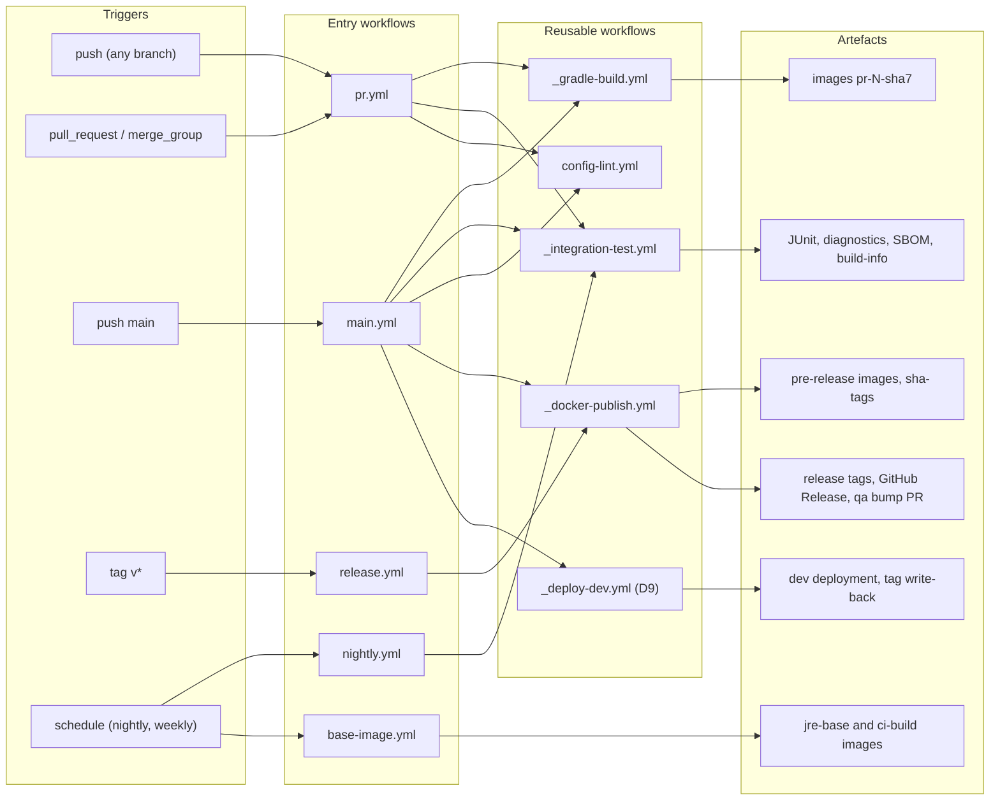
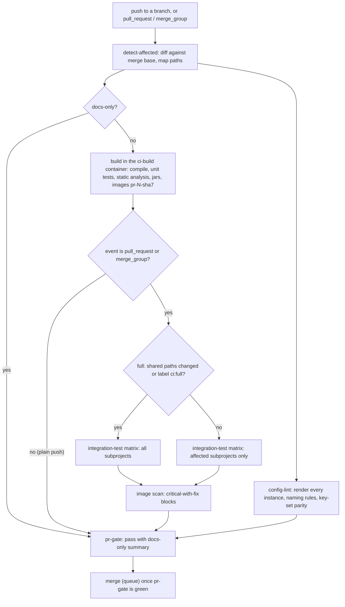
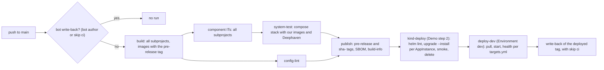
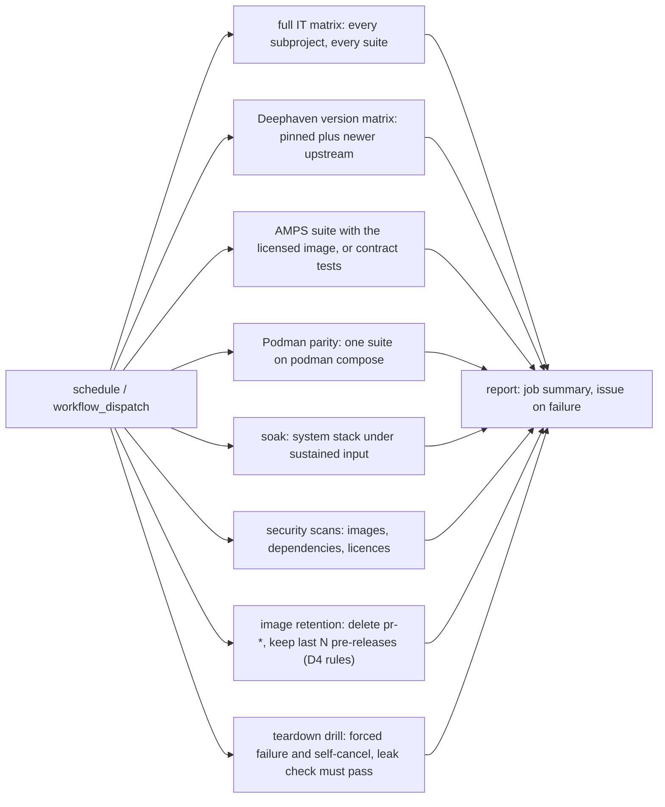
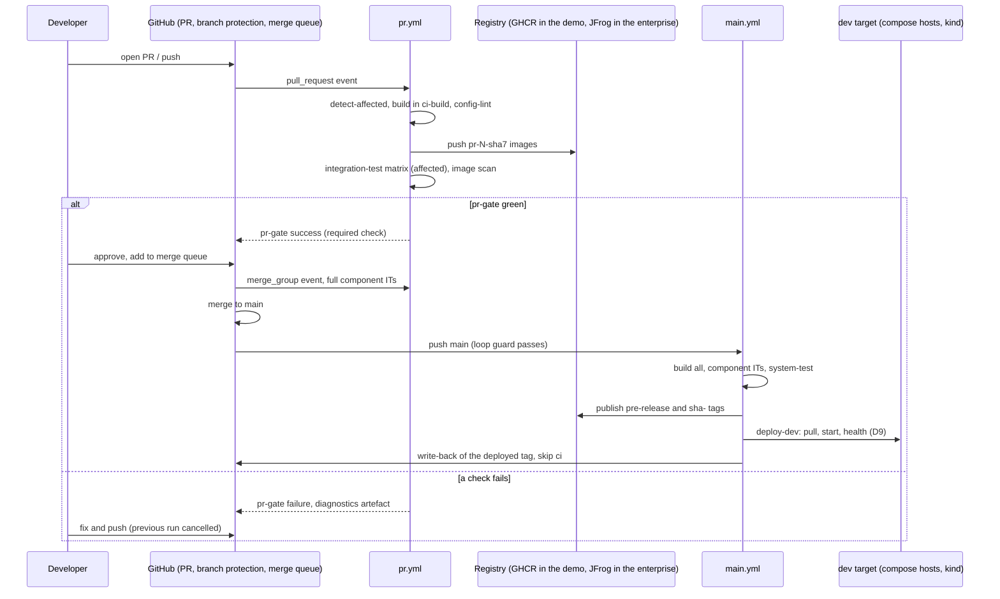

# D7 — CI pipeline: GitHub Actions to JFrog

| | |
|---|---|
| Document | D7 |
| Status | Draft v1 (phase 1) |
| Date | 2026-09-26 |
| Source brief | TODO.md v0.8, §5.9 (with §2.2, §4, §5.4, §5.11, §5.12, §6, §7) |
| Related | D1 (`docs/01-repository-and-build.md`), D3 (`docs/03-docker-images.md`), D4 (`docs/04-versioning-and-image-tagging.md`), D5 (`docs/05-configuration-management.md`), D8 (`docs/08-integration-testing.md`), D9 (`docs/09-cd-and-release-management.md`), D10 (`docs/10-containerised-ci-execution.md`), D11 (`docs/11-kubernetes-packaging-and-gitops.md`) |

## 1. Purpose and scope

This document defines the GitHub Actions pipeline of the monorepo: which workflows exist, what
triggers them, which jobs they run, which gates protect `main`, and what they publish to the
registry and the Maven repository. Its central artefact is the **test tiers by trigger** table
(§5.3), which fixes how much testing each kind of git event buys.

Boundaries:

- D10 (`docs/10-containerised-ci-execution.md`) owns how a job executes: the `ci-build` container,
  the compose stack lifecycle, the Deephaven server in CI, teardown and leak check. D7 only places
  those jobs in workflows.
- D8 (`docs/08-integration-testing.md`) owns test levels, test content, test data and the harness.
  D7 decides when each level runs.
- D9 (`docs/09-cd-and-release-management.md`) owns what `deploy-dev` does and how qa / prod are
  promoted. D7 shows where `deploy-dev` sits in `main.yml`.
- D4 (`docs/04-versioning-and-image-tagging.md`) owns version computation and the tag scheme; D7
  applies the tags at publish time.

## 2. Context and constraints

Decided facts:

- **GitHub-hosted runners** (`ubuntu-latest`) run every demo workflow (DL-17, DL-25). No self-hosted
  runner is required; the one allowed exception is a runner on a dev compose host (DL-35).
- **docker compose is the only integration-test stack mechanism** in the demo workflows (DL-15,
  DL-24). No Testcontainers and no Kubernetes in the demo's test jobs; kind appears in Demo step 2
  (kind + Helm) for the Helm deployment test only (DL-32).
- **GHCR** stands in for JFrog Artifactory in the demo. The enterprise pipeline publishes to
  Artifactory (Docker and Maven repositories, Xray if available) and resolves every dependency and
  base image through JFrog remotes (§2.2 of the brief).
- **Merge to `main` auto-deploys to the dev targets** through a `deploy-dev` job at the end of
  `main.yml` (GitHub Environment `dev`, no reviewers). qa and prod are PR-gated and never touched by
  `main.yml` (§5.12, DL-09).
- **One Gradle monorepo** (DL-01): one pipeline with affected-subproject detection; `main` builds
  everything.
- Java 21, Spring Boot 4.1 (DL-23); the version is derived from git, never from a file (§2.2).

Enterprise constraints that shape the recommendations: runners have no direct internet (Gradle
plugins, dependencies, base and test images come through JFrog remotes); the enterprise CA must be
trusted by Gradle, `docker`, `curl` and `jf` in CI (D3); Docker and Podman parity for test stacks
(DL-19); the SQL Server test image is amd64-only, so CI stays amd64 (§5.3).

Phasing: everything here belongs to **Demo step 1 (compose)** unless labelled otherwise. **Demo
step 2 (kind + Helm)** adds the `kind-deploy` job and `helm lint` / `helm template` to config-lint.
**Phase 3 (EKS + GitOps)** replaces `deploy-dev`'s `helm upgrade` with an Argo CD sync and may move
the runners to ARC on EKS.

## 3. Requirements

| §5.9 "Must answer" | Answered in |
|---|---|
| Execution model: build, unit and integration tests inside containers with an ephemeral Deephaven server, torn down after every run | §2; D10 (`docs/10-containerised-ci-execution.md`) — D7 only places the jobs (§5.2) |
| Workflow set: `pr.yml`, `main.yml`, `release.yml`, `nightly.yml`, `base-image.yml`, `config-lint` | §5.1, §6.1 |
| Structure: reusable workflows per concern + composite actions; matrix from a "detect affected" job | §4.1, §5.2, §6.2, §6.3 |
| Runners: GitHub-hosted for the demo; GitHub-hosted vs ARC on EKS for the enterprise | §2, §4.7, §5.9 |
| Authentication to JFrog: OIDC over static tokens; `jf` CLI for build-info and Xray; `maven-publish` for `connectors-framework` | §4.4, §5.7, §6.8 |
| Caching: Gradle, Docker layer cache | §4.5, §5.8, §6.7 |
| Concurrency groups and cancellation, required status checks, branch protection, CODEOWNERS | §5.6, §6.5, §6.6 |
| Quality gates | §5.5, §6.4 |
| Outputs: JUnit summaries, image digests as job outputs, SBOM, build-info | §6.9 |
| Gating of ITs on PRs (label vs always) and time budget | §4.3, §5.3, §5.4 |

## 4. Options considered

### 4.1 Workflow structure

| Option | Pros | Cons | When to prefer |
|---|---|---|---|
| One self-contained YAML per trigger, steps inlined | readable top to bottom; no indirection | the same fifteen steps copied into five files; PR and `main` behaviour drift apart | a single-app repository with one workflow |
| **Reusable workflows (`workflow_call`) per concern + composite actions for step groups** | one implementation of build / IT / publish shared by pr, main, release and nightly; inputs make the differences explicit; composite actions keep set-up (JDK, registry login, CA) identical everywhere | two levels of indirection; limited nesting depth; outputs must be declared explicitly | a monorepo where several triggers run the same job set with different parameters — this case |
| Composite actions only | simple mental model; steps stay in the caller | jobs (matrix, `needs`, `container:`) cannot be shared, only steps | when job topology differs per workflow but steps are common |

### 4.2 Affected-subproject detection

| Option | Pros | Cons | When to prefer |
|---|---|---|---|
| **Path filters → checked-in map of path globs to Gradle projects; shared paths map to "all"** | transparent, seconds to run, no Gradle start-up; auditable in one small file | must follow the tree; coarse (a comment change rebuilds the app) | small project families (three apps, one framework) — this case |
| Gradle-native detection from the project graph (`git diff` → changed projects → dependants) | precise; follows the real dependency graph | needs the Gradle configuration phase in the detect job; a custom plugin to maintain | dozens of subprojects with a deep graph |
| Always build and test everything | no detection logic | the PR budget is spent on SQL Server + Deephaven stacks for every app on every push | tiny repositories, or `main`, where "everything" is the policy anyway |

### 4.3 Integration tests on pull requests

| Option | Pros | Cons | When to prefer |
|---|---|---|---|
| Full IT suite on every PR push | maximum confidence before merge | 30–45 min per push; runner minutes and licence-bound images (AMPS) spent on work-in-progress commits | very small suites |
| Label-triggered only (`ci:full`) | cheap by default | integration breaks surface on `main`, after the author has moved on; label discipline decays | throwaway prototypes |
| **Affected component ITs by default; full suite when shared code changes; `ci:full` label to force; docs-only skips** | proportionate: a connector change tests that connector, a framework or build-logic change tests everything; deterministic and explainable | needs the affected map and a shared-paths list, reviewed when the tree changes | a monorepo with a shared framework — this case |

### 4.4 Authentication from CI to the registry / JFrog (DL-18)

| Option | Pros | Cons | When to prefer |
|---|---|---|---|
| Static access token in a GitHub secret | works with any Artifactory edition | long-lived credential in GitHub; manual rotation; one token, one blast radius | an Artifactory edition without OIDC (confirm in §8) |
| **GitHub OIDC → Artifactory identity mapping** | no stored secret; permissions scoped per workflow / ref through claims (`repository`, `ref`, `environment`); audit trail per run | the OIDC provider and claim → permission mappings must be configured and maintained in Artifactory | the enterprise pipeline, whenever the edition supports it |
| Demo: `GITHUB_TOKEN` with `packages: write` to GHCR | zero configuration | GHCR only; not the enterprise path | the demo (stand-in registry) |

### 4.5 Caching

| Option | Pros | Cons | When to prefer |
|---|---|---|---|
| **Gradle user home through `gradle/actions/setup-gradle`** (GitHub cache backend) | official; restores dependency and build caches keyed on the catalog and build scripts; works inside a job container | shares the 10 GB per-repository cache quota (verify) with everything else; cold restore takes time | every Gradle job |
| Remote Gradle build cache node (HTTP) in the enterprise | task outputs shared between CI and developers; big wins on `main` | one more service to run and secure | when a build cache node exists (§5.1 of the brief) |
| Docker layer cache: buildx `type=gha` | no extra infrastructure | counts against the same quota; evicted under pressure | PR image builds |
| **Docker layer cache: buildx `type=registry`** (GHCR in the demo, a JFrog cache repository in the enterprise) | persistent, shared across branches and runners; not bound by the Actions quota | one more repository to clean up (D4 retention) | `main` and nightly image builds; the enterprise |

### 4.6 Merging to `main`

| Option | Pros | Cons | When to prefer |
|---|---|---|---|
| Direct merge after required checks | simple | checks ran on the PR head, not on the merged result; two PRs green in isolation can break `main` together — and `main` auto-deploys to dev | low merge rate |
| **Merge queue** (`merge_group` event runs the full component IT tier on the speculative merge) | `main` only receives commits whose actual merge result passed; batches PRs | `merge_group` must be a trigger of `pr.yml`; queue latency; availability depends on the GitHub plan (verify) | whenever available — `main` is a deploy trigger here |

### 4.7 Runners for the enterprise pipeline (DL-17, beyond the demo)

| Option | Pros | Cons | When to prefer |
|---|---|---|---|
| GitHub-hosted standard | nothing to operate; ephemeral by nature (teardown backstop) | no reach into the enterprise network (JFrog, Vault, AMPS, dev cluster) unless exposed; standard-class memory is tight for Deephaven + SQL Server (measure, D10 §5.8) | the demo; repositories without enterprise dependencies |
| GitHub-hosted larger runners | more memory and CPU for IT stacks; still ephemeral | paid feature; network reach unchanged | when the standard class is measured too small |
| **Self-hosted ephemeral runners: ARC on EKS** (`dind` mode so compose runs unchanged) | network reach to JFrog / Vault / dev cluster; CA pre-installed; ephemeral pods; capacity for ITs | a platform component to operate; nested containers and their security review | the enterprise pipeline — Phase 3 (EKS + GitOps) |

### 4.8 What a release tag builds on

| Option | Pros | Cons | When to prefer |
|---|---|---|---|
| **Reuse the `main` run of the same commit: retag / promote the digests already tested** | promote, never rebuild (§5.4 of the brief); a release takes minutes | needs the commit → digest mapping (`sha-<sha7>` tag, OCI labels); a tag on a commit `main.yml` never tested must be refused | the normal release path |
| Rerun build + system IT against the release images | independent of earlier runs | a rebuild is a new digest unless the build is reproducible; 30–45 min | a tag that is not on a tested `main` commit (hotfix branch), or when policy demands it |

## 5. Recommendation and rationale

### 5.1 Workflow set

| Workflow | Trigger | Jobs | Publishes | Phase |
|---|---|---|---|---|
| `pr.yml` | `push` to any branch except `main`; `pull_request` (opened, synchronize, reopened, labeled); `merge_group` | `detect-affected`, `build` (compile, unit tests, static analysis, jars, images), `config-lint`, `integration-test` matrix (PR and merge queue only), `pr-gate` | images `pr-<n>-<sha7>` to the dev repository (GHCR in the demo); test reports | Demo step 1 (compose) |
| `main.yml` | `push` to `main`; loop guard excludes bot write-backs (DL-36) | `build` (all), `integration-test` (all), `system-test`, `publish`, `deploy-dev`; Demo step 2 inserts `kind-deploy` before `deploy-dev` | pre-release image tags + `sha-<sha7>` (D4); `connectors-framework` jar to the Maven dev repository if consumed elsewhere (§8); SBOM + build-info; GitHub Deployment on `dev` | Demo step 1 / 2 |
| `release.yml` | `push` of tag `v*` or `deephaven-server/v*`, plus `workflow_dispatch` from `release-please.yml` (a tag created with `GITHUB_TOKEN` starts no workflow, so release-please dispatches it explicitly); it waits for the `main.yml` run of the tagged commit and retags its tested digests | `resolve` (find the tested `main` run and its digests), `promote` (retag / promote), `release` (GitHub Release + changelog), `bump-qa` (bot PR), `smoke` (dev, then qa after the bump PR merges) | release tags `1.4.2`, promoted digests, GitHub Release, qa bump PR | Demo step 1 (compose) |
| `nightly.yml` | `schedule` (one run per night) + `workflow_dispatch` | full IT matrix, Deephaven version matrix, AMPS suite, Podman parity, soak, security scans, image retention, teardown drill | scan reports, retention log, issue on failure | Demo step 1 (subset) |
| `base-image.yml` | weekly `schedule`; `push` to the base-image Dockerfiles; `workflow_dispatch` with a CA-bundle version (rotation) | build, scan and push the company JRE base image (DL-13) and the `ci-build` image (DL-28) | base images to the tools repository | Demo step 1 (compose) |
| `config-lint.yml` | `workflow_call` from `pr.yml` and `main.yml`; also `pull_request` on `config/**`, `**/helm/**`, `**/docker/docker-compose.yml` | render every instance (`docker compose config`; `helm lint` / `helm template` in step 2), naming regex / length / uniqueness, key-set parity dev vs qa vs prod (rules in D5) | lint report | Demo step 1 / 2 |

The brief placed `config-lint.yml` "in the config repo". With DL-06 the config tree lives in this
monorepo, so `config-lint.yml` is a reusable workflow here and moves with `config/` if the tree is
ever split out.

### 5.2 Structure

Reusable workflows per concern under `.github/workflows/`, prefixed `_` so they are visibly not
entry points: `_gradle-build.yml`, `_integration-test.yml`, `_docker-publish.yml`,
`_deploy-dev.yml` (content owned by D9), plus `config-lint.yml`. Composite actions under
`.github/actions/` for step groups that must be identical everywhere: `setup-build-env`,
`registry-login`, `compose-stack` (mechanics owned by D10) and `affected-matrix`.

`detect-affected` runs first in `pr.yml` and emits `matrix` (JSON list of Gradle project paths),
`full` and `docs-only`; every later job consumes them. On `main` the matrix is always the full list.

### 5.3 Test tiers by trigger

| Trigger | What runs | Containers | Budget |
|---|---|---|---|
| **Every push to any branch** | compile, unit tests, static analysis, formatting, config lint, hadolint, ShellCheck, secret scan | none | under 10 min |
| **Pull request** (every push; cancel-in-progress) | the push tier, plus **component integration tests for the affected subprojects only**, each with just the dependencies it needs plus Deephaven; the **full component IT suite when shared code changes** (`connectors-framework`, `build-logic`, the version catalog, any `Dockerfile`, `test-infra/`); label `ci:full` forces the full suite; **docs-only changes skip** builds and tests | one compose stack per affected subproject (D10) | 15–20 min |
| **Merge to `main`** (ideally via merge queue) | full build, full component ITs, the **full system integration test with the images built in this run and Deephaven**, publish pre-release images, then **`deploy-dev`** | full stacks with our images | 30–45 min |
| **Nightly** | everything too slow, expensive or licence-bound for the merge path: full matrix regardless of change, soak, newer Deephaven versions, AMPS if licence-limited, Podman parity, security scans, image retention, teardown drill | full stacks and their variants | hours; nobody waits for it |
| **Release tag** | reuse the `main` results for the same commit (retag / promote) or rerun against the release images (§4.8); **post-deploy smoke in dev and qa** | none started; smoke targets running instances | 10–15 min (+30–45 with a rerun) |

Why not the full suite on every commit: every IT stack pays for a roughly 2 GB SQL Server pull and
its slow start plus a Deephaven start; three apps × every work-in-progress push spends runner
minutes and licence-bound images (AMPS) on feedback nobody asked for, and a standard runner cannot
host several stacks at once. Affected detection keeps the PR budget at 15–20 minutes while
shared-code changes still get everything.

Why not nightly only: `main` auto-deploys to dev on merge, so `main` must be proven with the built
images *before* `deploy-dev` runs — that gate cannot wait for the night. A red nightly also has to
be bisected across a day of merges by people who have moved on; a red PR check lands on the author
while the context is fresh.

### 5.4 Affected detection rules

1. `detect-affected` diffs the PR head against the merge base (`pull_request`, `merge_group`) or the
   previous `main` commit (`push`) and maps changed paths with the table in §6.3.
2. Any change in the **shared set** (`deephaven-connectors/connectors-framework/**`, `build-logic/**`,
   `gradle/**`, `settings.gradle.kts`, `build.gradle.kts`, `**/Dockerfile`, `test-infra/**`,
   `.github/**`) sets `full=true`.
3. Label `ci:full` sets `full=true`. A `ci:skip-it` label is deliberately not offered: a PR that
   cannot afford its ITs is not ready.
4. If every changed path is under `docs/**` or is a `*.md`, all build and test jobs are skipped and
   `pr-gate` passes with a "docs-only" summary.
5. `config/**` changes alone run `config-lint` and the push tier; no image build (DL-06 guard-rail).
   On `main` they still trigger `deploy-dev` (D9).

### 5.5 Quality gates

Everything that needs no container runs in the push tier inside the `build` job (§6.4). Image
scanning (Xray in the enterprise; a Trivy-style scanner in the demo (verify)) runs once images exist:
PR images fail the gate only on critical findings with a fix available; `main` and nightly enforce
the full policy. Coverage is a threshold per subproject enforced by the Gradle build (D1), not by an
external service, so the gate is identical locally and in CI.

### 5.6 Required checks, concurrency, protection

- The **only required status check** on `main` is `pr-gate`: a fan-in job that `needs:` every other
  job, runs with `if: always()` and fails when any dependency failed or was cancelled. Matrix shapes
  can change without touching branch protection.
- Branch protection on `main`: pull request required, `pr-gate` required, stale approvals dismissed,
  CODEOWNERS review required (`config/**` prod paths owned by ops; `build-logic/**` and `.github/**`
  by the platform team), linear history, merge queue when available (§4.6).
- Concurrency: PR runs cancel the previous run of the same PR; `main` runs never cancel each other
  (they queue — a cancelled `deploy-dev` is worse than a late one); `deploy-dev` additionally
  serialises on the environment (§6.6).
- `timeout-minutes` on every job (D10) so a hung stack releases the runner.

### 5.7 Publishing

- **PR**: `build` pushes `pr-<n>-<sha7>` images to the dev repository so the `integration-test`
  matrix pulls exactly the digest it built (digests flow as job outputs, §6.9). Retention: deleted
  after PR close + 7 days (D4). If pushing from PRs is unwanted, the alternative is `docker save` →
  workflow artefact → `docker load` (slower; roughly 200 MB per image).
- **main**: pre-release tag per D4 plus `sha-<sha7>`; `connectors-framework` published with
  `maven-publish` to the Maven dev repository only if another repository consumes it (§8);
  build-info via `jf rt build-publish` and one SBOM per image in the enterprise.
- **Release**: the same digests are retagged / promoted (`docker-dev-local → docker-qa-local` on
  the tag; `→ docker-prod-local` from the approved prod job, D9). Nothing is rebuilt.
- Demo: all of the above against GHCR with `GITHUB_TOKEN`; "promotion" is a retag, because GHCR
  has no repository promotion.

### 5.8 Caching

Gradle user home through `gradle/actions/setup-gradle` in every Gradle job (cache written on
`main`, read-only elsewhere); Docker layer cache in the registry (`type=registry`) for `main` and
nightly and `type=gha` for PRs. Dependency-image pre-pull and runner sizing are D10's (§5.7 and §5.8
there). Keys in §6.7.

### 5.9 Runners

GitHub-hosted `ubuntu-latest` for the demo and for any repository that needs no enterprise network
reach. For the enterprise pipeline recommend **ARC on EKS with ephemeral runners** in Phase 3 (EKS +
GitOps): JFrog, Vault, the dev cluster and AMPS are reachable only from inside, and ephemeral pods
keep the teardown backstop (D10 §5.4). Larger GitHub-hosted runners are the fallback when memory,
not network reach, is the limit.

## 6. Conventions

### 6.1 Workflow files and triggers

| File | `on:` (illustrative) | Concurrency group | `timeout-minutes` |
|---|---|---|---|
| `.github/workflows/pr.yml` | `push: branches-ignore: [main, 'hotfix/**', 'gh-readonly-queue/**']`; `pull_request: types: [opened, synchronize, reopened, labeled]`; `merge_group` | `pr-${{ github.event.pull_request.number \|\| github.ref }}`, cancel-in-progress `true` | build 25, IT 30 |
| `.github/workflows/main.yml` | `push: branches: [main]` | `main`, cancel-in-progress `false` | build 25, system-test 45, deploy-dev 20 |
| `.github/workflows/release.yml` | `push: tags: ['v*', '*/v*']` | `release-${{ github.ref }}` | 30 |
| `.github/workflows/nightly.yml` | `schedule: [{cron: ...}]`, `workflow_dispatch` | `nightly` | per job, at most 120 |
| `.github/workflows/base-image.yml` | weekly `schedule`; `push: paths: [docker/base/**]`; `workflow_dispatch: inputs: ca-bundle-version` | `base-image` | 30 |
| `.github/workflows/config-lint.yml` | `workflow_call`; `pull_request: paths: [config/**, '**/helm/**', '**/docker/docker-compose.yml']` | inherits the caller's | 10 |

### 6.2 Reusable workflows and composite actions

| Unit | Path | Inputs → outputs |
|---|---|---|
| Gradle build | `.github/workflows/_gradle-build.yml` | `projects` (JSON), `publish-images`, `tag-kind` (`pr` / `prerelease`) → `projects`, `images` (JSON `project → digest`) |
| Integration test | `.github/workflows/_integration-test.yml` | `project`, `images`, `deephaven-image`, `level` (`component` / `system`) → report artefact name |
| Publish | `.github/workflows/_docker-publish.yml` | `digests`, `tags` (D4) → `tag`, published references |
| Deploy dev | `.github/workflows/_deploy-dev.yml` (D9) | `env` (`us-dev`), `tag` → deployment URL, write-back commit |
| Set-up | `.github/actions/setup-build-env/action.yml` | Gradle cache, CA bundle for `curl` / `jf`; JDK only when the job is not in `ci-build` |
| Registry login | `.github/actions/registry-login/action.yml` | `registry` (`ghcr.io` / `artifactory.<company>.com`), `mode` (`token` / `oidc`) |
| Compose stack | `.github/actions/compose-stack/action.yml` | `command` (`up` / `diagnostics` / `down` / `leak-check`), `project` — semantics in D10 §6 |
| Affected matrix | `.github/actions/affected-matrix/action.yml` | `base-ref` → `matrix`, `full`, `docs-only` |

### 6.3 Path → Gradle project map (`.github/affected-map.yml`, illustrative)

| Path glob | Gradle project(s) |
|---|---|
| `deephaven-connectors/source-kafka/**` | `:deephaven-connectors:source-kafka` |
| `deephaven-connectors/source-amps/**` | `:deephaven-connectors:source-amps` |
| `deephaven-connectors/source-database/**` | `:deephaven-connectors:source-database` |
| `deephaven-server/**` | `:deephaven-server` |
| `deephaven-connectors/connectors-framework/**`, `build-logic/**`, `gradle/**`, `*.gradle.kts`, `**/Dockerfile`, `test-infra/**`, `.github/**` | **all** (`full=true`) |
| `config/**` | `config-lint` only |
| `docs/**`, `**/*.md` | none (`docs-only`) |

### 6.4 Quality gates

| Gate | Tool (plugin choice confirmed in D1) | Runs in | Blocking |
|---|---|---|---|
| Compile + unit tests | Gradle `build` (`check` without ITs) | push tier | yes |
| Coverage threshold | JaCoCo verification per subproject | push tier | yes |
| Formatting | Spotless `check` | push tier | yes |
| Static analysis | Error Prone / Checkstyle through the convention plugin | push tier | yes |
| Dependency vulnerabilities | Xray (enterprise) / dependency scanner (demo) | push tier (report), `main` (gate) | critical only on PR |
| Dockerfile lint | hadolint | push tier | yes |
| Shell lint | ShellCheck on `scripts/**`, `test-infra/**/*.sh`, `.github/**/*.sh` | push tier | yes |
| Secret scan | gitleaks-style scan + GitHub secret scanning | push tier | yes |
| Licence check | Gradle licence report / Xray policy | `main`, nightly | policy-defined |
| Config lint | `config-lint.yml` (D5 rules) | push tier | yes |
| Image scan | Xray / Trivy-style on built images | after `build` | critical-with-fix on PR; full on `main` |

### 6.5 Job names and required checks

| Job id | Display name | Required on `main` |
|---|---|---|
| `detect-affected` | `detect affected` | no |
| `build` | `build (all)` or `build (:deephaven-connectors:source-database)` | no (covered by the gate) |
| `config-lint` | `config lint` | no (covered by the gate) |
| `integration-test` | `it (source-database)` | no (covered by the gate) |
| `pr-gate` | `pr gate` | **yes — the only required check** |
| `push-gate` | `push gate` | no — the fan-in of a plain branch push; deliberately a different name so a push result can never satisfy or hide `pr-gate` |

### 6.6 Concurrency and environments

| Scope | Group | Cancel in progress |
|---|---|---|
| PR checks | `pr-<PR number>` (or `pr-<ref>` for a plain push) | yes |
| `main` pipeline | `main` | no (queue) |
| Deploy to dev | `deploy-us-dev`; GitHub Environment `dev`, no reviewers | no |
| Release | `release-<tag>` | no |
| Nightly | `nightly` | no |

### 6.7 Cache keys

| Cache | Key | Scope |
|---|---|---|
| Gradle user home | managed by `setup-gradle`: hash of `gradle/libs.versions.toml`, `**/*.gradle.kts`, `gradle/wrapper/**` | written on `main`, read-only elsewhere |
| Docker layers (PR) | buildx `type=gha,scope=<project>` | per subproject |
| Docker layers (`main`, nightly) | `type=registry,ref=<registry>/<repo>/<project>:buildcache,mode=max` | shared |

### 6.8 Registry and JFrog identities (enterprise; the demo uses GHCR with `GITHUB_TOKEN`)

| Purpose | Repository | Who may write |
|---|---|---|
| PR and pre-release images | `artifactory.<company>.com/docker-dev-local/deephaven-connectors/<AppName>` | OIDC identities `gha-<repo>-pr` (`pr-*` tags only) and `gha-<repo>-main` |
| Promoted images | `docker-qa-local`, `docker-prod-local` | `gha-<repo>-release`; prod promotion only from the approved prod job (D9) |
| Base and build images | `docker-base-local/<company>/jre21`, `docker-base-local/<company>/ci-build` (D3 §6.1) | `base-image.yml` identity |
| Gradle / Maven | virtual repository (read); `maven-dev-local` (write from `main`) | `gha-<repo>-main` |
| Test data | `generic-testdata-local` (D8) | data owners write; CI reads |
| Layer cache | `docker-cache-local` | all workflow identities |

### 6.9 Outputs and artefacts

| Output | Mechanism | Retention |
|---|---|---|
| JUnit XML | `**/build/test-results/**` uploaded per job; summarised into the job summary | 7 days (PR), 30 days (`main`) |
| Image digests | job output `images` (JSON `project → sha256`), consumed by `integration-test`, `system-test`, `publish`, `deploy-dev` | run lifetime |
| Diagnostics bundle | `it-diagnostics-<run_id>-<index>` (D10 §6.5) | 7 days |
| SBOM | one per image, attached to the GitHub Release; build-info via `jf` in the enterprise | with the release |
| Deployment record | GitHub Deployment on Environment `dev` + write-back commit (D9) | permanent |

### 6.10 Illustrative `main.yml` job skeleton

```yaml
name: main
on:
  push: { branches: [main] }
concurrency: { group: main, cancel-in-progress: false }
permissions: { contents: read, packages: write, id-token: write }
jobs:
  build:
    if: github.actor != 'github-actions[bot]'        # loop guard — demo bot identity (a GitHub App in the enterprise); the write-back also carries [skip ci] (DL-36)
    uses: ./.github/workflows/_gradle-build.yml
    with: { projects: all, publish-images: true, tag-kind: prerelease }
  config-lint:
    uses: ./.github/workflows/config-lint.yml
  integration-test:
    needs: build
    strategy: { fail-fast: false, matrix: { project: "${{ fromJson(needs.build.outputs.projects) }}" } }
    uses: ./.github/workflows/_integration-test.yml
    with: { project: "${{ matrix.project }}", images: "${{ needs.build.outputs.images }}", level: component }
  system-test:
    needs: [build, integration-test]
    uses: ./.github/workflows/_integration-test.yml
    with: { project: ":deephaven-connectors:source-database", images: "${{ needs.build.outputs.images }}", level: system }
  publish:
    needs: [system-test, config-lint]
    uses: ./.github/workflows/_docker-publish.yml
    with: { digests: "${{ needs.build.outputs.images }}", tags: prerelease }   # tag scheme from D4
  # kind-deploy:  Demo step 2 — needs: publish; helm lint, helm upgrade --install per AppInstance into kind, smoke, delete (D11)
  deploy-dev:
    needs: publish
    uses: ./.github/workflows/_deploy-dev.yml           # content owned by D9
    with: { env: us-dev, tag: "${{ needs.publish.outputs.tag }}" }
    secrets: inherit
```

## 7. Diagrams

### 7.1 Structural — workflow topology



*Figure 1 — Workflow topology: triggers, entry workflows, reusable workflows and the artefacts they produce.*

Five entry workflows share four reusable workflows, so the build, IT and publish logic exists once.
Only `main.yml` reaches `_deploy-dev.yml`; `release.yml` publishes by promoting digests that
`main.yml` already produced and tested.

### 7.2 Flow — PR checks



*Figure 2 — PR checks: the push tier always runs; the component IT tier runs only for pull requests and merge-queue groups, sized by affected detection.*

A plain push to a branch gets the sub-10-minute tier and nothing else. Opening the PR adds the
component ITs for the affected subprojects, or for everything when shared code changed or the
`ci:full` label is set; `pr-gate` is the single required check that fans all of it in.

### 7.3 Flow — main build



*Figure 3 — `main.yml`: the loop guard, the full test tiers, publication and the automatic dev deployment.*

Nothing is published before the system test has passed against the images built in the same run,
and `deploy-dev` only starts after publication, so dev never receives an untested image. The
write-back commit is excluded by the loop guard, so the workflow does not trigger itself (DL-36).

### 7.4 Flow — nightly



*Figure 4 — Nightly: independent jobs that are too slow, expensive or licence-bound for the merge path.*

Every nightly job is independent, so one red job does not hide the others. The teardown drill keeps
D10's guarantee honest: it fails a test on purpose and cancels a job on purpose, and both must leave
the runner clean.

### 7.5 Sequence — PR → checks → merge → main build → publish → deploy-dev



*Figure 5 — From a pull request to a running dev deployment, with the failure path.*

The merge queue re-runs the component ITs on the actual merge result before `main` moves, so
`main.yml` rarely fails on integration. The write-back at the end is the only commit `main.yml`
makes, and it is the one commit that does not trigger another run.

## 8. How the demo skeleton implements it

| Item | Location | Phase |
|---|---|---|
| Entry workflows | `.github/workflows/pr.yml`, `main.yml`, `release.yml`, `nightly.yml`, `base-image.yml`, `config-lint.yml` | Demo step 1 (compose); `kind-deploy` job and Helm checks in Demo step 2 (kind + Helm) |
| Reusable workflows | `.github/workflows/_gradle-build.yml`, `_integration-test.yml`, `_docker-publish.yml`, `_deploy-dev.yml` | Demo step 1 (compose) |
| Composite actions | `.github/actions/{setup-build-env,registry-login,compose-stack,affected-matrix}/action.yml` | Demo step 1 (compose) |
| Affected map | `.github/affected-map.yml` | Demo step 1 (compose) |
| Ownership | `.github/CODEOWNERS` (`config/**` prod paths → ops; `build-logic/**`, `.github/**` → platform) | Demo step 1 (compose) |
| Registry | GHCR via `GITHUB_TOKEN` (`packages: write`); `registry-login` has an `oidc` mode ready for Artifactory | Demo step 1 (compose); OIDC in the enterprise |
| Build environment | `container: ghcr.io/<org>/base/ci-build:<tag>` on the `build` job (DL-28 leaning; D10 §5.2; image content in D3 §6.10) | Demo step 1 (compose) |
| Dev deployment | `deploy-dev` job under Environment `dev`, adapter per `config/us-dev/targets.yml` (D9) | Demo step 1 (compose): `run-compose.sh` on the compose hosts (placeholder in the demo: `--dry-run` on the runner plus a `TODO(DL-35)` comment, D9 §6.4); Demo step 2 (kind + Helm): `helm upgrade --install`; Phase 3 (EKS + GitOps): Argo CD sync |
| Retention | nightly job calling the GHCR package API (demo) / `jf` cleanup (enterprise), rules from D4 | Demo step 1 (compose) |

## 9. Open items

> **Update 2026-09-26 (brief v1.0):** DL-03, DL-04, DL-05, DL-14, DL-27, DL-28, DL-35, DL-36 referenced below were decided as recommended in this
> document; their ADRs in `docs/adr/` are now Accepted. The remaining rows are unchanged.

| Item | Depends on |
|---|---|
| OIDC to Artifactory vs static token; edition support | DL-18; §8 "JFrog: Artifactory edition, Xray, OIDC support" |
| Tag scheme applied by `publish` and `release.yml`; lockstep vs independent tag format (`v*` vs `<subproject>/v*`) | DL-03, DL-04, DL-05 |
| `ci-build` image for the `build` job vs `setup-java` on the host | DL-28 (leaning `ci-build`; D10) |
| Teardown layers and leak check inside `_integration-test.yml` | DL-27 (D10) |
| Which Deephaven image the PR tier tests: upstream or our `deephaven-server` image | DL-26; §8 "Must our `deephaven-server` image be under test on every PR" |
| Podman parity job scope | DL-19 |
| Loop guard mechanics for the write-back | DL-36 (D9) |
| How `deploy-dev` reaches the compose hosts | DL-35 (D9) |
| Enterprise runners: ARC on EKS, network reach to JFrog / dev cluster | DL-17; §8 "CI runners" |
| Image build tool (buildx vs Jib) affecting the layer cache | DL-14 (D3) |
| Merge queue availability; GitHub Enterprise Cloud or Server | §8 "GitHub Enterprise Cloud or Server?" |
| AMPS licence for CI (nightly AMPS suite vs contract tests) | §8 "AMPS licence terms" (D8) |
| Whether other repositories consume `connectors-framework` (Maven publishing) | §8 "Do other repositories consume `connectors-framework`?" |
| Compliance: SBOM, signing, audit retention of test evidence | §8 "Compliance" |
