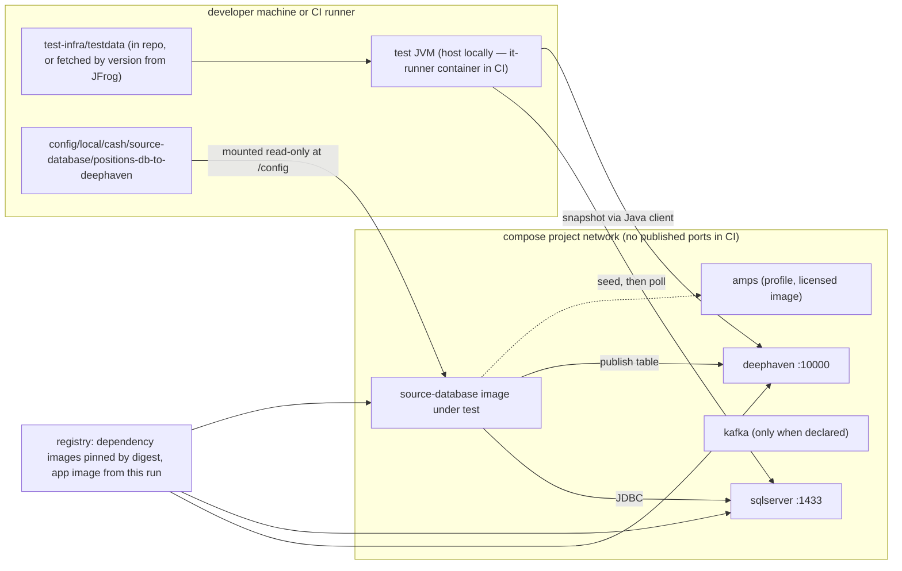
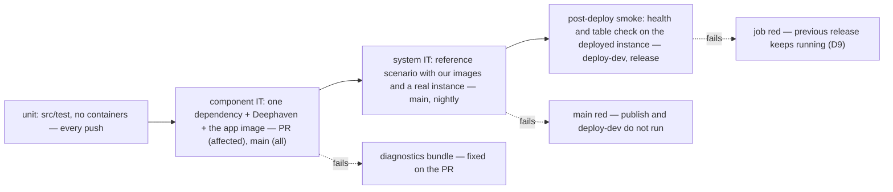
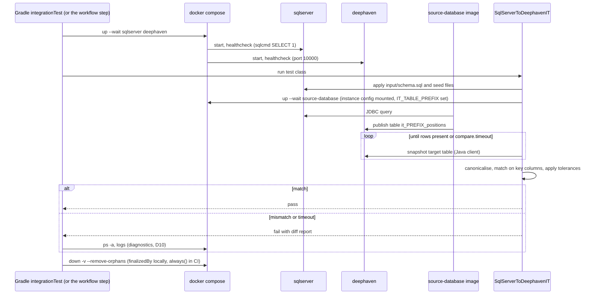

# D8 — Integration testing

| | |
|---|---|
| Document | D8 |
| Status | Draft v1 (phase 1) |
| Date | 2026-09-26 |
| Source brief | TODO.md v0.8, §5.10 (with §2.4, §4, §5.3, §5.11, §5.12, §6, §7) |
| Related | D1 (`docs/01-repository-and-build.md`), D3 (`docs/03-docker-images.md`), D5 (`docs/05-configuration-management.md`), D6 (`docs/06-runtime-operations.md`), D7 (`docs/07-ci-pipeline-github-actions.md`), D9 (`docs/09-cd-and-release-management.md`), D10 (`docs/10-containerised-ci-execution.md`) |

## 1. Purpose and scope

This document defines what the integration tests are and how they are written: the test levels
from unit test to post-deploy smoke, the reference scenario, the dependency images and their
constraints, the test-data layout and versioning, the expected-output comparison rules, the
speed and cost budget, and the reuse of the `test-infra/compose/` stacks for local development.

Boundaries:

- D10 (`docs/10-containerised-ci-execution.md`) owns the CI-side lifecycle: runner class, the
  `ci-build` container, how the compose stack is started and torn down, the Deephaven server
  profile in CI, diagnostics and the leak check.
- D7 (`docs/07-ci-pipeline-github-actions.md`) owns which level runs on which trigger (its "test
  tiers by trigger" table) and the PR time budget.
- D6 (`docs/06-runtime-operations.md`) owns `run-compose.sh`; D9 owns the post-deploy smoke test's
  place in `deploy-dev`; D5 owns the config tree the tests mount.

## 2. Context and constraints

Decided facts:

- **Demo harness: a docker compose stack per test suite**, started and stopped by the workflow or
  by the Gradle compose lifecycle, so `./gradlew integrationTest` does the same locally. Tests reach
  services by compose service name. **Testcontainers is not used in the demo**; it stays an option
  for component ITs later (DL-15).
- **No git submodules** for test data (DL-01). The remaining options (DL-16) are a second-repo
  checkout in CI or a versioned artefact in a JFrog generic repository; the leaning is the JFrog
  artefact.
- **Reference scenario**: SQL Server → `source-database` → AMPS / Deephaven, with the connector
  **image** under test, not just its classes (§5.10). The demo's end-to-end IT is SQL Server →
  `source-database` → Deephaven (or a stub target when neither Deephaven nor AMPS is available).
- Every dependency image is pulled through JFrog remotes in the enterprise (§5.11); the demo pulls
  from `ghcr.io` and `mcr.microsoft.com` directly, pinned by digest.
- Docker **and** Podman must run the stacks locally (DL-19); the SQL Server image is amd64-only, so
  CI and the stacks stay amd64 (§5.3).
- Vault is not in the demo (§4): the connector's DB password arrives as an environment variable
  behind the final Spring property name (D2).

Phasing: the levels and harness below are **Demo step 1 (compose)**. **Demo step 2 (kind + Helm)**
adds the post-deploy smoke test against the kind release (D11). **Phase 3 (EKS + GitOps)** may add
Testcontainers for single-dependency component ITs (DL-15) and system ITs in an ephemeral EKS
namespace (D10 §5.9).

## 3. Requirements

| §5.10 "Must answer" | Answered in |
|---|---|
| CI-side lifecycle (runner class, start-up, readiness, teardown, leak check) | D10 (`docs/10-containerised-ci-execution.md`); §5.6 here for the budget it must meet |
| Demo harness: compose stack per suite, workflow- or Gradle-driven; service names | §5.1, §5.7, §6.2 |
| Harness options: Testcontainers vs compose; Podman compatibility; runner topology | §4.1, §4.2; runner topology in D10 §4.1 |
| Dependency images and constraints (Kafka, Hazelcast, SQL Server, Deephaven, AMPS, Vault dev) | §4.5, §5.3, §6.4 |
| Test data: distribution, layout `testdata/<connector>/<case>/{input/, expected/, manifest.yml}`, versioning | §4.3, §5.4, §6.5 |
| Reference scenario (`source-database`) and the same shape for `source-kafka` and `source-amps` | §5.2, §7.3 |
| Test levels: unit → component IT → system IT → post-deploy smoke | §5.1, §6.1, §7.2 |
| Expected-output comparison (canonical JSON, ordering, timestamp tolerance) | §4.4, §5.5, §6.6 |
| Speed and cost: reuse, parallelism, pre-pull, PR budget | §5.6, §6.7 |
| `test-infra/compose/` reused for local development (`dev-up`) | §5.7, §6.3, §8 |

## 4. Options considered

### 4.1 Harness per test level (DL-15)

| Option | Pros | Cons | When to prefer |
|---|---|---|---|
| Testcontainers (JUnit 5) per test class | closest to the test code; random ports; Ryuk reaps | Ryuk needs socket access; Podman quirks; the connector *image* is awkward to wire in; not the demo's decision | later, for single-dependency component ITs of `connectors-framework` |
| Testcontainers `ComposeContainer` | compose files reused from the JVM | doubles the lifecycle owners (JVM and workflow); same socket and Podman caveats | rarely; when a test must own its stack |
| **Compose stack per suite, driven by the workflow or by Gradle** (decided for the demo) | identical locally and in CI; Docker and Podman; whole stacks including our images; one lifecycle owner per run | we own labels, project names and teardown (D10); a stack is shared by all classes of a suite, so tests must isolate their tables | the demo and every level that involves our images |

### 4.2 Who drives the compose lifecycle from Gradle

| Option | Pros | Cons | When to prefer |
|---|---|---|---|
| A third-party Gradle compose plugin (`composeUp` / `composeDown`) | ready-made tasks, service-port discovery | plugin maintenance and Podman support to verify; a second implementation next to the workflow's | if the plugin proves Podman-clean and maintained (verify) |
| **Thin `Exec` tasks in the `integration-test` convention plugin that call `test-infra/compose/stack.sh`** | the workflow and Gradle run the *same* script (D10 §6.2); trivial Podman switch; nothing to upgrade | we write ~100 lines of shell | the demo (leaning) |
| Workflow-only lifecycle (developers start stacks by hand) | nothing in Gradle | `./gradlew integrationTest` does not work on a laptop; parity lost | never |

### 4.3 Test-data distribution (DL-16; submodules excluded by DL-01)

| Option | Pros | Cons | When to prefer |
|---|---|---|---|
| Small fixtures in this repository under `test-infra/testdata/` | atomic with the code; no credentials | repository grows with large datasets | the demo; any dataset below a few MB |
| **Versioned dataset artefacts in a JFrog generic repository, downloaded by version** | reproducible; large-file friendly; cached by Gradle like any dependency; checksums for free | publishing discipline for data owners; a version to bump | the leaning for real datasets |
| Second-repository checkout in CI (HTTPS with a deploy key or GitHub App token; never raw SSH) | data owners keep git history | credentials in CI; no size discipline; a second checkout per job | when data owners insist on git |

### 4.4 Expected-output comparison

| Option | Pros | Cons | When to prefer |
|---|---|---|---|
| Byte-equal golden files | simplest | breaks on ordering, timestamps, float formatting; every run needs a new file | deterministic, ordered, timestamp-free outputs |
| **Canonical JSON with declared rules (key columns, ordering, tolerances, ignored columns)** | stable; failures explain themselves; the rules live with the case | a small comparison library to write and own | connector outputs — this case |
| Schema-only assertions (row count, column set) | never flaky | proves little | smoke tests |

### 4.5 AMPS in CI

| Option | Pros | Cons | When to prefer |
|---|---|---|---|
| Internal licensed AMPS image from `artifactory.<company>.com` | real target | licence terms for CI to confirm; not available to the demo | nightly and enterprise system ITs once licensing is confirmed |
| **Contract tests against a shared dev AMPS** (fallback named in the brief) | no licence per run | needs network reach (self-hosted runner); shared state, topics must be per run | until an image is licensed for CI |
| Stub sink implementing the framework's sink interface | fast; exercises the connector's publish path | not AMPS | component ITs and the demo |

### 4.6 Deephaven image under test (DL-26)

| Option | Pros | Cons | When to prefer |
|---|---|---|---|
| Upstream `ghcr.io/deephaven/server` | fast; no dependency on our image build | does not test our CA / plugin packaging | component ITs |
| Our `deephaven-server` image built in the same run | tests what we deploy | adds our image build to the critical path | system ITs on `main` and nightly |
| Both, by level | best coverage | two profiles to maintain | the leaning: upstream for component, ours for system |

## 5. Recommendation and rationale

### 5.1 Test levels

| Level | Scope | Stack | Source set / Gradle task | Trigger (D7) | Budget |
|---|---|---|---|---|---|
| Unit | one class or module; mocks, no I/O | none | `src/test/java`, `test` (part of `check`) | every push | under 5 min in total |
| Component IT | one connector (the **image** for apps; classes for `connectors-framework`) against **one** dependency plus Deephaven | compose: `deephaven` + the one dependency + the app image | `src/integrationTest/java`, `integrationTest` (JUnit tag `component`) | PR: affected subprojects; `main`: all | at most 8 min per suite |
| System IT | the reference scenario end to end with **our** images and a real instance from the config tree | compose: full stack for the scenario | same source set, JUnit tag `system`, task `systemTest` | `main`, nightly | at most 20 min |
| Post-deploy smoke | a deployed instance answers: health, target table exists, expected row count | none started by the test | `scripts/smoke.sh` per app, called by `run-compose.sh health` (D6) and by `deploy-dev` (D9) | `deploy-dev`, release (dev, qa) | at most 3 min |

`check` never runs ITs (D1): `integrationTest` and `systemTest` are separate tasks that depend on
`composeUp` and are finalised by `composeDown`. Component ITs test the app *image* because the
Dockerfile, the config mounts and the entrypoint are the parts most likely to break; the
`connectors-framework` component ITs run in-JVM because there is no image.

### 5.2 Reference scenario (`source-database`)

1. `composeUp` starts `sqlserver` and `deephaven` (plus `amps` when licensed) and waits for their
   health checks (D10 §6.3 for the probes).
2. The test applies `input/schema.sql` and the seed files of the case to SQL Server.
3. The test starts the `source-database` **image** with the instance config
   `config/local/cash/source-database/positions-db-to-deephaven/` mounted read-only under `/config`
   and the DB password from the environment (no Vault, §4 of the brief). The target table name
   carries the test prefix (§6.6).
4. The connector queries SQL Server and publishes the `positions` table to Deephaven.
5. The test polls the target through the Deephaven Java client until rows appear or the case's
   timeout expires, snapshots the table, canonicalises it and compares it with
   `expected/positions.jsonl` under the case's rules.
6. `composeDown` removes the stack; on failure the diagnostics are collected first (D10 §6.5).

The same shape serves `source-kafka` (step 2 produces the input records to a topic) and
`source-amps` (step 2 publishes to an AMPS topic; the stub sink or contract tests stand in until
the licence is confirmed). The instance `trades-db-to-amps` is the AMPS-target variant of the same
scenario; in the demo its target is the stub sink.

Test instance config lives under the `local` env because the connector always runs as a container
on the compose network, so `deephaven:10000` and `sqlserver:1433` are valid in both places; only the
test JVM's own endpoint differs (§6.2). If D5 introduces a dedicated CI env token, the directory
moves and nothing else changes.

### 5.3 Dependency images and constraints

Table in §6.4. Points that drive the design: SQL Server needs `ACCEPT_EULA=Y`, is amd64-only, is
about 2 GB and takes 30–60 s to start, so its health check gates the connector's start and the
image is pre-pulled (D10 §5.7); Deephaven is `ghcr.io/deephaven/server` pinned by digest, with the
CI profile (heap, anonymous auth, port 10000, readiness) defined in D10 §6.3; AMPS has no public
image, so the AMPS suite is nightly-only and licence-gated with the contract-test fallback; Kafka is
a single-node KRaft broker; Hazelcast's role is unconfirmed (§8), so its stack exists but no suite
depends on it yet; Vault dev is not started in the demo (D2 designs the Vault path).

### 5.4 Test data

- Layout, wherever the dataset root lives: `testdata/<connector>/<case>/{input/, expected/,
  manifest.yml}` (§6.5). In this repository the root is `test-infra/testdata/`; in JFrog it is one
  archive per connector and dataset version.
- Versioning: a dataset carries `datasetVersion` (semver). Its **major** equals the major of the
  connector family it is written for (lockstep, DL-03 leaning), so a `2.x` dataset never runs against
  a `1.x` connector; minors add cases, patches fix expected files. The connector's
  `build.gradle.kts` declares the dataset version it consumes.
- Distribution (leaning, DL-16): `fetchTestData` resolves
  `generic-testdata-local/deephaven-connectors/<connector>/<datasetVersion>/<connector>-testdata-<datasetVersion>.tar.gz`
  through Gradle's dependency resolution (an Ivy-style repository on the generic repo), so caching
  and checksum verification come free, and unpacks it into `build/testdata/`. The demo ships small
  fixtures in-repo; the task is a no-op until the first large dataset exists.
- Expected files are updated only locally with `-Pit.updateExpected=true`, reviewed in the PR that
  changes the connector; CI refuses the flag.

### 5.5 Comparison rules

Canonical JSON: rows are serialised as JSON objects with keys sorted, UTF-8, no insignificant
whitespace, numbers rendered as plain decimals without exponent or trailing zeros, timestamps as
ISO-8601 in UTC with millisecond precision, `null` written explicitly. Matching is a **set match on
the key columns** declared in the manifest unless `ordered: true`; columns listed in `ignoreColumns`
are dropped before comparison; timestamp columns match within `timestampTolerance`; numeric columns
within `numericTolerance`. The failure report lists missing rows, unexpected rows and per-column
differences and is written to `build/reports/integrationTest/<case>-diff.json`. The rules are
implemented once, in the test fixtures of `connectors-framework` (Gradle `java-test-fixtures`), and
consumed by every app's `integrationTest` source set.

### 5.6 Speed and cost

The PR budget is 15–20 minutes for the whole workflow (D7 §5.3). The IT share is at most 8 minutes
per suite, achieved by: one stack per suite shared by all test classes (isolation by table prefix,
not by restart); a matrix job per affected subproject so suites run in parallel on separate runners;
pre-pulling SQL Server and Deephaven while the app image is fetched; images pinned by digest so
pulls are cache-friendly; the connector image built once in `build` and pulled by digest (D7 §5.7).
Kafka-based suites start their own broker only when the subproject needs it. Cost per PR is roughly
one `build` job plus one IT job per affected app, all under 30 runner-minutes for a single-connector
change.

### 5.7 Local development reuse

`./gradlew :deephaven-connectors:source-database:devUp` starts the dependencies the subproject
declares, with the `local-ports.yml` override that publishes ports on `localhost`; `devDown` stops
them. `run-compose.sh local cash source-database positions-db-to-deephaven start` (D6) then runs the
app image against them on the same network. `./gradlew integrationTest` uses the same files without
`devUp`: it brings the stack up, runs the tests against `localhost` and tears the stack down, on
Docker or Podman.

## 6. Conventions

### 6.1 Source sets, tags and tasks

| Level | Location | JUnit 5 tag | Task | Depends on / finalised by |
|---|---|---|---|---|
| Unit | `<subproject>/src/test/java` | none | `test` | — |
| Component IT | `<subproject>/src/integrationTest/java` | `@Tag("component")` | `integrationTest` | `composeUp` / `composeDown` |
| System IT | same source set | `@Tag("system")` | `systemTest` | `composeUp -Pcompose.stack=system` / `composeDown` |
| Smoke | `<subproject>/scripts/smoke.sh` | — | `run-compose.sh health`, `deploy-dev` | — |
| Local stack | — | — | `devUp`, `devDown` | — |

Class names end in `IT` (`SqlServerToDeephavenIT`); the reference case is
`deephaven-connectors/source-database/src/integrationTest/java/.../SqlServerToDeephavenIT.java`.

### 6.2 Compose stack composition

| Subproject | Declared stacks (convention plugin extension) | Compose files merged, in order |
|---|---|---|
| `source-database` | `deephaven`, `sqlserver` (+ `amps` under `-Pcompose.amps=true`) | `test-infra/compose/base.yml`, `deephaven.yml`, `sqlserver.yml`, `deephaven-connectors/source-database/docker/docker-compose.yml` |
| `source-kafka` | `deephaven`, `kafka` | `base.yml`, `deephaven.yml`, `kafka.yml`, the app's `docker-compose.yml` |
| `source-amps` | `deephaven`, `amps` (or the stub sink) | `base.yml`, `deephaven.yml`, `amps.yml`, the app's `docker-compose.yml` |
| `connectors-framework` | `deephaven` (+ `kafka` for the Kafka sink tests) | `base.yml`, `deephaven.yml`, `kafka.yml` |
| local dev | as above plus `test-infra/compose/local-ports.yml` | published ports only in this file |

Service names are fixed: `deephaven`, `sqlserver`, `kafka`, `hazelcast`, `amps`, `vault`, and the
app's `AppName`. Tests resolve endpoints from environment variables with local defaults:
`IT_DEEPHAVEN_HOST` (`localhost` locally, `deephaven` in CI), `IT_DEEPHAVEN_PORT` (`10000`),
`IT_SQLSERVER_HOST`, `IT_SQLSERVER_PORT` (`1433`). Versions and digests of every dependency image
live in one file, `test-infra/compose/versions.env`, so a dependency bump is one line.

### 6.3 Test-infra tree

```
test-infra/
├── compose/
│   ├── base.yml              # x-ci-labels anchor, default network, project-wide settings (D10)
│   ├── deephaven.yml         # deephaven service: START_OPTS, auth, healthcheck (profile in D10 §6.3)
│   ├── sqlserver.yml         # sqlserver service + seed volume
│   ├── kafka.yml             # single-node KRaft broker
│   ├── hazelcast.yml         # single member (role to confirm, §8)
│   ├── amps.yml              # licensed image; profile "amps"
│   ├── vault.yml             # dev mode; not started in the demo
│   ├── it-runner.yml         # test JVM as a compose service for CI (D10 §6.2)
│   ├── local-ports.yml       # published localhost ports for developers only
│   ├── versions.env          # image references pinned by digest
│   └── stack.sh              # up | down | diagnostics | leak-check (D10 §6.2)
├── seed/
│   └── sqlserver/            # generic schema helpers used by cases
└── testdata/
    └── source-database/
        └── positions-basic/  # the reference case (§6.5)
```

### 6.4 Dependency images

| Service | Image (enterprise: through the JFrog remote) | Key settings | Readiness | Typical start | Constraints |
|---|---|---|---|---|---|
| `deephaven` | `ghcr.io/deephaven/server@sha256:<pin>` → `artifactory.<company>.com/ghcr-remote/deephaven/server` | `START_OPTS` heap, anonymous auth (D10 §6.3) | port 10000 probe (D10) | 20–40 s | JVM heap sized to the runner; our `deephaven-server` image for system ITs (DL-26) |
| `sqlserver` | `mcr.microsoft.com/mssql/server@sha256:<pin>` → `mcr-remote/mssql/server` | `ACCEPT_EULA=Y`, `MSSQL_SA_PASSWORD` (test-only value), `MSSQL_PID=Developer`, memory limit | `sqlcmd -Q "SELECT 1"` (tools path differs by image version, verify) | 30–60 s | amd64 only; about 2 GB; Developer edition is non-production; EULA acceptance recorded in the compose file |
| `kafka` | Apache Kafka KRaft single node → `dockerhub-remote` | one broker, `PLAINTEXT`, auto-create topics | broker API probe | about 10 s | Confluent or Redpanda images are alternatives; pick one and pin |
| `hazelcast` | `hazelcast/hazelcast@sha256:<pin>` → `dockerhub-remote` | single member, cluster name per run | health endpoint on 5701 (verify) | about 10 s | role to confirm before any suite depends on it (§8) |
| `amps` | `artifactory.<company>.com/docker-internal-local/test-infra/amps:<pin>` (D3 §6.10) | licence file from a CI secret | admin port probe (verify) | a few seconds | licensed; nightly only; contract tests as fallback |
| `vault` | `hashicorp/vault@sha256:<pin>` dev mode | `VAULT_DEV_ROOT_TOKEN_ID` | `/v1/sys/health` | a few seconds | not in the demo (D2) |

### 6.5 Test-data layout and manifest

```
test-infra/testdata/source-database/positions-basic/
├── manifest.yml
├── input/
│   ├── schema.sql
│   └── positions.sql
└── expected/
    └── positions.jsonl
```

Illustrative `manifest.yml`:

```yaml
case: positions-basic
connector: source-database
instance: positions-db-to-deephaven        # config/local/cash/source-database/<AppInstance>
datasetVersion: 1.0.0                      # major == connector family major
input:
  schema: input/schema.sql
  seed: [input/positions.sql]
expected:
  target: deephaven                        # deephaven | amps | stub
  table: positions                         # the harness prepends the run prefix (§6.6)
  file: expected/positions.jsonl
compare:
  keyColumns: [account, instrument]
  ordered: false
  ignoreColumns: [ingested_at]
  timestampTolerance: { columns: [as_of], seconds: 2 }
  numericTolerance: { columns: [qty], abs: 0 }
  timeout: PT60S                           # poll until rows are present or fail
```

### 6.6 Comparison and isolation rules

| Rule | Convention | Manifest key |
|---|---|---|
| Canonical form | sorted keys, UTF-8, plain decimals, ISO-8601 UTC millis, explicit `null` | — |
| Row matching | set match on key columns; duplicates are a failure | `compare.keyColumns`, `compare.ordered` |
| Ignored columns | dropped before comparison (generated ids, ingestion time) | `compare.ignoreColumns` |
| Timestamps | equal within the tolerance | `compare.timestampTolerance` |
| Numerics | absolute tolerance, default `0` | `compare.numericTolerance` |
| Polling | poll until the expected row count is present, then compare once | `compare.timeout` |
| Table prefix | `it_<sha7>_<class>_` prepended to the target table name via `${IT_TABLE_PREFIX}` in the instance config; released in `@AfterAll` (mechanics in D10 §6.3) | — |
| Failure output | `build/reports/integrationTest/<case>-diff.json` plus the JUnit message with the first ten differences | — |
| Golden update | `-Pit.updateExpected=true`, local only | — |

### 6.7 Budget

| Item | Budget | Where enforced |
|---|---|---|
| Unit tier, whole repository | under 5 min | `build` job (D7) |
| One component IT suite (pull + up + tests + down) | at most 8 min | `timeout-minutes` on the IT job (D10) |
| SQL Server + Deephaven up and healthy | at most 3 min (`--wait-timeout 180`) | `stack.sh up` |
| System IT (`main`) | at most 20 min | `timeout-minutes: 45` on `system-test` |
| Case timeout (poll) | 60 s default | `compare.timeout` |
| Runner memory for one stack | fits the standard runner class; measured, not assumed | D10 §6.8 |

## 7. Diagrams

### 7.1 Structural — test-infra stack



*Figure 1 — The test-infra stack for the reference scenario: the test JVM seeds and asserts, the connector image does the real work.*

The connector under test is a container on the compose network with the real instance config
mounted, so the same files serve laptops and CI. Only the test JVM's position differs: on the host
against published `localhost` ports locally, inside the `it-runner` container in CI (D10).

### 7.2 Flow — test levels



*Figure 2 — Test levels and what a failure at each level blocks.*

Each level adds one kind of risk: the component level adds the container image and one real
dependency, the system level adds our whole stack and a real instance config, the smoke level adds
the deployment target. Failures stop the pipeline before the next, more expensive level runs.

### 7.3 Sequence — start dependencies → seed → run connector → assert → teardown



*Figure 3 — One reference case from stack start to teardown, with the failure branch.*

The dependencies come up first and gate the connector's start through health checks; the test
seeds before the connector starts so the first query already sees data. Teardown runs whether the
comparison passed or failed; D10 adds the CI-only labels, prune and leak check.

## 8. How the demo skeleton implements it

| Item | Location | Phase |
|---|---|---|
| Convention plugin: `integrationTest`, `systemTest`, `composeUp`, `composeDown`, `devUp`, `devDown`, `fetchTestData` | `build-logic/src/main/kotlin/integration-test.gradle.kts` | Demo step 1 (compose) |
| Compose stacks and lifecycle script | `test-infra/compose/{base,deephaven,sqlserver,kafka,hazelcast,amps,vault,it-runner,local-ports}.yml`, `versions.env`, `stack.sh` | Demo step 1 (compose); `amps.yml` and `vault.yml` dormant |
| Reference case | `test-infra/testdata/source-database/positions-basic/{manifest.yml,input/,expected/}` | Demo step 1 (compose) |
| Reference IT | `deephaven-connectors/source-database/src/integrationTest/java/.../SqlServerToDeephavenIT.java` (writes and reads a table through the Deephaven client — the §7 acceptance IT) | Demo step 1 (compose) |
| Comparison library | `deephaven-connectors/connectors-framework/src/testFixtures/java/...` (`java-test-fixtures`) | Demo step 1 (compose) |
| Test instance config | `config/local/cash/source-database/{app-common,positions-db-to-deephaven,trades-db-to-amps}/` | Demo step 1 (compose) |
| Stub sink for the AMPS-target instance | `connectors-framework` test fixtures | Demo step 1 (compose); real AMPS in nightly once licensed |
| Smoke test | `deephaven-connectors/source-database/scripts/smoke.sh`, called by `run-compose.sh health` (D6) and `deploy-dev` (D9) | Demo step 1 (compose); against the kind release in Demo step 2 (kind + Helm) |
| Workflow wiring | `.github/workflows/_integration-test.yml` (D7), `.github/actions/compose-stack` (D10) | Demo step 1 (compose) |

## 9. Open items

> **Update 2026-09-26 (brief v1.0):** DL-03, DL-27 referenced below were decided as recommended in this
> document; their ADRs in `docs/adr/` are now Accepted. The remaining rows are unchanged.

| Item | Depends on |
|---|---|
| Testcontainers for single-dependency component ITs after the demo | DL-15 |
| Test-data distribution: JFrog generic artefact (leaning) vs second-repo checkout; who owns and publishes datasets | DL-16; §8 "Ownership: ... test-data repo" |
| Podman support level and the nightly parity suite | DL-19 |
| Deephaven image per level (upstream vs ours) | DL-26; §8 "Must our `deephaven-server` image be under test on every PR" |
| Lockstep vs independent versioning, which fixes the dataset major rule | DL-03 |
| AMPS licence for CI images; Deephaven Community vs Enterprise; Hazelcast role | §8 "AMPS licence terms for CI / test images; Deephaven Community vs Enterprise; Hazelcast role" |
| Which component publishes to AMPS / Deephaven (app or shared sinks in `connectors-framework`) — decides where the stub sink lives | §8 "Which components publish to AMPS / Deephaven" |
| Deephaven version and auth mode for CI | §8 "Deephaven version and auth mode for CI tests"; D10 §6.3 |
| A dedicated CI env token in the config tree, or reuse of `local` | D5 (`docs/05-configuration-management.md`) |
| Teardown, labels and leak check for the stacks | DL-27 (D10) |
| Gradle compose plugin vs `stack.sh` `Exec` tasks (verify plugin Podman support) | §4.2 |
