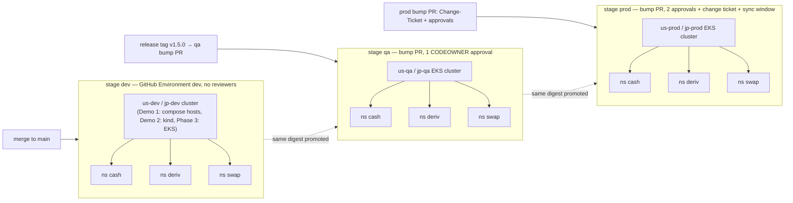
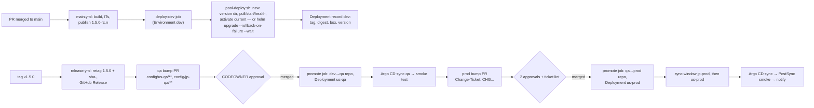
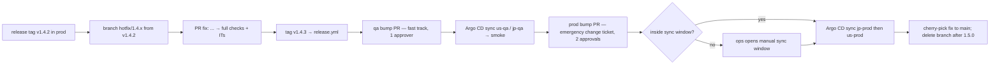
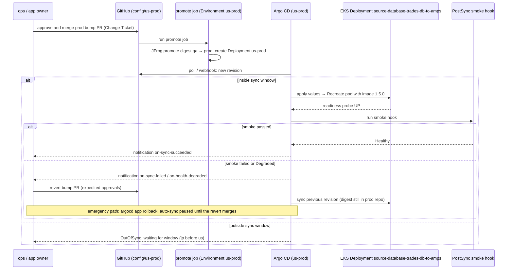
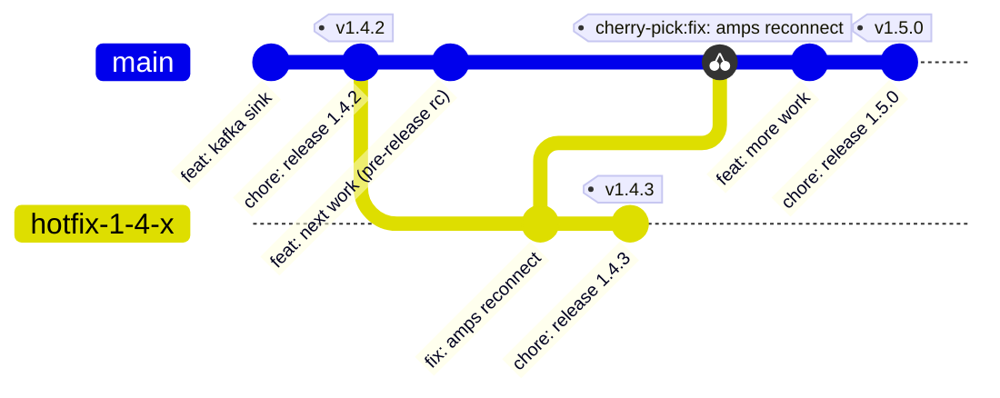

# D9 — CD pipeline and release management (dev → qa → prod)

| | |
|---|---|
| Document | D9 |
| Status | Draft v1 (phase 1) |
| Date | 2026-09-26 |
| Source brief | TODO.md v0.8, §5.12 (with §2.2 CD trigger, §4 CD on merge to `main`, §5.4 promotion, §5.5 bump delivery, §5.7 delivery to clusters) |
| Related | D4 (`docs/04-versioning-and-image-tagging.md`), D5 (`docs/05-configuration-management.md`), D6 (`docs/06-runtime-operations.md`), D7 (`docs/07-ci-pipeline-github-actions.md`), D10 (`docs/10-containerised-ci-execution.md`), D11 (`docs/11-kubernetes-packaging-and-gitops.md`) |

## 1. Purpose and scope

This document defines how a build that passed CI reaches `dev`, `qa` and `prod` in each region,
who approves what, how a deployment is recorded, how it is rolled back, and how releases and
hotfixes are cut. It covers:

- the environment model `<region>-<stage>` × business flow × AppInstance and the GitHub
  Environments that protect it;
- the `deploy-dev` job that auto-deploys every merge to `main` (decided v0.7), for Demo step 1
  (compose hosts) and Demo step 2 (Helm into the target cluster), and its hand-over to Argo CD in
  Phase 3;
- promotion dev → qa → prod of the **same image digest**, rollback, hotfix, release cadence,
  change-management evidence, access control, environment parity, deployment records.

Not here: how versions and tags are computed and how the release workflow opens bump PRs (D4);
the workflow topology and reusable jobs (D7); the chart, the ApplicationSet layout and the
config-tree → Kubernetes mapping (D11); `run-compose.sh` itself (D6).

## 2. Context and constraints

| Constraint | Source | Effect |
|---|---|---|
| Production on Kubernetes on EKS; compose only for local dev, CI stacks and the dev compose hosts of Demo step 1 | DL-02, §5.8 | qa and prod are Kubernetes-only from the first design; the compose path exists for one demo step |
| Merge to `main` auto-deploys to the dev targets; qa and prod stay PR-gated | §2.2, §4, §5.12 (decided v0.7) | `deploy-dev` job under GitHub Environment `dev` with no reviewers; never touches qa / prod |
| Config in this monorepo under `config/<env>/...`, `workflows-config.yml` per flow | DL-06, §5.7 (decided) | the config tree is the deployment intent for every env and the record for qa / prod; for dev the GitHub Deployment is the record — no workflow writes to `main` (DL-40, v1.5) |
| `main` accepts changes only through pull requests with at least one human approval; no bypass for workflows or Apps | company ruleset (v1.5) | no write-back and no loop guard; `config/*-dev/**` declares `main`, the deploy pins and records the digest (DL-40); each flow opts in to deploy on merge, nightly or by hand |
| Helm chart per app; one release `<app>-<instance>` per AppInstance, `replicas: 1` | DL-29, DL-33 (decided) | promotion and rollback are per instance; `helm upgrade --install ... --rollback-on-failure --wait` is the unit of deploy |
| Same digest promoted across `docker-dev-local → docker-qa-local → docker-prod-local`, never rebuilt | §5.4, §5.12 | the qa and prod bump PRs change a tag (and pin a digest, DL-20) — no build step in promotion |
| Deployment windows per region and flow (trading hours); region ordering | §2.1, §5.12 | enforced in the cluster by controller sync windows, not only in the pipeline |
| No production cluster credentials in GitHub; the controller pulls | §5.12 | Phase 3 replaces CI push with Argo CD reconciliation (DL-30 leaning) |
| Demo simplifications | §2.2, §4 | GitHub-hosted runners, GHCR instead of JFrog, no qa / prod targets exist, kind inside the workflow stands in for a dev cluster |

## 3. Requirements

| Brief bullet ("must answer", §5.12) | Answered in |
|---|---|
| Environment model `<region>-<stage>` × flow × instance; GitHub Environments with protection rules (reviewers for qa / prod, deployment branches limited to release tags) | §6.1, §6.2 |
| Promotion flow: build once → dev auto on `main` → qa on release tag (bump PR + approval) → prod on approved PR + change ticket; same digest, no rebuild | §6.3, §7.2 |
| Auto-deploy to dev on merge to `main`: `deploy-dev` job, `workflows-config.yml`, compose adapter (DL-35), Helm adapter (`--rollback-on-failure --wait --timeout 5m`), Argo CD hand-over, deployment record without a write-back (DL-40), deploy policy per flow, failure behaviour | §4.1, §4.2, §6.4–§6.6 |
| Deploy mechanics on EKS: controller reconciles a merged bump into a rolling update; probes gate; `maxUnavailable` / `maxSurge` per instance; PDB; progressive delivery where replicas exist; post-sync smoke test | §6.7, §7.4 (details in D6, D11) |
| Deployment windows per region and flow, region ordering, enforced by sync windows | §6.8 |
| Rollback: revert the bump PR, time-to-rollback target, schema compatibility | §6.9, §7.4 |
| Hotfix flow: branch from release tag → patch version → fast-tracked qa → prod | §6.10, §7.3, §7.5 |
| Release cadence and branching: trunk-based + tags vs release branches; code freeze; release notes from Conventional Commits | §4.6, §6.11, §7.5 |
| Change-management evidence: test reports, scan results, approvals, GitHub Deployments record, notifications | §6.12 |
| Access control: prod approvers, bot permissions, controller RBAC, no prod credentials in GitHub | §6.13 |
| Environment parity: one chart per app, overlays differ, config-lint compares key sets | §6.14 |
| §3 diagrams: approval matrix; promotion and hotfix flows; prod deploy sequence with rollback; gitGraph | §7 |

## 4. Options considered

### 4.1 Reaching the dev compose hosts from `deploy-dev` (DL-35, open — Demo step 1)

| Option | Pros | Cons | When to prefer |
|---|---|---|---|
| SSH with a deploy key from the GitHub-hosted runner | no agent on the host; key scoped to a `deploy` user whose shell allows only `run-compose.sh`; simplest to demo | the host must accept inbound SSH from GitHub's address ranges; key rotation; host key pinning | the host is reachable from the runner |
| Self-hosted runner on the compose host | no inbound network path; runs `run-compose.sh` locally; the one self-hosted exception §7 allows | a runner process per host to patch; the job's `runs-on` label is per host | the host is not reachable from GitHub-hosted runners |
| Pull agent on the host (cron / systemd timer running `pull`, `start`, `health` against the checked-out config) | no credentials in GitHub at all | no synchronous result for the job; a second mechanism to own; superseded anyway by the controller model (DL-10 → DL-30) | not recommended |

**Recommendation (leaning of DL-35):** SSH from the runner when the host is reachable, otherwise a
self-hosted runner on the host. Either way the host-side command is the same `run-compose.sh`
invocation, so the adapter changes only its transport.

### 4.2 Loop guard for the tag write-back (DL-36 — superseded by DL-40)

> **Superseded (v1.5, DL-40):** the company ruleset accepts no workflow push to `main`; there is no write-back
> and nothing to guard. The table stays for the record.

| Option | Pros | Cons | When to prefer |
|---|---|---|---|
| Skip bot-authored commits in the job `if:` (`github.actor != '<bot>'`) | exact: only the bot's commits are skipped; human config-only merges still deploy | relies on the bot identity being stable (GitHub App, DL-09) | always, as the primary guard |
| `[skip ci]` in the write-back commit message | GitHub skips the whole workflow — no runner minutes; belt and braces | skips `config-lint` too; a human copying the marker skips CI by accident | as the secondary guard |
| `paths-ignore: config/**` on the `main` workflow | trivial | **breaks the requirement** that a config-only human merge still deploys | rejected |

**Recommendation (leaning of DL-36):** bot author check **and** `[skip ci]`. Both are verified by
the acceptance test "the write-back commit does not trigger another deploy" (§7 of the brief).

### 4.3 Bump delivery for qa and prod (DL-09, qa / prod part open)

| Option | Pros | Cons | When to prefer |
|---|---|---|---|
| Bot PR against `config/<region>-qa/**` and `config/<region>-prod/**`, approvals via CODEOWNERS, merge = deploy intent | git is the deployment record; approvals and change ticket live on the PR; rollback is a revert | one PR per stage; PR noise in the code repository until `config/` moves (DL-06) | qa and prod (leaning) |
| Deploy-time parameter (job input) | no PR | state outside git; weak audit | never for qa / prod |
| Argo CD Image Updater / Flux image automation writing back to git | fully automatic | automation choosing prod images contradicts the approval gate; acceptable for dev only, and dev already has `deploy-dev` | not needed |

**Recommendation:** bot PR with approvals for qa and prod (DL-09 leaning); dev deploys from `main` and
records a GitHub Deployment instead of writing back (DL-40, v1.5).

### 4.4 GitOps controller on EKS (DL-30, EKS part open — Phase 3)

| Option | Pros | Cons | When to prefer |
|---|---|---|---|
| Argo CD | ApplicationSets over the config tree, **sync windows** map to trading-hours deployment windows, UI and RBAC per project, health and history, notifications | heavier install; hub-and-spoke vs per-cluster to decide | deployment windows and per-flow RBAC matter — leaning |
| Flux | lighter, no UI, image automation | windows only via a suspend schedule; less visibility for ops | a Flux-based platform already exists |
| CI push (`helm upgrade` from a workflow) | what the demo does; simplest | prod cluster credentials in GitHub; no drift detection; state in the pipeline | Demo steps 1–2 only |

**Recommendation:** Argo CD in Phase 3 (DL-30 leaning; the brief's §4 and §5.12 already name it).
Until then the `deploy-dev` job pushes with `helm upgrade --install` (decided for the demo).

### 4.5 Config promotion between environments (DL-21, open)

| Option | Pros | Cons | When to prefer |
|---|---|---|---|
| PR per env with CODEOWNERS | same gate for config and image changes; parity check runs on the PR | manual copying of a value into the next env's directory | leaning |
| Directory copy (`us-qa/` → `us-prod/` by script) | fast | overwrites env-specific values; no review | never for prod |

### 4.6 Branching model

| Option | Pros | Cons | When to prefer |
|---|---|---|---|
| Trunk-based development with release tags on `main`, short-lived `hotfix/<major>.<minor>.x` branches only when a patch cannot ship from `main` | one line of history; releases are tags (D4); no merge-back debt | needs disciplined feature flags for unfinished work | leaning (§5.12) |
| Release branches per version (`release/1.5`) | isolates stabilisation | double maintenance, merge-backs, drift | a long QA cycle forces it |
| GitFlow | familiar | heavy for a small family with lockstep versions | not recommended |

### 4.7 Cluster topology per `<region>-<stage>` (§8, open)

| Option | Pros | Cons | When to prefer |
|---|---|---|---|
| One EKS cluster per `<region>-<stage>` (six clusters) | hard isolation of prod; per-stage upgrades; simplest RBAC story | cost; six controller targets | prod always; recommended baseline |
| Shared cluster per region with a namespace per stage | cheaper for dev and qa | a cluster upgrade touches two stages; noisy-neighbour risk | dev + qa may share if the platform team prefers |

The approval matrix (§6.1) is written for the baseline; a shared dev/qa cluster changes only the
`cluster` column of `workflows-config.yml` and the Argo CD cluster generator.

## 5. Decision and rationale

Decided by the brief: merge to `main` deploys to the dev targets automatically through the
`deploy-dev` job (Demo step 1 via `run-compose.sh`, Demo step 2 via `helm upgrade --install`),
the deploy is recorded as a GitHub Deployment and nothing is written to `main` (DL-40, v1.5), qa and
prod are PR-gated and never touched by that job, the same digest is promoted and never rebuilt, and Phase 3 hands delivery to a GitOps
controller with deployment windows enforced in the cluster.

Recommendations in this document: SSH from the runner as the first transport to the dev compose
hosts (DL-35); bot PRs with
CODEOWNERS approvals for qa and prod bumps (DL-09), one PR per env (DL-21); Argo CD as the
controller with sync windows per `<region>-<stage>` × flow (DL-30); trunk-based development with
tags and hotfix branches cut from release tags; one cluster per `<region>-<stage>` as the baseline
topology. Rationale: every deploy intent is a git commit reviewed under the rules of the target
env, every promoted deploy is recorded twice (git and GitHub Deployments) and every dev deploy once (the
Deployment — the dev tree declares `main`), and rollback is always "the same mechanism in reverse".

## 6. Conventions

### 6.1 Environment model and approval matrix

| Env | Cluster (baseline) | Namespaces | Deployed by | Gate | Approvers | Window |
|---|---|---|---|---|---|---|
| `local` | laptop compose / kind | — | developer | none | — | — |
| CI test stacks (env `local`, run-scoped project names, D6 §6.5) | GitHub-hosted runner (compose; kind in Demo step 2) | kind cluster `ci-<run_id>` | workflow | none | — | — |
| `us-dev`, `jp-dev` | Demo step 1: compose hosts; Demo step 2: kind in the workflow, then a dev cluster; Phase 3: dev EKS | `cash`, `deriv`, `swap` (DL-38) | `deploy-dev` job (GitHub Environment `dev`), Phase 3: Argo CD auto-sync | per flow (`deploy` block, DL-40): merge to `main` (PR review + green CI), a nightly time, or a manual dispatch | PR reviewers only | none |
| `us-qa`, `jp-qa` | qa EKS per region | same | Phase 3: Argo CD; before that: documented only (no demo target) | bump PR on `config/<region>-qa/**` | 1 CODEOWNER of the app + qa owner | business hours |
| `us-prod`, `jp-prod` | prod EKS per region | same | Argo CD sync within the window | bump PR on `config/<region>-prod/**` with change-ticket reference | 2 approvals: app owner + ops CODEOWNER; GitHub Environment `<region>-prod` reviewers on the promotion job | trading-hours window per flow; `jp` before `us` |

### 6.2 GitHub Environments and protection rules

| Environment | Required reviewers | Deployment branches / tags | Wait timer | Secrets held | Used by |
|---|---|---|---|---|---|
| `dev` | none | `main` only | 0 | dev-host SSH key or nothing (self-hosted runner, DL-35); kind needs none | `deploy-dev` job in `main.yml`, the nightly tick and the manual / rollback dispatches |
| `us-qa`, `jp-qa` | 1 (qa owners team) | tags `v*` (and `<subproject>/v*` if DL-03 chooses independent tags) | 0 | JFrog promotion token via OIDC (DL-18); no cluster credentials | `promote` job in `release.yml`: registry promotion + Deployment record |
| `us-prod`, `jp-prod` | 2 (ops + platform owners); self-review disallowed | tags `v*` only | optional 30 min for change-ticket verification | JFrog promotion via OIDC; **no cluster credentials** | `promote` job: registry promotion, Deployment record, wait for controller health |

The GitHub Environment is not the only gate for qa and prod: the bump PR on `config/<env>/**` must
also be approved under CODEOWNERS. The Environment protects the job that promotes the digest in the
registry and records the deployment; the PR protects the deploy intent; the controller enforces the
window.

### 6.3 Promotion flow

| Stage | Trigger | What changes in git | Registry | Deployer | Record |
|---|---|---|---|---|---|
| dev | merge to `main` → `main.yml` publishes pre-release tag `1.5.0-rc.<n>` (format per DL-04 / DL-05) | nothing: `config/us-dev/**` declares `main`; the Deployment payload records tag and digest per instance (DL-40) | `docker-dev-local` | `deploy-dev` job | GitHub Deployment `dev`, job summary |
| release | tag `v1.5.0` → `release.yml` retags the digest as `1.5.0` + `sha-<sha7>` (D4) | nothing for dev: the release commit is a tested `main` commit, so `main` already points at the released digest and dev runs it (DL-40) — no dev bump PR | `docker-dev-local` | — | as above |
| qa | same `release.yml` opens bump PR on `config/us-qa/**` and `config/jp-qa/**` | `image.tag: 1.5.0` (+ `image.digest` per DL-20) per instance | promotion `docker-dev-local → docker-qa-local` by the `promote` job (Environment `<region>-qa`) after PR approval | Argo CD sync (Phase 3) | GitHub Deployment `<region>-qa`; Argo CD history |
| prod | bump PR opened by the `promote` job or by ops: qa values copied per instance into `config/<region>-prod/**`; PR body carries `Change-Ticket: CHG0012345` | `image.tag` + digest per instance | `docker-qa-local → docker-prod-local` by the `promote` job (Environment `<region>-prod`) | Argo CD sync inside the sync window | GitHub Deployment `<region>-prod`; Argo CD history; ticket link |

Nothing is built after `main.yml`; the digest the dev Deployment records — the one `release.yml` resolves from
the tagged commit's own run — is the digest that reaches prod.

### 6.4 The `deploy-dev` job

| Aspect | Convention |
|---|---|
| Position | last job of `main.yml`, `needs: [publish, kind-deploy]`, `environment: dev`, `concurrency: deploy-<env>` shared with the nightly tick and the dispatches (no parallel deploys, `cancel-in-progress: false`) |
| Triggers | `push` to `main`: the flows whose `deploy.on-merge` lists a project, with the run's version; the hourly tick: the flows whose `deploy.schedule` is due, with the latest tested `main` when it differs from the flow's last successful Deployment; `workflow_dispatch` (project, env, flow): the latest tested `main`, now; a rollback dispatch (project, env, flow): the previous version (DL-40, DL-41). No actor condition: nothing ever pushes to `main` |
| Input | `config/<env>/<flow>/workflows-config.yml` per flow (schema v2, D5 §6.6): the flow's boxes (`hosts`), its `deploy` policy and every instance with its box or cluster; a deploy covers every instance of the project in the flow — never a subset |
| Compose adapter (Demo step 1) | per (project, env, flow): `scripts/pool-deploy.sh <env> <flow> deploy --project <project> --tag <tag>` builds the project's bundle from the tree, rsyncs it as a **new** version directory to every box of `hosts.list` (verified by checksum), records the literal tag in it, pulls, runs `start` → `health` for every instance on its declared box, then activates `current` on every box (DL-41); `IMAGE_TAG` is the override for `pull` / `start` / `health` because the tree says `main` (DL-40). Over SSH as `hosts.user` with the DL-35 forced command. **Demo placeholder:** until the Environment `dev` holds `DEV_DEPLOY_SSH_KEY` and `config/<env>/known_hosts` exists, the `local` transport lets the runner play every box (one directory each; `validate`, `start --dry-run`, `activate --dry-run`) |
| Helm adapter (Demo step 2) | per `kind: helm` target: `scripts/helm-deploy-instance.sh us-dev <flow> <app> <inst> --tag <tag> --namespace <ns>` (D11 §8.3) = `helm upgrade --install <app>-<inst> deephaven-connectors/<app>/helm/<app> -n <ns> --create-namespace -f <app-common>/values.yaml -f <inst>/values.yaml --set-string image.tag=<tag> --set-file appConfig.common=<app-common>/application.yml --set-file appConfig.instance=<inst>/application.yml [--set-file appConfig.flow=... when the cluster layer exists] --rollback-on-failure --wait --timeout 5m`, then `rollout status` and `helm test`. Targets of `cluster: kind-ci` go into a kind cluster `deploy-<run_id>-<attempt>` created in the job and deleted in `always()` until a dev cluster exists (DL-32); any other cluster fails with `TODO(Phase 3)` (kubeconfig from the Environment `dev` secrets) |
| Health gate | compose: `health` exit code; Helm: `--rollback-on-failure --wait` plus `kubectl rollout status` and `helm test` (the kind deploy test adds the smoke diff: two instances differ in effective config, §7 of the brief) |
| Record | one GitHub Deployment per run (Environment `dev`, ref, sha, payload per instance: tag, digest, box, version directory, config git SHA) and a job summary table per instance; nothing is committed (DL-40) |
| Failure | job red, Deployment `failure`; compose: a `pull` failure changes nothing; any instance failing `health` sends every instance of the project back to `current` — the previous version directory, old image **and** old config — and `current` never moves (DL-41); Helm: `--rollback-on-failure` restored the previous revision (a failed `rollout status` or `helm test` afterwards runs `helm rollback`; a failed first install stays in place for diagnostics) |
| Never | touches `config/*-qa/**` or `config/*-prod/**`; the adapter refuses any env other than `*-dev` (and `run-compose.sh` enforces the same allow-list, D6) |
| Phase 3 | the adapters are replaced by Argo CD auto-sync on `config/<region>-dev/**`; the job shrinks to "wait for Application health, smoke test, record the Deployment" |

### 6.5 Illustrative `config/us-dev/cash/workflows-config.yml`

```yaml
# config/us-dev/cash/workflows-config.yml — schema v2 owned by D5 (§6.6); one file per flow (DL-40, DL-41)
env: us-dev
flow: cash
hosts:                             # the boxes dedicated to us-dev/cash; every one receives every version
  user: deploy                     # SSH login on every box (DL-35); root is relative to its home
  root: ~/versions                 # <root>/<project>/<YYYYMMDD-HHMMSS>/ + current
  keep: 5
  list: [dev-cash-01.us-dev.example.com, dev-cash-02.us-dev.example.com]
deploy:                            # required: when this flow deploys
  on-merge: [deephaven-connectors] # on every tested main merge
  schedule:                        # nightly, only when newer than what runs
    projects: [deephaven-server]
    at: "02:00"
    tz: America/New_York
    days: mon-fri
instances:                         # every instance directory of the flow, and where it runs
  source-database/trades-db-to-amps: dev-cash-01.us-dev.example.com
  source-database/positions-db-to-deephaven:
    cluster: kind-ci               # a Helm instance: Demo step 2 kind inside the workflow; later the dev EKS cluster
    namespace: cash                # default: the flow name (DL-38)
```

### 6.6 Illustrative `deploy-dev` job skeleton

```yaml
# illustrative — real job in .github/workflows/_deploy-dev.yml, called by main.yml (push), the hourly tick and the
# manual / rollback dispatches (D7 owns the workflow set). No actor condition: no workflow ever pushes to main (DL-40).
deploy-dev:
  needs: [publish, kind-deploy]
  runs-on: ubuntu-latest
  environment: { name: dev, deployment: false }      # the job records its own Deployment, with a payload
  concurrency: { group: deploy-us-dev, cancel-in-progress: false }
  permissions: { contents: read, deployments: write, packages: read }
  env:
    TAG: ${{ inputs.tag }}                             # push: the run's rc; tick / dispatch: the version `main` points to
    PROJECT: ${{ inputs.project }}                     # dispatch input; push / tick: every project the flow lists
  steps:
    - uses: actions/checkout@v4
    - id: plan                                         # which flows deploy for this trigger (DL-40):
      run: |                                           # push → deploy.on-merge; tick → deploy.schedule due now; dispatch → the inputs
        scripts/ci/deploy-plan.sh us-dev "$GITHUB_EVENT_NAME" "$PROJECT" "${{ inputs.flow }}" >> "$GITHUB_OUTPUT"
    - name: Deploy compose instances (Demo step 1; versioned bundles, DL-41)
      env: { POOL_TRANSPORT: ssh }                     # `local` until DEV_DEPLOY_SSH_KEY and known_hosts exist (DL-35)
      run: |
        # Per (project, env, flow): bundle from the tree → new version directory on every box of hosts.list → record-tag
        # → pull → start + health for every instance on its declared box → activate current on every box → prune.
        # Any health failure: every instance back to current, which never moved.
        for flow in ${{ steps.plan.outputs.compose-flows }}; do
          scripts/pool-deploy.sh us-dev "$flow" deploy --project "$PROJECT" --tag "$TAG"   # prints: deployed <project>@<flow>=<tag> <version>
        done
    - name: Deploy helm instances (Demo step 2)
      uses: ./.github/actions/helm-deploy-instance     # scripts/helm-deploy-instance.sh per instance (D11 §8.3):
      with:                                            # namespace + PSS labels, Secret, helm lint, upgrade --install
        env: us-dev                                    # --rollback-on-failure --wait --timeout 5m, rollout status, helm test
        instances: ${{ steps.plan.outputs.helm }}
        tag: ${{ env.TAG }}
    - name: Record the deployment                      # the record: tag, digest, box, version directory, config sha per instance
      run: gh api repos/${{ github.repository }}/deployments -f ref="$GITHUB_SHA" -f environment=dev -f payload="$PAYLOAD"
```

### 6.7 Deploy mechanics on EKS (Phase 3)

| Mechanism | Convention | Owner |
|---|---|---|
| Reconciliation | Argo CD `ApplicationSet` (git directory generator over `config/<env>/<flow>/<app>/<instance>` × cluster generator) → one Application per instance, `syncPolicy.automated` with `selfHeal` and `prune` in dev, automated without `prune` in qa, manual-approval-free but window-bound in prod | D11 |
| Rollout | Deployment `strategy` per instance (`Recreate` default for exclusive consumers, D6 §6.10); probes gate readiness; PDB only when `replicas > 1` | D6 |
| Progressive delivery | Argo Rollouts only where an instance has `replicas > 1`; out of scope for `replicas: 1` | later |
| Post-sync smoke test | Argo CD `PostSync` hook Job: `GET /actuator/health/readiness` and a config-differentiation check per instance; hook failure marks the sync Degraded | D11 |
| Config change | a merged change to `application.yml` re-renders the ConfigMap; checksum annotation restarts that one instance | D5 |

### 6.8 Deployment windows

| Env × flow | Allowed sync window (illustrative, to confirm with §8 change management) | Ordering |
|---|---|---|
| `jp-prod` × `cash`, `deriv`, `swap` | Mon–Fri 19:00–22:00 Asia/Tokyo | first |
| `us-prod` × `cash`, `deriv`, `swap` | Mon–Fri 18:00–21:00 America/New_York | after `jp-prod` is healthy |
| `*-qa` | Mon–Fri 08:00–18:00 local | — |
| `*-dev` | always | — |

Windows are Argo CD `syncWindows` on the `AppProject` per `<env>/<flow>` (`kind: allow`, `schedule`
in cron syntax, `duration`, `applications` selector); outside the window the Application shows
`OutOfSync` and waits. Emergency changes use a `manualSync: true` window that ops may trigger
(verify option name). The pipeline may additionally delay the prod bump PR merge, but the cluster
is the enforcement point.

### 6.9 Rollback

| Situation | Mechanism | Target time | Record |
|---|---|---|---|
| `deploy-dev` Helm upgrade fails | `--rollback-on-failure` restores the previous revision automatically (a failed `rollout status` or `helm test` afterwards runs `helm rollback`; a failed first install has nothing to restore and stays in place for diagnostics); job red; no write-back | immediate | job summary, Deployment `failure` |
| `deploy-dev` compose `health` fails | every instance of the project in the flow restarts from `current` — the previous version directory, old image and old config (DL-41); `current` never moved; job red, Deployment `failure` | < 2 min | job summary |
| Dev runs a bad version or configuration | rollback dispatch (project, env, flow): every box flips `current` to the previous version and restarts; a restore pull request follows only when the tree must change too (DL-40) | minutes | Deployment, job summary |
| Bad release in qa or prod, cluster healthy but behaviour wrong | **restore the env to its last good revision**: one pull request that checks out `config/<env>/**` at the SHA of the last successful Deployment — image tag, digest and every config layer together, however many PRs made the release (DL-40); same gates, expedited approvals; Argo CD syncs it; the previous digest is still in the prod repo (never deleted, D4) | ≤ 15 min from decision to sync (to confirm with change management) | restore PR + Deployment |
| Prod incident needing seconds, not minutes | ops runs `argocd app rollback <app>-<inst>` (or `helm rollback` with break-glass credentials); auto-sync is disabled on that Application until the revert PR merges — otherwise `selfHeal` would re-apply the bad version | minutes | Argo CD history + follow-up revert PR within the same day |
| Schema or data compatibility | database or table changes ship expand → migrate → contract across releases so that rolling back the connector never requires rolling back a schema; the release checklist records the compatibility statement | — | PR template field |
| Rollback drill | quarterly in qa: revert PR, measure time to healthy; result attached to the change-management evidence | — | drill report |

### 6.10 Hotfix flow

| Step | Action | Who |
|---|---|---|
| 1 | Branch `hotfix/1.4.x` from tag `v1.4.2` (only if `main` already carries unreleasable changes; otherwise fix on `main` and release normally) | app owner |
| 2 | Fix commit (`fix: ...`, Conventional Commit) via PR into the hotfix branch; full PR checks including ITs (D7, D10) | developer + reviewer |
| 3 | Tag `v1.4.3` on the hotfix branch → `release.yml` builds, tags `1.4.3` + `sha-<sha7>`, opens qa bump PR | release workflow |
| 4 | qa: one approver (fast track), promote, smoke test | qa owner |
| 5 | prod: bump PR with an **emergency** change ticket; two approvals still required; sync inside the window or via the manual sync window | ops + app owner |
| 6 | Cherry-pick the fix to `main` (or merge the hotfix branch); delete the branch after the next minor release supersedes it | developer |

### 6.11 Release cadence and branching

| Topic | Convention |
|---|---|
| Model | trunk-based: every change merges to `main` through a PR; `main` is always deployable to dev |
| Versions | pre-release on every `main` merge (`1.5.0-rc.<n>` or the SNAPSHOT form — D4 decides, DL-04 / DL-05); release on tag `v<major>.<minor>.<patch>` (lockstep for the connector family; `deephaven-server/v*` if DL-03 chooses hybrid) |
| Cadence (proposal, to confirm) | minor release every two weeks or on demand; patch releases as needed via hotfix; no fixed code freeze — freezes are expressed as closed sync windows and paused promotion PRs |
| Release notes | generated from Conventional Commits by the release tooling (release-please leaning, DL-04); attached to the GitHub Release and linked from the prod bump PR |
| Branch protection on `main` | required checks (build, unit, config-lint, affected ITs), 1 review, CODEOWNERS, linear history; no bypass — no workflow pushes to `main` (DL-40) |

### 6.12 Change-management evidence

| Evidence | Produced by | Stored | Retention |
|---|---|---|---|
| Unit and integration test reports (JUnit) | `pr.yml`, `main.yml` | workflow artefacts, job summary | 90 days (artefacts); the GitHub Release links the run |
| Image scan result and SBOM | `main.yml` / `release.yml` (Xray or Trivy, D7) | JFrog build-info, release assets | with the image |
| Approvals | PR reviews on bump PRs; Environment approvals on `promote` | GitHub, immutable | repository lifetime |
| Change-ticket reference | `Change-Ticket:` trailer in the prod bump PR body, checked by a PR lint | PR, Deployment payload | repository lifetime |
| Deployment record | GitHub Deployments API entry per env per run (`ref`, `sha`, `payload.instances[]`) | GitHub | repository lifetime |
| What is running | `config/<env>/**` at any commit; Argo CD sync history | git; controller | git lifetime |
| Notifications | Argo CD notifications and workflow steps post to the flow's channel on sync success / failure and on rollback | chat / e-mail | — |

### 6.13 Access control

| Actor | May | Mechanism |
|---|---|---|
| Developers | merge to `main` after review → dev deploy | branch protection, CODEOWNERS on code |
| App owners | approve qa bump PRs; co-approve prod | CODEOWNERS on `config/*-qa/**`, `config/*-prod/**` |
| Ops / platform team | approve prod bump PRs and Environment `<region>-prod`; run break-glass rollbacks | CODEOWNERS, Environment reviewers, Argo CD RBAC role per project |
| Bot (GitHub App) | open qa / prod bump PRs; **never pushes to `main`, cannot approve** | App installation with `pull-requests: write` and `contents: write` on its own `bump/*` branches only (DL-09, DL-40) |
| CI (`promote` job) | promote a digest between JFrog repos; create Deployments | OIDC to JFrog (DL-18); no cluster credentials |
| Argo CD | read the config repo; apply into its own cluster / namespaces | deploy key or App token read-only; per-namespace RBAC; the controller pulls, GitHub never pushes to prod |
| Dev compose hosts (Demo step 1) | `deploy` user limited to `run-compose.sh` via a forced SSH command or a self-hosted runner | DL-35 |

### 6.14 Environment parity

| Rule | Check |
|---|---|
| One chart per app (`helm/<app>/`), one compose template per app; only values and `application.yml` layers differ per env | chart and template are versioned with the code, never copied per env |
| `app-common` and instance directories exist for every env an instance is deployed to | config-lint required-file check (D5) |
| Key sets match across `us-dev` → `us-qa` → `us-prod` for the same instance; only values differ | config-lint renders `helm template` and `docker compose config` per env and diffs key sets; a missing key in prod fails the promotion PR |
| Same digest in every env once promoted | the `promote` job compares the digest in the qa and prod values before promoting (DL-20: digest pinned in qa / prod) |

### 6.15 Deployment records and notifications

| Event | Record | Notification |
|---|---|---|
| dev deploy (merge, nightly or dispatch, DL-40) | Deployment `dev` with payload per instance (tag, digest, box, version directory, config git SHA); `current` on the boxes | none by default; failure posts to the platform channel |
| qa / prod promotion | Deployment `<region>-<stage>`; bump PR; JFrog promotion build-info | flow channel: "promoted `source-database` 1.5.0 to `us-qa` (2 instances)" |
| Argo CD sync result | Application history (revision, author, time) | Argo CD notifications on `on-sync-succeeded`, `on-sync-failed`, `on-health-degraded` |
| Rollback | revert PR + Deployment marked `inactive` for the bad revision | flow channel and change ticket update |

## 7. Diagrams

### 7.1 Structural — clusters, namespaces and gates per `<region>-<stage>`



*Figure 1 — Approval matrix per stage.*

Each region has one cluster per stage in the baseline
topology, with a namespace per business flow holding one Helm release per AppInstance. The gate
tightens per stage while the artefact — the image digest recorded in dev — never changes.

### 7.2 Flow — dev → qa → prod promotion through the config tree



*Figure 2 — Promotion as a chain of git changes.*

Dev is deployed and recorded — its tree declares `main` (DL-40); qa and prod are written first (a reviewed
bump PR) and then deployed by the controller. Every arrow to a qa or prod cluster starts from a merged
commit, so `git log config/us-qa config/us-prod` is their deployment history; dev's is the Deployment list.

### 7.3 Flow — hotfix path



*Figure 3 — Hotfix path.*

The hotfix uses the ordinary release and promotion machinery with
shorter approval queues; only the branch point (a release tag rather than `main`) and the ticket
class differ. The fix returns to `main` by cherry-pick so the next minor release contains it.

### 7.4 Sequence — prod deploy via GitOps sync, including rollback



*Figure 4 — Production deploy and rollback.*

GitHub never talks to the prod cluster: the promote
job moves the digest and records the deployment, while Argo CD pulls the merged config and applies
it only inside the sync window. Rollback is the same path in reverse — a revert commit — with a
controller-side rollback reserved for emergencies.

### 7.5 gitGraph — release and hotfix branching



*Figure 5 — Trunk-based development with tags.*

Releases are tags on `main`; a hotfix branch
(`hotfix/1.4.x`, drawn as `hotfix-1-4-x`) is cut from the release tag only when `main` has moved
on, receives the fix and its own tag, and the fix is cherry-picked back. No long-lived release
branches exist.

## 8. How the demo skeleton implements it

| Phase | File / path | What it proves |
|---|---|---|
| Demo step 1 (compose) | `.github/workflows/main.yml` → `deploy-dev` job with `environment: dev`, compose adapter (§6.4, §6.6) | merge to `main` resolves the targets in `config/us-dev/cash/workflows-config.yml` and runs the placeholder adapter (`--dry-run` + printed SSH command, `TODO(DL-35)`) without a manual step; the real SSH transport is a later implementation |
| Demo step 1 (compose) | `config/us-dev/cash/workflows-config.yml` (§6.5; per flow since v1.3) | inventory of dev targets; `kind: compose` entries |
| Host pools (v1.3, DL-39; v2 v1.5, DL-41) | `config/us-dev/<flow>/workflows-config.yml` (`hosts`, `deploy`, `instances`); `scripts/pool-deploy.sh` (`bundle`, `deploy`, `rollback`, `status`); `scripts/test/pool-deploy-test.sh` (lint job) | dedicated boxes, a versioned per-project bundle with `current` on every box, declared placement, deploy-all with activation after health and rollback to the previous version; ssh transport stub-tested, `local` transport run by `deploy-dev` until the boxes exist |
| Demo step 1 (compose) | `_deploy-dev.yml` Deployment record (DL-40) | no workflow commits to `main`; the Deployment payload names the digest, box and version of every instance |
| Demo step 1 (compose) | `.github/workflows/release.yml` | `v0.1.0` → `0.1.0` tags → qa bump PR (§4 of the brief; no qa target in the demo, so the PR is the proof); no dev bump PR — dev declares `main` (DL-40) |
| Demo step 1 (compose) | GitHub Environment `dev` settings; branch protection on `main`; `CODEOWNERS` with `config/**` rules | gates as in §6.2 |
| Demo step 2 (kind + Helm) | `_deploy-dev.yml` Helm adapter: kind cluster `deploy-<run_id>-<attempt>` in the job, `scripts/helm-deploy-instance.sh` (`helm upgrade --install ... --rollback-on-failure --wait --timeout 5m`, `rollout status`, `helm test`) per `kind: helm` target of `cluster: kind-ci`, Deployment record, cluster deleted and leak-checked in `always()` | one release per AppInstance from the config tree; `--rollback-on-failure` on a failing upgrade |
| Demo step 2 (kind + Helm) | `helm lint` / `helm template` for every instance in the config-lint job | parity check of §6.14 |
| Phase 3 (EKS + GitOps) | Argo CD `ApplicationSet` and `AppProject` with `syncWindows` per `<env>/<flow>` (D11); `promote` job under Environments `<region>-qa` / `<region>-prod`; Argo CD notifications | documented, not provisioned by the demo |

## 9. Open items

> **Update 2026-09-26 (brief v1.0):** DL-03, DL-04, DL-05, DL-09, DL-35, DL-36 referenced below were decided as recommended in this
> document; their ADRs in `docs/adr/` are now Accepted. The remaining rows are unchanged.

| Item | Status | Effect here |
|---|---|---|
| DL-03 / DL-04 / DL-05 versioning scope, computation, tag scheme | open | the tag strings in §6.3 and in bump PRs; whether `<subproject>/v*` tags exist |
| DL-09 qa / prod bump delivery | open, leaning bot PR with approvals | §4.3, §6.3 |
| DL-20 tag vs digest pinning | open, leaning digest + tag in qa / prod | what the bump PR writes; the `promote` job's digest comparison |
| DL-21 config promotion between envs | open, leaning PR per env | §4.5 |
| DL-30 GitOps controller on EKS | open, leaning Argo CD (already named in §4 and §5.12 of the brief) | §4.4, §6.7, §6.8, Figure 4 |
| DL-35 reaching the dev compose hosts | open, leaning SSH from the runner | §4.1, §6.4; Environment `dev` secrets |
| DL-36 loop guard | superseded by DL-40 (v1.5) | §4.2 kept for the record |
| DL-40 deployment record without writing to `main` | accepted (v1.5) | §6.3–§6.6, §6.9, §6.13 |
| DL-41 versioned per-project bundles on dedicated boxes | accepted (v1.5) | §6.4, §6.5, §6.9 |
| DL-38 namespace per flow | open, leaning per flow | Figure 1, `workflows-config.yml` `namespace` field |
| §8: EKS topology per `<region>-<stage>`; are dev and qa on EKS; AWS regions | to confirm | §4.7, §6.1 |
| §8: is a GitOps controller provided on the platform and who runs it | to confirm | §6.7 ownership |
| §8: change-management constraints (CAB, evidence, windows per region / flow) | to confirm | §6.8 windows, §6.12 evidence, rollback target in §6.9 |
| §8: GitHub Enterprise Cloud or Server; JFrog promotion API allowed | to confirm | Environments features, `promote` job |
| §8: dev compose hosts and reachability; persistent dev cluster before EKS | to confirm | Demo step 1 and 2 targets |
| Follow-ups | — | define the `Change-Ticket:` PR lint; schedule the first rollback drill (deploy N, roll back to N-1 in kind); verify the Argo CD manual sync window option name; agree the release cadence in §6.11 as a release train; trigger `release-please.yml` on `hotfix/**` with `target-branch` so that D4 §6.6 step 4 runs; add `uat` as a stage if it exists |
