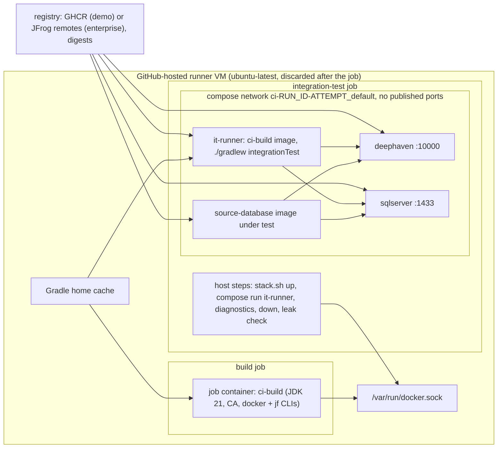
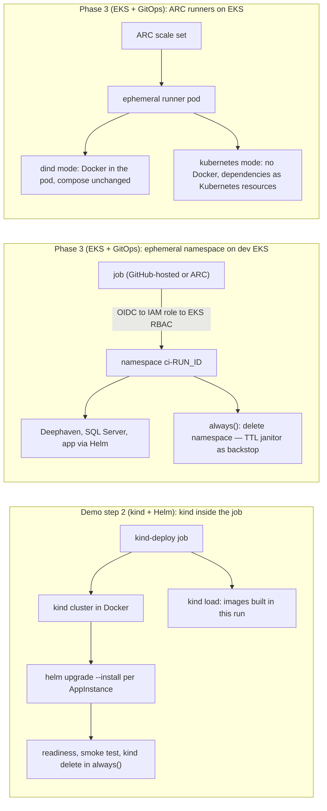
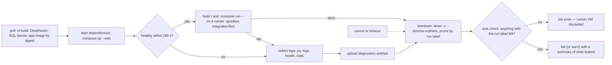
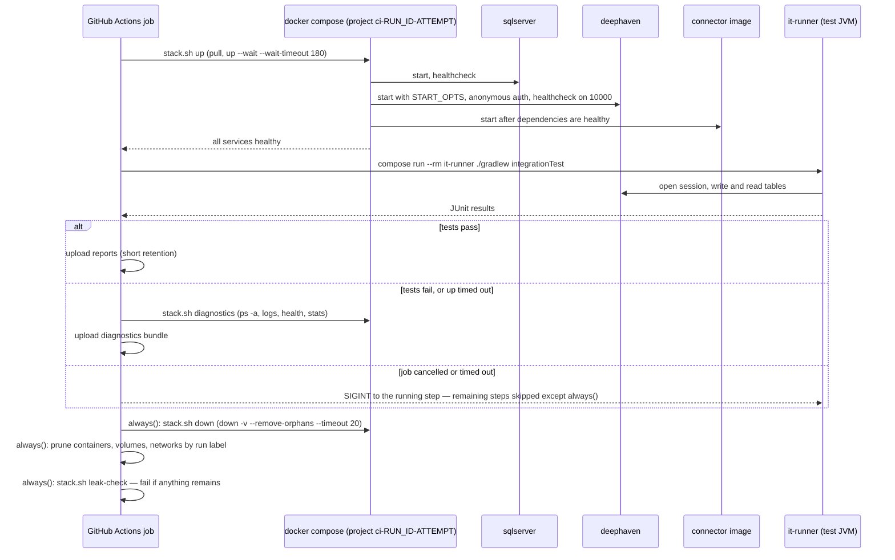

# D10 — Containerised CI execution

| | |
|---|---|
| Document | D10 |
| Status | Draft v1 (phase 1) |
| Date | 2026-09-26 |
| Source brief | TODO.md v0.8, §5.11 (with §2.2, §4, §5.9, §5.10, §6, §7, §8) |
| Related | D3 (`docs/03-docker-images.md`), D6 (`docs/06-runtime-operations.md`), D7 (`docs/07-ci-pipeline-github-actions.md`), D8 (`docs/08-integration-testing.md`), D9 (`docs/09-cd-and-release-management.md`), D11 (`docs/11-kubernetes-packaging-and-gitops.md`) |

## 1. Purpose and scope

This document specifies how a CI job executes on a GitHub runner: which container layers are in
scope, the job layout, the Deephaven server's lifecycle during integration tests, the layered
teardown guarantee and the leak check that proves it, diagnostics, networking, caches, the resource
budget, local parity, security and enterprise egress, and Kubernetes as a test substrate.

Boundaries: D7 (`docs/07-ci-pipeline-github-actions.md`) owns triggers, gates and publishing; D8
(`docs/08-integration-testing.md`) owns test levels, content, data and comparison rules; D3 owns the
content of the `ci-build` and `deephaven-server` images; D11 owns the Helm chart that the kind tier
installs.

## 2. Context and constraints

Decided facts:

- **GitHub-hosted runners** (`ubuntu-latest`, Docker and compose preinstalled) for the demo (DL-17,
  DL-25). They are discarded after every job, which is the outermost teardown backstop.
- **Model C — an ephemeral docker compose stack per job — is decided for the demo** (DL-24, DL-15).
  Deephaven is a compose service with a health condition; no Testcontainers, no Kubernetes in the
  demo's test jobs.
- **Demo step 2 (kind + Helm) adds kind inside the workflow for the Helm deployment demo**, not for
  integration tests (DL-32): create cluster, load the run's images, `helm upgrade --install` one
  release per AppInstance, readiness, smoke test, delete.
- Layer 3 (the runner itself in a container) is out of scope; ARC on EKS and ephemeral EKS
  namespaces are Phase 3 (EKS + GitOps).
- CI stays amd64 (SQL Server image); every image is pinned by digest; enterprise pulls go through
  JFrog remotes (§5.11).

Leanings to validate here: the `build` job runs in a pinned `ci-build` container image (DL-28) and
the teardown guarantee is **all layers together plus a leak check** (DL-27).

## 3. Requirements

| §5.11 "Must answer" | Answered in |
|---|---|
| Which container layers are required (dependencies; build/test process; the runner itself) | §5.1 |
| Kubernetes as the test substrate: ARC (`dind` / `kubernetes` mode), ephemeral namespace on dev EKS, kind in the job, deployment tests | §4.3, §5.9, §7.3 |
| Demo decision: GitHub-hosted runners, compose only, kind for the Helm demo | §2, §5.1 |
| Job layout: `build` → `integration-test` → `system-test`; matrix vs one job; `needs:` ordering | §5.2, §6.1 |
| Deephaven server lifecycle in CI: image pin, heap, auth, port, readiness, reach, assertions, isolation | §4.4–§4.6, §5.3, §6.3 |
| Teardown guarantee, layered; leak-check step; `timeout-minutes` | §4.7, §5.4, §6.4, §6.11 |
| Diagnostics before teardown | §5.5, §6.5 |
| Networking and ports | §5.6, §6.6 |
| Caches inside containers; pre-pull | §5.7, §6.7 |
| Resource budget | §5.8, §6.8 |
| Local parity | §5.10, §6.9 |
| Security of socket mounting | §5.11 |
| Enterprise egress through JFrog remotes | §5.12, §6.10 |

## 4. Options considered

### 4.1 Execution models (DL-24)

| Model | How | Pros | Cons | When to prefer |
|---|---|---|---|---|
| A. Job `container:` + `services:` | GitHub starts the job container and a Deephaven service container on one network and removes both at job end | least YAML; teardown built in; hostnames for free | Docker only; one container per service, no compose stack; not reproducible locally as-is | single-dependency jobs that never run on a laptop |
| B. Host job + Testcontainers | Gradle on the runner host; tests start Deephaven through Testcontainers; Ryuk reaps | closest to the test code; random ports; works locally | the build is not in a container; Ryuk needs the socket; Podman quirks | later component ITs (DL-15) |
| **C. Ephemeral compose stack (decided for the demo)** | `compose up --wait` in a step or from Gradle, then tests, then an `always()` `down` | same path locally and in CI; Docker and Podman; whole stacks; our images testable | we own teardown, labels and project names | the demo and every level that tests our images |
| D. Fully containerised build in compose | `compose run --rm build ./gradlew build integrationTest` against the `deephaven` service | build and tests in containers from one file | Gradle cache plumbing; slower cold starts; nested access if tests also use Testcontainers | when the build job cannot use `container:` |

### 4.2 Build and test process environment (DL-28)

| Option | Pros | Cons | When to prefer |
|---|---|---|---|
| `setup-java` on the runner host | simplest; fastest start | toolchain drifts from the runtime image; CA, `jf` and container CLIs installed per run | tiny repositories |
| **Pinned `ci-build` image as `container:` of the `build` job** | JDK 21, enterprise CA, container and `jf` CLIs identical in CI and on a laptop (`docker run ci-build ./gradlew build`); one image maintained by `base-image.yml` | one more image; the socket is mounted into the job container (§5.11); actions run inside the container | the leaning; every Gradle job |
| Test JVM as an `it-runner` compose service from the `ci-build` image (borrowed from model D for the test step only) | the test JVM sits on the stack network — no published ports; compose runs on the host, so bind mounts and paths need no translation; the runner container is removed by `down` | Gradle home bind-mounted from the host cache; UID mapping | the `integration-test` job (§5.2) |
| Test JVM in the job container joined to the compose network (`docker network connect`) | one image for build and test jobs | compose runs from inside a container against the host daemon, so bind-mount sources must be host paths (path translation, verify); an extra join step | when the `it-runner` service is unwanted |

### 4.3 Kubernetes as the test substrate (DL-32)

| Option | Pros | Cons | Phase |
|---|---|---|---|
| **kind inside the job** | no cloud access; the run's images loaded straight in; deletes with the job | not EKS; heavy on a standard runner next to a compose stack, so it runs as its own job | Demo step 2 (kind + Helm), Helm deployment test only |
| Ephemeral namespace `ci-<run_id>` on a dev EKS cluster | real platform: IRSA, storage classes, network policies | needs GitHub OIDC → IAM role → EKS RBAC; a TTL janitor as backstop | Phase 3 (EKS + GitOps), `main` / nightly |
| ARC runners on EKS, `dind` mode | network reach; ephemeral pods; compose and Testcontainers unchanged | Docker daemon in a pod (privileged) — security review | Phase 3 (EKS + GitOps) |
| ARC runners on EKS, `kubernetes` mode | no Docker daemon anywhere | no compose, no Testcontainers; dependencies must become Kubernetes resources | Phase 3, if security forbids `dind` |
| None | nothing to run | the chart is never exercised before dev | never, with production on EKS |

### 4.4 Deephaven authentication in CI

| Option | Pros | Cons | When to prefer |
|---|---|---|---|
| **Anonymous handler** | no secret plumbing; the stack publishes no ports | no protection at all | ephemeral CI stacks and laptops |
| Pre-shared key | one setting protects a reachable server | a test-only key in the compose environment | stacks with published ports on shared hosts (dev compose hosts, D6) |

### 4.5 Deephaven readiness probe

| Option | Pros | Cons | When to prefer |
|---|---|---|---|
| **HTTP GET on port 10000 as a compose `healthcheck`** | works with `up --wait`; gates the connector's start | probe tool must exist in the image (verify for upstream; our `deephaven-server` image ships one) | the compose stack |
| gRPC health service (`grpc.health.v1.Health`) | the definitive "ready" signal | needs a gRPC probe binary in the image (verify) | our `deephaven-server` image |
| Client-level probe from the test JVM (open a session, run a trivial query) | proves what tests need | runs after `up --wait`; not usable as a compose condition | always, as the second line, inside the test fixtures |

### 4.6 Deephaven image under test (DL-26)

| Option | Pros | Cons | When to prefer |
|---|---|---|---|
| Upstream `ghcr.io/deephaven/server` (through a JFrog remote) | independent of our image build | does not test our CA and plugin packaging | component ITs |
| Our `deephaven-server` image built earlier in the same run | tests what we deploy | our image build joins the critical path | system ITs on `main` and nightly |

### 4.7 Teardown layers (DL-27)

| Layer alone | Covers | Fails when |
|---|---|---|
| `always()` cleanup step (`compose down -v --remove-orphans` + prune by run label) | success, failure and cancel | the step itself is killed, or the runner dies |
| Run-id labels + unique project name `ci-<run_id>-<attempt>` | exact targeting; parallel jobs never collide | nothing is labelled (a stray `docker run`) |
| Ephemeral runner (GitHub-hosted VM, ARC pod) | everything on the runner | never on GitHub-hosted; on persistent self-hosted runners |
| Ryuk (Testcontainers only) | containers the test JVM started | Testcontainers is not in the demo |
| **All layers together + leak check** | a leak needs several simultaneous failures; the leak check makes any leak visible | — |

## 5. Recommendation and rationale

### 5.1 Container layers in scope

| Layer | Content | Demo | Enterprise |
|---|---|---|---|
| 1. Dependencies under test | Deephaven, SQL Server, Kafka, AMPS, Vault dev as compose services | **in scope** — the compose stack | in scope |
| 2. Build and test process | `build` job in the `ci-build` image; test JVM in the `it-runner` service from the same image | **in scope** (DL-28 leaning) | in scope |
| 3. The runner itself | ARC runner pods, nested Docker (`dind`) or a Podman socket | **out of scope**; GitHub-hosted VMs | Phase 3 (EKS + GitOps), ARC on EKS |

Layers 1 and 2 satisfy "build, unit-test and integration-test inside containers" with one image
family we control; layer 3 needs enterprise infrastructure and a nested-container security review.

### 5.2 Job layout

| Job | Runs in | Does | `needs:` |
|---|---|---|---|
| `build` | `container: ci-build` on `ubuntu-latest` | compile, unit tests, static checks, jars; `docker buildx build` of the app images (the runner mounts the socket into the job container — verify), push `pr-<n>-<sha7>` or pre-release tags, output digests | — |
| `integration-test` (matrix per subproject) | host steps on `ubuntu-latest`; test JVM in `it-runner` | `stack.sh up` (Deephaven + only the dependencies the subproject declares, D8 §6.2, plus the app image by digest), `compose run --rm it-runner ./gradlew <project>:integrationTest`, diagnostics, `always()` teardown, leak check | `build` |
| `system-test` (`main`, nightly) | as above | the full scenario stack with **our** images, including our `deephaven-server` image (DL-26) | `build`, `integration-test` |
| `kind-deploy` (Demo step 2) | host steps; kind cluster in Docker | `kind create`, `kind load` the run's images, `helm lint`, `helm upgrade --install` per AppInstance, `kubectl rollout status`, smoke, `kind delete` in `always()` | `publish` (D7) |

Matrix per subproject rather than one job: each stack gets a whole runner (memory, §5.8), suites run
in parallel, and a failure is attributed to one subproject. `needs:` passes image digests, so the
system test runs exactly the images `build` produced.

### 5.3 Deephaven server lifecycle in CI

- **Image and pin**: component ITs use upstream `ghcr.io/deephaven/server` pinned by digest in
  `test-infra/compose/versions.env`; in the enterprise the reference is
  `artifactory.<company>.com/ghcr-remote/deephaven/server@sha256:...`. System ITs use our
  `deephaven-server` image from the same run (DL-26 leaning). The Deephaven Java client version
  used by the tests matches the pinned server version (verify compatibility on each bump).
- **JVM heap** through `START_OPTS` (for example `-Xmx1536m`), sized from the budget in §6.8, with a
  compose memory limit slightly above the heap.
- **Auth**: anonymous handler for CI stacks (§4.4); the exact `START_OPTS` system properties for the
  anonymous and pre-shared-key handlers are taken from the pinned version's documentation (verify).
- **Port**: 10000, never published in CI; published on `localhost` only by `local-ports.yml`.
- **Readiness**: compose `healthcheck` on port 10000 with `start_period`, `interval`, `retries`
  (§6.3) and `up --wait --wait-timeout 180`; the connector service has `depends_on: deephaven:
  condition: service_healthy`; the test fixtures add a client-level probe with a 60 s budget.
- **Reach**: the connector and the `it-runner` use the service name `deephaven` on the compose
  network; locally the host JVM uses `localhost:10000`.
- **Assertions**: the test opens a session with the Deephaven Java client and takes a snapshot of the
  target table; D8 §6.6 owns the comparison rules.
- **Isolation**: one Deephaven per compose project, so matrix jobs never share a server; within a
  suite every class writes under its own prefix `it_<sha7>_<class>_` (passed to the connector as
  `IT_TABLE_PREFIX`), releases its tables in `@AfterAll`, and classes run sequentially against the
  shared server.

### 5.4 Layered teardown guarantee

1. **`always()` cleanup step**: `docker compose down -v --remove-orphans --timeout 20` for this
   run's project, then a prune of every container, volume and network labelled with this run id. It
   runs on success, failure and cancel, and is short enough to finish in the post-cancel window (verify).
2. **Labels and project name**: every service, volume and network in the compose files carries
   `com.<company>.ci.run=<run_id>` and `com.<company>.ci.attempt=<attempt>` through one YAML anchor;
   the project name is `ci-<run_id>-<attempt>`; compose adds its own `com.docker.compose.project`
   label. Parallel jobs on one runner never collide, and cleanup targets exactly this run.
3. **Ephemeral runner**: the GitHub-hosted VM is destroyed after the job; ARC pods are destroyed
   after the job in Phase 3. Ryuk joins only if Testcontainers ever arrives (DL-15).
4. **Leak check**: an `always()` step after teardown lists containers, volumes and networks carrying
   the run label or the compose project label and fails if any remain (a `warn-only` switch for the
   first weeks); it writes what it found to the job summary.
5. **`timeout-minutes`** on every job, so a hung Deephaven cannot hold a runner; the leak check
   still runs because the `always()` steps run after the timeout kills the step.

A **teardown drill** in `nightly.yml` (D7 §7.4) keeps the guarantee honest: one job fails a test on
purpose, another cancels itself once the stack is up, and both leak checks must pass — the proof
on a passing, a failing and a cancelled run that §7 of the brief demands.

### 5.5 Diagnostics before teardown

A step with `if: failure()` (switchable to `always()` for `main`) runs `stack.sh diagnostics` (§6.5)
and uploads `build/ci-logs/**`, `**/build/test-results/**` and `**/build/reports/**` as
`it-diagnostics-<run_id>-<index>` with a 7-day retention (14 on `main`). The JUnit XML also feeds
the job summary (D7 §6.9).

### 5.6 Networking and ports

No published host ports in CI: the connector, Deephaven, the dependencies and the `it-runner` share
the compose project network and use service names; random host ports appear only if Testcontainers
arrives. `local-ports.yml` publishes `10000`, `1433`, `9092` on `localhost` for developers (all above
1024, so rootless Podman needs no privilege); SELinux hosts add `:Z` to bind mounts there only.

### 5.7 Caches

Gradle user home restored by `gradle/actions/setup-gradle` (D7 §5.8): inside the `build` job
container directly, on the host for the IT job and bind-mounted into `it-runner`. Docker layer cache
per D7 §6.7. Dependency images are pre-pulled by digest at the start of the IT job; a tarball cache
of images is not worth the Actions cache quota, and the enterprise JFrog remote keeps pulls fast.

### 5.8 Resource budget

The initial budget in §6.8 assumes the standard GitHub-hosted class (2 vCPU, 7 GB RAM, 14 GB SSD —
verify the current specification for private repositories). The skeleton's first task is to
**measure** with `docker stats` during a real run. If the stack does not fit: shrink the Deephaven
heap first, then move Kafka-based suites to their own jobs, then a larger runner class (D7 §4.7).

### 5.9 Kubernetes as the test substrate

- **Demo step 2 (kind + Helm)**: `kind-deploy` in `main.yml` creates a kind cluster, loads the run's
  images, runs `helm lint` and `helm upgrade --install <app>-<instance> helm/<app> -f
  app-common/values.yaml -f <instance>/values.yaml --set image.tag=<tag> --set-file ... --atomic`
  for `us-dev/cash/source-database/{trades-db-to-amps,positions-db-to-deephaven}`, waits for
  readiness, runs the smoke test proving the two instances differ, and deletes the cluster in an
  `always()` step. It is a deployment test of D11's chart, not an integration test.
- **Phase 3 (EKS + GitOps)**: system ITs and deployment tests on `main` / nightly run in an ephemeral
  namespace `ci-<run_id>` on a dev EKS cluster. The job authenticates with GitHub OIDC → IAM role →
  EKS RBAC limited to `ci-*` namespaces; the `always()` step deletes the namespace and a janitor
  (CronJob) deletes any `ci-*` namespace older than its TTL as the backstop.
- **Phase 3 runners**: ARC on EKS with ephemeral pods; `dind` mode keeps compose unchanged, and the
  compose model of this document carries over. `kubernetes` mode would force the dependencies into
  Kubernetes resources; choose it only if `dind` is refused.

### 5.10 Local parity

`./gradlew :deephaven-connectors:source-database:integrationTest` runs `composeUp` (`stack.sh up
--local`: the same files plus `local-ports.yml`), the tests on the host JVM against `localhost`, then
`composeDown` as a `finalizedBy` task, so the stack goes down on failure too. `stack.sh` detects
`docker compose` or `podman compose`; `-Pcompose.keep=true` keeps the stack for debugging. The exact
CI shape is one command away (§6.9).

### 5.11 Security

Mounting the container socket into a job container is root-equivalent on the runner: acceptable on
ephemeral runners only (GitHub-hosted, ARC ephemeral pods), never on a persistent self-hosted runner;
a rootless Podman socket is the alternative where the Docker socket is refused (§8). The `ci-build`
image runs as a non-root user; job containers are never `privileged`; the workflow `permissions:`
block grants the minimum (`contents: read`, `packages: write`, `id-token: write` where OIDC is used);
licensed images (AMPS) receive their licence from a masked secret, never from a compose file.

### 5.12 Enterprise egress

`ghcr.io`, `mcr.microsoft.com` and Docker Hub may be blocked from enterprise runners. Every test
image is referenced through a JFrog remote and pinned by digest (§6.10); the demo references the
public registries directly, still by digest. Switching is one edit to `versions.env`.

## 6. Conventions

### 6.1 Job identifiers and environment

| Item | Convention |
|---|---|
| Compose project name | `ci-${GITHUB_RUN_ID}-${GITHUB_RUN_ATTEMPT}` (local: `local-<AppName>`) |
| Run label | `com.<company>.ci.run=${GITHUB_RUN_ID}`; `com.<company>.ci.attempt=${GITHUB_RUN_ATTEMPT}`; local runs use `local` |
| Job timeouts | `build` 20 min (PR) / 25 (`main`); `integration-test` 30; `system-test` 45; `kind-deploy` 30 |
| Job container | `ghcr.io/<org>/ci-build:<tag>` (demo); `artifactory.<company>.com/docker-tools-local/ci-build:<tag>` (enterprise) |
| Diagnostics artefact | `it-diagnostics-<run_id>-<matrix index>`, 7 days (14 on `main`) |

### 6.2 `test-infra/compose/stack.sh` — one script, two callers

| Command | Effect |
|---|---|
| `stack.sh up --project <gradle path> [--local]` | resolves the subproject's declared stacks to a `-f` list, exports `COMPOSE_FILE` and `COMPOSE_PROJECT_NAME` (to `$GITHUB_ENV` in CI), `pull --quiet`, `up --wait --wait-timeout 180` |
| `stack.sh diagnostics <dir>` | `ps -a`, per-service logs, health history, `stats --no-stream` into `<dir>` |
| `stack.sh down` | `down -v --remove-orphans --timeout 20`, then prune by run label |
| `stack.sh leak-check [--warn-only]` | lists resources by run label and project label; non-zero exit if any remain |

Gradle's `composeUp` / `composeDown` are `Exec` tasks calling the same script (D8 §4.2), so a laptop
and the workflow run identical commands.

### 6.3 Deephaven CI profile (`test-infra/compose/deephaven.yml`, illustrative)

```yaml
x-ci-labels: &ci-labels
  com.<company>.ci.run: "${CI_RUN_ID:-local}"
  com.<company>.ci.attempt: "${CI_RUN_ATTEMPT:-0}"
services:
  deephaven:
    image: ${DEEPHAVEN_IMAGE}            # digest-pinned in versions.env; our image for system ITs
    environment:
      START_OPTS: "-Xmx1536m ${DEEPHAVEN_AUTH_OPTS}"   # anonymous handler in CI (verify property names)
    mem_limit: 2g
    healthcheck:
      test: ["CMD-SHELL", "<probe on http://localhost:10000/ (verify tool in image)>"]
      start_period: 30s
      interval: 5s
      retries: 24
    labels: *ci-labels
    # no ports: — published only by local-ports.yml
networks:
  default:
    labels: *ci-labels
```

`it-runner.yml` declares the test JVM: `image: ${CI_BUILD_IMAGE}`, `profiles: [tools]` so
`up --wait` never starts it, `user` mapped to the runner UID / GID, the workspace and the host Gradle
home bind-mounted, `IT_DEEPHAVEN_HOST=deephaven`, `IT_SQLSERVER_HOST=sqlserver`, and the same labels.

### 6.4 Teardown and leak-check commands

| Step | Command (illustrative) |
|---|---|
| Down | `docker compose down -v --remove-orphans --timeout 20` |
| Prune containers | `docker ps -aq --filter "label=com.<company>.ci.run=$GITHUB_RUN_ID" \| xargs -r docker rm -f` |
| Prune volumes | `docker volume ls -q --filter "label=com.<company>.ci.run=$GITHUB_RUN_ID" \| xargs -r docker volume rm -f` |
| Prune networks | `docker network ls -q --filter "label=com.<company>.ci.run=$GITHUB_RUN_ID" \| xargs -r docker network rm` |
| Leak check | the three `ls` commands above plus `--filter "label=com.docker.compose.project=$COMPOSE_PROJECT_NAME"`; any output → exit 1 and a summary table |
| Kind (step 2) | `kind delete cluster --name ci-$GITHUB_RUN_ID` in `always()`; leak check adds `docker ps --filter label=io.x-k8s.kind.cluster` (verify label) |

### 6.5 Diagnostics bundle

| File | Source |
|---|---|
| `build/ci-logs/compose-ps.txt` | `docker compose ps -a` |
| `build/ci-logs/<service>.log` | `docker compose logs --timestamps --no-color <service>` |
| `build/ci-logs/health-<service>.json`, `stats.txt` | `docker inspect` health state, `docker stats --no-stream` |
| `**/build/test-results/**`, `**/build/reports/**` | Gradle |

### 6.6 Networking

| Context | Endpoint for Deephaven | Ports published |
|---|---|---|
| CI (`it-runner`, connector) | `deephaven:10000` on the compose network | none |
| Local (host JVM) | `localhost:10000` via `local-ports.yml` | 10000, 1433, 9092 (all above 1024) |
| Kind (step 2) | Service DNS inside the cluster; smoke via `kubectl port-forward` | none on the runner |

### 6.7 Caches and pre-pull

| Cache | Mechanism | Notes |
|---|---|---|
| Gradle home (`build` job) | `setup-gradle` inside the job container | cache written on `main` only |
| Gradle home (`it-runner`) | host cache from `setup-gradle`, bind-mounted read-write | `--no-daemon` inside the container |
| Dependency images | `docker compose pull --quiet` at job start, digests from `versions.env` | no image tarball caching |

### 6.8 Initial resource budget (standard runner class — measure, then adjust)

| Component | Memory | Setting |
|---|---|---|
| Deephaven | heap 1.5 GB, limit 2 GB | `START_OPTS=-Xmx1536m`, `mem_limit: 2g` |
| SQL Server | limit 2 GB (its documented minimum, verify) | `MSSQL_MEMORYLIMIT_MB`, `mem_limit` |
| Connector under test | limit 768 MB | `JAVA_TOOL_OPTIONS=-XX:MaxRAMPercentage=60`, `mem_limit: 768m` |
| `it-runner` | limit 1.2 GB | Gradle `-Xmx1g`, `--no-daemon` |
| Runner OS + Docker | about 1 GB | — |
| **Total** | about 6.5–7 GB | at the limit of the standard class; §5.8 fallbacks |

### 6.9 Local parity commands

| Intent | Command |
|---|---|
| Full lifecycle, one subproject | `./gradlew :deephaven-connectors:source-database:integrationTest` |
| Exactly the CI shape | `test-infra/compose/stack.sh up --project :deephaven-connectors:source-database && docker compose run --rm it-runner ./gradlew :deephaven-connectors:source-database:integrationTest` |
| Podman | `COMPOSE_BIN="podman compose" ./gradlew ... integrationTest` (auto-detected when `docker` is absent) |

### 6.10 Image references (`test-infra/compose/versions.env`)

| Variable | Demo | Enterprise |
|---|---|---|
| `DEEPHAVEN_IMAGE` | `ghcr.io/deephaven/server@sha256:<pin>` | `artifactory.<company>.com/ghcr-remote/deephaven/server@sha256:<pin>` |
| `MSSQL_IMAGE` | `mcr.microsoft.com/mssql/server@sha256:<pin>` | `artifactory.<company>.com/mcr-remote/mssql/server@sha256:<pin>` |
| `KAFKA_IMAGE` | Docker Hub image by digest | `artifactory.<company>.com/dockerhub-remote/...@sha256:<pin>` |
| `CI_BUILD_IMAGE` | `ghcr.io/<org>/ci-build:<tag>` | `artifactory.<company>.com/docker-tools-local/ci-build:<tag>` |
| `AMPS_IMAGE` | — (stub sink) | `artifactory.<company>.com/docker-tools-local/amps:<pin>` |

### 6.11 Illustrative `integration-test` job skeleton

```yaml
integration-test:
  runs-on: ubuntu-latest
  timeout-minutes: 30
  needs: build
  strategy: { fail-fast: false, matrix: { project: "${{ fromJson(needs.build.outputs.projects) }}" } }
  env:
    COMPOSE_PROJECT_NAME: ci-${{ github.run_id }}-${{ github.run_attempt }}
    CI_RUN_ID: ${{ github.run_id }}
    CI_RUN_ATTEMPT: ${{ github.run_attempt }}
    APP_IMAGE: ${{ fromJson(needs.build.outputs.images)[matrix.project] }}   # digest built in this run
  steps:
    - uses: actions/checkout@<pinned>
    - uses: ./.github/actions/registry-login
    - uses: ./.github/actions/setup-build-env            # Gradle home cache, bind-mounted into it-runner
    - name: Start stack (Deephaven + the dependencies this project declares)
      run: test-infra/compose/stack.sh up --project "${{ matrix.project }}"   # pull, up --wait --wait-timeout 180
    - name: Integration tests in the ci-build image, on the stack network
      run: docker compose run --rm it-runner ./gradlew "${{ matrix.project }}:integrationTest" -Pcompose.managed=false --no-daemon
    - name: Diagnostics before teardown
      if: failure()
      run: test-infra/compose/stack.sh diagnostics build/ci-logs
    - name: Upload diagnostics and reports
      if: failure()
      uses: actions/upload-artifact@<pinned>
      with:
        name: it-diagnostics-${{ github.run_id }}-${{ strategy.job-index }}
        path: |
          build/ci-logs/**
          **/build/test-results/**
        retention-days: 7
    - name: Teardown (success, failure and cancel)
      if: always()
      run: test-infra/compose/stack.sh down            # down -v --remove-orphans --timeout 20, then prune by run label
    - name: Leak check
      if: always()
      run: test-infra/compose/stack.sh leak-check      # exit 1 if any container, volume or network with this run's label remains
```

## 7. Diagrams

### 7.1 Structural — execution models A–D

```mermaid
flowchart TB
  subgraph A["A. Job container + services"]
    A1["job container"] --- A2["services: deephaven"]
  end
  subgraph B["B. Host job + Testcontainers"]
    B1["Gradle on the host"] --> B2["Testcontainers starts deephaven"]
    B2 --- B3["Ryuk reaper"]
  end
  subgraph C["C. Ephemeral compose stack (decided for the demo)"]
    C1["build job in ci-build"] --> C2["compose up --wait"]
    C2 --> C3["deephaven, dependencies, app image, it-runner"]
    C3 --> C4["always(): compose down -v, prune, leak check"]
  end
  subgraph D["D. Fully containerised build in compose"]
    D1["compose run --rm build ./gradlew build integrationTest"] --> D2["deephaven service"]
  end
```



*Figure 1 — The four execution models of §5.11; model C is decided for the demo.*

A and B delegate teardown to GitHub or Ryuk but cannot run a whole stack of our images the same way
on a laptop. C and D can; C borrows D's `compose run --rm` only for the test JVM.

### 7.2 Structural — model C on a GitHub-hosted runner



*Figure 2 — Model C as implemented: the build job in the `ci-build` container, the IT job driving a labelled compose stack whose test JVM is itself a container on the stack network.*

Both jobs reach the host daemon through the socket, and the IT job's steps are thin shell around
`stack.sh`, so a laptop runs the same commands; everything on the network dies with `down -v`.

### 7.3 Structural — Kubernetes variants



*Figure 3 — The three Kubernetes variants and their phases; only kind is in the demo, and only for the Helm deployment test.*

kind proves the chart with the run's images and needs no cloud access. The EKS namespace adds the
real platform; ARC moves the runner onto the cluster, and only its `dind` mode keeps this compose model.

### 7.4 Flow — job lifecycle



*Figure 4 — Job lifecycle from pull to leak check; every path converges on teardown.*

The health gate, the test result, a cancel and a timeout all lead to the same `always()` teardown;
the leak check judges the teardown, not the tests. Diagnostics are collected before the stack goes.

### 7.5 Sequence — workflow job → compose → Deephaven → tests → teardown



*Figure 5 — The CI sequence with the success, failure and cancel paths.*

The three `alt` branches differ only in what happens before teardown; teardown, prune and leak check
are the same `always()` steps on every path. A cancel interrupts the test step, not the cleanup.

## 8. How the demo skeleton implements it

| Item | Location | Phase |
|---|---|---|
| `build` job in the `ci-build` container | `.github/workflows/_gradle-build.yml` (`container:`), image from `docker/base/ci-build/Dockerfile` (location to confirm with D3) built by `.github/workflows/base-image.yml` | Demo step 1 (compose) |
| `integration-test` and `system-test` jobs | `.github/workflows/_integration-test.yml`; skeleton in §6.11 | Demo step 1 (compose) |
| Stack lifecycle, teardown, leak check | `test-infra/compose/stack.sh`; composite action `.github/actions/compose-stack/action.yml` wraps it | Demo step 1 (compose) |
| Labels, project name, Deephaven profile, `it-runner` | `test-infra/compose/{base,deephaven,sqlserver,it-runner,local-ports}.yml`, `versions.env` | Demo step 1 (compose) |
| Gradle lifecycle tasks | `build-logic/src/main/kotlin/integration-test.gradle.kts` (`composeUp`, `composeDown`, `integrationTest`, `systemTest`) | Demo step 1 (compose) |
| The acceptance IT (write and read a table through the Deephaven client) | `deephaven-connectors/source-database/src/integrationTest/java/.../SqlServerToDeephavenIT.java` (D8) | Demo step 1 (compose) |
| Our Deephaven image for system ITs | `deephaven-server/docker/Dockerfile` (D3), built in `build`, referenced as `DEEPHAVEN_IMAGE` on `main` | Demo step 1 (compose) |
| Teardown drill | `.github/workflows/nightly.yml` jobs `teardown-drill-fail` and `teardown-drill-cancel` | Demo step 1 (compose) |
| kind deployment test | `.github/workflows/main.yml` job `kind-deploy`; `test-infra/kind/cluster.yaml`; chart under `deephaven-connectors/source-database/helm/source-database/` (D11) | Demo step 2 (kind + Helm) |
| Ephemeral EKS namespace, ARC runners | documented here, not provisioned | Phase 3 (EKS + GitOps) |

## 9. Open items

| Item | Depends on |
|---|---|
| `ci-build` image for the `build` job (leaning) vs `setup-java` on the host; the socket mount into job containers | DL-28; §8 "Is mounting the container socket into a job container acceptable to security" |
| Teardown layers all together plus leak check (leaning); warn-only period | DL-27 |
| Deephaven image per level: upstream for component ITs, ours for system ITs (leaning) | DL-26; §8 "Must our `deephaven-server` image be under test on every PR" |
| Deephaven version, auth mode and readiness probe for CI | §8 "Deephaven version and auth mode for CI tests"; `START_OPTS` property names to verify |
| Which container layers are mandatory in the enterprise | §8 "Which container layers are mandatory in CI" |
| Runner class and the measured resource budget | DL-17; §5.8 |
| Podman parity in CI and the rootless socket alternative | DL-19 |
| Kubernetes tier after the demo: ephemeral namespace on dev EKS, RBAC for namespace creation, TTL backstop | DL-32; §8 "Can CI create ephemeral namespaces on a dev EKS cluster" |
| ARC on EKS as the enterprise runner; `dind` vs `kubernetes` mode | DL-17, DL-25; §8 "CI runners" |
| Egress: JFrog remotes for `ghcr.io`, `mcr.microsoft.com`, Docker Hub | §8 "Egress policy" |
| Testcontainers and Ryuk if component ITs move to it later | DL-15 |
| Base-image location and content (`ci-build`, `jre-base`) | DL-13 (D3) |
