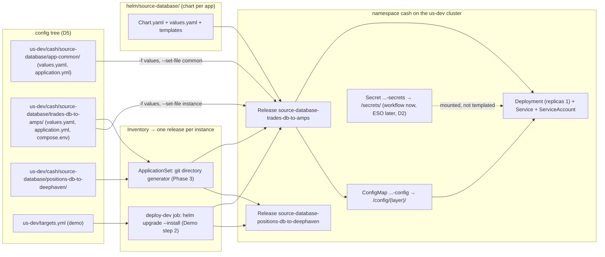
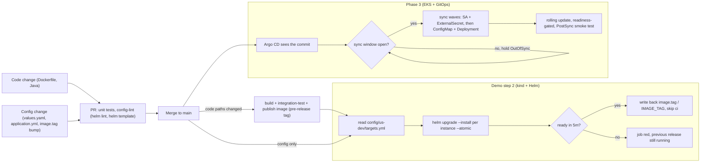
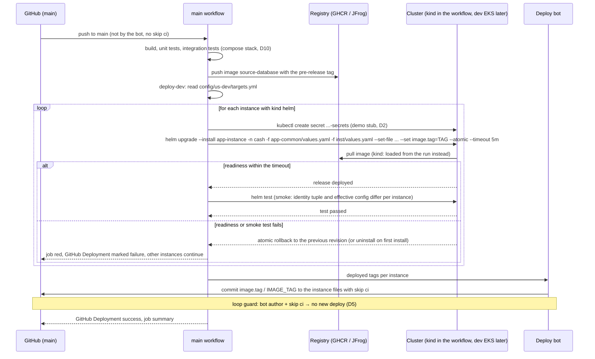

# D11 — Kubernetes Packaging and GitOps

| | |
|---|---|
| Document | D11 |
| Status | Draft v1 (phase 1) |
| Date | 2026-09-26 |
| Source brief | TODO.md v0.8, §2.4 (Kubernetes mapping), §4 (demo step 2, CD), §5.5–§5.7, §5.11 (kind tier), §5.12 (deploy mechanics), DL-29, DL-30, DL-31, DL-32, DL-33, DL-34, DL-38 |
| Related | D2 (`docs/02-secrets-and-vault.md`), D3 (`docs/03-docker-images.md`), D4 (`docs/04-versioning-and-image-tagging.md`), D5 (`docs/05-configuration-management.md`), D6 (`docs/06-runtime-operations.md`), D9 (`docs/09-cd-and-release-management.md`), D10 (`docs/10-containerised-ci-execution.md`) |

## 1. Purpose and scope

This document defines how a connector is packaged for Kubernetes and how it gets there: the Helm
chart per app, the mapping from one instance directory in the config tree to one Helm release with
its Deployment, ConfigMap and `Secret`, the `helm upgrade --install` path the demo uses from CI, and
the Argo CD delivery that replaces it on EKS — ApplicationSets, sync waves and sync windows.

In scope: chart structure and templates, values layering, file values for the `application.yml`
layers, release and namespace naming, the `deploy-dev` Helm path with kind, rollback, the
ApplicationSet layout and Argo CD sync policy. Out of scope, pointed to: the configuration model and
config-lint (D5), secret values and Vault (D2), image build, CA and registry (D3), tag computation
(D4), probes, resources, PodDisruptionBudgets and logging (D6), approval gates and promotion (D9),
the kind cluster lifecycle inside the workflow (D10).

Phasing:

- **Demo step 1 (compose)** — no Kubernetes artefacts are exercised; the chart may be authored.
- **Demo step 2 (kind + Helm)** — chart for `source-database` under `helm/<AppName>/`; a workflow
  creates a kind cluster, loads the images built in the run, runs `helm lint`, installs one release
  per AppInstance with `replicas: 1`, waits for readiness, smoke-tests, deletes the cluster;
  `deploy-dev` runs `helm upgrade --install` per instance into the target cluster.
- **Phase 3 (EKS + GitOps)** — Argo CD ApplicationSets generate one Application per instance
  directory; sync windows enforce deployment windows; secrets via ESO (D2).

## 2. Context and constraints

- Decided: Helm chart per app under `helm/<AppName>/` (DL-29); one Application / Helm release per
  AppInstance generated from the config tree, one Deployment, `replicas: 1` for now (DL-33); values
  layered `helm/<app>/values.yaml` → `app-common/values.yaml` → `<instance>/values.yaml`;
  `application.yml` layers passed as file values (`--set-file`, Argo CD `helm.fileParameters`) and
  rendered into a ConfigMap mounted under `/config/<layer>/`; `compose.env` values become container
  `env` in the instance values (§2.4, §5.6); `deploy-dev` uses `helm upgrade --install` in Demo step 2
  and Argo CD in Phase 3 (EKS + GitOps) (§4, §5.12, DL-30 decided for the demo).
- Chart location: §2.4 places the chart inside the subproject —
  `deephaven-connectors/source-database/helm/source-database/` — so a code change and its chart
  change ship in one PR. `helm/<app>` in commands below is that path (assumption, §9).
- Production is EKS (DL-02); dev and qa topology, cluster count and whether a controller is already
  provided are open (§8). kind inside the workflow stands in until a dev cluster exists (DL-32).
- Naming and length rules come from DL-37 (D5 §6.2); Helm's 53-character release-name limit is the
  binding constraint here.
- No cluster credentials for qa or prod in GitHub; on EKS the controller pulls (§5.12). The demo's
  `deploy-dev` job holds only the kind kubeconfig of its own run.
- Secrets never enter the chart's values; the chart references an existing `Secret` (D2).

## 3. Requirements

| "Must answer" bullet / requirement | Answered in |
|---|---|
| §5.5 Production tag is `image.tag` in the instance values; the deployer rolls the Deployment; same digest across envs | §6.2, §6.4, Figure 3 |
| §5.5 Drift detection by the controller (OutOfSync) and self-heal | §4.2, §6.6 |
| §5.5 Rollback = revert the bump; demo emergency path | §6.4 |
| §5.6 One ConfigMap per release from the `application.yml` layers via `--set-file` / `helm.fileParameters`, mounted `/config/<layer>/` | §6.3, Figure 1 |
| §5.6 `compose.env` values become container `env` in the instance values | §6.3 |
| §5.6 One release and one Deployment per AppInstance named `<app>-<instance>`, `replicas: 1` | §5, §6.2 |
| §5.6 config-lint renders `helm template` | §6.4 (checks in D5 §6.5) |
| §5.7 ApplicationSet (git directory × cluster generator) replaces `targets.yml` | §4.5, §6.6, Figure 1 |
| §5.7 Delivery: Argo CD / Flux / CI push; controller placement | §4.2, §4.3, §5 |
| §5.7 ConfigMap change → rolling restart; RBAC per env; audit; rollback | §6.5, D5 §4.6 |
| §5.7 Secrets never in the config repo; delivered per DL-31 | §6.3, D2 |
| §5.12 `helm upgrade --install ... --atomic --timeout 5m`; kind until a dev cluster exists; Argo CD auto-sync later | §6.4, §8, Figure 3 |
| §5.12 Deployment windows enforced in the cluster (sync windows); readiness-gated rollouts; post-sync smoke test | §6.6 |
| §2.4 Chart contents: `Chart.yaml`, `values.yaml`, templates (Deployment, Service, ConfigMap, probes) | §6.1 |
| §7 acceptance: mapping with one worked instance; GitOps sync flow; secrets delivery path | §6.2, §6.3, Figures 1–3 |
| DL-38 namespace layout | §4.1, §5 |
| DL-34 registry for EKS; probes / resources / PDB | §4.6 (pointers to D3, D6) |

## 4. Options considered

### 4.1 Namespace layout (DL-38)

| Option | Pros | Cons | When to prefer |
|---|---|---|---|
| **Namespace per `<flow>`** in each `<env>` cluster (`cash`, `deriv`, `swap`); release `<app>-<instance>` | matches the business boundary for RBAC, quotas, NetworkPolicies and sync windows (trading hours differ per flow); release names stay short; the same instance name may recur in another flow without collision | if dev / qa / prod share a cluster (§8), the stage must also appear (`cash-dev`) | leaning; one cluster per `<region>-<stage>` |
| Namespace per `<flow>-<app>` | tighter quotas per code base | many namespaces; RBAC by flow becomes a list | very large flows |
| One namespace per env | simplest | one blast radius for all flows; sync windows must filter by label | tiny estates |
| Namespace per instance | strongest isolation | hundreds of namespaces; shared services (AMPS clients) duplicated | regulated workloads only |

### 4.2 GitOps controller for EKS (DL-30) — Kubernetes-side differences (delivery comparison in D5 §4.5)

| Option | Pros | Cons | When to prefer |
|---|---|---|---|
| **Argo CD** | ApplicationSet generators map the tree to Applications; `AppProject` sync windows and RBAC per env / flow; sync waves and hooks (post-sync smoke test); UI shows desired vs live per instance; Image Updater for dev bumps | renders Helm itself (`helm template` semantics: no release secrets, hooks mapped to Argo phases); another operator unless provided by the platform | EKS in Phase 3 (EKS + GitOps), leaning |
| Flux | `HelmRelease` uses real Helm releases (history, `helm rollback` compatible); Kustomize-native; image automation | no sync windows (suspend / resume by schedule instead); no UI; one `HelmRelease` object per instance must be generated by us | platform standardises on Flux |
| CI push (`helm upgrade --install`) | nothing to install in the cluster; the demo's mechanism; real Helm history for `helm rollback` | cluster credentials in CI; no drift detection; pipeline is the audit trail | Demo step 2 (kind + Helm); dev until a controller exists |

### 4.3 Controller placement

| Option | Pros | Cons | When to prefer |
|---|---|---|---|
| **Per-cluster install** (one Argo CD per `<region>-<stage>` cluster) | prod isolated from dev; no cross-cluster credentials; regional independence | several UIs and RBAC sets; ApplicationSet per cluster | prod and regional isolation (§2.1) |
| Hub-and-spoke (one Argo CD managing every cluster) | one place to look; one ApplicationSet with a cluster generator | the hub holds credentials to prod; cross-region traffic | dev + qa clusters of one region |
| Hybrid: hub for non-prod, dedicated instance per prod cluster | balance of both | two patterns to document | recommended starting point |

### 4.4 Values layering

| Option | Pros | Cons | When to prefer |
|---|---|---|---|
| **`-f` chain**: chart `values.yaml` → `app-common/values.yaml` → `<instance>/values.yaml`, plus `--set image.tag` in the demo | mirrors the config tree; Helm merges maps deterministically (later file wins); Argo CD `valueFiles` supports the same chain | list-valued keys are replaced, not merged (keep `env:` as a map) | decided direction (§2.4) |
| One generated `values.yaml` per instance (CI merges the layers) | single file to inspect | a generator to maintain; the merged file is not what is reviewed | never |
| `--set` per key | no files | unreadable for anything structured | only `image.tag` at deploy time |

### 4.5 ApplicationSet generator (Phase 3)

| Option | Pros | Cons | When to prefer |
|---|---|---|---|
| **Git directory generator** over `config/<env>/*/*/*` excluding `app-common` and `_common`, in a **matrix with a cluster generator** matching `<env>` | the tree is the inventory; adding a directory adds an Application; `path[n]` segments give env, flow, app, instance | requires the directory depth to be exactly the identity tuple (config-lint enforces it) | recommended |
| List generator fed from `targets.yml` | explicit, works with an irregular tree | a file to keep in sync — what `targets.yml` retirement avoids | transition only |
| One hand-written Application per instance | fully explicit | does not scale past a handful | never |

### 4.6 Pointers for decisions owned elsewhere

- Secrets delivery in Kubernetes (DL-31): ESO leaning; this chart references an existing `Secret`
  and optionally renders an `ExternalSecret` — D2 §4.3, §6.6.
- Registry for EKS (DL-34): JFrog direct with `imagePullSecrets` vs an in-region ECR mirror; the chart
  exposes `image.repository` and `imagePullSecrets` so either works — D3.
- Probes, resources, PodDisruptionBudget, graceful shutdown, topology spread: values keys are defined
  here (§6.1), sizing and semantics in D6.
- ConfigMap change → rollout (checksum annotation vs Reloader): D5 §4.6; this chart implements the
  checksum annotation and the Reloader annotation behind a flag.

## 5. Decision and rationale

Decided (indicative):

| # | Decision | Consequence in this document |
|---|---|---|
| D1 | Helm chart per app under `helm/<AppName>/` (DL-29) | §6.1 fixes the chart contents; Kustomize is not used |
| D2 | One Application / Helm release per AppInstance, generated from the config tree, one Deployment, `replicas: 1` (DL-33) | §6.2 maps one directory to one release; a second replica is a values change, not a redesign |
| D3 | Values layered chart → `app-common` → `<instance>`; `application.yml` layers as file values into one ConfigMap mounted `/config/<layer>/`; `compose.env` values as container `env` (§2.4, §5.6) | §6.3 |
| D4 | `deploy-dev` runs `helm upgrade --install` in Demo step 2 (kind + Helm); Argo CD takes over in Phase 3 (EKS + GitOps) (§4, §5.12, DL-30 for the demo) | §6.4, §6.6, Figure 3 |

Recommended (to validate):

| # | Recommendation | Rationale | Alternative kept |
|---|---|---|---|
| R1 | Namespace per `<flow>` in each `<region>-<stage>` cluster; release and Deployment `<app>-<instance>` (DL-38) | RBAC, quotas, NetworkPolicies and sync windows follow the business flow; names stay under Helm's 53-character limit | §4.1 |
| R2 | Argo CD on EKS (DL-30), per-cluster install for prod, a hub for the non-prod clusters of a region (§4.3) | sync windows are the only controller feature that maps directly to trading-hours deployment windows; prod isolation | §4.2, §4.3 |
| R3 | ApplicationSet = git directory generator × cluster generator (§4.5); `targets.yml` retires when it goes live | the tree is the inventory; no second file to keep in sync | §4.5 |
| R4 | The chart never templates secret values: it mounts an existing `Secret <app>-<instance>-secrets` at `/secrets/` and, behind a flag, renders the `ExternalSecret` (D2) | one chart for demo and production; secrets stay out of values and git | D2 §4.3 |
| R5 | Checksum annotation on the pod template for the Helm-owned ConfigMap; Reloader annotation behind a flag for the ESO-owned `Secret` (D5 §4.6) | rollout exactly when config changes; rotations still reach pods | D5 §4.6 |
| R6 | `helm upgrade --install --atomic --timeout 5m` per instance from CI; `helm rollback` only as the demo's emergency path; on EKS rollback is a git revert | a failed deploy leaves the previous release running (§5.12); the controller owns state on EKS | §6.4 |

## 6. Conventions

### 6.1 Chart structure (`helm/<AppName>/`, here `deephaven-connectors/source-database/helm/source-database/`)

| Path | Purpose | Notes |
|---|---|---|
| `Chart.yaml` | `name: source-database` (= AppName), `version` = chart semver bumped when templates change, `appVersion` informational | the running image tag is `image.tag`, never `appVersion` |
| `values.yaml` | defaults: `replicaCount: 1`, image repository, ports, probes, resources, securityContext, `appConfig: {}`, `env: {}`, `secrets.existingSecret`, feature flags | skeleton in §8.2 |
| `values.schema.json` | JSON schema for values; `helm lint` validates every instance in config-lint | catches a misspelt key before deploy |
| `templates/_helpers.tpl` | names (`<app>-<instance>`), labels, checksum helper | release name comes from `helm upgrade` / Argo CD `releaseName` |
| `templates/serviceaccount.yaml` | `ServiceAccount <app>-<instance>` | Vault Kubernetes auth and IRSA identity (D2) |
| `templates/configmap.yaml` | one ConfigMap `<app>-<instance>-config` with a key per layer file | §6.3 |
| `templates/deployment.yaml` | `replicas` from values (1), `strategy` (`Recreate` by default for single-consumer connectors, D6 §6.10), checksum and Reloader annotations, `env` from the values map, ConfigMap items mounted per layer, `Secret` at `/secrets/`, startup / liveness / readiness probes on the actuator, resources, restricted securityContext, `terminationGracePeriodSeconds` | probe paths and sizing in D6 |
| `templates/service.yaml` | ClusterIP exposing the management port (metrics, health) | connectors have no ingress |
| `templates/externalsecret.yaml` | rendered when `secrets.externalSecret.enabled` | Phase 3 (EKS + GitOps), D2 |
| `templates/servicemonitor.yaml`, `templates/pdb.yaml` | rendered behind flags | PDB is meaningful only when `replicaCount > 1` (D6) |
| `templates/tests/smoke-test.yaml` | `helm test` Job: calls readiness and checks the identity tuple in the actuator output | doubles as the Argo CD PostSync hook |
| `templates/NOTES.txt`, `.helmignore` | usual Helm plumbing | — |

### 6.2 Worked mapping — `config/us-dev/cash/source-database/trades-db-to-amps/`

| Source in the tree | Kubernetes / Helm target | Value |
|---|---|---|
| directory `<AppName>/<AppInstance>` | Helm release, Deployment, Application (per-cluster Argo CD) | `source-database-trades-db-to-amps` |
| `<flow>` | namespace (R1) | `cash` |
| `<env>` | cluster: `targets.yml` (demo) or cluster generator label `env=us-dev` (Phase 3) | the `us-dev` cluster |
| identity tuple | labels on every object | `app.kubernetes.io/name=source-database`, `app.kubernetes.io/instance=source-database-trades-db-to-amps`, `platform.<company>.com/env=us-dev`, `.../flow=cash`, `.../app=source-database`, `.../instance=trades-db-to-amps` |
| `helm/source-database/values.yaml` | values layer 1 | chart defaults |
| `config/us-dev/cash/source-database/app-common/values.yaml` | values layer 2 (`-f`) | resources for this env + flow, `env: {TZ: America/New_York}` |
| `.../trades-db-to-amps/values.yaml` | values layer 3 (`-f`) | `image.tag`, `env: {APP_ENV, APP_FLOW, APP_NAME, APP_INSTANCE, JAVA_OPTS, LOG_LEVEL_ROOT}` |
| `config/_common/source-database/application.yml` | `--set-file appConfig.platform` → ConfigMap key `platform.application.yml` → `/config/platform/application.yml` | optional |
| `config/us-dev/_common/application.yml` | `appConfig.env` → `/config/env/application.yml` | optional |
| `.../app-common/application.yml` | `appConfig.common` → `/config/common/application.yml` | required |
| `.../trades-db-to-amps/application.yml` | `appConfig.instance` → `/config/instance/application.yml` | required |
| `.../app-common/logback.xml` | `appFiles.common.logback_xml` → `/config/common/logback.xml` (key → file name mapping in the chart, verify `--set-file` key escaping) | optional |
| `compose.env` app-facing variables (D5 §6.3) | `env:` map in the instance values → container `env` | identity, `JAVA_OPTS`, `TZ`, `LOG_LEVEL_ROOT` |
| `IMAGE_TAG` in `compose.env` | `image.tag` in the instance values | same value, written back together by `deploy-dev` |
| not in git | `Secret source-database-trades-db-to-amps-secrets` → `/secrets/` (demo: created by the workflow; Phase 3: ESO) | D2 |
| chart | `ServiceAccount`, `Service`, `ConfigMap source-database-trades-db-to-amps-config` | names derive from the release |

The same chart with `positions-db-to-deephaven` yields a second release in the same namespace; the
two differ only in values layer 3 and the instance `application.yml` (D5 §6.3).

### 6.3 ConfigMap, env and `Secret` mechanics

| Concern | Convention |
|---|---|
| ConfigMap keys | `<layer>.application.yml` for the four layers; `<layer>.<file>` for extra files; projected with `items[].path: <layer>/<file>` into one volume mounted read-only at `/config/` |
| Missing optional layer | the chart omits the key; Spring's `optional:` import skips it (D5 §6.1) |
| Rollout on config change | pod-template annotation `checksum/config` = sha256 of the rendered ConfigMap; a `Secret` rotation is caught by the Reloader annotation when `reloader.enabled` (D5 §4.6) |
| `env` | a **map** (`env: {APP_ENV: us-dev}`) so Helm deep-merges the layers; the chart renders it as a list; secret-bearing names (`SPRING_*`, `CONNECTOR_*_PASSWORD`) are rejected by `values.schema.json` |
| `Secret` | `secrets.existingSecret: <app>-<instance>-secrets`, mounted at `/secrets/` with `defaultMode: 0400`; keys are Spring property names (D2 §6.4); `optional: false` so a missing `Secret` blocks the pod visibly |
| Image | `image.repository` (`ghcr.io/<org>/deephaven-connectors/source-database` in the demo, `artifactory.<company>.com/docker-prod-local/deephaven-connectors/source-database` or the ECR mirror on EKS, DL-34) + `image.tag`; `image.digest` optional for qa / prod pinning (DL-20) |
| Two consumers, one file set | compose mounts the same directories directly; config-lint renders `docker compose config` and `helm template` from the same tree (D5 §6.5) |

### 6.4 Helm commands (Demo step 2 and dev until a controller exists)

| Step | Command (illustrative) | Notes |
|---|---|---|
| Lint per instance | `helm lint helm/source-database -f <app-common>/values.yaml -f <inst>/values.yaml --set-file appConfig.common=... --set-file appConfig.instance=...` | in config-lint (D5 check 12) |
| Render | `helm template source-database-trades-db-to-amps helm/source-database -n cash ...same flags...` | diffed in PRs; used by the parity check |
| Install / upgrade | `helm upgrade --install source-database-trades-db-to-amps helm/source-database -n cash --create-namespace ...values and files... --set image.tag=<tag> --atomic --timeout 5m` | `--atomic` implies `--wait`; on failure the previous revision is restored (a failed first install is removed) |
| Readiness | `kubectl -n cash rollout status deployment/source-database-trades-db-to-amps --timeout=5m` | redundant with `--wait`, kept for the job log |
| Smoke test | `helm test source-database-trades-db-to-amps -n cash` | proves the two instances differ (§7 acceptance) |
| History / rollback | `helm history <release> -n cash`; `helm rollback <release> <revision> -n cash --wait` | emergency only; the normal rollback is a git revert redeployed by `deploy-dev` |
| Uninstall | `helm uninstall <release> -n cash` | kind: the whole cluster is deleted instead (D10) |

### 6.5 Rollout, drift and rollback on EKS

| Concern | Convention |
|---|---|
| Sync policy | dev: automated with `prune` and `selfHeal`; qa / prod: automated but only inside sync windows, `prune` on, `selfHeal` on (manual `kubectl` edits are reverted — the audit trail is git) |
| Drift | Argo CD reports OutOfSync per Application; alerting on OutOfSync or Degraded longer than the window |
| Blast radius | one Application = one instance; a bad commit can break at most the instances it touches; `app-common` edits touch every instance of that app in the env + flow — CODEOWNERS review (D5 §6.7) |
| Rollback | revert the commit; the controller syncs the previous rendering; the previous image tag is still in the registry (retention protects tags referenced by the config tree, D4) |
| RBAC | one `AppProject` per `<env>-<flow>`: source repo and paths restricted to `config/<env>/<flow>/**` and the chart paths; destinations restricted to namespace `<flow>` of the `<env>` cluster; roles per team (D9) |

### 6.6 ApplicationSet, sync waves and sync windows (Phase 3)

Illustrative ApplicationSet for one env (per-cluster Argo CD; a hub adds the cluster generator):

```yaml
apiVersion: argoproj.io/v1alpha1
kind: ApplicationSet
metadata: { name: us-dev-connectors, namespace: argocd }
spec:
  generators:
    - git:
        repoURL: https://github.com/<org>/<repo>.git
        revision: main
        directories:
          - path: config/us-dev/*/*/*
          - { path: config/us-dev/*/*/app-common, exclude: true }
          - { path: config/us-dev/_common, exclude: true }
  template:
    metadata: { name: "{{path[3]}}-{{path[4]}}" }               # <app>-<instance>
    spec:
      project: "us-dev-{{path[2]}}"                              # AppProject per env + flow
      source:
        repoURL: https://github.com/<org>/<repo>.git
        targetRevision: main
        path: deephaven-connectors/{{path[3]}}/helm/{{path[3]}}  # chart path (assumption, §2)
        helm:
          releaseName: "{{path[3]}}-{{path[4]}}"
          valueFiles: [ "../../../../config/us-dev/{{path[2]}}/{{path[3]}}/app-common/values.yaml", "../../../../{{path}}/values.yaml" ]
          fileParameters:
            - { name: appConfig.common,   path: "../../../../config/us-dev/{{path[2]}}/{{path[3]}}/app-common/application.yml" }
            - { name: appConfig.instance, path: "../../../../{{path}}/application.yml" }
      destination: { name: us-dev, namespace: "{{path[2]}}" }   # namespace per flow
      syncPolicy: { automated: { prune: true, selfHeal: true }, syncOptions: [ CreateNamespace=true ] }
```

Relative `valueFiles` / `fileParameters` paths outside the chart directory but inside the same
repository are used here; verify against the installed Argo CD version (a multi-source Application
is the fallback).

| Concern | Convention |
|---|---|
| Application name | `<app>-<instance>` per-cluster; `<env>-<app>-<instance>` on a hub (label-value limit 63 → still within budget with AppInstance ≤ 32) |
| Sync waves | `-1`: ServiceAccount, `ExternalSecret` (the `Secret` must exist before the pod); `0`: ConfigMap, Deployment, Service; PostSync hook: the smoke-test Job |
| Sync windows | on the `AppProject`: `deny` during trading hours per flow and region, `allow` in the deployment window (for example `cash` in `us-prod`: weekdays 18:30–21:30 `America/New_York`); `manualSync: false` in prod; region ordering (`jp` before `us`) is a promotion rule in D9, not a window |
| Image bumps in dev | the `deploy-dev` write-back until Argo CD Image Updater (or a bot PR) replaces it (D4, D9) |
| Retiring `targets.yml` | delete the env's file once its ApplicationSet is live; config-lint check 11 switches to the ApplicationSet dry-run (D5 check 13) |

## 7. Diagrams

### 7.1 Structural — config tree → inventory → Helm release per instance → Kubernetes objects



*Figure 1 — One instance directory becomes one release; the chart is shared, the values and file layers are not.*

Whether the inventory is `targets.yml` read by CI or an ApplicationSet enumerating directories, the
result is the same set of releases, so the demo and Phase 3 (EKS + GitOps) produce identical objects
in the cluster. The `Secret` enters from the side: never rendered from values.

### 7.2 Flow — config or image change → PR → lint → merge → deploy or sync → rolling update



*Figure 2 — Image and config changes share one path; only the last hop differs between the demo and EKS.*

A code change adds a build and a new tag; a config-only change skips straight to deployment. On
EKS the commit itself is the deploy intent and the window decides when it lands; in the demo the
`deploy-dev` job lands it immediately and records the tag back into the tree.

### 7.3 Sequence — merge to `main` → build → publish → `helm upgrade --install` → readiness → smoke test → write-back



*Figure 3 — The `main` workflow deploys what it just built and leaves the record in git.*

Each instance is its own `helm upgrade`, so a failure is confined to that release and the previous
revision keeps running. The write-back is the last step and is authored by the bot, which is what
the loop guard keys on.

## 8. How the demo skeleton implements it

### 8.1 File pointers by phase

| File (planned tree, §2.3 / §2.4) | Role | Phase |
|---|---|---|
| `deephaven-connectors/source-database/helm/source-database/` (`Chart.yaml`, `values.yaml`, `values.schema.json`, `templates/*`) | the first chart; `source-kafka` and `source-amps` copy it | Demo step 2 (kind + Helm) |
| `config/us-dev/cash/source-database/app-common/values.yaml`, `.../trades-db-to-amps/values.yaml`, `.../positions-db-to-deephaven/values.yaml` | values layers 2 and 3 | Demo step 2 (kind + Helm) |
| `config/us-dev/targets.yml` (`kind: helm`, `cluster`, `namespace`) | inventory for `deploy-dev` | Demo step 2 (kind + Helm) |
| `.github/workflows/pr.yml` (`config-lint`: `helm lint`, `helm template` per instance) | D5 check 12 | Demo step 2 (kind + Helm) |
| `.github/workflows/main.yml` (`kind-deploy` job: create cluster, load images, install both releases, readiness, `helm test`, delete cluster — lifecycle in D10, job name as in D7) | acceptance criterion "Demo step 2" of §7 | Demo step 2 (kind + Helm) |
| `.github/workflows/main.yml` (`deploy-dev` job, Helm adapter) | §6.4 commands, write-back with loop guard | Demo step 2 (kind + Helm) |
| `.github/actions/helm-deploy-instance/` (composite action: resolve paths from the identity tuple, build the flag list, run upgrade, rollout status, test) | one place for the command of §8.3 | Demo step 2 (kind + Helm) |
| `deephaven-connectors/source-database/helm/source-database/templates/externalsecret.yaml`, `servicemonitor.yaml`, `pdb.yaml` | flags off in the demo | Phase 3 (EKS + GitOps) |
| ApplicationSet and `AppProject` manifests — proposed location `config/<env>/_argocd/` next to `targets.yml` (assumption) | replaces `targets.yml` | Phase 3 (EKS + GitOps) |
| `docs/adr/` | ADRs for DL-30 (EKS), DL-38, DL-34 once confirmed | phase 1 review |

### 8.2 Illustrative — chart `values.yaml` skeleton (`helm/source-database/values.yaml`)

```yaml
replicaCount: 1                       # DL-33: one replica per instance for now
image:
  repository: ghcr.io/<org>/deephaven-connectors/source-database   # JFrog or ECR mirror on EKS (DL-34)
  tag: ""                             # always set by the instance values / --set image.tag
  digest: ""                          # optional pin for qa / prod (DL-20)
  pullPolicy: IfNotPresent
imagePullSecrets: []
serviceAccount: { create: true }
identity: { env: "", flow: "", app: source-database, instance: "" }   # rendered as labels; must equal env below
env: {}                               # map → container env; instance values set APP_ENV, APP_FLOW, APP_NAME, APP_INSTANCE, JAVA_OPTS, TZ, LOG_LEVEL_ROOT
appConfig: {}                         # platform | env | common | instance → /config/<layer>/application.yml (--set-file)
appFiles: {}                          # <layer>: { <key>: <content> } → /config/<layer>/<file>
secrets:
  existingSecret: ""                  # defaults to <release>-secrets; mounted at /secrets/ (D2)
  externalSecret: { enabled: false, storeRef: "", vaultPath: "" }   # Phase 3
service: { port: 8080 }               # HTTP / actuator port: health, metrics (D3 EXPOSE 8080, D6 §6.9)
probes:                               # paths and timings sized in D6
  startup:   { path: /actuator/health/liveness,  failureThreshold: 24, periodSeconds: 5 }   # 2-minute budget (D6 §6.9)
  readiness: { path: /actuator/health/readiness, periodSeconds: 10 }
  liveness:  { path: /actuator/health/liveness,  periodSeconds: 10 }
resources:
  requests: { cpu: 250m, memory: 1Gi }
  limits:   { memory: 1Gi }           # requests == limits; JVM -XX:MaxRAMPercentage=70 in JAVA_OPTS (D3, D6 §6.10)
strategy: { type: Recreate }          # single-consumer default; RollingUpdate only for idempotent pipelines (D6 §6.10)
terminationGracePeriodSeconds: 30
podSecurityContext: { runAsNonRoot: true, seccompProfile: { type: RuntimeDefault } }
securityContext: { readOnlyRootFilesystem: true, allowPrivilegeEscalation: false, capabilities: { drop: [ALL] } }
reloader: { enabled: false }          # Reloader annotation for the ESO-owned Secret (D5 §4.6)
serviceMonitor: { enabled: false }
podDisruptionBudget: { enabled: false }
```

### 8.3 Illustrative — `helm upgrade --install` for one instance (as run by `deploy-dev`)

```bash
#!/usr/bin/env bash
# illustrative — deploy one AppInstance; arguments come from targets.yml and the identity tuple
set -euo pipefail
ENV=us-dev FLOW=cash APP=source-database INST=trades-db-to-amps TAG="$1"      # TAG = image built in this run
CHART="deephaven-connectors/${APP}/helm/${APP}"
COMMON="config/${ENV}/${FLOW}/${APP}/app-common"
INSTD="config/${ENV}/${FLOW}/${APP}/${INST}"
RELEASE="${APP}-${INST}"; NS="${FLOW}"                                         # DL-38 leaning

flags=( -f "${COMMON}/values.yaml" -f "${INSTD}/values.yaml"
        --set-file "appConfig.common=${COMMON}/application.yml"
        --set-file "appConfig.instance=${INSTD}/application.yml"
        --set "image.tag=${TAG}" )
[[ -f "config/_common/${APP}/application.yml" ]] && flags+=( --set-file "appConfig.platform=config/_common/${APP}/application.yml" )
[[ -f "config/${ENV}/_common/application.yml" ]] && flags+=( --set-file "appConfig.env=config/${ENV}/_common/application.yml" )

helm lint "${CHART}" "${flags[@]}"
helm upgrade --install "${RELEASE}" "${CHART}" -n "${NS}" --create-namespace \
  "${flags[@]}" --atomic --timeout 5m
kubectl -n "${NS}" rollout status "deployment/${RELEASE}" --timeout=5m
helm test "${RELEASE}" -n "${NS}"
echo "${INST}=${TAG}" >> deployed.txt                                          # consumed by the write-back step
```

The kind job of Demo step 2 runs the same script against a cluster created in the run (images
loaded with `kind load docker-image`, D10); the `deploy-dev` job runs it against the target in
`targets.yml`; in Phase 3 (EKS + GitOps) the ApplicationSet of §6.6 renders the same flags.

## 9. Open items

| Item | Status | Needed for |
|---|---|---|
| DL-30 GitOps controller on EKS (Argo CD leaning) and hub vs per-cluster placement | open for EKS | Phase 3 (EKS + GitOps) |
| DL-31 secrets delivery (ESO leaning; chart flag) | open | Phase 3 (EKS + GitOps), D2 |
| DL-34 registry for EKS (JFrog direct vs ECR mirror) | open | `image.repository`, `imagePullSecrets` values |
| DL-38 namespace layout (per flow leaning) | open | `targets.yml` defaults, `AppProject` destinations |
| DL-20 tag vs digest pinning per env | open | `image.digest` usage in qa / prod values |
| DL-09 bump delivery for qa / prod | open for qa / prod | D9 |
| DL-32 Kubernetes test tier beyond kind (dev EKS namespace) | open for Phase 3 | D10 |
| Chart location `<subproject>/helm/<AppName>/` vs a top-level `helm/` (§2.4 vs §4 wording) | assumption | chart path in `deploy-dev` and the ApplicationSet |
| AppInstance length budget ≤ 32 (adopted by the brief in v0.9) | resolved | release and Application names |

§8 questions this document depends on: EKS topology (one cluster per `<region>-<stage>` or shared
clusters with a namespace per stage — decides the cluster generator and whether the stage joins the
namespace name); whether Argo CD or Flux is already provided and who runs it; image pulls (JFrog
reachable or ECR mirror; amd64 vs arm64 nodes); pod security standards, IRSA, service mesh or
ingress requirements; whether CI may create ephemeral namespaces on dev EKS; availability of a
persistent dev cluster before EKS; change-management windows per region and flow.

Follow-ups: verify Argo CD `valueFiles` / `fileParameters` relative paths outside the chart directory
(fallback: multi-source Application); write `values.schema.json` before the first kind run; confirm
Reloader (or an equivalent) is available on the platform; agree the `helm test` smoke-test content
with D10; write ADRs for DL-30 (EKS), DL-34 and DL-38.
