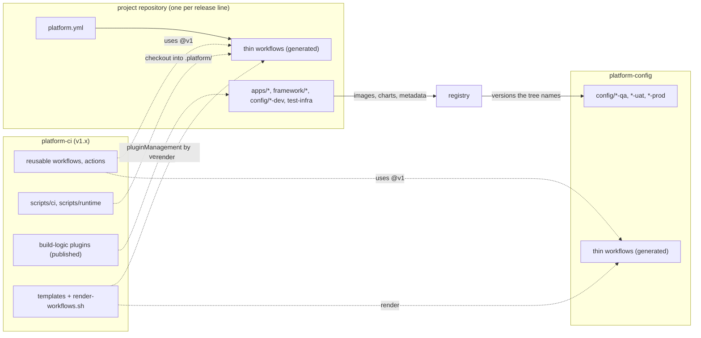
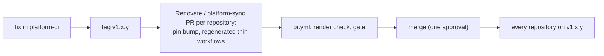

# D12 — Repository layout and pipeline contract (one pipeline for many repositories)

| | |
|---|---|
| Document | D12 |
| Status | Draft v1.2 (brief v1.8): `framework/` replaces `libs/` (DL-43); the cluster layer `<env>/<flow>/_common/` replaces the env layer (DL-44) |
| Date | 2026-10-04 |
| Source brief | TODO.md v1.7, §2.3, §2.4, §5.1, §5.7, §5.9, §6 (DL-01, DL-03, DL-06, DL-07, DL-39, DL-40, DL-41, DL-42, DL-43, DL-44) |
| Related | D1 (`docs/01-repository-and-build.md`), D5 (`docs/05-configuration-management.md`), D7 (`docs/07-ci-pipeline-github-actions.md`), D9 (`docs/09-cd-and-release-management.md`); ADR DL-42 (`docs/adr/DL-42-repository-layout-and-pipeline-contract.md`) |

## 1. Purpose and scope

This document fixes how a repository must look so that **one** set of GitHub workflows, composite
actions, CI scripts and Gradle convention plugins — kept in one place and versioned — serves every
repository of the platform with the least customisation per repository: directories and file names the
pipeline may assume, the Gradle task names it may call, the deploy-time files it reads, a small manifest
for what no convention can derive, and how the manual workflows' drop-down options are produced without
hand-editing YAML. It records the decision of DL-42.

In scope: the three repository kinds and their layouts, the manifest, the pipeline contract, the
generation of the thin trigger workflows, how a repository consumes the platform repository, what
legitimately differs per repository, and how the demo monorepo maps onto all of it. Out of scope: the
contents of the reusable workflows (D7), the config layers and the inventory schema (D5), versioning
(D4), the deploy mechanics (D9, DL-40, DL-41).

## 2. Context and constraints

- Several repositories will exist: the connector family, the Deephaven server, a configuration
  repository for the promoted environments, more projects later. Each is a Gradle monorepo of its own
  (DL-01); git submodules are excluded everywhere (DL-01).
- Decided conventions already fix most of a repository's shape: Maven source layout under Gradle,
  the hybrid release lines (DL-03), the config tree with four layers (DL-06, DL-07, D5 §6.1), one
  inventory per flow (DL-39, DL-41), the deployment record without a write-back (DL-40), versions from
  git tags (DL-04), images from the company base image (DL-13, DL-28).
- GitHub Actions facts that shape the design: reusable workflows and composite actions may live in
  another repository and are referenced by a tag or SHA; `workflow_dispatch` `choice` inputs are static
  YAML — there is no dynamic drop-down; events created with `GITHUB_TOKEN` start no workflows.
- The owner's goals: reuse `.github/workflows`, `.github/actions` and `scripts/ci` as much as possible;
  externalise variables into configuration; keep per-repository customisation to a minimum, the
  drop-down options included.

## 3. Requirements

| Requirement | Answered in |
|---|---|
| Every repository has the same directory structure: docs, Gradle build files, scripts, `src/main` / `src/test` / `src/integrationTest`, the Spring Boot `application.yml`, config directories, Dockerfile, compose template, `compose.env`, `app.env`, `vault.env`, `workflows-config.yml` | §6.2, §6.5 |
| The same workflows, actions and CI scripts serve every repository | §6.1, §6.4, §6.7, §6.9 |
| Variables live in configuration, not in workflow files | §6.6, §6.7 |
| Drop-down options of the manual workflows follow the configuration without hand-editing | §6.8 |
| A new repository is pipeline-complete with minimal work | §6.10, §6.11 |
| The demo monorepo keeps working without a split | §8 |

## 4. Options considered

### 4.1 Where the pipeline lives

| Option | Pros | Cons | When to prefer |
|---|---|---|---|
| Copy `.github/` and `scripts/ci/` into every repository | fastest first day; each team owns its copy | N copies drift within months; a pipeline fix is a pull request per repository; no contract, so every copy grows local assumptions | never beyond a second repository |
| One monorepo for everything | no contract needed; one pipeline by construction | approvals, CODEOWNERS and release cadence do not scale across teams; DL-01 chose one monorepo per deliverable | small estates with one team |
| **A versioned `platform-ci` repository consumed by every repository under a contract** | one fix, one pull request; the contract is explicit and lint-checked; repositories pin a major and upgrade deliberately | the contract must be written and kept; a major bump is a migration | several repositories, several teams (this platform) |
| Organisation ruleset with a required workflow | enforces that the gate runs everywhere | enforces presence, not shape; no reuse of the jobs themselves | complement to the contract, not a substitute |

### 4.2 How the drop-downs follow the configuration

| Option | Pros | Cons | When to prefer |
|---|---|---|---|
| Hand-edited `choice` lists in each repository | nothing to build | drifts from the tree; the one place per-repository YAML keeps growing | never |
| `string` inputs validated at run time | no list to maintain | no drop-down: typos fail only after the run started | fallback for rarely used inputs |
| **Lists generated from the manifest and the tree, lint-checked for staleness** | a drop-down that is always right; adding a flow is a directory plus a regeneration | a generator to keep; a lint check | the manual deploy and rollback workflows |

## 5. Decision and rationale

DL-42 (v1.6): three repository kinds — `platform-ci` (versioned), one project repository per release
line, `platform-config` for the promoted environments; a fixed project layout; three deploy-time env
files with one reader each; a manifest `platform.yml` holding only what the tree cannot derive; the
Gradle task names as the contract between the shared workflows and every repository; thin trigger
workflows, drop-downs included, generated from the manifest and the tree and lint-checked.

Rationale: reuse across repositories is only possible when every repository looks the same to the
pipeline, and a contract that is written down and checked is cheaper than N copies that drift. Deriving
everything derivable from directories keeps the manifest tiny and makes "add a flow" or "add an app" a
directory, not a configuration change in three places.

## 6. Conventions

### 6.1 Three kinds of repository

| Repository | Holds | Versioned by | Deploys |
|---|---|---|---|
| `<org>/platform-ci` | the reusable workflows (`_*.yml`), composite actions, `scripts/ci/`, `scripts/runtime/` (what ships to the boxes), the Gradle convention plugins (`build-logic`, published to the Maven repository), the library chart, the shared compose template, the thin-workflow templates and `render-workflows.sh`, the design documents and ADRs, the `gha-*` skills | tags `v<major>.<minor>.<patch>`; consumers pin the major (`@v1`) | nothing |
| `<org>/<project>` — one per release line (`deephaven-connectors`, `deephaven-server`) | the apps of the project as Gradle subprojects, their Dockerfiles, charts and compose overrides, the `config/` tree of the envs the project deploys itself (dev), the integration-test infrastructure, the repository's own docs | its own tags `vX.Y.Z` (D4) | its dev envs, per flow policy (DL-40) |
| `<org>/platform-config` | `config/` of the promoted envs (qa, uat, prod) for every project; `values.yaml` / `compose.env` carry tag **and** digest | pull requests only (DL-09, DL-21) | qa / uat / prod on bump-PR merge (D9) |

One project per repository makes the version, the image namespace, the hotfix line and the `project`
drop-down implicit. A repository may still hold several apps released in lockstep; a monorepo that holds
two release lines (the demo) declares two `projects` in its manifest (§6.6).

### 6.2 Layout of a project repository

```
<project>/
├── platform.yml                       the manifest (§6.6)
├── settings.gradle.kts                pluginManagement: the convention plugins by version; includes apps/* and framework/*
├── build.gradle.kts  gradle.properties  gradle/ (wrapper, libs.versions.toml)
├── .github/
│   ├── workflows/                     thin and generated (§6.8): pr.yml main.yml release.yml release-please.yml nightly.yml deploy.yml rollback.yml
│   ├── CODEOWNERS                     hand-written
│   └── affected-map.yml               generated from the layout (one glob per app)
├── docs/                              README, runbooks, docs/adr/ of this repository
├── apps/<AppName>/                    one Gradle subproject per deployable app (`apps_dir`; the demo keeps deephaven-connectors/)
│   ├── build.gradle.kts               plugins { id("buildlogic.spring-boot-app") } and little else
│   ├── src/main/java
│   ├── src/main/resources/application.yml      layer 1: jar defaults and the import list of the layers (D5 §6.1)
│   ├── src/test/java                  unit tests
│   ├── src/integrationTest/java       component integration tests against the compose stack — a Gradle source set
│   │                                  beside src/test/, never under src/main/ (Maven has no standard slot for them)
│   ├── docker/Dockerfile              FROM the company runtime base image (D3); nothing app-specific but the jar
│   ├── docker/docker-compose.yml      only when the app needs more than the shared template — an override
│   └── helm/<AppName>/                a thin wrapper around the platform library chart (D11)
├── framework/<name>/                  the shared code the apps are built on (connectors-framework): built and published,
│                                      never deployed, never an image; a change here builds everything (DL-43)
├── config/                            the tree of the envs THIS repository deploys itself (dev); same shape as platform-config
│   ├── _common/<AppName>/application.yml                       layer 2  platform-wide app defaults
│   └── <env>/                                                  nothing is shared at the env level (DL-44)
│       ├── known_hosts                                         pinned SSH host keys of the boxes (DL-35)
│       └── <flow>/                                             one business flow in one env = one cluster
│           ├── _common/application.yml                         layer 3  cluster-wide (shared endpoints, log shipping, TZ, Vault address)
│           ├── workflows-config.yml                            boxes, deploy policy, instance → box (D5 §6.6; DL-40, DL-41)
│           └── <AppName>/
│               ├── app-common/{application.yml, values.yaml, logback.xml, app.env}                   layer 4
│               └── <AppInstance>/{application.yml, values.yaml, compose.env, app.env, vault.env}     layer 5 + deploy-time env
├── test-infra/                        compose stacks and test data for the integration tests (D8, D10)
└── scripts/                           app-specific helpers only (a custom smoke check); platform scripts are never copied here
```

Removed by this layout, compared with the demo of v1.4: the per-app `scripts/run-compose.sh` wrappers
(the deployer calls `<version>/scripts/run-compose.sh <AppName> <AppInstance> <command>` on a box,
DL-41 short form) and most per-app compose templates (the demo's three are identical apart from
`${APP_NAME}`; the template lives in `platform-ci/scripts/runtime/`, an app ships
`docker/docker-compose.yml` only as an override).

### 6.3 Layout of the configuration repository

```
platform-config/
├── platform.yml                       kind: config; the projects it serves
├── .github/workflows/                 generated: pr.yml (config-lint, parity), deploy.yml (plan from Deployments → _deploy-env), rollback.yml
├── .github/CODEOWNERS                 per env: config/*-qa/**, config/*-uat/**, config/*-prod/**
├── config/
│   ├── _common/<AppName>/…            layer 2, promoted copy
│   └── <env>/                         us-qa, us-uat, us-prod, jp-… — the same shape as §6.2, tag and digest per instance
└── docs/
```

Config-lint runs here against **published** artefacts — the apps' configuration metadata and the charts
at the versions the tree names — never against a source checkout.

### 6.4 Layout of the platform repository

```
platform-ci/
├── .github/workflows/_*.yml           reusable workflows: build, integration-test, docker-publish, kind-deploy, deploy-dev, deploy-env, config-lint, release, retention
├── .github/actions/                   composite actions: setup-build-env, registry-login, kind-cluster, helm-deploy-instance, detect-affected
├── scripts/ci/                        affected.py, set-image-tag.sh, deploy-plan.sh, retention.sh, render-workflows.sh …
├── scripts/runtime/                   run-compose.sh, smoke.sh, pool-deploy.sh, docker-compose.yml — what ships in the version directory (DL-41)
├── build-logic/                       the Gradle convention plugins, published as com.<company>.buildlogic:<version>
├── helm/platform-app/                 the library chart every app chart wraps
├── templates/                         thin trigger workflows and the platform.yml skeleton that render-workflows.sh fills
├── docs/                              D0–D12, ADRs
└── .claude/skills/gha-*               the skills
```

### 6.5 The deploy-time env files

Each file has one reader and an allow-list; config-lint check 5 validates each against its own list and
check 9 (secret scan) covers all three. None ever holds a secret.

| File | Read by | Holds | Never |
|---|---|---|---|
| `compose.env` | compose only | how to run the container: `IMAGE_REPO`, `IMAGE_TAG`, the identity `APP_*`, `*_HOST_PORT`, `MEM_LIMIT`, `LOGS_DIR`, `DATA_DIR` | anything the process reads |
| `app.env` | the process (`env_file:` into the container; `app-common/app.env` first, then `<AppInstance>/app.env` — later files override) | `JAVA_OPTS`, `TZ`, `LOG_LEVEL_ROOT` | a Spring property name — application configuration stays YAML (D5 R3) |
| `vault.env` | the Vault client or agent | `VAULT_ADDR`, `VAULT_NAMESPACE`, the auth method and role, secret mount paths | a token or secret-id — those come from the box (`~/shared/<project>/`) or the Vault agent (D2) |

In dev, `compose.env` says `IMAGE_TAG=main` and `values.yaml` says `image.tag: main` (DL-40); in the
promoted envs both carry an immutable release tag and `values.yaml` the digest (DL-20, check 10).

### 6.6 The manifest `platform.yml`

```yaml
platform: v1                      # the platform-ci major this repository follows
kind: app                         # app | config | library
registry: ghcr.io/<org>           # or artifactory.company.com/docker-dev-local
projects:                         # one entry per release line; a single-project repository has one
  - name: deephaven-connectors
    apps_dir: apps                # the demo monorepo: deephaven-connectors
    kinds: [compose, helm]
  - name: deephaven-server        # the demo only: an independent line in the same repository (DL-03)
    apps_dir: deephaven-server
    tag_prefix: deephaven-server/
dev_envs: [us-dev]                # envs this repository deploys itself; promoted envs live in platform-config
notify: "#platform-cash"
```

| Key | Meaning | Default |
|---|---|---|
| `platform` | the `platform-ci` major the thin workflows pin; the reusable workflows assert it and fail with a pointer to the migration notes on a mismatch | required |
| `kind` | `app` (builds, publishes, deploys its dev envs), `config` (lints and deploys promoted envs), `library` (builds and publishes only) | required |
| `registry` | image namespace: images are `<registry>/<project>/<AppName>` | required for `app` |
| `projects[].name` | the release line: tags `vX.Y.Z` (with `tag_prefix` for an independent line), image path, the `project` drop-down | required for `app` |
| `projects[].apps_dir` | where the apps live; an app is `<apps_dir>/<AppName>/docker/Dockerfile` | `apps` |
| `projects[].kinds` | the deploy kinds the apps support | `[compose, helm]` |
| `dev_envs` | the envs this repository deploys itself | every `config/*-dev/` directory |
| `notify` | the channel of the deploy notifications (D9 §6.15) | none |

Everything else is derived, never declared twice: apps from `<apps_dir>/*/docker/Dockerfile`, libraries
from `framework/*`, envs, flows and instances from the `config/` directories, deploy policy and boxes from the
flow's `workflows-config.yml`, versions from git tags. **A value that can be derived from the tree is not
a manifest key.**

### 6.7 The pipeline contract

What the shared workflows may assume of every repository, and who provides it:

| The pipeline calls or expects | Provided by |
|---|---|
| Gradle tasks `build`, `test`, `integrationTest`, `configLint`, `printVersion`, `dockerBuild`, `dockerPush`, `publish`, with their outputs where the convention plugins put them | the convention plugins, applied by version — the task names are the contract between workflows and repositories |
| versions from git tags: `vX.Y.Z`, `<next>-rc.<n>` on `main`, `<next-patch>-rc.<n>` on `hotfix/**`, `pr-<n>-<sha7>`; one release line per project, `tag_prefix` for an independent line | `buildlogic.git-version` (DL-04, DL-05) |
| images `<registry>/<project>/<AppName>` with the tag set of D4 §6.2 | manifest `registry` and `projects[].name` |
| an app is `<apps_dir>/<AppName>/docker/Dockerfile`, optionally with `helm/<AppName>/` | convention |
| `config/<env>/<flow>/<AppName>/<AppInstance>/` with the four layers and the inventory per flow | convention (D5 §6.1, §6.6) |
| the branch model: `main`, `hotfix/<x.y>.x`, release pull requests by release-please on both | D9 §6.11, D4 §6.6 |
| GitHub Environments named like the envs; secrets `DEV_DEPLOY_SSH_KEY`, `DEV_KUBECONFIG`, the bump App id and key | the repository settings checklist (§6.10) |
| the `ci:full` label; CODEOWNERS on `config/*-qa/**` and `config/*-prod/**`; the ruleset on `main` and `hotfix/**` | the repository settings checklist (§6.10) |

### 6.8 Thin, generated trigger workflows and their drop-downs

A repository's `.github/workflows/*.yml` are a few lines each: the triggers, `uses: <org>/platform-ci/.github/workflows/_<x>.yml@v1`,
`secrets: inherit`, and for `deploy.yml` / `rollback.yml` the `choice` inputs **project**, **env**, **flow**.
`render-workflows.sh` (platform-ci) generates them from the templates, the manifest and the `config/` tree:

```
platform.yml (projects, dev_envs) ──┐
config/<env>/<flow>/ directories ──┼──► render-workflows.sh ──► .github/workflows/*.yml (choice lists filled)
platform-ci/templates/*.yml ───────┘                         └► .github/affected-map.yml
```

- `pr.yml`'s lint job re-renders and fails when a generated file differs from the checked-in one
  ("run `render-workflows`"), so a drop-down can never lag behind the tree.
- A `platform-sync` workflow in each repository opens the regeneration pull request when platform-ci
  publishes a new version; Renovate bumps the `@v1` pins and the plugin version.
- Adding a flow is a directory under `config/<env>/` plus a regeneration; adding an app is a directory under
  `<apps_dir>/`; neither touches a workflow by hand.

### 6.9 How a repository consumes platform-ci

| Piece | Consumed as |
|---|---|
| reusable workflows, composite actions | `uses: <org>/platform-ci/...@v1` (major tag; the reusable workflow checks the manifest's `platform`) |
| Gradle convention plugins | a version in `settings.gradle.kts` `pluginManagement`, from the Maven repository — never a copied `build-logic/` |
| `scripts/ci/`, `scripts/runtime/` | a checkout of `platform-ci@v1` into `.platform/` by the reusable workflows; the version directory on a box (DL-41) carries the runtime scripts from that checkout |
| library chart, shared compose template | the chart as a dependency of the app's wrapper chart; the template from `.platform/scripts/runtime/` unless the app overrides it |

### 6.10 What legitimately differs per repository, and the settings checklist

Per repository: `platform.yml` (a dozen lines), `CODEOWNERS`, the generated workflows, the app wrappers
(Dockerfile, chart wrapper, compose override). GitHub settings no file can set, documented as a checklist
by platform-ci (or applied through the API by a script): the ruleset on `main` and `hotfix/**` (pull
request, one approval, required gate check, linear history), the Environments named like the envs with
their reviewers and secrets, "Allow auto-merge", Renovate, the deploy App installation for the
configuration repository.

### 6.11 Creating a new repository

1. Create it from the template (`platform.yml` skeleton, `settings.gradle.kts`, `apps/`, `framework/`, `config/`,
   `test-infra/`, `docs/`).
2. Fill `platform.yml`; add the first app under `apps/<AppName>/` and its dev config under `config/us-dev/<flow>/`.
3. Run `render-workflows.sh`; commit the generated workflows and `affected-map.yml`.
4. Apply the settings checklist (ruleset, Environments, secrets, CODEOWNERS).
5. The first merge to `main` builds, tests, publishes and — if the flow's `deploy` block opts in — deploys.

## 7. Diagrams

### 7.1 Structural — repository kinds and what flows between them



*Figure 1 — One pipeline, consumed by every repository through pinned references; nothing is copied.*

### 7.2 Flow — a change to the platform reaching every repository



*Figure 2 — A pipeline fix is one change and N reviewed, mechanical pull requests — never N hand edits.*

## 8. How the demo skeleton implements it

| Today (v1.4) | Contract | Change |
|---|---|---|
| `deephaven-connectors/<AppName>/` and `deephaven-server/` in one repository | two `projects` in `platform.yml` (`apps_dir: deephaven-connectors`, `apps_dir: deephaven-server`, `tag_prefix: deephaven-server/`) | none to the layout; the split into two repositories is optional and later |
| `build-logic/` in the repository | the same plugins, published by version | publish from platform-ci once it exists |
| `scripts/ci/`, `scripts/run-compose.sh`, `scripts/smoke.sh`, `scripts/pool-deploy.sh`, `_*.yml`, `.github/actions/` | `platform-ci` | moved, then consumed by reference |
| per-app `scripts/run-compose.sh` wrappers; three identical compose templates; three near-identical charts | none; one shared template with overrides; one library chart | removed with DL-41 |
| `.github/affected-map.yml` by hand | generated | `render-workflows.sh` |
| `FLOWS="cash deriv swap"` in the scripts | directories | DL-41 backlog |
| `compose.env` carrying `JAVA_OPTS`, `TZ`, `LOG_LEVEL_ROOT` | `app.env` | check 5 per-file allow-lists; `vault.env` when Vault arrives (D2) |
| `config/<env>/_common/` (env-wide layer 3) | `config/<env>/<flow>/_common/` (the cluster layer, DL-44) | port `run-compose.sh`, the charts and config-lint from `github-cicd-simple-apps` |
| hand-written `pr.yml`, `main.yml`, `release.yml`, `nightly.yml` | generated thin files | `render-workflows.sh` and the staleness lint |

## 9. Open items

| Item | Status | Needed for |
|---|---|---|
| `render-workflows.sh` and the templates; the staleness lint in `pr.yml` | to build | §6.8 |
| Publishing `build-logic` to the Maven repository; the `pluginManagement` block of the template | to build | §6.9 |
| Migration policy for a platform-ci major bump (notes, deprecation window) | to agree | §6.6 `platform` |
| An organisation ruleset with a required workflow for the gate | to decide | §4.1 complement |
| `platform-config`: fetching configuration metadata and charts from the registry for config-lint | to design | §6.3 |
| When `app.env` / `vault.env` are introduced (with D2's Vault delivery) | to schedule | §6.5 |
| `uat` as a stage, if it exists | to confirm | §6.1, §6.3 |
| D1 §2.3 / §2.4, D5 §6.3, D7 and the `gha-pipeline-design` skill to revise to this document | with the implementation | — |
